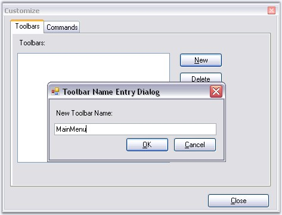
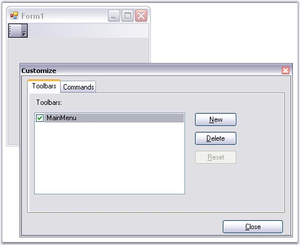
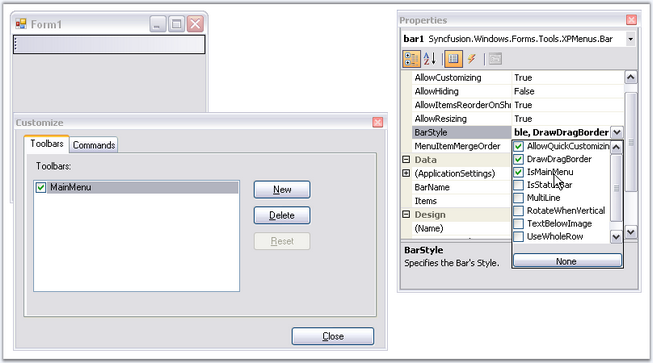
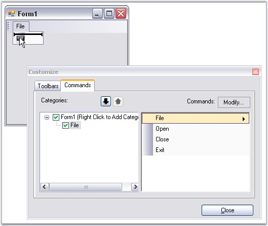
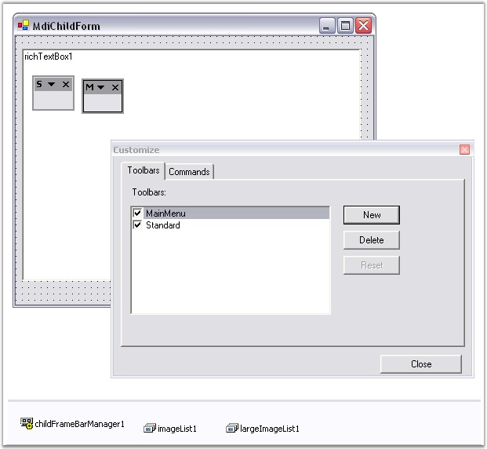

::: {style="DISPLAY: none"}
{#d2h_url_template}{#d2h_package_url style="WIDTH: 0px; DISPLAY: none; HEIGHT: 0px"}
:::

:::: {.d2h_secondary_topic style="PADDING-BOTTOM: 10pt; MARGIN: 0pt; PADDING-LEFT: 0pt; PADDING-RIGHT: 0pt; PADDING-TOP: 0pt"}
##### Adding Toolbars and Populating the Bar Items {#adding-toolbars-and-populating-the-bar-items style="tab-stops: 0pt"}

[]{style="COLOR: #15428b"} 

To add a toolbar and populate it with the bar items follow the below steps.

[]{style="COLOR: #15428b"} 

[·      ]{style="FONT-FAMILY: Symbol"}To create a new toolbar, go to the Toolbars tab in the Customize dialog, select New and specify a name (Ex: MainMenu) for the toolbar.

[]{style="COLOR: #15428b"} 

{border="0"}

**[]{style="COLOR: #15428b"}** 

Figure 720: Adding a New Toolbar

[]{style="COLOR: #15428b"} 

[·      ]{style="FONT-FAMILY: Symbol"}This will create a new bar component in the designer as shown in the image below. Name this component as \'MainMenu\'. This will also make a corresponding entry in the Toolbars list.

[]{style="COLOR: #15428b"} 

{border="0"}

**[]{style="COLOR: #15428b"}** 

Figure 721: MainMenu bar created in the Form Designer

**[]{style="COLOR: black; FONT-SIZE: 8pt"}** 

[·      ]{style="FONT-FAMILY: Symbol"}Set the toolbar as a main menu, by selecting the **IsMainMenu** option in the BarStyle property of the mainMenuBar component.

[]{style="COLOR: #15428b"} 

{border="0"}

[]{style="COLOR: #15428b"} 

Figure 722: Setting BarStyle with IsMainMenu Checked

**[]{style="COLOR: #15428b"}** 

[·      ]{style="FONT-FAMILY: Symbol"}Fill your toolbars with items by simply dragging-and-dropping the items from the Command tab into the toolbars and submenus. To fill the sub menu of the parent bar items, again drag the required bar items inside it.

[]{style="COLOR: #15428b"} 

{border="0"}

[]{style="COLOR: #15428b"} 

Figure 723: Filling Toolbars with BarItems

[]{style="COLOR: #15428b"} 

[·      ]{style="FONT-FAMILY: Symbol"}You can drag and dock the toolbars on all four sides of the designer by dragging through the gripper on the left of the toolbar and moving them to any desired position. The toolbars can also be floated. See Toolbar Properties for more details.

[]{style="COLOR: #15428b"} 

::: {style="BORDER-BOTTOM: windowtext 1pt solid; BORDER-LEFT: medium none; PADDING-BOTTOM: 1pt; MARGIN-TOP: 9pt; PADDING-LEFT: 0pt; PADDING-RIGHT: 0pt; MARGIN-BOTTOM: 9pt; BORDER-TOP: windowtext 1pt solid; BORDER-RIGHT: medium none; PADDING-TOP: 1pt"}
{border="0"} Note: If a toolbar from the mainFrameBarManager and one (or more) from the child forms gets merged (the rules for merging are discussed in the[ ]{style="COLOR: black"}MDI Merging topic), the BarItems in the toolbar will be ordered based on their MergeOrder property.
:::

[]{style="COLOR: #15428b"} 

If this is a **ChildFrameBarManager**, all the toolbars (including the main menu) will be floating at design-time. This is because the child toolbars will be docked to the main form rather than to your child form during run-time, and hence, floating avoids polluting your child forms during design-time.

[]{style="COLOR: #15428b"} 

{border="0"}

[]{style="COLOR: #15428b"} 

Figure 724: Floating ChildForm Toolbars

**[]{style="COLOR: #15428b"}** 

See Also

[[]{style="TEXT-DECORATION: none"}]{.UGHyperlink} 

[Concepts and Features]{.UGHyperlink}[]{.UGHyperlink}

[]{#related-topics}
::::
