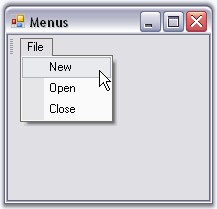

::: {style="DISPLAY: none"}
{#d2h_url_template}{#d2h_package_url style="WIDTH: 0px; DISPLAY: none; HEIGHT: 0px"}
:::

::: {.d2h_secondary_topic style="PADDING-BOTTOM: 10pt; MARGIN: 0pt; PADDING-LEFT: 0pt; PADDING-RIGHT: 0pt; PADDING-TOP: 0pt"}
##### Adding Toolbars and Populating the Bar Items {#adding-toolbars-and-populating-the-bar-items style="tab-stops: 0pt"}

[]{#p852}[]{style="COLOR: #15428b"} 

Follow the steps below to create and populate the toolbar with menus.

[]{style="COLOR: #15428b"} 

6.   Create an instance of Toolbar and associate it with MainFrameBarManager.

[]{style="COLOR: #15428b"} 

+-------------------------------------------------------------------------------------------------------------------------------------------------------------------------------------------------------------------------------------------+
| **[\[C#\]]{style="FONT-FAMILY: 'Courier New'; COLOR: black"}**                                                                                                                                                                            |
|                                                                                                                                                                                                                                           |
| **[]{style="FONT-FAMILY: 'Courier New'; COLOR: black"}**                                                                                                                                                                                  |
|                                                                                                                                                                                                                                           |
| [private]{style="FONT-FAMILY: 'Courier New'; COLOR: blue"}[ Syncfusion.Windows.Forms.Tools.XPMenus.Bar bar1;]{style="FONT-FAMILY: 'Courier New'"}                                                                                         |
|                                                                                                                                                                                                                                           |
| [this]{style="FONT-FAMILY: 'Courier New'; COLOR: blue"}[.bar1 = [new]{style="COLOR: blue"} Syncfusion.Windows.Forms.Tools.XPMenus.Bar([this]{style="COLOR: blue"}.mainFrameBarManager1, \"MyMenu\");]{style="FONT-FAMILY: 'Courier New'"} |
|                                                                                                                                                                                                                                           |
| [this]{style="FONT-FAMILY: 'Courier New'; COLOR: blue"}[.mainFrameBarManager1.Bars.Add([this]{style="COLOR: blue"}.bar1);]{style="FONT-FAMILY: 'Courier New'"}                                                                            |
|                                                                                                                                                                                                                                           |
| [this]{style="FONT-FAMILY: 'Courier New'; COLOR: blue"}[.bar1.Manager = [this]{style="COLOR: blue"}.mainFrameBarManager1;]{style="FONT-FAMILY: 'Courier New'"}                                                                            |
+-------------------------------------------------------------------------------------------------------------------------------------------------------------------------------------------------------------------------------------------+

[]{style="COLOR: #15428b"} 

+----------------------------------------------------------------------------------------------------------------------------------------------------------------------------------------------------------------------------------------------------------------------------------------------+
| **[\[VB.NET\]]{style="FONT-FAMILY: 'Courier New'; COLOR: black"}**                                                                                                                                                                                                                           |
|                                                                                                                                                                                                                                                                                              |
| **[]{style="FONT-FAMILY: 'Courier New'; COLOR: black"}**                                                                                                                                                                                                                                     |
|                                                                                                                                                                                                                                                                                              |
| [Private]{style="FONT-FAMILY: 'Courier New'; COLOR: blue"}[ bar1 [As]{style="COLOR: blue"} Syncfusion.Windows.Forms.Tools.XPMenus.Bar]{style="FONT-FAMILY: 'Courier New'"}                                                                                                                   |
|                                                                                                                                                                                                                                                                                              |
| [Private]{style="FONT-FAMILY: 'Courier New'; COLOR: blue"}[ [Me]{style="COLOR: blue"}.bar1 = [New]{style="COLOR: blue"} Syncfusion.Windows.Forms.Tools.XPMenus.Bar([Me]{style="COLOR: blue"}.mainFrameBarManager1, [\"MyMenu\"]{style="COLOR: maroon"})]{style="FONT-FAMILY: 'Courier New'"} |
|                                                                                                                                                                                                                                                                                              |
| [Me]{style="FONT-FAMILY: 'Courier New'; COLOR: blue"}[.mainFrameBarManager1.Bars.Add([Me]{style="COLOR: blue"}.bar1)]{style="FONT-FAMILY: 'Courier New'"}                                                                                                                                    |
|                                                                                                                                                                                                                                                                                              |
| [Private]{style="FONT-FAMILY: 'Courier New'; COLOR: blue"}[ [Me]{style="COLOR: blue"}.bar1.Manager = [Me]{style="COLOR: blue"}.mainFrameBarManager1]{style="FONT-FAMILY: 'Courier New'"}                                                                                                     |
+----------------------------------------------------------------------------------------------------------------------------------------------------------------------------------------------------------------------------------------------------------------------------------------------+

[]{style="COLOR: #15428b"} 

7.   Add bar items to the ParentBarItem.

[]{style="COLOR: #15428b"} 

+---------------------------------------------------------------------------------------------------------------------------------------------------------------------------------------------------------------------------------------------------------------------------------------+
| **[\[C#\]]{style="FONT-FAMILY: 'Courier New'; COLOR: black"}**                                                                                                                                                                                                                        |
|                                                                                                                                                                                                                                                                                       |
| **[]{style="FONT-FAMILY: 'Courier New'; COLOR: black"}**                                                                                                                                                                                                                              |
|                                                                                                                                                                                                                                                                                       |
| [this]{style="FONT-FAMILY: 'Courier New'; COLOR: blue"}[.parentBarItem1.Items.AddRange([new]{style="COLOR: blue"} Syncfusion.Windows.Forms.Tools.XPMenus.BarItem\[\] {[this]{style="COLOR: blue"}.barItem1,[this]{style="COLOR: blue"}.barItem2,]{style="FONT-FAMILY: 'Courier New'"} |
|                                                                                                                                                                                                                                                                                       |
| [this]{style="FONT-FAMILY: 'Courier New'; COLOR: blue"}[.barItem3});]{style="FONT-FAMILY: 'Courier New'"}                                                                                                                                                                             |
+---------------------------------------------------------------------------------------------------------------------------------------------------------------------------------------------------------------------------------------------------------------------------------------+

[]{style="COLOR: #15428b"} 

+--------------------------------------------------------------------------------------------------------------------------------------------------------------------------------------------------------------------------------------------------------------------------------------------------------------------+
| **[\[VB.NET\]]{style="FONT-FAMILY: 'Courier New'; COLOR: black"}**                                                                                                                                                                                                                                                 |
|                                                                                                                                                                                                                                                                                                                    |
| **[]{style="FONT-FAMILY: 'Courier New'; COLOR: black"}**                                                                                                                                                                                                                                                           |
|                                                                                                                                                                                                                                                                                                                    |
| [Me]{style="FONT-FAMILY: 'Courier New'; COLOR: blue"}[.parentBarItem1.Items.AddRange([New]{style="COLOR: blue"} Syncfusion.Windows.Forms.Tools.XPMenus.BarItem() {[Me]{style="COLOR: blue"}.barItem1,[Me]{style="COLOR: blue"}.barItem2, [Me]{style="COLOR: blue"}.barItem3})]{style="FONT-FAMILY: 'Courier New'"} |
+--------------------------------------------------------------------------------------------------------------------------------------------------------------------------------------------------------------------------------------------------------------------------------------------------------------------+

[]{style="COLOR: #15428b"} 

8.   Finally add ParentBarItem to the toolbar.

[]{style="COLOR: #15428b"} 

+------------------------------------------------------------------------------------------------------------------------------------------------------------------------------------------------------------------------------------------------+
| **[\[C#\]]{style="FONT-FAMILY: 'Courier New'; COLOR: black"}**                                                                                                                                                                                 |
|                                                                                                                                                                                                                                                |
| **[]{style="FONT-FAMILY: 'Courier New'; COLOR: black"}**                                                                                                                                                                                       |
|                                                                                                                                                                                                                                                |
| [this]{style="FONT-FAMILY: 'Courier New'; COLOR: blue"}[.bar1.Items.AddRange([new]{style="COLOR: blue"} Syncfusion.Windows.Forms.Tools.XPMenus.BarItem\[\] {[this]{style="COLOR: blue"}.parentBarItem1});]{style="FONT-FAMILY: 'Courier New'"} |
+------------------------------------------------------------------------------------------------------------------------------------------------------------------------------------------------------------------------------------------------+

[]{style="COLOR: #15428b"} 

+-----------------------------------------------------------------------------------------------------------------------------------------------------------------------------------------------------------------------------------------+
| **[\[VB.NET\]]{style="FONT-FAMILY: 'Courier New'; COLOR: black"}**                                                                                                                                                                      |
|                                                                                                                                                                                                                                         |
| **[]{style="FONT-FAMILY: 'Courier New'; COLOR: black"}**                                                                                                                                                                                |
|                                                                                                                                                                                                                                         |
| [Me]{style="FONT-FAMILY: 'Courier New'; COLOR: blue"}[.bar1.Items.AddRange([New]{style="COLOR: blue"} Syncfusion.Windows.Forms.Tools.XPMenus.BarItem() {[Me]{style="COLOR: blue"}.parentBarItem1})]{style="FONT-FAMILY: 'Courier New'"} |
+-----------------------------------------------------------------------------------------------------------------------------------------------------------------------------------------------------------------------------------------+

[]{style="COLOR: #15428b"} 

9.   You can make the toolbar to occupy the entire row in the form by setting **BarStyle** property to following values.

[]{style="COLOR: #15428b"} 

+-----------------------------------------------------------------------------------------------------------------------------------------------------------------------------------------------------------------------------------------------------------------------------------------------------------------------------------------------------------------------+
| **[\[C#\]]{style="FONT-FAMILY: 'Courier New'; COLOR: black"}**                                                                                                                                                                                                                                                                                                        |
|                                                                                                                                                                                                                                                                                                                                                                       |
| **[]{style="FONT-FAMILY: 'Courier New'; COLOR: black"}**                                                                                                                                                                                                                                                                                                              |
|                                                                                                                                                                                                                                                                                                                                                                       |
| [this]{style="FONT-FAMILY: 'Courier New'; COLOR: blue"}[.bar1.BarStyle = ((Syncfusion.Windows.Forms.Tools.XPMenus.BarStyle) ((((Syncfusion.Windows.Forms.Tools.XPMenus.BarStyle.AllowQuickCustomizing \| Syncfusion.Windows.Forms.Tools.XPMenus.BarStyle.IsMainMenu)\| Syncfusion.Windows.Forms.Tools.XPMenus.BarStyle.Visible) ]{style="FONT-FAMILY: 'Courier New'"} |
|                                                                                                                                                                                                                                                                                                                                                                       |
| [\| Syncfusion.Windows.Forms.Tools.XPMenus.BarStyle.DrawDragBorder)));]{style="FONT-FAMILY: 'Courier New'"}                                                                                                                                                                                                                                                           |
+-----------------------------------------------------------------------------------------------------------------------------------------------------------------------------------------------------------------------------------------------------------------------------------------------------------------------------------------------------------------------+

[]{style="COLOR: #15428b"} 

+------------------------------------------------------------------------------------------------------------------------------------------------------------------------------------------------------------------------------------------------------------------------------------------------------------------------------------------------------------------------------------------------------------------------------------------------------------------------------------------------------------------------------------------+
| **[\[VB.NET\]]{style="FONT-FAMILY: 'Courier New'; COLOR: black"}**                                                                                                                                                                                                                                                                                                                                                                                                                                                                       |
|                                                                                                                                                                                                                                                                                                                                                                                                                                                                                                                                          |
| **[]{style="FONT-FAMILY: 'Courier New'; COLOR: black"}**                                                                                                                                                                                                                                                                                                                                                                                                                                                                                 |
|                                                                                                                                                                                                                                                                                                                                                                                                                                                                                                                                          |
| [Me]{style="FONT-FAMILY: 'Courier New'; COLOR: blue"}[.bar1.BarStyle = ([CType]{style="COLOR: blue"}((((Syncfusion.Windows.Forms.Tools.XPMenus.BarStyle.AllowQuickCustomizing [Or]{style="COLOR: blue"} Syncfusion.Windows.Forms.Tools.XPMenus.BarStyle.IsMainMenu) [Or]{style="COLOR: blue"} Syncfusion.Windows.Forms.Tools.XPMenus.BarStyle.Visible) [Or]{style="COLOR: blue"} Syncfusion.Windows.Forms.Tools.XPMenus.BarStyle.DrawDragBorder), Syncfusion.Windows.Forms.Tools.XPMenus.BarStyle))]{style="FONT-FAMILY: 'Courier New'"} |
+------------------------------------------------------------------------------------------------------------------------------------------------------------------------------------------------------------------------------------------------------------------------------------------------------------------------------------------------------------------------------------------------------------------------------------------------------------------------------------------------------------------------------------------+

[]{style="COLOR: #15428b"} 

The resulting form will look like the below image.

[]{style="COLOR: #15428b"} 

{border="0"}

[]{style="COLOR: #15428b"} 

Figure 725: Toolbar populated with Menus

[]{style="COLOR: #15428b"} 

See Also

[]{style="COLOR: #15428b"} 

[Concepts and Features]{.UGHyperlink}[]{.UGHyperlink}

[]{#related-topics}
:::
