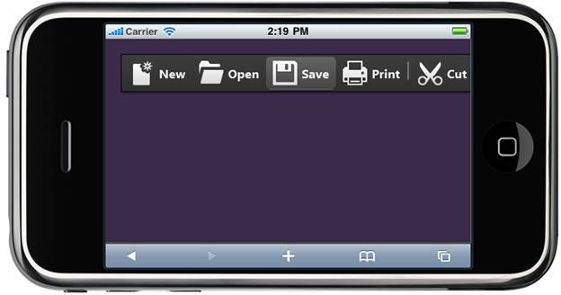

::: {style="DISPLAY: none"}
{#d2h_url_template} {#d2h_package_url style="WIDTH: 0px; DISPLAY: none; HEIGHT: 0px"}
:::

::::: {#nsbanner .d2h_main_nsbanner style="BORDER-BOTTOM: #999999 1px solid; POSITION: relative; PADDING-BOTTOM: 0px; BACKGROUND-COLOR: transparent; PADDING-LEFT: 0px; PADDING-RIGHT: 0px; DISPLAY: none; BORDER-TOP: #999999 1px solid; PADDING-TOP: 0px; LEFT: 0px"}
:::: {#TitleRow .d2h_main_titlerow style="PADDING-BOTTOM: 4px; BACKGROUND-COLOR: transparent; PADDING-LEFT: 22px; WIDTH: 100%; PADDING-RIGHT: 10px; DISPLAY: none; PADDING-TOP: 4px"}
::: {#ienav .d2h_main_ienav style="DISPLAY: none"}
{#D2HPrevious .D2HPreviousEnabled}  {#D2HNext .D2HNextEnabled}
:::
::::
:::::

:::: {#nstext .d2h_main_nstext style="PADDING-BOTTOM: 10px; BACKGROUND-COLOR: transparent; PADDING-LEFT: 22px; PADDING-RIGHT: 10px; HEIGHT: 100%; OVERFLOW: auto; PADDING-TOP: 5px" hasuserbackground="true" valign="bottom"}
::: {#d2h_breadcrumbs .d2h_breadcrumbs}
[Essential Studio User Guide Documentation](ms-xhelp:///?Id=12457748-09e3-4d74-a240-8e049cedf030){.d2h_breadcrumbsNormal} [ \> ]{.d2h_breadcrumbsLinkSeparator} [User Interface Edition](ms-xhelp:///?Id=c29296b7-531c-413b-a0ec-488ca1f7f669){.d2h_breadcrumbsNormal} [ \> ]{.d2h_breadcrumbsLinkSeparator} [Essential Mobile MVC](ms-xhelp:///?Id=74df42e3-5434-4590-9be6-3ae2f911cbbc){.d2h_breadcrumbsNormal} [ \> ]{.d2h_breadcrumbsLinkSeparator} [Essential Tools]{.d2h_breadcrumbsContentsOnly} [ \> ]{.d2h_breadcrumbsLinkSeparator} [Controls and Components](ms-xhelp:///?Id=143afae1-3f83-4d32-9bfa-92ed7022a696){.d2h_breadcrumbsNormal} [ \> ]{.d2h_breadcrumbsLinkSeparator} [Toolbar](ms-xhelp:///?Id=6c5f0bf5-7ca8-4362-8f46-87fb8af9dd00){.d2h_breadcrumbsNormal}
:::

### Adding Toolbar to the Mobile MVC application {#adding-toolbar-to-the-mobile-mvc-application style="tab-stops: 0pt"}

In the [Getting Started]{.UGHyperlink} section, we discussed how to [create a Mobile MVC application]{.UGHyperlink} and [add Tools package to the application]{.UGHyperlink}. This section guides you to add Toolbar control to an application.

1.   In **View**, Invoke the Toolbar helper with the Toolbar ID as the first argument.

+----------------------------------------------------------------------------------------------------------------------------------------------------------------------------------------------------------------------------------------+
| **[\[ASPX\]]{style="FONT-FAMILY: 'Courier New'"}**                                                                                                                                                                                     |
|                                                                                                                                                                                                                                        |
| [\<%]{style="FONT-FAMILY: 'Courier New'; BACKGROUND: yellow"} [=]{style="FONT-FAMILY: 'Courier New'; COLOR: blue"} [Html.MobSyncfusion().Toolbar([\"CoreToolbar\"]{style="COLOR: #a31515"})]{style="FONT-FAMILY: 'Courier New'"}       |
|                                                                                                                                                                                                                                        |
| [   .Items(items =\>]{style="FONT-FAMILY: 'Courier New'"}                                                                                                                                                                              |
|                                                                                                                                                                                                                                        |
| [   {]{style="FONT-FAMILY: 'Courier New'"}                                                                                                                                                                                             |
|                                                                                                                                                                                                                                        |
| [                   items.Add().Value([\"New\"]{style="COLOR: #a31515"}).Text([\"New\"]{style="COLOR: #a31515"}).ImageUrl([\"\~/Content/Toolbar/Images/new.png\"]{style="COLOR: #a31515"});]{style="FONT-FAMILY: 'Courier New'"}       |
|                                                                                                                                                                                                                                        |
| [                   items.Add().Value([\"Open\"]{style="COLOR: #a31515"}).Text([\"Open\"]{style="COLOR: #a31515"}).ImageUrl([\"\~/Content/Toolbar/Images/open.png\"]{style="COLOR: #a31515"});]{style="FONT-FAMILY: 'Courier New'"}    |
|                                                                                                                                                                                                                                        |
| [                   items.Add().Value([\"Save\"]{style="COLOR: #a31515"}).Text([\"Save\"]{style="COLOR: #a31515"}).ImageUrl([\"\~/Content/Toolbar/Images/save.png\"]{style="COLOR: #a31515"});]{style="FONT-FAMILY: 'Courier New'"}    |
|                                                                                                                                                                                                                                        |
| [                   items.Add().Value([\"Print\"]{style="COLOR: #a31515"}).Text([\"Print\"]{style="COLOR: #a31515"}).ImageUrl([\"\~/Content/Toolbar/Images/print.png\"]{style="COLOR: #a31515"});]{style="FONT-FAMILY: 'Courier New'"} |
|                                                                                                                                                                                                                                        |
| []{style="FONT-FAMILY: 'Courier New'"}                                                                                                                                                                                                 |
|                                                                                                                                                                                                                                        |
| [items.Add().IsSeparator([true]{style="COLOR: blue"});]{style="FONT-FAMILY: 'Courier New'"}                                                                                                                                            |
|                                                                                                                                                                                                                                        |
| [                   items.Add().Value([\"Cut\"]{style="COLOR: #a31515"}).Text([\"Cut\"]{style="COLOR: #a31515"}).ImageUrl([\"\~/Content/Toolbar/Images/Cut.png\"]{style="COLOR: #a31515"});]{style="FONT-FAMILY: 'Courier New'"}       |
|                                                                                                                                                                                                                                        |
| [    ]{style="FONT-FAMILY: 'Courier New'"}                                                                                                                                                                                             |
|                                                                                                                                                                                                                                        |
| [   })[%\>]{style="BACKGROUND: yellow"}]{style="FONT-FAMILY: 'Courier New'"}                                                                                                                                                           |
|                                                                                                                                                                                                                                        |
| []{style="FONT-FAMILY: 'Courier New'; BACKGROUND: yellow"}                                                                                                                                                                             |
+----------------------------------------------------------------------------------------------------------------------------------------------------------------------------------------------------------------------------------------+

 

+-------------------------------------------------------------------------------------------------------------------------------------------------------------------------------------------------------------------------------------+
| **[\[Razor\]]{style="FONT-FAMILY: 'Courier New'"}**                                                                                                                                                                                 |
|                                                                                                                                                                                                                                     |
| [\@{]{style="FONT-FAMILY: 'Courier New'; BACKGROUND: yellow"} []{style="FONT-FAMILY: 'Courier New'"}                                                                                                                                |
|                                                                                                                                                                                                                                     |
| [   Html.MobSyncfusion().Toolbar([\"CoreToolbar\"]{style="COLOR: #a31515"})]{style="FONT-FAMILY: 'Courier New'"}                                                                                                                    |
|                                                                                                                                                                                                                                     |
| [   .Items(items =\>]{style="FONT-FAMILY: 'Courier New'"}                                                                                                                                                                           |
|                                                                                                                                                                                                                                     |
| [   {]{style="FONT-FAMILY: 'Courier New'"}                                                                                                                                                                                          |
|                                                                                                                                                                                                                                     |
| [                items.Add().Value([\"New\"]{style="COLOR: #a31515"}).Text([\"New\"]{style="COLOR: #a31515"}).ImageUrl([\"\~/Content/Toolbar/Images/new.png\"]{style="COLOR: #a31515"});]{style="FONT-FAMILY: 'Courier New'"}       |
|                                                                                                                                                                                                                                     |
| [                items.Add().Value([\"Open\"]{style="COLOR: #a31515"}).Text([\"Open\"]{style="COLOR: #a31515"}).ImageUrl([\"\~/Content/Toolbar/Images/open.png\"]{style="COLOR: #a31515"});]{style="FONT-FAMILY: 'Courier New'"}    |
|                                                                                                                                                                                                                                     |
| [                items.Add().Value([\"Save\"]{style="COLOR: #a31515"}).Text([\"Save\"]{style="COLOR: #a31515"}).ImageUrl([\"\~/Content/Toolbar/Images/save.png\"]{style="COLOR: #a31515"});]{style="FONT-FAMILY: 'Courier New'"}    |
|                                                                                                                                                                                                                                     |
| [                items.Add().Value([\"Print\"]{style="COLOR: #a31515"}).Text([\"Print\"]{style="COLOR: #a31515"}).ImageUrl([\"\~/Content/Toolbar/Images/print.png\"]{style="COLOR: #a31515"});]{style="FONT-FAMILY: 'Courier New'"} |
|                                                                                                                                                                                                                                     |
| []{style="FONT-FAMILY: 'Courier New'"}                                                                                                                                                                                              |
|                                                                                                                                                                                                                                     |
| [items.Add().IsSeparator([true]{style="COLOR: blue"});]{style="FONT-FAMILY: 'Courier New'"}                                                                                                                                         |
|                                                                                                                                                                                                                                     |
| [                items.Add().Value([\"Cut\"]{style="COLOR: #a31515"}).Text([\"Cut\"]{style="COLOR: #a31515"}).ImageUrl([\"\~/Content/Toolbar/Images/Cut.png\"]{style="COLOR: #a31515"});]{style="FONT-FAMILY: 'Courier New'"}       |
|                                                                                                                                                                                                                                     |
| [   })]{style="FONT-FAMILY: 'Courier New'"}                                                                                                                                                                                         |
|                                                                                                                                                                                                                                     |
| [   .Render();[}]{style="BACKGROUND: yellow"}]{style="FONT-FAMILY: 'Courier New'"}                                                                                                                                                  |
+-------------------------------------------------------------------------------------------------------------------------------------------------------------------------------------------------------------------------------------+

 

 

2.   Run the application.

The output is shown in the following screenshot:

{border="0"}

Figure 171: Toolbar

A sample which demonstrates a basic Toolbar control can be downloaded from the following link:

[]{style="FONT-FAMILY: 'Calibri','sans-serif'; COLOR: black"} 

[Toolbar- ASPX Application](http://files2.syncfusion.com/support/ToolsMobileMvc/9.4.0.62/Toolbar/AspxApplication.zip) []{.UGHyperlink}

[ []{style="TEXT-DECORATION: none"} ]{.UGHyperlink} 

[Toolbar -- Razor Application](http://files2.syncfusion.com/support/ToolsMobileMvc/9.4.0.62/Toolbar/RazorApplication.zip) []{.UGHyperlink}

[ []{style="TEXT-DECORATION: none"} ]{.UGHyperlink} 

[]{#related-topics}
::::
