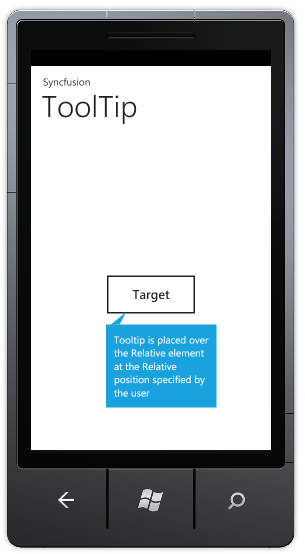

::: {style="DISPLAY: none"}
{#d2h_url_template}{#d2h_package_url style="WIDTH: 0px; DISPLAY: none; HEIGHT: 0px"}
:::

::: {.d2h_secondary_topic style="PADDING-BOTTOM: 10pt; MARGIN: 0pt; PADDING-LEFT: 0pt; PADDING-RIGHT: 0pt; PADDING-TOP: 0pt"}
#### Adding Tooltip control to the Windows Phone Application {#adding-tooltip-control-to-the-windows-phone-application style="tab-stops: 0pt"}

[]{style="FONT-FAMILY: 'Times New Roman','serif'; FONT-SIZE: 12pt"} 

[To ]{style="FONT-FAMILY: 'Times New Roman','serif'; FONT-SIZE: 12pt"}[[create a Windows Phone application and deploy Essential Tools]{.UGHyperlink}](ms-xhelp:///?Id=5fcac24b-a16b-4dff-a48a-571fc711de4c)[ for Windows Phone, refer to section ]{style="FONT-FAMILY: 'Times New Roman','serif'; FONT-SIZE: 12pt"}[[3 Getting Started]{.UGHyperlink}](ms-xhelp:///?Id=1227f833-c9a0-4862-ab58-fcd7ae3c42b7)[. This section covers how to add Tooltip control to this application.]{style="FONT-FAMILY: 'Times New Roman','serif'; FONT-SIZE: 12pt"}

 

The *Tooltip* control can be added to the application using either Xaml or procedural code. The following code illustrartes this:

 

+------------------------------------------------------------------------------------------------------------------------------------------------------------------------------------------------------------------------------------------------------------------------------------------------------------------------------------------------------------------------------------------------------------------------------------------------------------------------------------------------------------------------------------------------------------------------------------------------------------------------------------------------------------------------------------------------------------------------------------------------------------------------------------------------------------------------------------------------------------------------------------------------------------+
| [\[XAML\]]{style="FONT-FAMILY: 'Times New Roman','serif'; FONT-SIZE: 12pt"}                                                                                                                                                                                                                                                                                                                                                                                                                                                                                                                                                                                                                                                                                                                                                                                                                                |
|                                                                                                                                                                                                                                                                                                                                                                                                                                                                                                                                                                                                                                                                                                                                                                                                                                                                                                            |
| [\<]{style="FONT-FAMILY: Consolas; COLOR: blue; FONT-SIZE: 9.5pt"}[syncfusion]{style="FONT-FAMILY: Consolas; COLOR: #a31515; FONT-SIZE: 9.5pt"}[:]{style="FONT-FAMILY: Consolas; COLOR: blue; FONT-SIZE: 9.5pt"}[ToolTip]{style="FONT-FAMILY: Consolas; COLOR: #a31515; FONT-SIZE: 9.5pt"}[ [ RelativeTo]{style="COLOR: red"}[=\"Button1\"]{style="COLOR: blue"}[ IsBackKeyClose]{style="COLOR: red"}[=\"True\"]{style="COLOR: blue"}[ IsTapOutside]{style="COLOR: red"}[=\"True\"]{style="COLOR: blue"}[ RelativePlacement]{style="COLOR: red"}[=\"Bottom\"]{style="COLOR: blue"} [ x]{style="COLOR: red"}[:]{style="COLOR: blue"}[Name]{style="COLOR: red"}[=\"tooltip\"]{style="COLOR: blue"}[ Content]{style="COLOR: red"}[=\"Tooltip is placed over the Relative element at the Relative position specified by the user\" /\>]{style="COLOR: blue"}]{style="FONT-FAMILY: Consolas; FONT-SIZE: 9.5pt"} |
|                                                                                                                                                                                                                                                                                                                                                                                                                                                                                                                                                                                                                                                                                                                                                                                                                                                                                                            |
|                                                                                                                                                                                                                                                                                                                                                                                                                                                                                                                                                                                                                                                                                                                                                                                                                                                                                                            |
+------------------------------------------------------------------------------------------------------------------------------------------------------------------------------------------------------------------------------------------------------------------------------------------------------------------------------------------------------------------------------------------------------------------------------------------------------------------------------------------------------------------------------------------------------------------------------------------------------------------------------------------------------------------------------------------------------------------------------------------------------------------------------------------------------------------------------------------------------------------------------------------------------------+

[]{style="FONT-FAMILY: 'Times New Roman','serif'; FONT-SIZE: 12pt"} 

+--------------------------------------------------------------------------------------------------------------------------------------------------------------------------------------------------------------------------------+
| **[\[C#\]]{style="FONT-FAMILY: 'Courier New'"}**                                                                                                                                                                               |
|                                                                                                                                                                                                                                |
| [Syncfusion.Phone.Tools.Controls.[ToolTip]{style="COLOR: #2b91af"} \_tooltip=[new]{style="COLOR: blue"} Syncfusion.Phone.Tools.Controls.[ToolTip]{style="COLOR: #2b91af"}();]{style="FONT-FAMILY: Consolas; FONT-SIZE: 9.5pt"} |
|                                                                                                                                                                                                                                |
| [\_tooltip.RelativeTo=[\"Button1\"]{style="COLOR: #a31515"};]{style="FONT-FAMILY: Consolas; FONT-SIZE: 9.5pt"}                                                                                                                 |
|                                                                                                                                                                                                                                |
| [\_tooltip.RelativePlacement=Syncfusion.Phone.Tools.Controls.[Placement]{style="COLOR: #2b91af"}.Bottom;]{style="FONT-FAMILY: Consolas; FONT-SIZE: 9.5pt"}                                                                     |
|                                                                                                                                                                                                                                |
| [\_tooltip.IsBackKeyClose=[true]{style="COLOR: blue"};]{style="FONT-FAMILY: Consolas; FONT-SIZE: 9.5pt"}                                                                                                                       |
|                                                                                                                                                                                                                                |
| [\_tooltip.IsTapOutside=[true]{style="COLOR: blue"};]{style="FONT-FAMILY: Consolas; FONT-SIZE: 9.5pt"}                                                                                                                         |
|                                                                                                                                                                                                                                |
| [\_tooltip.Content=[\"Tooltip is placed over the Relative element at the Relative position specified by the user\"]{style="COLOR: #a31515"};]{style="FONT-FAMILY: Consolas; FONT-SIZE: 9.5pt"}                                 |
+--------------------------------------------------------------------------------------------------------------------------------------------------------------------------------------------------------------------------------+

[]{style="FONT-FAMILY: 'Times New Roman','serif'; FONT-SIZE: 12pt"} 

[]{style="FONT-FAMILY: 'Times New Roman','serif'; FONT-SIZE: 12pt"} 

[         ]{style="FONT-FAMILY: 'Times New Roman','serif'; FONT-SIZE: 12pt"}{border="0"}

Figure 105: Tooltip

 

 

[]{#related-topics}
:::
