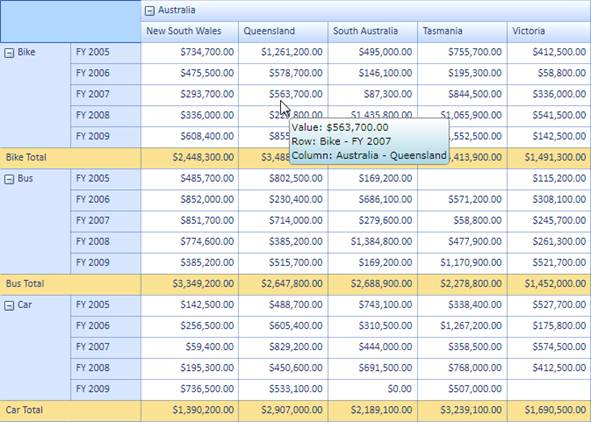
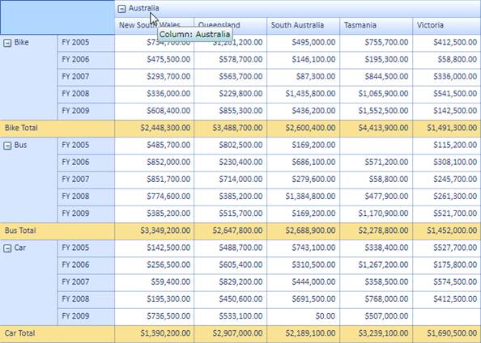
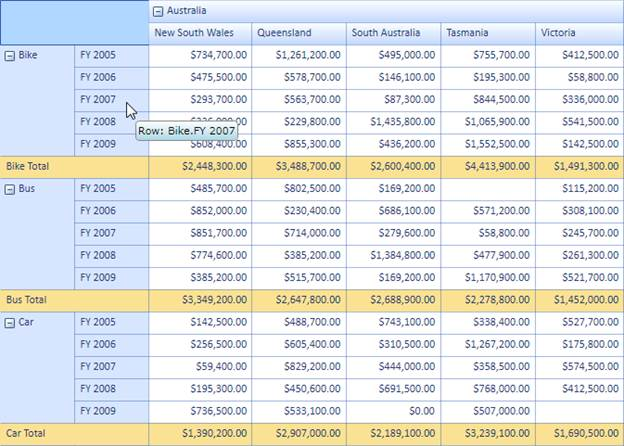
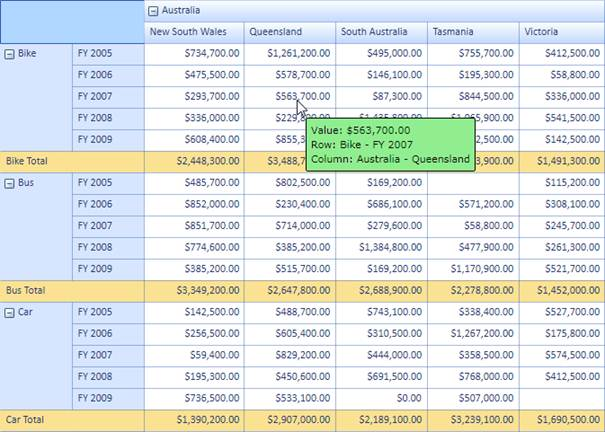
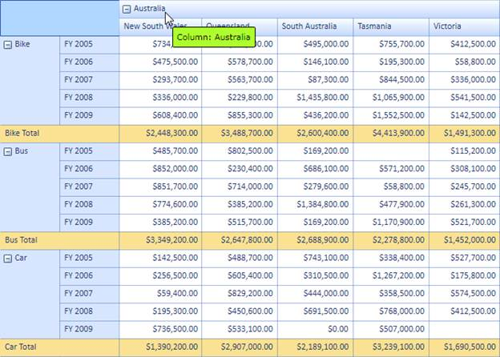

::: {style="DISPLAY: none"}
{#d2h_url_template}{#d2h_package_url style="WIDTH: 0px; DISPLAY: none; HEIGHT: 0px"}
:::

::::: {#nsbanner .d2h_main_nsbanner style="BORDER-BOTTOM: #999999 1px solid; POSITION: relative; PADDING-BOTTOM: 0px; BACKGROUND-COLOR: transparent; PADDING-LEFT: 0px; PADDING-RIGHT: 0px; DISPLAY: none; BORDER-TOP: #999999 1px solid; PADDING-TOP: 0px; LEFT: 0px"}
:::: {#TitleRow .d2h_main_titlerow style="PADDING-BOTTOM: 4px; BACKGROUND-COLOR: transparent; PADDING-LEFT: 22px; WIDTH: 100%; PADDING-RIGHT: 10px; DISPLAY: none; PADDING-TOP: 4px"}
::: {#ienav .d2h_main_ienav style="DISPLAY: none"}
{#D2HPrevious .D2HPreviousEnabled}  {#D2HNext .D2HNextEnabled}
:::
::::
:::::

:::: {#nstext .d2h_main_nstext style="PADDING-BOTTOM: 10px; BACKGROUND-COLOR: transparent; PADDING-LEFT: 22px; PADDING-RIGHT: 10px; HEIGHT: 100%; OVERFLOW: auto; PADDING-TOP: 5px" hasuserbackground="true" valign="bottom"}
::: {#d2h_breadcrumbs .d2h_breadcrumbs}
[Essential Studio User Guide Documentation](ms-xhelp:///?Id=12457748-09e3-4d74-a240-8e049cedf030){.d2h_breadcrumbsNormal}[ \> ]{.d2h_breadcrumbsLinkSeparator}[Business Intelligence Edition](ms-xhelp:///?Id=fdf33dd8-62b2-47b9-ad7b-fc50e590bca5){.d2h_breadcrumbsNormal}[ \> ]{.d2h_breadcrumbsLinkSeparator}[Essential BI Silverlight](ms-xhelp:///?Id=c006b39c-6aa2-4637-b7de-3e7b6cb3f9f9){.d2h_breadcrumbsNormal}[ \> ]{.d2h_breadcrumbsLinkSeparator}[Essential Pivot Grid]{.d2h_breadcrumbsContentsOnly}[ \> ]{.d2h_breadcrumbsLinkSeparator}[Features](ms-xhelp:///?Id=9d7968f1-d52c-4e79-a6ae-fb01305e9f98){.d2h_breadcrumbsNormal}[ \> ]{.d2h_breadcrumbsLinkSeparator}[ToolTips](ms-xhelp:///?Id=d3fc5686-b5d5-4e62-babe-430da6305182){.d2h_breadcrumbsNormal}
:::

### Adding ToolTip to an Application {#adding-tooltip-to-an-application style="tab-stops: 0pt"}

To show ToolTips in the PivotGrid control you need to set the PivotGrid control's **TooltipEnabled** property to **true**. This is the master property which controls all the styles' ToolTip properties. The following code explains its usage.

 

+--------------------------------------------------------------------------------------------------------------------------------------------------------------------------------------------+
| **[\[C#\]]{style="FONT-FAMILY: 'Courier New'"}**                                                                                                                                           |
|                                                                                                                                                                                            |
| [//Enable Tooltip for PivotGridControl]{style="FONT-FAMILY: 'Courier New'; COLOR: green; FONT-SIZE: 9.5pt"}                                                                                |
|                                                                                                                                                                                            |
| [this]{style="FONT-FAMILY: 'Courier New'; COLOR: blue; FONT-SIZE: 9.5pt"}[.pivotGrid1.ToolTipEnabled = [true]{style="COLOR: blue"};]{style="FONT-FAMILY: 'Courier New'; FONT-SIZE: 9.5pt"} |
|                                                                                                                                                                                            |
|                                                                                                                                                                                            |
+--------------------------------------------------------------------------------------------------------------------------------------------------------------------------------------------+

[]{style="COLOR: #c00000"} 

+-----------------------------------------------------------------------------------------------------------------------------------------------------------------------------------------+
| **[\[VB\]]{style="FONT-FAMILY: 'Courier New'"}**                                                                                                                                        |
|                                                                                                                                                                                         |
| [//Enable Tooltip for PivotGridControl]{style="FONT-FAMILY: 'Courier New'; COLOR: green; FONT-SIZE: 9.5pt"}                                                                             |
|                                                                                                                                                                                         |
| [Me]{style="FONT-FAMILY: 'Courier New'; COLOR: blue; FONT-SIZE: 9.5pt"}[.pivotGrid1.ToolTipEnabled = [True]{style="COLOR: blue"}]{style="FONT-FAMILY: 'Courier New'; FONT-SIZE: 9.5pt"} |
|                                                                                                                                                                                         |
|                                                                                                                                                                                         |
+-----------------------------------------------------------------------------------------------------------------------------------------------------------------------------------------+

[]{style="COLOR: #c00000"} 

You can set the appearance of ToolTips with respect to their styles. Each style has its own **ToolTipEnabled** property. These properties help to set the appearance individually for each style. The following code explains its implementation.

 

+----------------------------------------------------------------------------------------------------------------------------------------------------------------------------------------------------------------------------+
| **[\[C#\]]{style="FONT-FAMILY: 'Courier New'"}**                                                                                                                                                                           |
|                                                                                                                                                                                                                            |
| [//Enable Tooltip for RowHeaderCellStyle]{style="FONT-FAMILY: 'Courier New'; COLOR: green"}[]{style="FONT-FAMILY: 'Courier New'"}                                                                                          |
|                                                                                                                                                                                                                            |
| [this]{style="FONT-FAMILY: 'Courier New'; COLOR: blue"}[.pivotGrid1.RowHeaderCellStyle.ToolTipEnabled = [true]{style="COLOR: blue"};]{style="FONT-FAMILY: 'Courier New'"}                                                  |
|                                                                                                                                                                                                                            |
| [//Enable Tooltip for ColumnHeaderCellStyle]{style="FONT-FAMILY: 'Courier New'; COLOR: green"}[]{style="FONT-FAMILY: 'Courier New'"}                                                                                       |
|                                                                                                                                                                                                                            |
| [this]{style="FONT-FAMILY: 'Courier New'; COLOR: blue"}[.pivotGrid1.ColumnHeaderCellStyle.ToolTipEnabled = [true]{style="COLOR: blue"};]{style="FONT-FAMILY: 'Courier New'"}                                               |
|                                                                                                                                                                                                                            |
| [//Enable Tooltip for ValueCellStyle]{style="FONT-FAMILY: 'Courier New'; COLOR: green"}[]{style="FONT-FAMILY: 'Courier New'"}                                                                                              |
|                                                                                                                                                                                                                            |
| [this]{style="FONT-FAMILY: 'Courier New'; COLOR: blue"}[.pivotGrid1.ValueCellStyle.ToolTipEnabled = [true]{style="COLOR: blue"};]{style="FONT-FAMILY: 'Courier New'"}                                                      |
|                                                                                                                                                                                                                            |
| [//Enable Tooltip for SummaryHeaderStyle]{style="FONT-FAMILY: 'Courier New'; COLOR: green"}[]{style="FONT-FAMILY: 'Courier New'"}                                                                                          |
|                                                                                                                                                                                                                            |
| [this]{style="FONT-FAMILY: 'Courier New'; COLOR: blue"}[.pivotGrid1.SummaryHeaderStyle.ToolTipEnabled = [true]{style="COLOR: blue"};]{style="FONT-FAMILY: 'Courier New'"}                                                  |
|                                                                                                                                                                                                                            |
| [//Enable Tooltip for SummaryCellStyle]{style="FONT-FAMILY: 'Courier New'; COLOR: green"}[]{style="FONT-FAMILY: 'Courier New'"}                                                                                            |
|                                                                                                                                                                                                                            |
| [this]{style="FONT-FAMILY: 'Courier New'; COLOR: blue"}[.pivotGrid1.SummaryCellStyle.ToolTipEnabled = [true]{style="COLOR: blue"};]{style="FONT-FAMILY: 'Courier New'"}[]{style="FONT-FAMILY: Consolas; FONT-SIZE: 9.5pt"} |
+----------------------------------------------------------------------------------------------------------------------------------------------------------------------------------------------------------------------------+

[]{style="COLOR: #c00000"} 

+---------------------------------------------------------------------------------------------------------------------------------------------------------------------------------------------------------------+
| **[\[VB\]]{style="FONT-FAMILY: 'Courier New'"}**                                                                                                                                                              |
|                                                                                                                                                                                                               |
| [//Enable Tooltip for RowHeaderCellStyle]{style="FONT-FAMILY: 'Courier New'; COLOR: green; FONT-SIZE: 9.5pt"}[]{style="FONT-FAMILY: 'Courier New'; FONT-SIZE: 9.5pt"}                                         |
|                                                                                                                                                                                                               |
| [Me]{style="FONT-FAMILY: 'Courier New'; COLOR: blue; FONT-SIZE: 9.5pt"}[.pivotGrid1.RowHeaderCellStyle.ToolTipEnabled = [True]{style="COLOR: blue"}]{style="FONT-FAMILY: 'Courier New'; FONT-SIZE: 9.5pt"}    |
|                                                                                                                                                                                                               |
| [//Enable Tooltip for ColumnHeaderCellStyle]{style="FONT-FAMILY: 'Courier New'; COLOR: green; FONT-SIZE: 9.5pt"}[]{style="FONT-FAMILY: 'Courier New'; FONT-SIZE: 9.5pt"}                                      |
|                                                                                                                                                                                                               |
| [Me]{style="FONT-FAMILY: 'Courier New'; COLOR: blue; FONT-SIZE: 9.5pt"}[.pivotGrid1.ColumnHeaderCellStyle.ToolTipEnabled = [True]{style="COLOR: blue"}]{style="FONT-FAMILY: 'Courier New'; FONT-SIZE: 9.5pt"} |
|                                                                                                                                                                                                               |
| [//Enable Tooltip for ValueCellStyle]{style="FONT-FAMILY: 'Courier New'; COLOR: green; FONT-SIZE: 9.5pt"}[]{style="FONT-FAMILY: 'Courier New'; FONT-SIZE: 9.5pt"}                                             |
|                                                                                                                                                                                                               |
| [Me]{style="FONT-FAMILY: 'Courier New'; COLOR: blue; FONT-SIZE: 9.5pt"}[.pivotGrid1.ValueCellStyle.ToolTipEnabled = [True]{style="COLOR: blue"}]{style="FONT-FAMILY: 'Courier New'; FONT-SIZE: 9.5pt"}        |
|                                                                                                                                                                                                               |
| [//Enable Tooltip for SummaryHeaderStyle]{style="FONT-FAMILY: 'Courier New'; COLOR: green; FONT-SIZE: 9.5pt"}[]{style="FONT-FAMILY: 'Courier New'; FONT-SIZE: 9.5pt"}                                         |
|                                                                                                                                                                                                               |
| [Me]{style="FONT-FAMILY: 'Courier New'; COLOR: blue; FONT-SIZE: 9.5pt"}[.pivotGrid1.SummaryHeaderStyle.ToolTipEnabled = [True]{style="COLOR: blue"}]{style="FONT-FAMILY: 'Courier New'; FONT-SIZE: 9.5pt"}    |
|                                                                                                                                                                                                               |
| [//Enable Tooltip for SummaryCellStyle]{style="FONT-FAMILY: 'Courier New'; COLOR: green; FONT-SIZE: 9.5pt"}[]{style="FONT-FAMILY: 'Courier New'; FONT-SIZE: 9.5pt"}                                           |
|                                                                                                                                                                                                               |
| [Me]{style="FONT-FAMILY: 'Courier New'; COLOR: blue; FONT-SIZE: 9.5pt"}[.pivotGrid1.SummaryCellStyle.ToolTipEnabled = [True]{style="COLOR: blue"}]{style="FONT-FAMILY: 'Courier New'; FONT-SIZE: 9.5pt"}      |
+---------------------------------------------------------------------------------------------------------------------------------------------------------------------------------------------------------------+

[]{style="COLOR: #c00000"} 

{border="0"}[]{style="COLOR: #c00000"}

Figure 34: Default ToolTip (Visual Style: Office2007Blue)

 

{border="0"}

Figure 35: ToolTip Shown at Column Header

{border="0"}

Figure 36: ToolTip Shown at Row Header

 

Custom data templates can be set for the PivotGrid control's ToolTip. To do so, you need to write a data template, bind the style's **Tag** property, and set the key to the PivotGrid control's **CustomToolTipTemplateKey** property. The following code explains its implementation.

 

+-------------------------------------------------------------------------------------------------------------------------------------------------------------------------------------------------------------------------------------------------------------+
| **[\[C#\]]{style="FONT-FAMILY: 'Courier New'"}**                                                                                                                                                                                                            |
|                                                                                                                                                                                                                                                             |
| [//Set the Custom DataTemplate for PivotGridControl's Tooltip]{style="FONT-FAMILY: 'Courier New'; COLOR: green"}                                                                                                                                            |
|                                                                                                                                                                                                                                                             |
| [this]{style="FONT-FAMILY: 'Courier New'; COLOR: blue"}[.pivotGrid1.CustomToolTipTemplateKey = \"[CustomTemplateTooltip]{style="COLOR: #a31515"}\";]{style="FONT-FAMILY: 'Courier New'"}[]{style="FONT-FAMILY: Consolas; COLOR: #a31515; FONT-SIZE: 9.5pt"} |
+-------------------------------------------------------------------------------------------------------------------------------------------------------------------------------------------------------------------------------------------------------------+

[]{style="COLOR: #c00000"} 

+---------------------------------------------------------------------------------------------------------------------------------------------------------------------------------------+
| **[\[VB\]]{style="FONT-FAMILY: 'Courier New'"}**                                                                                                                                      |
|                                                                                                                                                                                       |
| [//Set the Custom DataTemplate for PivotGridControl's Tooltip]{style="FONT-FAMILY: 'Courier New'; COLOR: green"}                                                                      |
|                                                                                                                                                                                       |
| [Me]{style="FONT-FAMILY: 'Courier New'; COLOR: blue"}[.pivotGrid1.CustomToolTipTemplateKey = \"[CustomTemplateTooltip]{style="COLOR: #a31515"}\"]{style="FONT-FAMILY: 'Courier New'"} |
|                                                                                                                                                                                       |
|                                                                                                                                                                                       |
+---------------------------------------------------------------------------------------------------------------------------------------------------------------------------------------+

[]{style="COLOR: #c00000"} 

{border="0"}[]{style="COLOR: #c00000"}

Figure 37: Custom ToolTip (Custom DataTemplate)

 

You can set the data template for ToolTips with respect to their styles. Each style has its own **CustomToolTipTemplateKey** property. These properties help to set the appearance individually for each style. The following code explains its implementation.

 

+------------------------------------------------------------------------------------------------------------------------------------------------------------------------------------------------------------------------------------------------------------------------------+
| **[\[C#\]]{style="FONT-FAMILY: 'Courier New'"}**                                                                                                                                                                                                                             |
|                                                                                                                                                                                                                                                                              |
| [//Set the Custom DataTemplate for ColumnHeaderCellStyle Tooltip]{style="FONT-FAMILY: 'Courier New'; COLOR: green; FONT-SIZE: 9.5pt"}                                                                                                                                        |
|                                                                                                                                                                                                                                                                              |
| [this]{style="FONT-FAMILY: 'Courier New'; COLOR: blue; FONT-SIZE: 9.5pt"}[.pivotGrid1.ColumnHeaderCellStyle.CustomToolTipTemplateKey = [\"ColumnTemplateTooltip\"]{style="COLOR: #a31515"};]{style="FONT-FAMILY: 'Courier New'; FONT-SIZE: 9.5pt"}                           |
|                                                                                                                                                                                                                                                                              |
| [//Set the Custom DataTemplate for RowHeaderCellStyle Tooltip]{style="FONT-FAMILY: 'Courier New'; COLOR: green; FONT-SIZE: 9.5pt"}                                                                                                                                           |
|                                                                                                                                                                                                                                                                              |
| [this]{style="FONT-FAMILY: 'Courier New'; COLOR: blue; FONT-SIZE: 9.5pt"}[.pivotGrid1.RowHeaderCellStyle.CustomToolTipTemplateKey = [\"RowTemplateTooltip\"]{style="COLOR: #a31515"};]{style="FONT-FAMILY: 'Courier New'; FONT-SIZE: 9.5pt"}                                 |
|                                                                                                                                                                                                                                                                              |
| [//Set the Custom DataTemplate for ]{style="FONT-FAMILY: 'Courier New'; COLOR: green; FONT-SIZE: 9.5pt"}[[ValueCellStyle Tooltip]{style="COLOR: green"}]{style="FONT-FAMILY: 'Courier New'; FONT-SIZE: 9.5pt"}                                                               |
|                                                                                                                                                                                                                                                                              |
| [this]{style="FONT-FAMILY: 'Courier New'; COLOR: blue; FONT-SIZE: 9.5pt"}[.pivotGrid1.ValueCellStyle.CustomToolTipTemplateKey = [\"ValueTemplateTooltip\"]{style="COLOR: #a31515"};]{style="FONT-FAMILY: 'Courier New'; FONT-SIZE: 9.5pt"}                                   |
|                                                                                                                                                                                                                                                                              |
| [//Set the Custom DataTemplate for ]{style="FONT-FAMILY: 'Courier New'; COLOR: green; FONT-SIZE: 9.5pt"}[[SummaryHeaderStyle Tooltip]{style="COLOR: green"}]{style="FONT-FAMILY: 'Courier New'; FONT-SIZE: 9.5pt"}                                                           |
|                                                                                                                                                                                                                                                                              |
| [this]{style="FONT-FAMILY: 'Courier New'; COLOR: blue; FONT-SIZE: 9.5pt"}[.pivotGrid1.SummaryHeaderStyle.CustomToolTipTemplateKey = [\"SummaryHeaderTemplateTooltip\"]{style="COLOR: #a31515"};]{style="FONT-FAMILY: 'Courier New'; FONT-SIZE: 9.5pt"}                       |
|                                                                                                                                                                                                                                                                              |
| [//Set the Custom DataTemplate for SummaryCellStyle Tooltip]{style="FONT-FAMILY: 'Courier New'; COLOR: green; FONT-SIZE: 9.5pt"}[]{style="FONT-FAMILY: 'Courier New'; FONT-SIZE: 9.5pt"}                                                                                     |
|                                                                                                                                                                                                                                                                              |
| [this]{style="FONT-FAMILY: 'Courier New'; COLOR: blue; FONT-SIZE: 9.5pt"}[.pivotGrid1.SummaryCellStyle.CustomToolTipTemplateKey = [\"SummaryCellTemplateTooltip\"]{style="COLOR: #a31515"};[]{style="COLOR: #a31515"}]{style="FONT-FAMILY: 'Courier New'; FONT-SIZE: 9.5pt"} |
+------------------------------------------------------------------------------------------------------------------------------------------------------------------------------------------------------------------------------------------------------------------------------+

[]{style="COLOR: #c00000"} 

+-----------------------------------------------------------------------------------------------------------------------------------------------------------------------------------------------------------------------------------------------------+
| **[\[VB\]]{style="FONT-FAMILY: 'Courier New'"}**                                                                                                                                                                                                    |
|                                                                                                                                                                                                                                                     |
| [//Set the Custom DataTemplate for ColumnHeaderCellStyle Tooltip]{style="FONT-FAMILY: 'Courier New'; COLOR: green; FONT-SIZE: 9.5pt"}                                                                                                               |
|                                                                                                                                                                                                                                                     |
| [Me]{style="FONT-FAMILY: 'Courier New'; COLOR: blue; FONT-SIZE: 9.5pt"}[.pivotGrid1.ColumnHeaderCellStyle.CustomToolTipTemplateKey = [\"ColumnTemplateTooltip\"]{style="COLOR: #a31515"}]{style="FONT-FAMILY: 'Courier New'; FONT-SIZE: 9.5pt"}     |
|                                                                                                                                                                                                                                                     |
| [//Set the Custom DataTemplate for RowHeaderCellStyle Tooltip]{style="FONT-FAMILY: 'Courier New'; COLOR: green; FONT-SIZE: 9.5pt"}                                                                                                                  |
|                                                                                                                                                                                                                                                     |
| [Me]{style="FONT-FAMILY: 'Courier New'; COLOR: blue; FONT-SIZE: 9.5pt"}[.pivotGrid1.RowHeaderCellStyle.CustomToolTipTemplateKey = [\"RowTemplateTooltip\"]{style="COLOR: #a31515"}]{style="FONT-FAMILY: 'Courier New'; FONT-SIZE: 9.5pt"}           |
|                                                                                                                                                                                                                                                     |
| [//Set the Custom DataTemplate for ]{style="FONT-FAMILY: 'Courier New'; COLOR: green; FONT-SIZE: 9.5pt"}[[ValueCellStyle Tooltip]{style="COLOR: green"}]{style="FONT-FAMILY: 'Courier New'; FONT-SIZE: 9.5pt"}                                      |
|                                                                                                                                                                                                                                                     |
| [Me]{style="FONT-FAMILY: 'Courier New'; COLOR: blue; FONT-SIZE: 9.5pt"}[.pivotGrid1.ValueCellStyle.CustomToolTipTemplateKey = [\"ValueTemplateTooltip\"]{style="COLOR: #a31515"}]{style="FONT-FAMILY: 'Courier New'; FONT-SIZE: 9.5pt"}             |
|                                                                                                                                                                                                                                                     |
| [//Set the Custom DataTemplate for ]{style="FONT-FAMILY: 'Courier New'; COLOR: green; FONT-SIZE: 9.5pt"}[[SummaryHeaderStyle Tooltip]{style="COLOR: green"}]{style="FONT-FAMILY: 'Courier New'; FONT-SIZE: 9.5pt"}                                  |
|                                                                                                                                                                                                                                                     |
| [Me]{style="FONT-FAMILY: 'Courier New'; COLOR: blue; FONT-SIZE: 9.5pt"}[.pivotGrid1.SummaryHeaderStyle.CustomToolTipTemplateKey = [\"SummaryHeaderTemplateTooltip\"]{style="COLOR: #a31515"}]{style="FONT-FAMILY: 'Courier New'; FONT-SIZE: 9.5pt"} |
|                                                                                                                                                                                                                                                     |
| [//Set the Custom DataTemplate for SummaryCellStyle Tooltip]{style="FONT-FAMILY: 'Courier New'; COLOR: green; FONT-SIZE: 9.5pt"}[]{style="FONT-FAMILY: 'Courier New'; FONT-SIZE: 9.5pt"}                                                            |
|                                                                                                                                                                                                                                                     |
| [Me]{style="FONT-FAMILY: 'Courier New'; COLOR: blue; FONT-SIZE: 9.5pt"}[.pivotGrid1.SummaryCellStyle.CustomToolTipTemplateKey = [\"SummaryCellTemplateTooltip\"]{style="COLOR: #a31515"}]{style="FONT-FAMILY: 'Courier New'; FONT-SIZE: 9.5pt"}     |
+-----------------------------------------------------------------------------------------------------------------------------------------------------------------------------------------------------------------------------------------------------+

[]{style="COLOR: #c00000"} 

{border="0"}

Figure 38: Custom DataTemplate for ColumnHeaderCellStyle

[]{#related-topics}
::::
