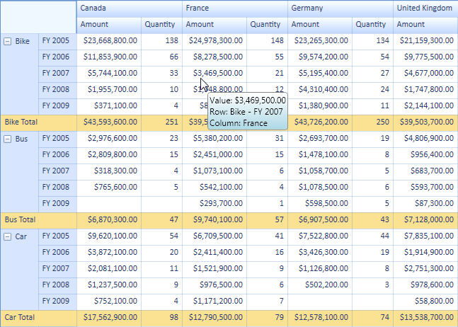
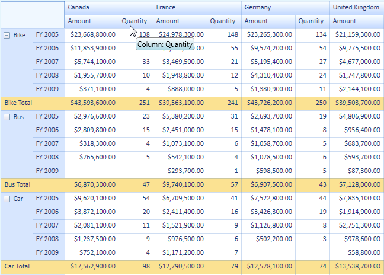
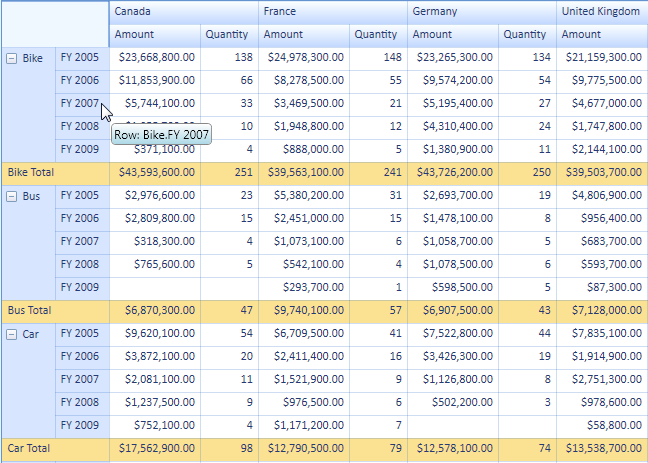
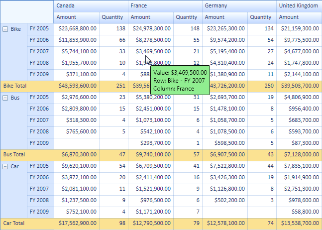
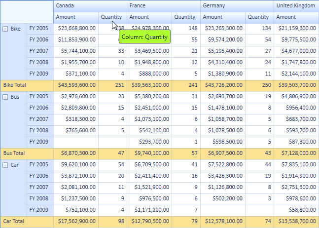

::: {style="DISPLAY: none"}
{#d2h_url_template} {#d2h_package_url style="WIDTH: 0px; DISPLAY: none; HEIGHT: 0px"}
:::

::: {.d2h_secondary_topic style="PADDING-BOTTOM: 10pt; MARGIN: 0pt; PADDING-LEFT: 0pt; PADDING-RIGHT: 0pt; PADDING-TOP: 0pt"}
##### Adding ToolTip to an Application {#adding-tooltip-to-an-application style="tab-stops: 0pt"}

To show the ToolTip in the PivotGrid control you need to set the PivotGrid control's **TooltipEnabled** property to **true**. This is the master property which controls all the styles of the ToolTip property. The following code explains its usage.

 

+---------------------------------------------------------------------------------------------------------------------------------------------------------------------------------------------+
| **[\[C#\]]{style="FONT-FAMILY: 'Courier New'"}**                                                                                                                                            |
|                                                                                                                                                                                             |
| [//Enable Tooltip for PivotGridControl]{style="FONT-FAMILY: 'Courier New'; COLOR: green; FONT-SIZE: 9.5pt"}                                                                                 |
|                                                                                                                                                                                             |
| [this]{style="FONT-FAMILY: 'Courier New'; COLOR: blue; FONT-SIZE: 9.5pt"} [.pivotGrid1.ToolTipEnabled = [true]{style="COLOR: blue"};]{style="FONT-FAMILY: 'Courier New'; FONT-SIZE: 9.5pt"} |
|                                                                                                                                                                                             |
|                                                                                                                                                                                             |
+---------------------------------------------------------------------------------------------------------------------------------------------------------------------------------------------+

[]{style="COLOR: #c00000"} 

+------------------------------------------------------------------------------------------------------------------------------------------------------------------------------------------+
| **[\[VB\]]{style="FONT-FAMILY: 'Courier New'"}**                                                                                                                                         |
|                                                                                                                                                                                          |
| [//Enable Tooltip for PivotGridControl]{style="FONT-FAMILY: 'Courier New'; COLOR: green; FONT-SIZE: 9.5pt"}                                                                              |
|                                                                                                                                                                                          |
| [Me]{style="FONT-FAMILY: 'Courier New'; COLOR: blue; FONT-SIZE: 9.5pt"} [.pivotGrid1.ToolTipEnabled = [True]{style="COLOR: blue"}]{style="FONT-FAMILY: 'Courier New'; FONT-SIZE: 9.5pt"} |
|                                                                                                                                                                                          |
|                                                                                                                                                                                          |
+------------------------------------------------------------------------------------------------------------------------------------------------------------------------------------------+

[]{style="COLOR: #c00000"} 

You can set the appearance of ToolTips with respect to their styles. Each style has its own **ToolTipEnabled** property. These properties help to set the appearance individually for each style. The following code explains its implementation.

 

+-------------------------------------------------------------------------------------------------------------------------------------------------------------------------------------------------------------------+
| **[\[C#\]]{style="FONT-FAMILY: 'Courier New'"}**                                                                                                                                                                  |
|                                                                                                                                                                                                                   |
| [//Enable Tooltip for RowHeaderCellStyle]{style="FONT-FAMILY: 'Courier New'; COLOR: green; FONT-SIZE: 9.5pt"} []{style="FONT-FAMILY: 'Courier New'; FONT-SIZE: 9.5pt"}                                            |
|                                                                                                                                                                                                                   |
| [this]{style="FONT-FAMILY: 'Courier New'; COLOR: blue; FONT-SIZE: 9.5pt"} [.pivotGrid1.RowHeaderCellStyle.ToolTipEnabled = [true]{style="COLOR: blue"};]{style="FONT-FAMILY: 'Courier New'; FONT-SIZE: 9.5pt"}    |
|                                                                                                                                                                                                                   |
| [//Enable Tooltip for ColumnHeaderCellStyle]{style="FONT-FAMILY: 'Courier New'; COLOR: green; FONT-SIZE: 9.5pt"} []{style="FONT-FAMILY: 'Courier New'; FONT-SIZE: 9.5pt"}                                         |
|                                                                                                                                                                                                                   |
| [this]{style="FONT-FAMILY: 'Courier New'; COLOR: blue; FONT-SIZE: 9.5pt"} [.pivotGrid1.ColumnHeaderCellStyle.ToolTipEnabled = [true]{style="COLOR: blue"};]{style="FONT-FAMILY: 'Courier New'; FONT-SIZE: 9.5pt"} |
|                                                                                                                                                                                                                   |
| [//Enable Tooltip for ValueCellStyle]{style="FONT-FAMILY: 'Courier New'; COLOR: green; FONT-SIZE: 9.5pt"} []{style="FONT-FAMILY: 'Courier New'; FONT-SIZE: 9.5pt"}                                                |
|                                                                                                                                                                                                                   |
| [this]{style="FONT-FAMILY: 'Courier New'; COLOR: blue; FONT-SIZE: 9.5pt"} [.pivotGrid1.ValueCellStyle.ToolTipEnabled = [true]{style="COLOR: blue"};]{style="FONT-FAMILY: 'Courier New'; FONT-SIZE: 9.5pt"}        |
|                                                                                                                                                                                                                   |
| [//Enable Tooltip for SummaryHeaderStyle]{style="FONT-FAMILY: 'Courier New'; COLOR: green; FONT-SIZE: 9.5pt"} []{style="FONT-FAMILY: 'Courier New'; FONT-SIZE: 9.5pt"}                                            |
|                                                                                                                                                                                                                   |
| [this]{style="FONT-FAMILY: 'Courier New'; COLOR: blue; FONT-SIZE: 9.5pt"} [.pivotGrid1.SummaryHeaderStyle.ToolTipEnabled = [true]{style="COLOR: blue"};]{style="FONT-FAMILY: 'Courier New'; FONT-SIZE: 9.5pt"}    |
|                                                                                                                                                                                                                   |
| [//Enable Tooltip for SummaryCellStyle]{style="FONT-FAMILY: 'Courier New'; COLOR: green; FONT-SIZE: 9.5pt"} []{style="FONT-FAMILY: 'Courier New'; FONT-SIZE: 9.5pt"}                                              |
|                                                                                                                                                                                                                   |
| [this]{style="FONT-FAMILY: 'Courier New'; COLOR: blue; FONT-SIZE: 9.5pt"} [.pivotGrid1.SummaryCellStyle.ToolTipEnabled = [true]{style="COLOR: blue"};]{style="FONT-FAMILY: 'Courier New'; FONT-SIZE: 9.5pt"}      |
|                                                                                                                                                                                                                   |
|                                                                                                                                                                                                                   |
+-------------------------------------------------------------------------------------------------------------------------------------------------------------------------------------------------------------------+

[]{style="COLOR: #c00000"} 

+----------------------------------------------------------------------------------------------------------------------------------------------------------------------------------------------------------------+
| **[\[VB\]]{style="FONT-FAMILY: 'Courier New'"}**                                                                                                                                                               |
|                                                                                                                                                                                                                |
| [//Enable Tooltip for RowHeaderCellStyle]{style="FONT-FAMILY: 'Courier New'; COLOR: green; FONT-SIZE: 9.5pt"} []{style="FONT-FAMILY: 'Courier New'; FONT-SIZE: 9.5pt"}                                         |
|                                                                                                                                                                                                                |
| [Me]{style="FONT-FAMILY: 'Courier New'; COLOR: blue; FONT-SIZE: 9.5pt"} [.pivotGrid1.RowHeaderCellStyle.ToolTipEnabled = [True]{style="COLOR: blue"}]{style="FONT-FAMILY: 'Courier New'; FONT-SIZE: 9.5pt"}    |
|                                                                                                                                                                                                                |
| [//Enable Tooltip for ColumnHeaderCellStyle]{style="FONT-FAMILY: 'Courier New'; COLOR: green; FONT-SIZE: 9.5pt"} []{style="FONT-FAMILY: 'Courier New'; FONT-SIZE: 9.5pt"}                                      |
|                                                                                                                                                                                                                |
| [Me]{style="FONT-FAMILY: 'Courier New'; COLOR: blue; FONT-SIZE: 9.5pt"} [.pivotGrid1.ColumnHeaderCellStyle.ToolTipEnabled = [True]{style="COLOR: blue"}]{style="FONT-FAMILY: 'Courier New'; FONT-SIZE: 9.5pt"} |
|                                                                                                                                                                                                                |
| [//Enable Tooltip for ValueCellStyle]{style="FONT-FAMILY: 'Courier New'; COLOR: green; FONT-SIZE: 9.5pt"} []{style="FONT-FAMILY: 'Courier New'; FONT-SIZE: 9.5pt"}                                             |
|                                                                                                                                                                                                                |
| [Me]{style="FONT-FAMILY: 'Courier New'; COLOR: blue; FONT-SIZE: 9.5pt"} [.pivotGrid1.ValueCellStyle.ToolTipEnabled = [True]{style="COLOR: blue"}]{style="FONT-FAMILY: 'Courier New'; FONT-SIZE: 9.5pt"}        |
|                                                                                                                                                                                                                |
| [//Enable Tooltip for SummaryHeaderStyle]{style="FONT-FAMILY: 'Courier New'; COLOR: green; FONT-SIZE: 9.5pt"} []{style="FONT-FAMILY: 'Courier New'; FONT-SIZE: 9.5pt"}                                         |
|                                                                                                                                                                                                                |
| [Me]{style="FONT-FAMILY: 'Courier New'; COLOR: blue; FONT-SIZE: 9.5pt"} [.pivotGrid1.SummaryHeaderStyle.ToolTipEnabled = [True]{style="COLOR: blue"}]{style="FONT-FAMILY: 'Courier New'; FONT-SIZE: 9.5pt"}    |
|                                                                                                                                                                                                                |
| [//Enable Tooltip for SummaryCellStyle]{style="FONT-FAMILY: 'Courier New'; COLOR: green; FONT-SIZE: 9.5pt"} []{style="FONT-FAMILY: 'Courier New'; FONT-SIZE: 9.5pt"}                                           |
|                                                                                                                                                                                                                |
| [Me]{style="FONT-FAMILY: 'Courier New'; COLOR: blue; FONT-SIZE: 9.5pt"} [.pivotGrid1.SummaryCellStyle.ToolTipEnabled = [True]{style="COLOR: blue"}]{style="FONT-FAMILY: 'Courier New'; FONT-SIZE: 9.5pt"}      |
|                                                                                                                                                                                                                |
|                                                                                                                                                                                                                |
+----------------------------------------------------------------------------------------------------------------------------------------------------------------------------------------------------------------+

[]{style="COLOR: #c00000"} 

{border="0"}

Figure 39: Default ToolTip (Visual Style: Office2007Blue)

 

{border="0"}

Figure 40: ToolTip Shown at Column

{border="0"}

Figure 41: ToolTip Shown at Row

 

Custom data templates can be set to the PivotGrid control's ToolTip. To do so, you need to write a data template and bind the style's **Tag** property and set the key to the PivotGrid control's **CustomToolTipTemplateKey** property. The following code explains its implementation.

+---------------------------------------------------------------------------------------------------------------------------------------------------------------------------------------------------------------------------------------------------------------------------------------------------+
| **[\[C#\]]{style="FONT-FAMILY: 'Courier New'"}**                                                                                                                                                                                                                                                  |
|                                                                                                                                                                                                                                                                                                   |
| [//Set the Custom DataTemplate for PivotGridControl's Tooltip]{style="FONT-FAMILY: 'Courier New'; COLOR: green; FONT-SIZE: 9.5pt"}                                                                                                                                                                |
|                                                                                                                                                                                                                                                                                                   |
| [this]{style="FONT-FAMILY: 'Courier New'; COLOR: blue; FONT-SIZE: 9.5pt"} [.pivotGrid1.CustomToolTipTemplateKey = \"[CustomTemplateTooltip]{style="COLOR: #a31515"}\";]{style="FONT-FAMILY: 'Courier New'; FONT-SIZE: 9.5pt"} []{style="FONT-FAMILY: Consolas; COLOR: #a31515; FONT-SIZE: 9.5pt"} |
+---------------------------------------------------------------------------------------------------------------------------------------------------------------------------------------------------------------------------------------------------------------------------------------------------+

[]{style="COLOR: #c00000"} 

+----------------------------------------------------------------------------------------------------------------------------------------------------------------------------------------------------------------------------+
| **[\[VB\]]{style="FONT-FAMILY: 'Courier New'"}**                                                                                                                                                                           |
|                                                                                                                                                                                                                            |
| [//Set the Custom DataTemplate for PivotGridControl's Tooltip]{style="FONT-FAMILY: 'Courier New'; COLOR: green; FONT-SIZE: 9.5pt"}                                                                                         |
|                                                                                                                                                                                                                            |
| [Me]{style="FONT-FAMILY: 'Courier New'; COLOR: blue; FONT-SIZE: 9.5pt"} [.pivotGrid1.CustomToolTipTemplateKey = \"[CustomTemplateTooltip]{style="COLOR: #a31515"}\"]{style="FONT-FAMILY: 'Courier New'; FONT-SIZE: 9.5pt"} |
|                                                                                                                                                                                                                            |
|                                                                                                                                                                                                                            |
+----------------------------------------------------------------------------------------------------------------------------------------------------------------------------------------------------------------------------+

{border="0"}

Figure 42: Custom ToolTip (Custom DataTemplate)

 

You can set the data template of ToolTip with respect to its styles. Each style has its own **CustomToolTipTemplateKey** property. These properties help to set the appearance individually for each style. The following code explains its implementation.

 

+-------------------------------------------------------------------------------------------------------------------------------------------------------------------------------------------------------------------------------------------------------------------------------+
| **[\[C#\]]{style="FONT-FAMILY: 'Courier New'"}**                                                                                                                                                                                                                              |
|                                                                                                                                                                                                                                                                               |
| [//Set the Custom DataTemplate for ColumnHeaderCellStyle Tooltip]{style="FONT-FAMILY: 'Courier New'; COLOR: green; FONT-SIZE: 9.5pt"}                                                                                                                                         |
|                                                                                                                                                                                                                                                                               |
| [this]{style="FONT-FAMILY: 'Courier New'; COLOR: blue; FONT-SIZE: 9.5pt"} [.pivotGrid1.ColumnHeaderCellStyle.CustomToolTipTemplateKey = [\"ColumnTemplateTooltip\"]{style="COLOR: #a31515"};]{style="FONT-FAMILY: 'Courier New'; FONT-SIZE: 9.5pt"}                           |
|                                                                                                                                                                                                                                                                               |
| [//Set the Custom DataTemplate for RowHeaderCellStyle Tooltip]{style="FONT-FAMILY: 'Courier New'; COLOR: green; FONT-SIZE: 9.5pt"}                                                                                                                                            |
|                                                                                                                                                                                                                                                                               |
| [this]{style="FONT-FAMILY: 'Courier New'; COLOR: blue; FONT-SIZE: 9.5pt"} [.pivotGrid1.RowHeaderCellStyle.CustomToolTipTemplateKey = [\"RowTemplateTooltip\"]{style="COLOR: #a31515"};]{style="FONT-FAMILY: 'Courier New'; FONT-SIZE: 9.5pt"}                                 |
|                                                                                                                                                                                                                                                                               |
| [//Set the Custom DataTemplate for ]{style="FONT-FAMILY: 'Courier New'; COLOR: green; FONT-SIZE: 9.5pt"} [  [ValueCellStyle Tooltip]{style="COLOR: green"}]{style="FONT-FAMILY: 'Courier New'; FONT-SIZE: 9.5pt"}                                                             |
|                                                                                                                                                                                                                                                                               |
| [this]{style="FONT-FAMILY: 'Courier New'; COLOR: blue; FONT-SIZE: 9.5pt"} [.pivotGrid1.ValueCellStyle.CustomToolTipTemplateKey = [\"ValueTemplateTooltip\"]{style="COLOR: #a31515"};]{style="FONT-FAMILY: 'Courier New'; FONT-SIZE: 9.5pt"}                                   |
|                                                                                                                                                                                                                                                                               |
| [//Set the Custom DataTemplate for ]{style="FONT-FAMILY: 'Courier New'; COLOR: green; FONT-SIZE: 9.5pt"} [  [SummaryHeaderStyle Tooltip]{style="COLOR: green"}]{style="FONT-FAMILY: 'Courier New'; FONT-SIZE: 9.5pt"}                                                         |
|                                                                                                                                                                                                                                                                               |
| [this]{style="FONT-FAMILY: 'Courier New'; COLOR: blue; FONT-SIZE: 9.5pt"} [.pivotGrid1.SummaryHeaderStyle.CustomToolTipTemplateKey = [\"SummaryHeaderTemplateTooltip\"]{style="COLOR: #a31515"};]{style="FONT-FAMILY: 'Courier New'; FONT-SIZE: 9.5pt"}                       |
|                                                                                                                                                                                                                                                                               |
| [//Set the Custom DataTemplate for SummaryCellStyle Tooltip]{style="FONT-FAMILY: 'Courier New'; COLOR: green; FONT-SIZE: 9.5pt"} []{style="FONT-FAMILY: 'Courier New'; FONT-SIZE: 9.5pt"}                                                                                     |
|                                                                                                                                                                                                                                                                               |
| [this]{style="FONT-FAMILY: 'Courier New'; COLOR: blue; FONT-SIZE: 9.5pt"} [.pivotGrid1.SummaryCellStyle.CustomToolTipTemplateKey = [\"SummaryCellTemplateTooltip\"]{style="COLOR: #a31515"};[]{style="COLOR: #a31515"}]{style="FONT-FAMILY: 'Courier New'; FONT-SIZE: 9.5pt"} |
|                                                                                                                                                                                                                                                                               |
| []{style="FONT-FAMILY: Consolas; COLOR: #a31515; FONT-SIZE: 9.5pt"}                                                                                                                                                                                                           |
+-------------------------------------------------------------------------------------------------------------------------------------------------------------------------------------------------------------------------------------------------------------------------------+

[]{style="COLOR: #c00000"} 

+------------------------------------------------------------------------------------------------------------------------------------------------------------------------------------------------------------------------------------------------------+
| **[\[VB\]]{style="FONT-FAMILY: 'Courier New'"}**                                                                                                                                                                                                     |
|                                                                                                                                                                                                                                                      |
| [//Set the Custom DataTemplate for ColumnHeaderCellStyle Tooltip]{style="FONT-FAMILY: 'Courier New'; COLOR: green; FONT-SIZE: 9.5pt"}                                                                                                                |
|                                                                                                                                                                                                                                                      |
| [Me]{style="FONT-FAMILY: 'Courier New'; COLOR: blue; FONT-SIZE: 9.5pt"} [.pivotGrid1.ColumnHeaderCellStyle.CustomToolTipTemplateKey = [\"ColumnTemplateTooltip\"]{style="COLOR: #a31515"}]{style="FONT-FAMILY: 'Courier New'; FONT-SIZE: 9.5pt"}     |
|                                                                                                                                                                                                                                                      |
| [//Set the Custom DataTemplate for RowHeaderCellStyle Tooltip]{style="FONT-FAMILY: 'Courier New'; COLOR: green; FONT-SIZE: 9.5pt"}                                                                                                                   |
|                                                                                                                                                                                                                                                      |
| [Me]{style="FONT-FAMILY: 'Courier New'; COLOR: blue; FONT-SIZE: 9.5pt"} [.pivotGrid1.RowHeaderCellStyle.CustomToolTipTemplateKey = [\"RowTemplateTooltip\"]{style="COLOR: #a31515"}]{style="FONT-FAMILY: 'Courier New'; FONT-SIZE: 9.5pt"}           |
|                                                                                                                                                                                                                                                      |
| [//Set the Custom DataTemplate for ]{style="FONT-FAMILY: 'Courier New'; COLOR: green; FONT-SIZE: 9.5pt"} [  [ValueCellStyle Tooltip]{style="COLOR: green"}]{style="FONT-FAMILY: 'Courier New'; FONT-SIZE: 9.5pt"}                                    |
|                                                                                                                                                                                                                                                      |
| [Me]{style="FONT-FAMILY: 'Courier New'; COLOR: blue; FONT-SIZE: 9.5pt"} [.pivotGrid1.ValueCellStyle.CustomToolTipTemplateKey = [\"ValueTemplateTooltip\"]{style="COLOR: #a31515"}]{style="FONT-FAMILY: 'Courier New'; FONT-SIZE: 9.5pt"}             |
|                                                                                                                                                                                                                                                      |
| [//Set the Custom DataTemplate for ]{style="FONT-FAMILY: 'Courier New'; COLOR: green; FONT-SIZE: 9.5pt"} [  [SummaryHeaderStyle Tooltip]{style="COLOR: green"}]{style="FONT-FAMILY: 'Courier New'; FONT-SIZE: 9.5pt"}                                |
|                                                                                                                                                                                                                                                      |
| [Me]{style="FONT-FAMILY: 'Courier New'; COLOR: blue; FONT-SIZE: 9.5pt"} [.pivotGrid1.SummaryHeaderStyle.CustomToolTipTemplateKey = [\"SummaryHeaderTemplateTooltip\"]{style="COLOR: #a31515"}]{style="FONT-FAMILY: 'Courier New'; FONT-SIZE: 9.5pt"} |
|                                                                                                                                                                                                                                                      |
| [//Set the Custom DataTemplate for SummaryCellStyle Tooltip]{style="FONT-FAMILY: 'Courier New'; COLOR: green; FONT-SIZE: 9.5pt"} []{style="FONT-FAMILY: 'Courier New'; FONT-SIZE: 9.5pt"}                                                            |
|                                                                                                                                                                                                                                                      |
| [Me]{style="FONT-FAMILY: 'Courier New'; COLOR: blue; FONT-SIZE: 9.5pt"} [.pivotGrid1.SummaryCellStyle.CustomToolTipTemplateKey = [\"SummaryCellTemplateTooltip\"]{style="COLOR: #a31515"}]{style="FONT-FAMILY: 'Courier New'; FONT-SIZE: 9.5pt"}     |
+------------------------------------------------------------------------------------------------------------------------------------------------------------------------------------------------------------------------------------------------------+

[]{style="COLOR: #c00000"} 

{border="0"}

Figure 43: Custom DataTemplate for ColumnHeaderCellStyle

[]{#related-topics}
:::
