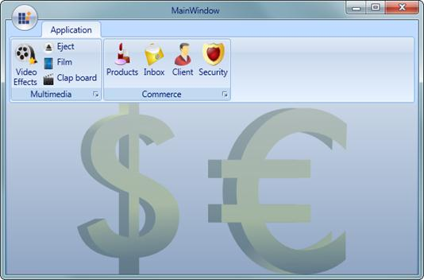
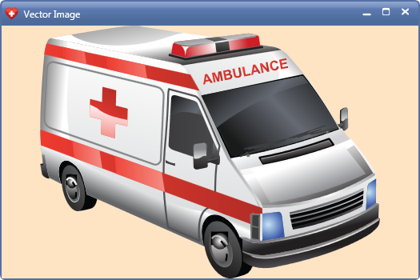

::: {style="DISPLAY: none"}
{#d2h_url_template}{#d2h_package_url style="WIDTH: 0px; DISPLAY: none; HEIGHT: 0px"}
:::

:::: {.d2h_secondary_topic style="PADDING-BOTTOM: 10pt; MARGIN: 0pt; PADDING-LEFT: 0pt; PADDING-RIGHT: 0pt; PADDING-TOP: 0pt"}
#### Adding Vector Images to an Application {#adding-vector-images-to-an-application style="tab-stops: 0pt"}

 

For using Vector Images in a WPF application, you need to add the following assembly to the references.     

                                **Syncfusion.VectorImages.WPF**

The resource dictionary containing the Vector Images should be merged into the WPF application. The following table shows the source path for each category.

***[]{style="FONT-FAMILY: 'Trebuchet MS','sans-serif'; COLOR: #15428b; FONT-SIZE: 9pt"}*** 

***[]{style="FONT-FAMILY: 'Trebuchet MS','sans-serif'; COLOR: #15428b; FONT-SIZE: 9pt"}*** 

::: {align="center"}
  Category           Resource Dictionary path
  ------------------ --------------------------------------------------------------------
  Banking            /Syncfusion.VectorImages.WPF;component/Icons/Banking.xaml
  Chart              /Syncfusion.VectorImages.WPF;component/Icons/Chart.xaml
  Computer           /Syncfusion.VectorImages.WPF;component/Icons/Computer.xaml
  Construction       /Syncfusion.VectorImages.WPF;component/Icons/Construction.xaml
  E-Commerce         /Syncfusion.VectorImages.WPF;component/Icons/E-Commerce.xaml
  Education          /Syncfusion.VectorImages.WPF;component/Icons/Education.xaml
  Finance            /Syncfusion.VectorImages.WPF;component/Icons/Finance.xaml
  Flags              /Syncfusion.VectorImages.WPF;component/Icons/Flags.xaml
  Food               /Syncfusion.VectorImages.WPF;component/Icons/Food.xaml
  General            /Syncfusion.VectorImages.WPF;component/Icons/General.xaml
  Medical            /Syncfusion.VectorImages.WPF;component/Icons/Medical.xaml
  Multimedia         /Syncfusion.VectorImages.WPF;component/Icons/Multimedia.xaml
  Outlook2007Icons   /Syncfusion.VectorImages.WPF;component/Icons/Outlook2007Icons.xaml
  General            /Syncfusion.VectorImages.WPF;component/Icons/General.xaml
:::

[]{style="FONT-FAMILY: 'Trebuchet MS','sans-serif'; COLOR: #15428b; FONT-SIZE: 9pt"} 

The following code snippet explains how to add the Vector Images to a real time application.

 

+------------------------------------------------------------------------------------------------------------------------------------------------------------------------------------------------------------------------------------------------------------------------------------------------------------------------------------------------------------------------------------------------------------------------------------------------------------------------------------+
| **[\[XAML\]]{style="FONT-FAMILY: 'Courier New'"}**                                                                                                                                                                                                                                                                                                                                                                                                                                 |
|                                                                                                                                                                                                                                                                                                                                                                                                                                                                                    |
| [\                                                                                                                                                                                                                                                                                                                                                                                                                                                                                 |
| ]{style="FONT-FAMILY: Consolas"}[\<]{style="FONT-FAMILY: 'Courier New'; COLOR: blue"}[syncfusion]{style="FONT-FAMILY: 'Courier New'; COLOR: #a31515"}[:]{style="FONT-FAMILY: 'Courier New'; COLOR: blue"}[Ribbon]{style="FONT-FAMILY: 'Courier New'; COLOR: #a31515"}[\>]{style="FONT-FAMILY: 'Courier New'; COLOR: blue"}                                                                                                                                                         |
|                                                                                                                                                                                                                                                                                                                                                                                                                                                                                    |
| [  ]{style="FONT-FAMILY: 'Courier New'; COLOR: #a31515"}[\<]{style="FONT-FAMILY: 'Courier New'; COLOR: blue"}[syncfusion]{style="FONT-FAMILY: 'Courier New'; COLOR: #a31515"}[:]{style="FONT-FAMILY: 'Courier New'; COLOR: blue"}[Ribbon.Resources]{style="FONT-FAMILY: 'Courier New'; COLOR: #a31515"}[\>]{style="FONT-FAMILY: 'Courier New'; COLOR: blue"}[\                                                                                                                     |
| [                ]{style="COLOR: #a31515"}[\<]{style="COLOR: blue"}[ResourceDictionary]{style="COLOR: #a31515"}[\>]{style="COLOR: blue"}\                                                                                                                                                                                                                                                                                                                                          |
| [                    ]{style="COLOR: #a31515"}[\<]{style="COLOR: blue"}[ResourceDictionary.MergedDictionaries]{style="COLOR: #a31515"}[\>]{style="COLOR: blue"}\                                                                                                                                                                                                                                                                                                                   |
| [                        ]{style="COLOR: #a31515"}[\<]{style="COLOR: blue"}[ResourceDictionary]{style="COLOR: #a31515"}[ Source]{style="COLOR: red"}[=\"/Syncfusion.VectorImages.WPF;component/Icons/General.xaml\"/\>]{style="COLOR: blue"}\                                                                                                                                                                                                                                      |
| [                        ]{style="COLOR: #a31515"}[\<]{style="COLOR: blue"}[ResourceDictionary]{style="COLOR: #a31515"}[ Source]{style="COLOR: red"}[=\"/Syncfusion.VectorImages.WPF;component/Icons/E-Commerce.xaml\"/\>]{style="COLOR: blue"}\                                                                                                                                                                                                                                   |
| [                        ]{style="COLOR: #a31515"}[\<]{style="COLOR: blue"}[ResourceDictionary]{style="COLOR: #a31515"}[ Source]{style="COLOR: red"}[=\"/Syncfusion.VectorImages.WPF;component/Icons/Multimedia.xaml\"/\>]{style="COLOR: blue"}\                                                                                                                                                                                                                                   |
| [                    ]{style="COLOR: #a31515"}[\</]{style="COLOR: blue"}[ResourceDictionary.MergedDictionaries]{style="COLOR: #a31515"}[\>]{style="COLOR: blue"}\                                                                                                                                                                                                                                                                                                                  |
| [                ]{style="COLOR: #a31515"}[\</]{style="COLOR: blue"}[ResourceDictionary]{style="COLOR: #a31515"}[\>]{style="COLOR: blue"}\                                                                                                                                                                                                                                                                                                                                         |
| [            ]{style="COLOR: #a31515"}[\</]{style="COLOR: blue"}[syncfusion]{style="COLOR: #a31515"}[:]{style="COLOR: blue"}[Ribbon.Resources]{style="COLOR: #a31515"}[\>]{style="COLOR: blue"}]{style="FONT-FAMILY: 'Courier New'"}                                                                                                                                                                                                                                               |
|                                                                                                                                                                                                                                                                                                                                                                                                                                                                                    |
| [\                                                                                                                                                                                                                                                                                                                                                                                                                                                                                 |
| [            ]{style="COLOR: #a31515"}[\<]{style="COLOR: blue"}[syncfusion]{style="COLOR: #a31515"}[:]{style="COLOR: blue"}[Ribbon.ApplicationMenu]{style="COLOR: #a31515"}[\>]{style="COLOR: blue"}\                                                                                                                                                                                                                                                                              |
| [                ]{style="COLOR: #a31515"}[\<]{style="COLOR: blue"}[syncfusion]{style="COLOR: #a31515"}[:]{style="COLOR: blue"}[ApplicationMenu]{style="COLOR: #a31515"}[ IsPopupOpen]{style="COLOR: red"}[=\"False\"]{style="COLOR: blue"}[ ApplicationButtonImage]{style="COLOR: red"}[=\"App.ico\"\>]{style="COLOR: blue"}\                                                                                                                                                     |
| [                ]{style="COLOR: #a31515"}[\</]{style="COLOR: blue"}[syncfusion]{style="COLOR: #a31515"}[:]{style="COLOR: blue"}[ApplicationMenu]{style="COLOR: #a31515"}[\>]{style="COLOR: blue"}\                                                                                                                                                                                                                                                                                |
| [            ]{style="COLOR: #a31515"}[\</]{style="COLOR: blue"}[syncfusion]{style="COLOR: #a31515"}[:]{style="COLOR: blue"}[Ribbon.ApplicationMenu]{style="COLOR: #a31515"}[\>]{style="COLOR: blue"}\                                                                                                                                                                                                                                                                             |
| [            ]{style="COLOR: #a31515"}[\<]{style="COLOR: blue"}[syncfusion]{style="COLOR: #a31515"}[:]{style="COLOR: blue"}[RibbonTab]{style="COLOR: #a31515"}[ Caption]{style="COLOR: red"}[=\"Application\"\>]{style="COLOR: blue"}\                                                                                                                                                                                                                                             |
| [                ]{style="COLOR: #a31515"}[\<]{style="COLOR: blue"}[syncfusion]{style="COLOR: #a31515"}[:]{style="COLOR: blue"}[RibbonBar]{style="COLOR: #a31515"}[ Header]{style="COLOR: red"}[=\"Multimedia\"\>]{style="COLOR: blue"}\                                                                                                                                                                                                                                           |
| [                    ]{style="COLOR: #a31515"}[\<]{style="COLOR: blue"}[syncfusion]{style="COLOR: #a31515"}[:]{style="COLOR: blue"}[RibbonButton]{style="COLOR: #a31515"}[ Label]{style="COLOR: red"}[=\"Video Effects\"]{style="COLOR: blue"}[ LargeIcon]{style="COLOR: red"}[=\"{]{style="COLOR: blue"}[StaticResource]{style="COLOR: #a31515"}[ VideoEffects]{style="COLOR: red"}[}\"]{style="COLOR: blue"}[ SizeForm]{style="COLOR: red"}[=\"Large\"/\>]{style="COLOR: blue"}\ |
| [                    ]{style="COLOR: #a31515"}[\<]{style="COLOR: blue"}[syncfusion]{style="COLOR: #a31515"}[:]{style="COLOR: blue"}[RibbonButton]{style="COLOR: #a31515"}[ Label]{style="COLOR: red"}[=\"Eject\"]{style="COLOR: blue"}[ SmallIcon]{style="COLOR: red"}[=\"{]{style="COLOR: blue"}[StaticResource]{style="COLOR: #a31515"}[ Eject]{style="COLOR: red"}[}\"]{style="COLOR: blue"}[ SizeForm]{style="COLOR: red"}[=\"Small\"/\>]{style="COLOR: blue"}\                |
| [                    ]{style="COLOR: #a31515"}[\<]{style="COLOR: blue"}[syncfusion]{style="COLOR: #a31515"}[:]{style="COLOR: blue"}[RibbonButton]{style="COLOR: #a31515"}[ Label]{style="COLOR: red"}[=\"Film\"]{style="COLOR: blue"}[ SmallIcon]{style="COLOR: red"}[=\"{]{style="COLOR: blue"}[StaticResource]{style="COLOR: #a31515"}[ Film]{style="COLOR: red"}[}\"]{style="COLOR: blue"}[ SizeForm]{style="COLOR: red"}[=\"Small\"/\>]{style="COLOR: blue"}\                  |
| [                    ]{style="COLOR: #a31515"}[\<]{style="COLOR: blue"}[syncfusion]{style="COLOR: #a31515"}[:]{style="COLOR: blue"}[RibbonButton]{style="COLOR: #a31515"}[ Label]{style="COLOR: red"}[=\"Clap board\"]{style="COLOR: blue"}[ SmallIcon]{style="COLOR: red"}[=\"{]{style="COLOR: blue"}[StaticResource]{style="COLOR: #a31515"}[ Clapboard]{style="COLOR: red"}[}\"]{style="COLOR: blue"}[ SizeForm]{style="COLOR: red"}[=\"Small\"/\>]{style="COLOR: blue"}\       |
| [                ]{style="COLOR: #a31515"}[\</]{style="COLOR: blue"}[syncfusion]{style="COLOR: #a31515"}[:]{style="COLOR: blue"}[RibbonBar]{style="COLOR: #a31515"}[\>]{style="COLOR: blue"}\                                                                                                                                                                                                                                                                                      |
| [                ]{style="COLOR: #a31515"}[\<]{style="COLOR: blue"}[syncfusion]{style="COLOR: #a31515"}[:]{style="COLOR: blue"}[RibbonBar]{style="COLOR: #a31515"}[ Header]{style="COLOR: red"}[=\"Commerce\"\>]{style="COLOR: blue"}\                                                                                                                                                                                                                                             |
| [                    ]{style="COLOR: #a31515"}[\<]{style="COLOR: blue"}[syncfusion]{style="COLOR: #a31515"}[:]{style="COLOR: blue"}[RibbonButton]{style="COLOR: #a31515"}[ Label]{style="COLOR: red"}[=\"Products\"]{style="COLOR: blue"}[ LargeIcon]{style="COLOR: red"}[=\"{]{style="COLOR: blue"}[StaticResource]{style="COLOR: #a31515"}[ Products]{style="COLOR: red"}[}\"]{style="COLOR: blue"}[ SizeForm]{style="COLOR: red"}[=\"Large\"/\>]{style="COLOR: blue"}\          |
| [                    ]{style="COLOR: #a31515"}[\<]{style="COLOR: blue"}[syncfusion]{style="COLOR: #a31515"}[:]{style="COLOR: blue"}[RibbonButton]{style="COLOR: #a31515"}[ Label]{style="COLOR: red"}[=\"Inbox\"]{style="COLOR: blue"}[ LargeIcon]{style="COLOR: red"}[=\"{]{style="COLOR: blue"}[StaticResource]{style="COLOR: #a31515"}[ Email]{style="COLOR: red"}[}\"]{style="COLOR: blue"}[ SizeForm]{style="COLOR: red"}[=\"Large\"/\>]{style="COLOR: blue"}\                |
| [                    ]{style="COLOR: #a31515"}[\<]{style="COLOR: blue"}[syncfusion]{style="COLOR: #a31515"}[:]{style="COLOR: blue"}[RibbonButton]{style="COLOR: #a31515"}[ Label]{style="COLOR: red"}[=\"Client\"]{style="COLOR: blue"}[ LargeIcon]{style="COLOR: red"}[=\"{]{style="COLOR: blue"}[StaticResource]{style="COLOR: #a31515"}[ Client]{style="COLOR: red"}[}\"]{style="COLOR: blue"}[ SizeForm]{style="COLOR: red"}[=\"Large\"/\>]{style="COLOR: blue"}\              |
| [                    ]{style="COLOR: #a31515"}[\<]{style="COLOR: blue"}[syncfusion]{style="COLOR: #a31515"}[:]{style="COLOR: blue"}[RibbonButton]{style="COLOR: #a31515"}[ Label]{style="COLOR: red"}[=\"Security\"]{style="COLOR: blue"}[ LargeIcon]{style="COLOR: red"}[=\"{]{style="COLOR: blue"}[StaticResource]{style="COLOR: #a31515"}[ AntiFraud]{style="COLOR: red"}[}\"]{style="COLOR: blue"}[ SizeForm]{style="COLOR: red"}[=\"Large\"/\>]{style="COLOR: blue"}\         |
| [                ]{style="COLOR: #a31515"}[\</]{style="COLOR: blue"}[syncfusion]{style="COLOR: #a31515"}[:]{style="COLOR: blue"}[RibbonBar]{style="COLOR: #a31515"}[\>]{style="COLOR: blue"}\                                                                                                                                                                                                                                                                                      |
| [            ]{style="COLOR: #a31515"}[\</]{style="COLOR: blue"}[syncfusion]{style="COLOR: #a31515"}[:]{style="COLOR: blue"}[RibbonTab]{style="COLOR: #a31515"}[\>]{style="COLOR: blue"}\                                                                                                                                                                                                                                                                                          |
| [\</]{style="COLOR: blue"}[syncfusion]{style="COLOR: #a31515"}[:]{style="COLOR: blue"}[Ribbon]{style="COLOR: #a31515"}[\>]{style="COLOR: blue"}\                                                                                                                                                                                                                                                                                                                                   |
| \                                                                                                                                                                                                                                                                                                                                                                                                                                                                                  |
| ]{style="FONT-FAMILY: 'Courier New'"}                                                                                                                                                                                                                                                                                                                                                                                                                                              |
+------------------------------------------------------------------------------------------------------------------------------------------------------------------------------------------------------------------------------------------------------------------------------------------------------------------------------------------------------------------------------------------------------------------------------------------------------------------------------------+

[]{style="COLOR: black"} 

{border="0"}

Figure 1174: Ribbon Application with vector Images

*[]{style="COLOR: black"}* 

The Vector images Images can be resized or stretched in an application without deviating from its original clarity.

[]{style="FONT-FAMILY: 'Trebuchet MS','sans-serif'; COLOR: #15428b; FONT-SIZE: 9pt"} 

+------------------------------------------------------------------------------------------------------------------------------------------------------------------------------------------------------------------------------------------------------------------------------------------------------------------------------------------------------------------------------------------------------------------------------------------------------------------------------------------------------------------------------------------------------------------------------------------------------------------+
|                                                                                                                                                                                                                                                                                                                                                                                                                                                                                                                                                                                                                  |
|                                                                                                                                                                                                                                                                                                                                                                                                                                                                                                                                                                                                                  |
| **[\[XAML\]]{style="FONT-FAMILY: 'Courier New'"}**                                                                                                                                                                                                                                                                                                                                                                                                                                                                                                                                                               |
|                                                                                                                                                                                                                                                                                                                                                                                                                                                                                                                                                                                                                  |
| [\                                                                                                                                                                                                                                                                                                                                                                                                                                                                                                                                                                                                               |
| [\<]{style="COLOR: blue"}[syncfusion]{style="COLOR: #a31515"}[:]{style="COLOR: blue"}[ChromelessWindow]{style="COLOR: #a31515"}[ x]{style="COLOR: red"}[:]{style="COLOR: blue"}[Class]{style="COLOR: red"}[=\"WpfApplication1.MainWindow\"]{style="COLOR: blue"}\                                                                                                                                                                                                                                                                                                                                                |
|        [ xmlns]{style="COLOR: red"}[=\"http://schemas.microsoft.com/winfx/2006/xaml/presentation\"]{style="COLOR: blue"}[ ]{style="COLOR: red"}]{style="FONT-FAMILY: 'Courier New'"}                                                                                                                                                                                                                                                                                                                                                                                                                             |
|                                                                                                                                                                                                                                                                                                                                                                                                                                                                                                                                                                                                                  |
| [        Icon]{style="FONT-FAMILY: 'Courier New'; COLOR: red"}[=\"{]{style="FONT-FAMILY: 'Courier New'; COLOR: blue"}[StaticResource]{style="FONT-FAMILY: 'Courier New'; COLOR: #a31515"}[ Cardiology]{style="FONT-FAMILY: 'Courier New'; COLOR: red"}[}\"]{style="FONT-FAMILY: 'Courier New'; COLOR: blue"}[\                                                                                                                                                                                                                                                                                                   |
|        [ xmlns]{style="COLOR: red"}[:]{style="COLOR: blue"}[x]{style="COLOR: red"}[=\"http://schemas.microsoft.com/winfx/2006/xaml\"]{style="COLOR: blue"}[ Title]{style="COLOR: red"}[=\"Vector Image\"]{style="COLOR: blue"}\                                                                                                                                                                                                                                                                                                                                                                                  |
|        [ Height]{style="COLOR: red"}[=\"350\"]{style="COLOR: blue"}[ Width]{style="COLOR: red"}[=\"525\"]{style="COLOR: blue"}[ xmlns]{style="COLOR: red"}[:]{style="COLOR: blue"}[syncfusion]{style="COLOR: red"}[=\"http://schemas.syncfusion.com/wpf\"\>]{style="COLOR: blue"}\                                                                                                                                                                                                                                                                                                                               |
| [   ]{style="COLOR: #a31515"}\                                                                                                                                                                                                                                                                                                                                                                                                                                                                                                                                                                                   |
| [    ]{style="COLOR: #a31515"}[\<]{style="COLOR: blue"}[Grid]{style="COLOR: #a31515"}[\>]{style="COLOR: blue"}]{style="FONT-FAMILY: 'Courier New'"}                                                                                                                                                                                                                                                                                                                                                                                                                                                              |
|                                                                                                                                                                                                                                                                                                                                                                                                                                                                                                                                                                                                                  |
| [      ]{style="FONT-FAMILY: 'Courier New'; COLOR: #a31515"}[\<]{style="FONT-FAMILY: 'Courier New'; COLOR: blue"}[Image]{style="FONT-FAMILY: 'Courier New'; COLOR: #a31515"}[ Source]{style="FONT-FAMILY: 'Courier New'; COLOR: red"}[=\"{]{style="FONT-FAMILY: 'Courier New'; COLOR: blue"}[StaticResource]{style="FONT-FAMILY: 'Courier New'; COLOR: #a31515"}[ Ambulance]{style="FONT-FAMILY: 'Courier New'; COLOR: red"}[}\"]{style="FONT-FAMILY: 'Courier New'; COLOR: blue"}[ Stretch]{style="FONT-FAMILY: 'Courier New'; COLOR: red"}[=\"Uniform\"/\>]{style="FONT-FAMILY: 'Courier New'; COLOR: blue"}[\ |
| [    ]{style="COLOR: #a31515"}[\</]{style="COLOR: blue"}[Grid]{style="COLOR: #a31515"}[\>]{style="COLOR: blue"}\                                                                                                                                                                                                                                                                                                                                                                                                                                                                                                 |
| [\</]{style="COLOR: blue"}[syncfusion]{style="COLOR: #a31515"}[:]{style="COLOR: blue"}[ChromelessWindow]{style="COLOR: #a31515"}[\>]{style="COLOR: blue"}]{style="FONT-FAMILY: 'Courier New'"}                                                                                                                                                                                                                                                                                                                                                                                                                   |
+------------------------------------------------------------------------------------------------------------------------------------------------------------------------------------------------------------------------------------------------------------------------------------------------------------------------------------------------------------------------------------------------------------------------------------------------------------------------------------------------------------------------------------------------------------------------------------------------------------------+

 

 

{border="0"}

Figure 1175: Resized Vector Image

 

[]{#related-topics}
::::
