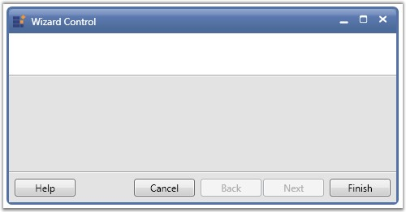
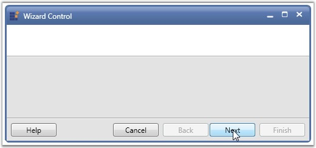

::: {style="DISPLAY: none"}
{#d2h_url_template}{#d2h_package_url style="WIDTH: 0px; DISPLAY: none; HEIGHT: 0px"}
:::

::: {.d2h_secondary_topic style="PADDING-BOTTOM: 10pt; MARGIN: 0pt; PADDING-LEFT: 0pt; PADDING-RIGHT: 0pt; PADDING-TOP: 0pt"}
#### Adding Wizard Page to the Wizard Control {#adding-wizard-page-to-the-wizard-control style="tab-stops: 0pt"}

[]{style="FONT-FAMILY: 'Trebuchet MS','sans-serif'; COLOR: #15428b; FONT-SIZE: 9pt"} 

You can add any number of wizard pages to the Wizard control. They are plenty of properties in the Wizard control that are used to customize the look and feel of the wizard page.

To add a wizard page to the Wizard control, use the below code

[]{style="FONT-FAMILY: 'Trebuchet MS','sans-serif'; COLOR: #15428b; FONT-SIZE: 9pt"} 

+-------------------------------------------------------------------------------------------------------------------------------------------------------------------------------------------------------------------------------------------------------------------------------------------------------------------------------------------------------------------------------------------------------------------------------------------------------------------------------------------------------------------------------------------------+
| **[\[XAML\]]{style="FONT-FAMILY: 'Courier New'; COLOR: black"}**                                                                                                                                                                                                                                                                                                                                                                                                                                                                                |
|                                                                                                                                                                                                                                                                                                                                                                                                                                                                                                                                                 |
| []{style="FONT-FAMILY: 'Courier New'; COLOR: black; FONT-SIZE: 9pt"}                                                                                                                                                                                                                                                                                                                                                                                                                                                                            |
|                                                                                                                                                                                                                                                                                                                                                                                                                                                                                                                                                 |
| [\<]{style="FONT-FAMILY: 'Courier New'; COLOR: blue; FONT-SIZE: 9pt"}[syncfusion]{style="FONT-FAMILY: 'Courier New'; COLOR: #a31515; FONT-SIZE: 9pt"}[:]{style="FONT-FAMILY: 'Courier New'; COLOR: blue; FONT-SIZE: 9pt"}[WizardControl]{style="FONT-FAMILY: 'Courier New'; COLOR: #a31515; FONT-SIZE: 9pt"}[ Name]{style="FONT-FAMILY: 'Courier New'; COLOR: red; FONT-SIZE: 9pt"}[=\"wizardControl\"\>]{style="FONT-FAMILY: 'Courier New'; COLOR: blue; FONT-SIZE: 9pt"}                                                                      |
|                                                                                                                                                                                                                                                                                                                                                                                                                                                                                                                                                 |
| [    ]{style="FONT-FAMILY: 'Courier New'; COLOR: #a31515; FONT-SIZE: 9pt"}[\<]{style="FONT-FAMILY: 'Courier New'; COLOR: blue; FONT-SIZE: 9pt"}[syncfusion]{style="FONT-FAMILY: 'Courier New'; COLOR: #a31515; FONT-SIZE: 9pt"}[:]{style="FONT-FAMILY: 'Courier New'; COLOR: blue; FONT-SIZE: 9pt"}[WizardPage]{style="FONT-FAMILY: 'Courier New'; COLOR: #a31515; FONT-SIZE: 9pt"}[ Name]{style="FONT-FAMILY: 'Courier New'; COLOR: red; FONT-SIZE: 9pt"}[=\"wizardPage\"/\>]{style="FONT-FAMILY: 'Courier New'; COLOR: blue; FONT-SIZE: 9pt"} |
|                                                                                                                                                                                                                                                                                                                                                                                                                                                                                                                                                 |
| [\</]{style="FONT-FAMILY: 'Courier New'; COLOR: blue; FONT-SIZE: 9pt"}[syncfusion]{style="FONT-FAMILY: 'Courier New'; COLOR: #a31515; FONT-SIZE: 9pt"}[:]{style="FONT-FAMILY: 'Courier New'; COLOR: blue; FONT-SIZE: 9pt"}[WizardControl]{style="FONT-FAMILY: 'Courier New'; COLOR: #a31515; FONT-SIZE: 9pt"}[\>]{style="FONT-FAMILY: 'Courier New'; COLOR: blue; FONT-SIZE: 9pt"}                                                                                                                                                              |
+-------------------------------------------------------------------------------------------------------------------------------------------------------------------------------------------------------------------------------------------------------------------------------------------------------------------------------------------------------------------------------------------------------------------------------------------------------------------------------------------------------------------------------------------------+

[]{style="FONT-FAMILY: 'Trebuchet MS','sans-serif'; COLOR: #15428b; FONT-SIZE: 9pt"} 

+---------------------------------------------------------------------------------------------------------------------------------+
| **[\[C#\]]{style="FONT-FAMILY: 'Courier New'; COLOR: black"}**                                                                  |
|                                                                                                                                 |
| []{style="FONT-FAMILY: 'Courier New'; COLOR: black; FONT-SIZE: 9pt"}                                                            |
|                                                                                                                                 |
| [WizardControl wizardControl = [new]{style="COLOR: blue"} WizardControl();]{style="FONT-FAMILY: 'Courier New'; FONT-SIZE: 9pt"} |
|                                                                                                                                 |
| [grid.Children.Add(wizardControl);]{style="FONT-FAMILY: 'Courier New'; FONT-SIZE: 9pt"}                                         |
|                                                                                                                                 |
| [WizardPage wizardPage = [new]{style="COLOR: blue"} WizardPage();]{style="FONT-FAMILY: 'Courier New'; FONT-SIZE: 9pt"}          |
|                                                                                                                                 |
| [wizardControl.Items.Add(wizardPage);  ]{style="FONT-FAMILY: 'Courier New'; FONT-SIZE: 9pt"}                                    |
+---------------------------------------------------------------------------------------------------------------------------------+

[]{style="FONT-FAMILY: 'Trebuchet MS','sans-serif'; COLOR: #15428b; FONT-SIZE: 9pt"} 

{border="0"}

*[]{style="FONT-FAMILY: 'Trebuchet MS','sans-serif'; COLOR: #15428b; FONT-SIZE: 9pt"}* 

Figure 1191: Wizard Control with a Single Wizard Page

*[]{style="FONT-FAMILY: 'Trebuchet MS','sans-serif'; COLOR: #15428b; FONT-SIZE: 9pt"}* 

[To add two wizard pages to the Wizard control, refer the below code]{style="FONT-FAMILY: 'Trebuchet MS','sans-serif'; COLOR: #15428b; FONT-SIZE: 9pt"}

[]{style="FONT-FAMILY: 'Trebuchet MS','sans-serif'; COLOR: #15428b; FONT-SIZE: 9pt"} 

+--------------------------------------------------------------------------------------------------------------------------------------------------------------------------------------------------------------------------------------------------------------------------------------------------------------------------------------------------------------------------------------------------------------------------------------------------------------------------------------------------------------------------------------------------+
| **[\[XAML\]]{style="FONT-FAMILY: 'Courier New'; COLOR: black"}**                                                                                                                                                                                                                                                                                                                                                                                                                                                                                 |
|                                                                                                                                                                                                                                                                                                                                                                                                                                                                                                                                                  |
| []{style="FONT-FAMILY: 'Courier New'; COLOR: black; FONT-SIZE: 9pt"}                                                                                                                                                                                                                                                                                                                                                                                                                                                                             |
|                                                                                                                                                                                                                                                                                                                                                                                                                                                                                                                                                  |
| [\<]{style="FONT-FAMILY: 'Courier New'; COLOR: blue; FONT-SIZE: 9pt"}[syncfusion]{style="FONT-FAMILY: 'Courier New'; COLOR: #a31515; FONT-SIZE: 9pt"}[:]{style="FONT-FAMILY: 'Courier New'; COLOR: blue; FONT-SIZE: 9pt"}[WizardControl]{style="FONT-FAMILY: 'Courier New'; COLOR: #a31515; FONT-SIZE: 9pt"}[ Name]{style="FONT-FAMILY: 'Courier New'; COLOR: red; FONT-SIZE: 9pt"}[=\"wizardControl\"\>]{style="FONT-FAMILY: 'Courier New'; COLOR: blue; FONT-SIZE: 9pt"}                                                                       |
|                                                                                                                                                                                                                                                                                                                                                                                                                                                                                                                                                  |
| [    ]{style="FONT-FAMILY: 'Courier New'; COLOR: #a31515; FONT-SIZE: 9pt"}[\<]{style="FONT-FAMILY: 'Courier New'; COLOR: blue; FONT-SIZE: 9pt"}[syncfusion]{style="FONT-FAMILY: 'Courier New'; COLOR: #a31515; FONT-SIZE: 9pt"}[:]{style="FONT-FAMILY: 'Courier New'; COLOR: blue; FONT-SIZE: 9pt"}[WizardPage]{style="FONT-FAMILY: 'Courier New'; COLOR: #a31515; FONT-SIZE: 9pt"}[ Name]{style="FONT-FAMILY: 'Courier New'; COLOR: red; FONT-SIZE: 9pt"}[=\"wizardPage1\"/\>]{style="FONT-FAMILY: 'Courier New'; COLOR: blue; FONT-SIZE: 9pt"} |
|                                                                                                                                                                                                                                                                                                                                                                                                                                                                                                                                                  |
| [    ]{style="FONT-FAMILY: 'Courier New'; COLOR: #a31515; FONT-SIZE: 9pt"}[\<]{style="FONT-FAMILY: 'Courier New'; COLOR: blue; FONT-SIZE: 9pt"}[syncfusion]{style="FONT-FAMILY: 'Courier New'; COLOR: #a31515; FONT-SIZE: 9pt"}[:]{style="FONT-FAMILY: 'Courier New'; COLOR: blue; FONT-SIZE: 9pt"}[WizardPage]{style="FONT-FAMILY: 'Courier New'; COLOR: #a31515; FONT-SIZE: 9pt"}[ Name]{style="FONT-FAMILY: 'Courier New'; COLOR: red; FONT-SIZE: 9pt"}[=\"wizardPage2\"/\>]{style="FONT-FAMILY: 'Courier New'; COLOR: blue; FONT-SIZE: 9pt"} |
|                                                                                                                                                                                                                                                                                                                                                                                                                                                                                                                                                  |
| [\</]{style="FONT-FAMILY: 'Courier New'; COLOR: blue; FONT-SIZE: 9pt"}[syncfusion]{style="FONT-FAMILY: 'Courier New'; COLOR: #a31515; FONT-SIZE: 9pt"}[:]{style="FONT-FAMILY: 'Courier New'; COLOR: blue; FONT-SIZE: 9pt"}[WizardControl]{style="FONT-FAMILY: 'Courier New'; COLOR: #a31515; FONT-SIZE: 9pt"}[\>]{style="FONT-FAMILY: 'Courier New'; COLOR: blue; FONT-SIZE: 9pt"}                                                                                                                                                               |
+--------------------------------------------------------------------------------------------------------------------------------------------------------------------------------------------------------------------------------------------------------------------------------------------------------------------------------------------------------------------------------------------------------------------------------------------------------------------------------------------------------------------------------------------------+

[]{style="FONT-FAMILY: 'Trebuchet MS','sans-serif'; COLOR: #15428b; FONT-SIZE: 9pt"} 

+---------------------------------------------------------------------------------------------------------------------------------+
| **[\[C#\]]{style="FONT-FAMILY: 'Courier New'; COLOR: black"}**                                                                  |
|                                                                                                                                 |
| []{style="FONT-FAMILY: 'Courier New'; COLOR: black; FONT-SIZE: 9pt"}                                                            |
|                                                                                                                                 |
| [WizardControl wizardControl = [new]{style="COLOR: blue"} WizardControl();]{style="FONT-FAMILY: 'Courier New'; FONT-SIZE: 9pt"} |
|                                                                                                                                 |
| [grid.Children.Add(wizardControl);]{style="FONT-FAMILY: 'Courier New'; FONT-SIZE: 9pt"}                                         |
|                                                                                                                                 |
| [WizardPage wizardPage1 = [new]{style="COLOR: blue"} WizardPage();]{style="FONT-FAMILY: 'Courier New'; FONT-SIZE: 9pt"}         |
|                                                                                                                                 |
| [WizardPage wizardPage2 = [new]{style="COLOR: blue"} WizardPage();]{style="FONT-FAMILY: 'Courier New'; FONT-SIZE: 9pt"}         |
|                                                                                                                                 |
| [wizardControl.Items.Add(wizardPage1);     ]{style="FONT-FAMILY: 'Courier New'; FONT-SIZE: 9pt"}                                |
|                                                                                                                                 |
| [wizardControl.Items.Add(wizardPage2);]{style="FONT-FAMILY: 'Courier New'; FONT-SIZE: 9pt"}                                     |
+---------------------------------------------------------------------------------------------------------------------------------+

[]{style="FONT-FAMILY: 'Trebuchet MS','sans-serif'; COLOR: #15428b; FONT-SIZE: 9pt"} 

{border="0"}

*[]{style="FONT-FAMILY: 'Trebuchet MS','sans-serif'; COLOR: #15428b; FONT-SIZE: 9pt"}* 

Figure 1192:Two Wizard Pages Added to Wizard Control

 

[]{#p637} 

[]{#related-topics}
:::
