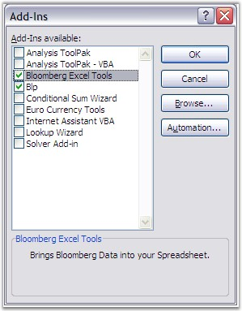

::: {style="DISPLAY: none"}
{#d2h_url_template}{#d2h_package_url style="WIDTH: 0px; DISPLAY: none; HEIGHT: 0px"}
:::

::::: {#nsbanner .d2h_main_nsbanner style="BORDER-BOTTOM: #999999 1px solid; POSITION: relative; PADDING-BOTTOM: 0px; BACKGROUND-COLOR: transparent; PADDING-LEFT: 0px; PADDING-RIGHT: 0px; DISPLAY: none; BORDER-TOP: #999999 1px solid; PADDING-TOP: 0px; LEFT: 0px"}
:::: {#TitleRow .d2h_main_titlerow style="PADDING-BOTTOM: 4px; BACKGROUND-COLOR: transparent; PADDING-LEFT: 22px; WIDTH: 100%; PADDING-RIGHT: 10px; DISPLAY: none; PADDING-TOP: 4px"}
::: {#ienav .d2h_main_ienav style="DISPLAY: none"}
{#D2HPrevious .D2HPreviousEnabled}  {#D2HNext .D2HNextEnabled}
:::
::::
:::::

::::: {#nstext .d2h_main_nstext style="PADDING-BOTTOM: 10px; BACKGROUND-COLOR: transparent; PADDING-LEFT: 22px; PADDING-RIGHT: 10px; HEIGHT: 100%; OVERFLOW: auto; PADDING-TOP: 5px" hasuserbackground="true" valign="bottom"}
::: {#d2h_breadcrumbs .d2h_breadcrumbs}
[Essential Studio User Guide Documentation](ms-xhelp:///?Id=12457748-09e3-4d74-a240-8e049cedf030){.d2h_breadcrumbsNormal}[ \> ]{.d2h_breadcrumbsLinkSeparator}[Reporting Edition](ms-xhelp:///?Id=027aa5b6-6676-4f93-ad23-c20e8c45792e){.d2h_breadcrumbsNormal}[ \> ]{.d2h_breadcrumbsLinkSeparator}[Essential XlsIO](ms-xhelp:///?Id=b01a1b50-1d7d-40c0-bc83-af67e57c9005){.d2h_breadcrumbsNormal}[ \> ]{.d2h_breadcrumbsLinkSeparator}[Concepts and Features](ms-xhelp:///?Id=21b26556-5905-4ad9-90b4-40320db25faf){.d2h_breadcrumbsNormal}
:::

## Add-Ins {#add-ins style="tab-stops: 0pt"}

 

An Excel Add-In is a file (usually with a .xla or .xll extension) that Excel loads when it starts up. The file contains code (VBA in the case of a .xla Add-In) that adds additional functionality to Excel, usually in the form of new functions.

 

Add-Ins provide an excellent way of increasing the power of Excel, and they are the ideal vehicle for distributing your custom functions. Excel is shipped with a variety of Add-Ins ready for you to load and start using, and many third-party Add-Ins are also available. You can select these functions through the Add-Ins dialog box.

 

{border="0"}

Figure 161: Add-Ins**[]{style="FONT-FAMILY: 'Trebuchet MS','sans-serif'; BACKGROUND: red; COLOR: white"}**

{border="0"}

Figure 162: Add-Ins in Excel**[]{style="FONT-FAMILY: 'Trebuchet MS','sans-serif'; BACKGROUND: red; COLOR: white"}**

[]{style="FONT-FAMILY: 'Trebuchet MS','sans-serif'; COLOR: #15428b; FONT-SIZE: 9pt"} 

 

XlsIO provides support for Excel and custom Add-Ins. They can be accessed by first registering, and then using the Add-In\'s custom functions through XlsIO formulas.

 

Following code example illustrates how to register and use Add-Ins.

  

+------------------------------------------------------------------------------------------------------------------------------------------------------------------------------------------------------------------------------------------------------------------------------------------------------------------------------------------------------+
| **[\[C#\]]{style="FONT-FAMILY: 'Courier New'"}**                                                                                                                                                                                                                                                                                                     |
|                                                                                                                                                                                                                                                                                                                                                      |
| []{style="FONT-FAMILY: 'Courier New'"}                                                                                                                                                                                                                                                                                                               |
|                                                                                                                                                                                                                                                                                                                                                      |
| [IAddInFunctions]{style="FONT-FAMILY: 'Courier New'; COLOR: teal"}[ unknownFunctions = workbook.AddInFunctions;]{style="FONT-FAMILY: 'Courier New'; COLOR: black"}                                                                                                                                                                                   |
|                                                                                                                                                                                                                                                                                                                                                      |
| [unknownFunctions.Add(\"]{style="FONT-FAMILY: 'Courier New'; COLOR: black"}[c:\\blp\\api\\dde\\blp.xla]{style="FONT-FAMILY: 'Courier New'; COLOR: #993300"}[\", \"]{style="FONT-FAMILY: 'Courier New'; COLOR: black"}[blp]{style="FONT-FAMILY: 'Courier New'; COLOR: #993300"}[\");]{style="FONT-FAMILY: 'Courier New'; COLOR: black"}               |
|                                                                                                                                                                                                                                                                                                                                                      |
| []{style="FONT-FAMILY: 'Courier New'; COLOR: black"}                                                                                                                                                                                                                                                                                                 |
|                                                                                                                                                                                                                                                                                                                                                      |
| [// Use the Function.]{style="FONT-FAMILY: 'Courier New'; COLOR: green"}                                                                                                                                                                                                                                                                             |
|                                                                                                                                                                                                                                                                                                                                                      |
| [sheet.Range\[ \"]{style="FONT-FAMILY: 'Courier New'; COLOR: black"}[A3\"]{style="FONT-FAMILY: 'Courier New'; COLOR: #993300"}[ \].Formula = \"]{style="FONT-FAMILY: 'Courier New'; COLOR: black"}[blp(A1+\\\" CORP\\\",\\\"PX_LAST\\\")]{style="FONT-FAMILY: 'Courier New'; COLOR: #993300"}[\";]{style="FONT-FAMILY: 'Courier New'; COLOR: black"} |
+------------------------------------------------------------------------------------------------------------------------------------------------------------------------------------------------------------------------------------------------------------------------------------------------------------------------------------------------------+

[]{style="FONT-FAMILY: 'Trebuchet MS','sans-serif'; COLOR: #15428b; FONT-SIZE: 9pt"} 

+-------------------------------------------------------------------------------------------------------------------------------------------------------------------------------------------------------------------------------------------------------------------------------------------------------------------------------------------------+
| **[\[VB.NET\]]{style="FONT-FAMILY: 'Courier New'"}**                                                                                                                                                                                                                                                                                            |
|                                                                                                                                                                                                                                                                                                                                                 |
| []{style="FONT-FAMILY: 'Courier New'; COLOR: black"}                                                                                                                                                                                                                                                                                            |
|                                                                                                                                                                                                                                                                                                                                                 |
| [Dim unknownFunctions As IAddInFunctions = workbook.AddInFunctions]{style="FONT-FAMILY: 'Courier New'; COLOR: black"}                                                                                                                                                                                                                           |
|                                                                                                                                                                                                                                                                                                                                                 |
| [unknownFunctions.Add(\"]{style="FONT-FAMILY: 'Courier New'; COLOR: black"}[c:\\blp\\api\\dde\\blp.xla]{style="FONT-FAMILY: 'Courier New'; COLOR: #993300"}[\", \"]{style="FONT-FAMILY: 'Courier New'; COLOR: black"}[blp]{style="FONT-FAMILY: 'Courier New'; COLOR: #993300"}[\")]{style="FONT-FAMILY: 'Courier New'; COLOR: black"}           |
|                                                                                                                                                                                                                                                                                                                                                 |
| []{style="FONT-FAMILY: 'Courier New'; COLOR: #001554"}                                                                                                                                                                                                                                                                                          |
|                                                                                                                                                                                                                                                                                                                                                 |
| [\' Use the Function.]{style="FONT-FAMILY: 'Courier New'; COLOR: green"}                                                                                                                                                                                                                                                                        |
|                                                                                                                                                                                                                                                                                                                                                 |
| [sheet.Range(\"]{style="FONT-FAMILY: 'Courier New'; COLOR: black"}[A3]{style="FONT-FAMILY: 'Courier New'; COLOR: #993300"}[\").Formula = \"]{style="FONT-FAMILY: 'Courier New'; COLOR: black"}[blp(A1+\"\" CORP\"\",\"\"PX_LAST\"\")]{style="FONT-FAMILY: 'Courier New'; COLOR: #993300"}[\"]{style="FONT-FAMILY: 'Courier New'; COLOR: black"} |
+-------------------------------------------------------------------------------------------------------------------------------------------------------------------------------------------------------------------------------------------------------------------------------------------------------------------------------------------------+

[]{style="FONT-FAMILY: 'Trebuchet MS','sans-serif'; COLOR: #15428b; FONT-SIZE: 9pt"} 

::: {style="BORDER-BOTTOM: windowtext 1pt solid; BORDER-LEFT: medium none; PADDING-BOTTOM: 1pt; MARGIN-TOP: 9pt; PADDING-LEFT: 0pt; PADDING-RIGHT: 0pt; MARGIN-BOTTOM: 9pt; BORDER-TOP: windowtext 1pt solid; BORDER-RIGHT: medium none; PADDING-TOP: 1pt"}
{border="0"}Note: If you move the file to another computer, or distribute it, the workbook will expect to find the same Add-In, in the same place, on their computers. But, if the Add-In is moved or deleted from the computer, the workbook won\'t be able to find it, and your code won\'t work. Make sure that the Add-In is accessed by locating the .xla file through the Tools menu (Tools -\> Addins -\> Browse).
:::

[]{#related-topics}
:::::
