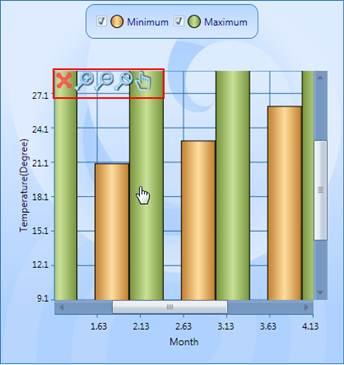
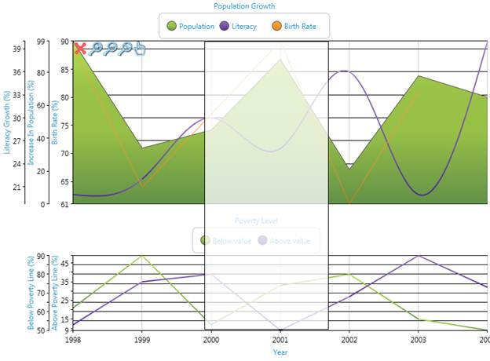

::: {style="DISPLAY: none"}
{#d2h_url_template}{#d2h_package_url style="WIDTH: 0px; DISPLAY: none; HEIGHT: 0px"}
:::

::: {.d2h_secondary_topic style="PADDING-BOTTOM: 10pt; MARGIN: 0pt; PADDING-LEFT: 0pt; PADDING-RIGHT: 0pt; PADDING-TOP: 0pt"}
##### Additional Zooming Functionality for SyncChartAreas {#additional-zooming-functionality-for-syncchartareas style="tab-stops: 0pt"}

Essential Chart now supports the concepts of **Zoomin, Zoomout,** and panning in the **SyncChartArea**

**[]{style="FONT-FAMILY: 'Trebuchet MS','sans-serif'; COLOR: #15428b; FONT-SIZE: 9pt"}** 

Adding Additional Zooming Functionality

Add additional zooming functionality by using the following code.

[]{style="FONT-FAMILY: 'Trebuchet MS','sans-serif'; COLOR: #15428b; FONT-SIZE: 9pt"} 

+------------------------------------------------------------------------------------------------------------------------------------------------------------------------------------------------------------------------------------------------------------------------------------------------------------------------------------------------------------------------------------------------------------------------+
| **[\[XAML\]]{style="FONT-FAMILY: 'Courier New'"}**                                                                                                                                                                                                                                                                                                                                                                     |
|                                                                                                                                                                                                                                                                                                                                                                                                                        |
| [\<]{style="FONT-FAMILY: 'Courier New'; COLOR: blue"}[sfChart]{style="FONT-FAMILY: 'Courier New'; COLOR: #a31515"}[:]{style="FONT-FAMILY: 'Courier New'; COLOR: blue"}[SyncChartAreas]{style="FONT-FAMILY: 'Courier New'; COLOR: #a31515"}[ IsContextMenuEnabled]{style="FONT-FAMILY: 'Courier New'; COLOR: red"}[=\"True\"\>]{style="FONT-FAMILY: 'Courier New'; COLOR: blue"}[ ]{style="FONT-FAMILY: 'Courier New'"} |
+------------------------------------------------------------------------------------------------------------------------------------------------------------------------------------------------------------------------------------------------------------------------------------------------------------------------------------------------------------------------------------------------------------------------+

[]{style="FONT-FAMILY: 'Courier New'"} 

+-----------------------------------------------------------------------------+
| **[\[C#\] ]{style="FONT-FAMILY: 'Courier New'"}**                           |
|                                                                             |
| []{style="FONT-FAMILY: 'Courier New'"}                                      |
|                                                                             |
| [syncArea.IsContextMenuEnabled = true;]{style="FONT-FAMILY: 'Courier New'"} |
+-----------------------------------------------------------------------------+

[]{style="FONT-FAMILY: 'Times New Roman','serif'; FONT-SIZE: 12pt"} 

[]{style="FONT-FAMILY: 'Calibri','sans-serif'"} 

{border="0"}[]{style="FONT-FAMILY: 'Calibri','sans-serif'"}

Figure 78: Zooming Options

Rectangular Selection Zooming in SyncChartAreas

SyncChartArea also has support for sector zooming as in ordinary chart areas.

[·      ]{style="FONT-FAMILY: Symbol"}SyncChart can be zoomed in using sector zooming instead of the **Zoom In** icon from the **Zooming** toolkit.

{border="0"}[]{style="COLOR: #c00000"}

Figure 79: Sector Zooming

Sample Link

Essential Chart WPF \> User Interaction \> Zooming and Scrolling Demo

+----------------------------------------------------------------------------------------------------------------------------------------------------------------------------------------------------------------------------------------------------------------------------------------------------------------------------------------------------------------------------------------------------------------------------------------------------------------------------------------------------+
| **[\[XAML\]]{style="FONT-FAMILY: 'Courier New'"}**                                                                                                                                                                                                                                                                                                                                                                                                                                                 |
|                                                                                                                                                                                                                                                                                                                                                                                                                                                                                                    |
| []{style="FONT-FAMILY: Consolas; COLOR: blue; FONT-SIZE: 9.5pt"}                                                                                                                                                                                                                                                                                                                                                                                                                                   |
|                                                                                                                                                                                                                                                                                                                                                                                                                                                                                                    |
| [\<]{style="FONT-FAMILY: Consolas; COLOR: blue; FONT-SIZE: 9.5pt"}[sfChart]{style="FONT-FAMILY: Consolas; COLOR: #a31515; FONT-SIZE: 9.5pt"}[:]{style="FONT-FAMILY: Consolas; COLOR: blue; FONT-SIZE: 9.5pt"}[SyncChartAreas]{style="FONT-FAMILY: Consolas; COLOR: #a31515; FONT-SIZE: 9.5pt"}[  [ Name]{style="COLOR: red"}[=\"syncChart\"]{style="COLOR: blue"}[ EnableMouseDragZooming]{style="COLOR: red"}[=\"True\"\>]{style="COLOR: blue"}]{style="FONT-FAMILY: Consolas; FONT-SIZE: 9.5pt"} |
|                                                                                                                                                                                                                                                                                                                                                                                                                                                                                                    |
| [\</]{style="FONT-FAMILY: Consolas; COLOR: blue; FONT-SIZE: 9.5pt"}[sfChart]{style="FONT-FAMILY: Consolas; COLOR: #a31515; FONT-SIZE: 9.5pt"}[:]{style="FONT-FAMILY: Consolas; COLOR: blue; FONT-SIZE: 9.5pt"}[SyncChartAreas]{style="FONT-FAMILY: Consolas; COLOR: #a31515; FONT-SIZE: 9.5pt"}[\>]{style="FONT-FAMILY: Consolas; COLOR: blue; FONT-SIZE: 9.5pt"}                                                                                                                                  |
+----------------------------------------------------------------------------------------------------------------------------------------------------------------------------------------------------------------------------------------------------------------------------------------------------------------------------------------------------------------------------------------------------------------------------------------------------------------------------------------------------+

 

+--------------------------------------------------------------------------------------------------------------------+
| **[\[C#\]]{style="FONT-FAMILY: 'Courier New'"}**                                                                   |
|                                                                                                                    |
| []{style="FONT-FAMILY: 'Courier New'"}                                                                             |
|                                                                                                                    |
| [syncChart.EnableMouseDragZooming = [true]{style="COLOR: blue"};]{style="FONT-FAMILY: Consolas; FONT-SIZE: 9.5pt"} |
+--------------------------------------------------------------------------------------------------------------------+

 

[]{#related-topics}
:::
