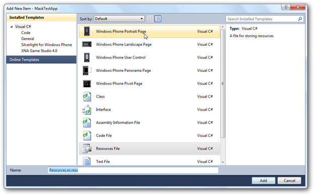

::: {style="DISPLAY: none"}
{#d2h_url_template}{#d2h_package_url style="WIDTH: 0px; DISPLAY: none; HEIGHT: 0px"}
:::

::: {.d2h_secondary_topic style="PADDING-BOTTOM: 10pt; MARGIN: 0pt; PADDING-LEFT: 0pt; PADDING-RIGHT: 0pt; PADDING-TOP: 0pt"}
#### Add Resources: {#add-resources style="TEXT-JUSTIFY: inter-ideograph; TEXT-ALIGN: justify; tab-stops: 0pt"}

To localize Syncfusion Essential Tools for Windows Phone controls, you need to create resource files for each culture. The following things are to be done when localizing strings for any culture.

1.   Add resource (.resx) files in the **Resources** folder for different cultures. (Here, .resx files in different cultures should be placed under the **Resources** folder of the project).

2.   Resource files should be named **Resources.CultureName.resx**

Where,

[·      ]{style="FONT-FAMILY: Symbol"}**Assembly Name**---Assembly name of your sample/application

[·      ]{style="FONT-FAMILY: Symbol"}**CultureName---**Culture code of the resource that you want to show in the UI.

For example,

[·      ]{style="FONT-FAMILY: Symbol"}Resources.es.resx---Spanish resource for Syncfusion.Shared.Phone assembly.

[·      ]{style="FONT-FAMILY: Symbol"}Resources.it.resx---Italian resource for Syncfusion.Shared.Phone assembly.

Steps:

1.   Right-click on the project, go to **Add** \> **New Item**.

2.   Choose the **Resource.resx** file and change the name to **Resources.es.resx** to enable the Spanish culture.

{border="0"}

Fig 164: Add New Resource Window

[]{#related-topics}
:::
