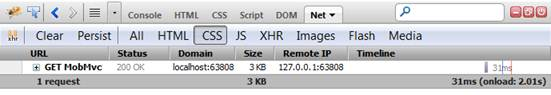
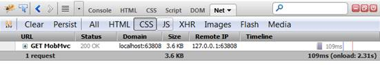

::: {style="DISPLAY: none"}
{#d2h_url_template}{#d2h_package_url style="WIDTH: 0px; DISPLAY: none; HEIGHT: 0px"}
:::

::: {.d2h_secondary_topic style="PADDING-BOTTOM: 10pt; MARGIN: 0pt; PADDING-LEFT: 0pt; PADDING-RIGHT: 0pt; PADDING-TOP: 0pt"}
#### [[       ]{style="COLOR: windowtext; TEXT-DECORATION: none; text-underline: none"}](ms-xhelp:///?Id=998be70b-5b2e-462b-a36e-bd68fd220002)Add StyleManager to an Application {#add-stylemanager-to-an-application style="tab-stops: 0pt"}

 

Add the **StyleManager** extension method in the HEAD tag of the **view** pages (in most cases, It is reasonable to call it within the **Site.Master** page).

 

+------------------------------------------------------------------------------------------------------------------------------------------------------------------------------------------------------------------------------------+
| **[\[ASPX\]]{style="FONT-FAMILY: 'Courier New'"}**                                                                                                                                                                                 |
|                                                                                                                                                                                                                                    |
| [\<]{style="FONT-FAMILY: 'Courier New'; COLOR: blue"}[head]{style="FONT-FAMILY: 'Courier New'; COLOR: maroon"}[ [runat]{style="COLOR: red"}[=\"server\"\>]{style="COLOR: blue"}]{style="FONT-FAMILY: 'Courier New'"}               |
|                                                                                                                                                                                                                                    |
| [\<%]{style="FONT-FAMILY: Consolas; BACKGROUND: yellow; FONT-SIZE: 9.5pt"}[=]{style="FONT-FAMILY: Consolas; COLOR: blue; FONT-SIZE: 9.5pt"}[ Html.MobSyncfusion().StyleManager()]{style="FONT-FAMILY: Consolas; FONT-SIZE: 9.5pt"} |
|                                                                                                                                                                                                                                    |
| [          .Register(stylesheets =\>]{style="FONT-FAMILY: Consolas; FONT-SIZE: 9.5pt"}                                                                                                                                             |
|                                                                                                                                                                                                                                    |
| [                  {]{style="FONT-FAMILY: Consolas; FONT-SIZE: 9.5pt"}                                                                                                                                                             |
|                                                                                                                                                                                                                                    |
| [                      stylesheets.Add([MobComponentType]{style="COLOR: #2b91af"}.Tab);]{style="FONT-FAMILY: Consolas; FONT-SIZE: 9.5pt"}                                                                                          |
|                                                                                                                                                                                                                                    |
| [                  })]{style="FONT-FAMILY: Consolas; FONT-SIZE: 9.5pt"}                                                                                                                                                            |
|                                                                                                                                                                                                                                    |
| [    [%\>]{style="BACKGROUND: yellow"}]{style="FONT-FAMILY: Consolas; FONT-SIZE: 9.5pt"}                                                                                                                                           |
|                                                                                                                                                                                                                                    |
|                                                                                                                                                                                                                                    |
|                                                                                                                                                                                                                                    |
| [...]{style="FONT-FAMILY: 'Courier New'"}                                                                                                                                                                                          |
|                                                                                                                                                                                                                                    |
| [\</]{style="FONT-FAMILY: 'Courier New'; COLOR: blue"}[head]{style="FONT-FAMILY: 'Courier New'; COLOR: maroon"}[\>]{style="FONT-FAMILY: 'Courier New'; COLOR: blue"}                                                               |
|                                                                                                                                                                                                                                    |
| **[\[Razor\]]{style="FONT-FAMILY: 'Courier New'"}**                                                                                                                                                                                |
|                                                                                                                                                                                                                                    |
| [\<]{style="FONT-FAMILY: 'Courier New'; COLOR: blue"}[head]{style="FONT-FAMILY: 'Courier New'; COLOR: maroon"}[ [runat]{style="COLOR: red"}[=\"server\"\>]{style="COLOR: blue"}]{style="FONT-FAMILY: 'Courier New'"}               |
|                                                                                                                                                                                                                                    |
| [@(]{style="FONT-FAMILY: Consolas; BACKGROUND: yellow; FONT-SIZE: 9.5pt"}[Html.MobSyncfusion().StyleManager()]{style="FONT-FAMILY: Consolas; FONT-SIZE: 9.5pt"}                                                                    |
|                                                                                                                                                                                                                                    |
| [    .Register(stylesheets =\>]{style="FONT-FAMILY: Consolas; FONT-SIZE: 9.5pt"}                                                                                                                                                   |
|                                                                                                                                                                                                                                    |
| [            {]{style="FONT-FAMILY: Consolas; FONT-SIZE: 9.5pt"}                                                                                                                                                                   |
|                                                                                                                                                                                                                                    |
| [                stylesheets.Add([MobComponentType]{style="COLOR: #2b91af"}.Tab);]{style="FONT-FAMILY: Consolas; FONT-SIZE: 9.5pt"}                                                                                                |
|                                                                                                                                                                                                                                    |
| [            })[)]{style="BACKGROUND: yellow"}]{style="FONT-FAMILY: Consolas; FONT-SIZE: 9.5pt"}                                                                                                                                   |
|                                                                                                                                                                                                                                    |
| [ ...]{style="FONT-FAMILY: 'Courier New'"}                                                                                                                                                                                         |
|                                                                                                                                                                                                                                    |
| [\</]{style="FONT-FAMILY: 'Courier New'; COLOR: blue"}[head]{style="FONT-FAMILY: 'Courier New'; COLOR: maroon"}[\>]{style="FONT-FAMILY: 'Courier New'; COLOR: blue"}[]{style="FONT-SIZE: 12pt"}                                    |
+------------------------------------------------------------------------------------------------------------------------------------------------------------------------------------------------------------------------------------+

 

Use the **Register()** method to register the Syncfusion component CSS resources.

+-------------------------------------------------------------------------------------------------------------------------------------------------------------------------------+
| [ **\[ASPX\]**]{style="FONT-FAMILY: 'Courier New'"}                                                                                                                           |
|                                                                                                                                                                               |
| [\<%]{style="FONT-FAMILY: 'Courier New'; BACKGROUND: yellow"}[{]{style="FONT-FAMILY: 'Courier New'"}                                                                          |
|                                                                                                                                                                               |
| [          Html.MobSyncfusion().StyleManager()]{style="FONT-FAMILY: 'Courier New'"}                                                                                           |
|                                                                                                                                                                               |
| [              .Register(stylesheets =\>]{style="FONT-FAMILY: 'Courier New'"}                                                                                                 |
|                                                                                                                                                                               |
| [               {]{style="FONT-FAMILY: 'Courier New'"}                                                                                                                        |
|                                                                                                                                                                               |
| [                   stylesheets.Add([MobComponentType]{style="COLOR: #2b91af"}.ListBox);]{style="FONT-FAMILY: 'Courier New'"}                                                 |
|                                                                                                                                                                               |
| [                   stylesheets.Add([MobComponentType]{style="COLOR: #2b91af"}.Menu);]{style="FONT-FAMILY: 'Courier New'"}                                                    |
|                                                                                                                                                                               |
| [                     stylesheets.Add([MobComponentType]{style="COLOR: #2b91af"}.ToolBar);]{style="FONT-FAMILY: Consolas; FONT-SIZE: 9.5pt"}                                  |
|                                                                                                                                                                               |
| [               }).Render();]{style="FONT-FAMILY: 'Courier New'"}                                                                                                             |
|                                                                                                                                                                               |
| [ } [%\>]{style="BACKGROUND: yellow"}]{style="FONT-FAMILY: 'Courier New'"}                                                                                                    |
|                                                                                                                                                                               |
|                                                                                                                                                                               |
|                                                                                                                                                                               |
| [ **\[Razor\]**]{style="FONT-FAMILY: 'Courier New'"}                                                                                                                          |
|                                                                                                                                                                               |
| [    [\@{]{style="BACKGROUND: yellow"}]{style="FONT-FAMILY: 'Courier New'"}                                                                                                   |
|                                                                                                                                                                               |
| [        Html.MobSyncfusion().StyleManager()]{style="FONT-FAMILY: 'Courier New'"}                                                                                             |
|                                                                                                                                                                               |
| [        .Register(stylesheets =\>]{style="FONT-FAMILY: 'Courier New'"}                                                                                                       |
|                                                                                                                                                                               |
| [            {]{style="FONT-FAMILY: 'Courier New'"}                                                                                                                           |
|                                                                                                                                                                               |
| [                stylesheets.Add([MobComponentType]{style="COLOR: #2b91af"}.ListBox);]{style="FONT-FAMILY: 'Courier New'"}                                                    |
|                                                                                                                                                                               |
| [                stylesheets.Add([MobComponentType]{style="COLOR: #2b91af"}.Menu);]{style="FONT-FAMILY: 'Courier New'"}                                                       |
|                                                                                                                                                                               |
| [                ]{style="FONT-FAMILY: 'Courier New'"}[stylesheets.Add([MobComponentType]{style="COLOR: #2b91af"}.ToolBar);]{style="FONT-FAMILY: Consolas; FONT-SIZE: 9.5pt"} |
|                                                                                                                                                                               |
| [            }).Render();]{style="FONT-FAMILY: 'Courier New'"}                                                                                                                |
|                                                                                                                                                                               |
| [    [}]{style="BACKGROUND: yellow"}]{style="FONT-FAMILY: 'Courier New'"}                                                                                                     |
|                                                                                                                                                                               |
| []{style="FONT-SIZE: 12pt"}                                                                                                                                                   |
+-------------------------------------------------------------------------------------------------------------------------------------------------------------------------------+

 

The above code registers the default DarkNight theme for added components. All the CSS resources are combined and minified before being sent to the browser.

Customization

Various customization options have been provided. They are:

[•   ]{style="FONT-FAMILY: 'Verdana','sans-serif'; FONT-SIZE: 10pt"}[Minify]{style="FONT-FAMILY: 'Arial','sans-serif'; FONT-SIZE: 10pt"}

[•   ]{style="FONT-FAMILY: 'Verdana','sans-serif'; FONT-SIZE: 10pt"}[Combine]{style="FONT-FAMILY: 'Arial','sans-serif'; FONT-SIZE: 10pt"}

[•   ]{style="FONT-FAMILY: 'Verdana','sans-serif'; FONT-SIZE: 10pt"}[Register]{style="FONT-FAMILY: 'Arial','sans-serif'; FONT-SIZE: 10pt"}

[•   ]{style="FONT-FAMILY: 'Verdana','sans-serif'; FONT-SIZE: 10pt"}[Theme]{style="FONT-FAMILY: 'Arial','sans-serif'; FONT-SIZE: 10pt"}

[•   ]{style="FONT-FAMILY: 'Verdana','sans-serif'; FONT-SIZE: 10pt"}[Add CSS Files]{style="FONT-FAMILY: 'Arial','sans-serif'; FONT-SIZE: 10pt"}

**[Minify]{style="FONT-FAMILY: 'Arial','sans-serif'; FONT-SIZE: 10pt"}**

 To enable or disable the Minify feature, use the **Minify()** method. Minify is enabled by default. 

+-------------------------------------------------------------------------------------------------------------------------------+
| **[\[ASPX\]]{style="FONT-FAMILY: 'Courier New'"}**                                                                            |
|                                                                                                                               |
| [    [\<%]{style="BACKGROUND: yellow"}{]{style="FONT-FAMILY: 'Courier New'"}                                                  |
|                                                                                                                               |
| [          Html.MobSyncfusion().StyleManager()]{style="FONT-FAMILY: 'Courier New'"}                                           |
|                                                                                                                               |
| [              ]{style="FONT-FAMILY: 'Courier New'"}                                                                          |
|                                                                                                                               |
| [              .Minify([false]{style="COLOR: blue"}) ]{style="FONT-FAMILY: 'Courier New'"}                                    |
|                                                                                                                               |
| [              ]{style="FONT-FAMILY: 'Courier New'"}                                                                          |
|                                                                                                                               |
| [              .Register(stylesheets =\>]{style="FONT-FAMILY: 'Courier New'"}                                                 |
|                                                                                                                               |
| [               {]{style="FONT-FAMILY: 'Courier New'"}                                                                        |
|                                                                                                                               |
| [                   stylesheets.Add([MobComponentType]{style="COLOR: #2b91af"}.Menu);]{style="FONT-FAMILY: 'Courier New'"}    |
|                                                                                                                               |
| [                   stylesheets.Add([MobComponentType]{style="COLOR: #2b91af"}.ListBox);]{style="FONT-FAMILY: 'Courier New'"} |
|                                                                                                                               |
| [                   stylesheets.Add([MobComponentType]{style="COLOR: #2b91af"}.ToolBar);]{style="FONT-FAMILY: 'Courier New'"} |
|                                                                                                                               |
| [                }).Render();]{style="FONT-FAMILY: 'Courier New'"}                                                            |
|                                                                                                                               |
| [      } [%\>]{style="BACKGROUND: yellow"}]{style="FONT-FAMILY: 'Courier New'"}                                               |
|                                                                                                                               |
|                                                                                                                               |
|                                                                                                                               |
| [ **\[Razor\]**]{style="FONT-FAMILY: 'Courier New'"}                                                                          |
|                                                                                                                               |
| [    [\@{]{style="BACKGROUND: yellow"}]{style="FONT-FAMILY: 'Courier New'"}                                                   |
|                                                                                                                               |
| [        Html.MobSyncfusion().StyleManager()]{style="FONT-FAMILY: 'Courier New'"}                                             |
|                                                                                                                               |
|                                                                                                                               |
|                                                                                                                               |
| [        .Minify([false]{style="COLOR: blue"})]{style="FONT-FAMILY: 'Courier New'"}                                           |
|                                                                                                                               |
|                                                                                                                               |
|                                                                                                                               |
| [        .Register(stylesheets =\>      ]{style="FONT-FAMILY: 'Courier New'"}                                                 |
|                                                                                                                               |
| [            {]{style="FONT-FAMILY: 'Courier New'"}                                                                           |
|                                                                                                                               |
| [                stylesheets.Add([MobComponentType]{style="COLOR: #2b91af"}.Menu);]{style="FONT-FAMILY: 'Courier New'"}       |
|                                                                                                                               |
| [                stylesheets.Add([MobComponentType]{style="COLOR: #2b91af"}.ListBox);]{style="FONT-FAMILY: 'Courier New'"}    |
|                                                                                                                               |
| [                stylesheets.Add([MobComponentType]{style="COLOR: #2b91af"}.ToolBar);]{style="FONT-FAMILY: 'Courier New'"}    |
|                                                                                                                               |
| [            }).Render();]{style="FONT-FAMILY: 'Courier New'"}                                                                |
|                                                                                                                               |
| [    [}]{style="BACKGROUND: yellow"}]{style="FONT-FAMILY: 'Courier New'"}[]{style="FONT-SIZE: 12pt"}                          |
+-------------------------------------------------------------------------------------------------------------------------------+

 

Please refer HTTP requests and the time details from the below images.

**Before**

{border="0"}

[]{#_Ref316896978}[Figure]{#_Ref316896987} 4: Minify Disabled

 

**After**

{border="0"} 

[Figure]{#_Ref316897012} 5: Minify Enabled

The above images show the size of the resource files before and after the minfication process. Before the minification process a 3.6KB file is downloaded in the browser ([Figure 4](#_Ref316896987)), whereas after minification, a 3KB file is downloaded in the browser ([Figure 5](#_Ref316897012)). 0.6KB size reduced in the above minification process sample.

 

**[Combine ]{style="FONT-FAMILY: 'Arial','sans-serif'; FONT-SIZE: 10pt"}**

To enable or disable the combine file feature, use the **Combine()** method. This method is enabled by default.

+-------------------------------------------------------------------------------------------------------------------------------+
| **[\[ASPX\]]{style="FONT-FAMILY: 'Courier New'"}**                                                                            |
|                                                                                                                               |
| [    [\<%]{style="BACKGROUND: yellow"}{]{style="FONT-FAMILY: 'Courier New'"}                                                  |
|                                                                                                                               |
| [          Html.MobSyncfusion().StyleManager()]{style="FONT-FAMILY: 'Courier New'"}                                           |
|                                                                                                                               |
|                                                                                                                               |
|                                                                                                                               |
| [              .Combine([false]{style="COLOR: blue"})]{style="FONT-FAMILY: 'Courier New'"}                                    |
|                                                                                                                               |
|                                                                                                                               |
|                                                                                                                               |
| [              .Register(stylesheets =\>]{style="FONT-FAMILY: 'Courier New'"}                                                 |
|                                                                                                                               |
| [               {]{style="FONT-FAMILY: 'Courier New'"}                                                                        |
|                                                                                                                               |
| [                   stylesheets.Add([MobComponentType]{style="COLOR: #2b91af"}.Menu);]{style="FONT-FAMILY: 'Courier New'"}    |
|                                                                                                                               |
| [                   stylesheets.Add([MobComponentType]{style="COLOR: #2b91af"}.ListBox);]{style="FONT-FAMILY: 'Courier New'"} |
|                                                                                                                               |
| [                   stylesheets.Add([MobComponentType]{style="COLOR: #2b91af"}.ToolBar);]{style="FONT-FAMILY: 'Courier New'"} |
|                                                                                                                               |
| [               }).Render();]{style="FONT-FAMILY: 'Courier New'"}                                                             |
|                                                                                                                               |
| [      } [%\>]{style="BACKGROUND: yellow"}]{style="FONT-FAMILY: 'Courier New'"}                                               |
|                                                                                                                               |
| [ **\[Razor\]**]{style="FONT-FAMILY: 'Courier New'"}                                                                          |
|                                                                                                                               |
| [    [\@{]{style="BACKGROUND: yellow"}]{style="FONT-FAMILY: 'Courier New'"}                                                   |
|                                                                                                                               |
| [        Html.MobSyncfusion().StyleManager()]{style="FONT-FAMILY: 'Courier New'"}                                             |
|                                                                                                                               |
|                                                                                                                               |
|                                                                                                                               |
| [        .Combine([false]{style="COLOR: blue"})]{style="FONT-FAMILY: 'Courier New'"}                                          |
|                                                                                                                               |
|                                                                                                                               |
|                                                                                                                               |
| [        .Register(stylesheets =\>]{style="FONT-FAMILY: 'Courier New'"}                                                       |
|                                                                                                                               |
| [            {]{style="FONT-FAMILY: 'Courier New'"}                                                                           |
|                                                                                                                               |
| [                stylesheets.Add([MobComponentType]{style="COLOR: #2b91af"}.Menu);]{style="FONT-FAMILY: 'Courier New'"}       |
|                                                                                                                               |
| [                stylesheets.Add([MobComponentType]{style="COLOR: #2b91af"}.ListBox);]{style="FONT-FAMILY: 'Courier New'"}    |
|                                                                                                                               |
| [                stylesheets.Add([MobComponentType]{style="COLOR: #2b91af"}.ToolBar);]{style="FONT-FAMILY: 'Courier New'"}    |
|                                                                                                                               |
| [            }).Render();]{style="FONT-FAMILY: 'Courier New'"}                                                                |
|                                                                                                                               |
| [    [}]{style="BACKGROUND: yellow"}]{style="FONT-FAMILY: 'Courier New'"}[]{style="FONT-SIZE: 12pt"}                          |
+-------------------------------------------------------------------------------------------------------------------------------+

 

Please refer HTTP requests and the time details from the below images:

 

**Before**

 

{border="0"}

[Figure]{#_Ref316897173} 6: Combine Disabled

 

**After**

 

{border="0"}

[Figure]{#_Ref316897182} 7: Combine Enabled

The above images show the downloading time before and after the combine process of the resource files. Before the combine process, the browser takes 109ms to download the CSS resources ([Figure 6](#_Ref316897173)), whereas after the combine process it takes only 32ms to download the resources ([Figure 7](#_Ref316897182)). 77ms time is reduced in the above combine process sample.

 

Register

Two overloads are available for the **Register()** method. Adding StyleManager to an application uses the one where the component name can be specified as strings separated by a comma.

To add controls in a single line, use the **Register()** method.

 

+--------------------------------------------------------------------------------------------------------------------------------------------------------------------------------------------+
| **[\[ASPX\]]{style="FONT-FAMILY: 'Courier New'"}**                                                                                                                                         |
|                                                                                                                                                                                            |
| [      [\<%]{style="BACKGROUND: yellow"}{]{style="FONT-FAMILY: 'Courier New'"}                                                                                                             |
|                                                                                                                                                                                            |
| [          Html.MobSyncfusion().StyleManager()]{style="FONT-FAMILY: 'Courier New'"}                                                                                                        |
|                                                                                                                                                                                            |
| [             .Register([\"Menu,Tab,Toolbar\"]{style="COLOR: #a31515"}) [//Specify the component names   separated by a comma.]{style="COLOR: green"}]{style="FONT-FAMILY: 'Courier New'"} |
|                                                                                                                                                                                            |
| [              .Render();]{style="FONT-FAMILY: 'Courier New'"}                                                                                                                             |
|                                                                                                                                                                                            |
| [      } [%\>]{style="BACKGROUND: yellow"}]{style="FONT-FAMILY: 'Courier New'"}                                                                                                            |
|                                                                                                                                                                                            |
|                                                                                                                                                                                            |
|                                                                                                                                                                                            |
| **[\[Razor\]]{style="FONT-FAMILY: 'Courier New'"}**                                                                                                                                        |
|                                                                                                                                                                                            |
| [    [\@{]{style="BACKGROUND: yellow"}]{style="FONT-FAMILY: 'Courier New'"}                                                                                                                |
|                                                                                                                                                                                            |
| [        Html.MobSyncfusion().StyleManager()]{style="FONT-FAMILY: 'Courier New'"}                                                                                                          |
|                                                                                                                                                                                            |
| [            .Register([\"Menu,Tab,Toolbar\"]{style="COLOR: #a31515"}) [//Specify the component names   separated by a comma.]{style="COLOR: green"}]{style="FONT-FAMILY: 'Courier New'"}  |
|                                                                                                                                                                                            |
| [            .Render();]{style="FONT-FAMILY: 'Courier New'"}                                                                                                                               |
|                                                                                                                                                                                            |
| [    [}]{style="BACKGROUND: yellow"} ]{style="FONT-FAMILY: 'Courier New'"}[]{style="FONT-SIZE: 12pt"}                                                                                      |
+--------------------------------------------------------------------------------------------------------------------------------------------------------------------------------------------+

 

Theme

To register the CSS StyleSheets for all controls, use the **Theme()** method.\
The DarkNight theme is the default theme for Essential Tools in Mobile MVC.

 

+-------------------------------------------------------------------------------------------------------------------------------+
| **[\[ASPX\]]{style="FONT-FAMILY: 'Courier New'"}**                                                                            |
|                                                                                                                               |
| [    [\<%]{style="BACKGROUND: yellow"}{]{style="FONT-FAMILY: 'Courier New'"}                                                  |
|                                                                                                                               |
| [          Html.MobSyncfusion().StyleManager()]{style="FONT-FAMILY: 'Courier New'"}                                           |
|                                                                                                                               |
| [              ]{style="FONT-FAMILY: 'Courier New'"}                                                                          |
|                                                                                                                               |
| [              .Theme([MobSkins]{style="COLOR: #2b91af"}.MetroBlue)]{style="FONT-FAMILY: 'Courier New'"}                      |
|                                                                                                                               |
| [              ]{style="FONT-FAMILY: 'Courier New'"}                                                                          |
|                                                                                                                               |
| [              .Register(stylesheets =\>]{style="FONT-FAMILY: 'Courier New'"}                                                 |
|                                                                                                                               |
| [               {]{style="FONT-FAMILY: 'Courier New'"}                                                                        |
|                                                                                                                               |
| [                   stylesheets.Add([MobComponentType]{style="COLOR: #2b91af"}.Menu);]{style="FONT-FAMILY: 'Courier New'"}    |
|                                                                                                                               |
| [                   stylesheets.Add([MobComponentType]{style="COLOR: #2b91af"}.Tab);]{style="FONT-FAMILY: 'Courier New'"}     |
|                                                                                                                               |
| [                   stylesheets.Add([MobComponentType]{style="COLOR: #2b91af"}.ToolBar);]{style="FONT-FAMILY: 'Courier New'"} |
|                                                                                                                               |
| [               }).Render();]{style="FONT-FAMILY: 'Courier New'"}                                                             |
|                                                                                                                               |
| [      } [%\>]{style="BACKGROUND: yellow"}]{style="FONT-FAMILY: 'Courier New'"}                                               |
|                                                                                                                               |
|                                                                                                                               |
|                                                                                                                               |
| [ **\[Razor\]**]{style="FONT-FAMILY: 'Courier New'"}                                                                          |
|                                                                                                                               |
| [    [\@{]{style="BACKGROUND: yellow"}]{style="FONT-FAMILY: 'Courier New'"}                                                   |
|                                                                                                                               |
| [        Html.MobSyncfusion().StyleManager()]{style="FONT-FAMILY: 'Courier New'"}                                             |
|                                                                                                                               |
|                                                                                                                               |
|                                                                                                                               |
| [        .Theme([MobSkins]{style="COLOR: #2b91af"}.MetroBlue)]{style="FONT-FAMILY: 'Courier New'"}                            |
|                                                                                                                               |
|                                                                                                                               |
|                                                                                                                               |
| [        .Register(stylesheets =\>]{style="FONT-FAMILY: 'Courier New'"}                                                       |
|                                                                                                                               |
| [            {]{style="FONT-FAMILY: 'Courier New'"}                                                                           |
|                                                                                                                               |
| [                stylesheets.Add([MobComponentType]{style="COLOR: #2b91af"}.Menu);]{style="FONT-FAMILY: 'Courier New'"}       |
|                                                                                                                               |
| [                stylesheets.Add([MobComponentType]{style="COLOR: #2b91af"}.Tab);]{style="FONT-FAMILY: 'Courier New'"}        |
|                                                                                                                               |
| [                stylesheets.Add([MobComponentType]{style="COLOR: #2b91af"}.ToolBar);]{style="FONT-FAMILY: 'Courier New'"}    |
|                                                                                                                               |
| [            }).Render();]{style="FONT-FAMILY: 'Courier New'"}                                                                |
|                                                                                                                               |
| [    [}]{style="BACKGROUND: yellow"}]{style="FONT-FAMILY: 'Courier New'"}[]{style="FONT-SIZE: 12pt"}                          |
+-------------------------------------------------------------------------------------------------------------------------------+

 

To configure an individual theme for every control, use the **Theme()** method inside **Register()**.

+--------------------------------------------------------------------------------------------------------------------------------------------------------------------------------+
| [ **\[ASPX\]**]{style="FONT-FAMILY: 'Courier New'"}                                                                                                                            |
|                                                                                                                                                                                |
| [    [\<%]{style="BACKGROUND: yellow"}{]{style="FONT-FAMILY: 'Courier New'"}                                                                                                   |
|                                                                                                                                                                                |
| [          Html.MobSyncfusion().StyleManager()]{style="FONT-FAMILY: 'Courier New'"}                                                                                            |
|                                                                                                                                                                                |
| [              .Register(stylesheets =\>]{style="FONT-FAMILY: 'Courier New'"}                                                                                                  |
|                                                                                                                                                                                |
| [               {]{style="FONT-FAMILY: 'Courier New'"}                                                                                                                         |
|                                                                                                                                                                                |
| [                   stylesheets.Add([MobComponentType]{style="COLOR: #2b91af"}.Menu).Theme([MobSkins]{style="COLOR: #2b91af"}.MetroBlue);]{style="FONT-FAMILY: 'Courier New'"} |
|                                                                                                                                                                                |
| [                   stylesheets.Add([MobComponentType]{style="COLOR: #2b91af"}.Tab);]{style="FONT-FAMILY: 'Courier New'"}                                                      |
|                                                                                                                                                                                |
| [                   stylesheets.Add([MobComponentType]{style="COLOR: #2b91af"}.ToolBar);]{style="FONT-FAMILY: 'Courier New'"}                                                  |
|                                                                                                                                                                                |
| [               }).Render();]{style="FONT-FAMILY: 'Courier New'"}                                                                                                              |
|                                                                                                                                                                                |
| [      } [%\>]{style="BACKGROUND: yellow"}]{style="FONT-FAMILY: 'Courier New'"}                                                                                                |
|                                                                                                                                                                                |
|                                                                                                                                                                                |
|                                                                                                                                                                                |
| [  **\[Razor\]**]{style="FONT-FAMILY: 'Courier New'"}                                                                                                                          |
|                                                                                                                                                                                |
| [    [\@{]{style="BACKGROUND: yellow"}]{style="FONT-FAMILY: 'Courier New'"}                                                                                                    |
|                                                                                                                                                                                |
| [        Html.MobSyncfusion().StyleManager()]{style="FONT-FAMILY: 'Courier New'"}                                                                                              |
|                                                                                                                                                                                |
| [        .Register(stylesheets =\>]{style="FONT-FAMILY: 'Courier New'"}                                                                                                        |
|                                                                                                                                                                                |
| [            {]{style="FONT-FAMILY: 'Courier New'"}                                                                                                                            |
|                                                                                                                                                                                |
| [                stylesheets.Add([MobComponentType]{style="COLOR: #2b91af"}.Menu).Theme([MobSkins]{style="COLOR: #2b91af"}.MetroBlue);]{style="FONT-FAMILY: 'Courier New'"}    |
|                                                                                                                                                                                |
| [                stylesheets.Add([MobComponentType]{style="COLOR: #2b91af"}.Tab);]{style="FONT-FAMILY: 'Courier New'"}                                                         |
|                                                                                                                                                                                |
| [                stylesheets.Add([MobComponentType]{style="COLOR: #2b91af"}.ToolBar);]{style="FONT-FAMILY: 'Courier New'"}                                                     |
|                                                                                                                                                                                |
| [            }).Render();]{style="FONT-FAMILY: 'Courier New'"}                                                                                                                 |
|                                                                                                                                                                                |
| [    [}]{style="BACKGROUND: yellow"}]{style="FONT-FAMILY: 'Courier New'"}[]{style="FONT-SIZE: 12pt"}                                                                           |
+--------------------------------------------------------------------------------------------------------------------------------------------------------------------------------+

In the code above, the MetroBlue theme registers for the Menu control and the DarkNight theme is registered for all the other components.

To avoid theme override by the external **Theme()** method, use the **DontOverride()** method.

+-----------------------------------------------------------------------------------------------------------------------------------------------------------------+
| **[\[ASPX\]]{style="FONT-FAMILY: 'Courier New'"}**                                                                                                              |
|                                                                                                                                                                 |
| [  [\<%]{style="BACKGROUND: yellow"}[=]{style="COLOR: blue"}Html.Syncfusion().StyleManager()\                                                                   |
|       .Theme([MobSkins]{style="COLOR: #2b91af"}.DarkNight)[//Specify Theme to all components]{style="COLOR: green"}.      ]{style="FONT-FAMILY: 'Courier New'"} |
|                                                                                                                                                                 |
| [.Register(styleSheet =\> \                                                                                                                                     |
|           {\                                                                                                                                                    |
|       styleSheet.Add([MobComponentType]{style="COLOR: #2b91af"}.ListBox).Theme([MobSkins]{style="COLOR: #2b91af"}.DarkNight) **).DontOverride()**;\             |
|         styleSheet.Add([MobComponentType]{style="COLOR: #2b91af"}.Menu);\                                                                                       |
|         styleSheet.Add([MobComponentType]{style="COLOR: #2b91af"}.Toolbar);\                                                                                    |
|            })  [%\>]{style="BACKGROUND: yellow"}]{style="FONT-FAMILY: 'Courier New'"}                                                                           |
|                                                                                                                                                                 |
| []{style="FONT-SIZE: 12pt"}                                                                                                                                     |
+-----------------------------------------------------------------------------------------------------------------------------------------------------------------+

In general, the external **Theme()** method overrides all the internal component themes registered. The **DontOverride()** method preserves the theme registered in the **Register()** methods.

{border="0"}[Note: The **Theme()** method will register the CSS for the specified theme in the HTML HEAD section. Using this method, we cannot apply themes for the controls (cannot add CSS classes). If we don't use StyleManager then the CSS for default themes or specified themes will be registered just before controls rendering starts. The StyleManager is introduced to improve the performance using its minify and combine features.]{style="FONT-FAMILY: 'Arial','sans-serif'; FONT-SIZE: 10pt"}

Add CSS Files

To include the application CSS files in StyleManager, use the **Add()** method.

 

+-------------------------------------------------------------------------------------------------------------------------------+
| **[\[ASPX\]]{style="FONT-FAMILY: 'Courier New'"}**                                                                            |
|                                                                                                                               |
| [    [\<%]{style="BACKGROUND: yellow"}{]{style="FONT-FAMILY: 'Courier New'"}                                                  |
|                                                                                                                               |
| [          Html.MobSyncfusion().StyleManager()]{style="FONT-FAMILY: 'Courier New'"}                                           |
|                                                                                                                               |
| [              .Register(stylesheets =\>]{style="FONT-FAMILY: 'Courier New'"}                                                 |
|                                                                                                                               |
| [               {]{style="FONT-FAMILY: 'Courier New'"}                                                                        |
|                                                                                                                               |
| [                   stylesheets.Add([MobComponentType]{style="COLOR: #2b91af"}.Menu);]{style="FONT-FAMILY: 'Courier New'"}    |
|                                                                                                                               |
| [                   stylesheets.Add([MobComponentType]{style="COLOR: #2b91af"}.Tab);]{style="FONT-FAMILY: 'Courier New'"}     |
|                                                                                                                               |
| [                   stylesheets.Add([MobComponentType]{style="COLOR: #2b91af"}.ToolBar);]{style="FONT-FAMILY: 'Courier New'"} |
|                                                                                                                               |
| [                   stylesheets.Add([\"\~/Content/site.css\"]{style="COLOR: #a31515"});]{style="FONT-FAMILY: 'Courier New'"}  |
|                                                                                                                               |
| [               }).Render();]{style="FONT-FAMILY: 'Courier New'"}                                                             |
|                                                                                                                               |
| [      } [%\>]{style="BACKGROUND: yellow"}]{style="FONT-FAMILY: 'Courier New'"}                                               |
|                                                                                                                               |
|                                                                                                                               |
|                                                                                                                               |
| **[\[Razor\]]{style="FONT-FAMILY: 'Courier New'"}**                                                                           |
|                                                                                                                               |
| [    [\@{]{style="BACKGROUND: yellow"}]{style="FONT-FAMILY: 'Courier New'"}                                                   |
|                                                                                                                               |
| [        Html.MobSyncfusion().StyleManager()]{style="FONT-FAMILY: 'Courier New'"}                                             |
|                                                                                                                               |
| [        .Register(stylesheets =\>]{style="FONT-FAMILY: 'Courier New'"}                                                       |
|                                                                                                                               |
| [            {]{style="FONT-FAMILY: 'Courier New'"}                                                                           |
|                                                                                                                               |
| [                stylesheets.Add([MobComponentType]{style="COLOR: #2b91af"}.Menu);]{style="FONT-FAMILY: 'Courier New'"}       |
|                                                                                                                               |
| [                stylesheets.Add([MobComponentType]{style="COLOR: #2b91af"}.Tab);]{style="FONT-FAMILY: 'Courier New'"}        |
|                                                                                                                               |
| [                stylesheets.Add([MobComponentType]{style="COLOR: #2b91af"}.ToolBar);]{style="FONT-FAMILY: 'Courier New'"}    |
|                                                                                                                               |
| [                stylesheets.Add([\"\~/Content/site.css\"]{style="COLOR: #a31515"});]{style="FONT-FAMILY: 'Courier New'"}     |
|                                                                                                                               |
| [            }).Render();]{style="FONT-FAMILY: 'Courier New'"}                                                                |
|                                                                                                                               |
| [    [}]{style="BACKGROUND: yellow"}]{style="FONT-FAMILY: 'Courier New'"}                                                     |
|                                                                                                                               |
| []{style="FONT-SIZE: 12pt"}                                                                                                   |
+-------------------------------------------------------------------------------------------------------------------------------+

[]{#related-topics}
:::
