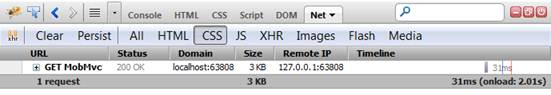
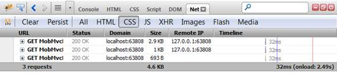
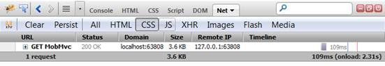

::: {style="DISPLAY: none"}
{#d2h_url_template} {#d2h_package_url style="WIDTH: 0px; DISPLAY: none; HEIGHT: 0px"}
:::

:::: {.d2h_secondary_topic style="PADDING-BOTTOM: 10pt; MARGIN: 0pt; PADDING-LEFT: 0pt; PADDING-RIGHT: 0pt; PADDING-TOP: 0pt"}
#### Add StyleManager to an Application {#add-stylemanager-to-an-application style="tab-stops: 0pt"}

 

Add the **StyleManager extension** method in the HEAD tag of the View pages (in most cases, It is reasonable to call it within the Site.Master page).[]{style="FONT-FAMILY: 'Times New Roman','serif'"}

[]{style="FONT-FAMILY: 'Times New Roman','serif'; FONT-SIZE: 12pt"} 

+--------------------------------------------------------------------------------------------------------------------------------------------------------------------------------------------------------------------------------------+
| **[\[ASPX\]]{style="FONT-FAMILY: 'Courier New'"}** []{style="FONT-FAMILY: 'Courier New'"}                                                                                                                                            |
|                                                                                                                                                                                                                                      |
| [\<]{style="FONT-FAMILY: 'Courier New'; COLOR: blue"} [head]{style="FONT-FAMILY: 'Courier New'; COLOR: maroon"} [ [runat]{style="COLOR: red"}[=\"server\"\>]{style="COLOR: blue"}]{style="FONT-FAMILY: 'Courier New'"}               |
|                                                                                                                                                                                                                                      |
| [\<%]{style="FONT-FAMILY: Consolas; BACKGROUND: yellow; FONT-SIZE: 9.5pt"} [=]{style="FONT-FAMILY: Consolas; COLOR: blue; FONT-SIZE: 9.5pt"} [ Html.MobSyncfusion().StyleManager()]{style="FONT-FAMILY: Consolas; FONT-SIZE: 9.5pt"} |
|                                                                                                                                                                                                                                      |
| [          .Register(stylesheets =\>]{style="FONT-FAMILY: Consolas; FONT-SIZE: 9.5pt"}                                                                                                                                               |
|                                                                                                                                                                                                                                      |
| [                  {]{style="FONT-FAMILY: Consolas; FONT-SIZE: 9.5pt"}                                                                                                                                                               |
|                                                                                                                                                                                                                                      |
| [                      stylesheets.Add([MobComponentType]{style="COLOR: #2b91af"}.Tab);]{style="FONT-FAMILY: Consolas; FONT-SIZE: 9.5pt"}                                                                                            |
|                                                                                                                                                                                                                                      |
| [                  })]{style="FONT-FAMILY: Consolas; FONT-SIZE: 9.5pt"}                                                                                                                                                              |
|                                                                                                                                                                                                                                      |
| [    [%\>]{style="BACKGROUND: yellow"}]{style="FONT-FAMILY: Consolas; FONT-SIZE: 9.5pt"}                                                                                                                                             |
|                                                                                                                                                                                                                                      |
| []{style="FONT-FAMILY: 'Courier New'; BACKGROUND: yellow"}                                                                                                                                                                           |
|                                                                                                                                                                                                                                      |
| [...]{style="FONT-FAMILY: 'Courier New'"}                                                                                                                                                                                            |
|                                                                                                                                                                                                                                      |
| [\</]{style="FONT-FAMILY: 'Courier New'; COLOR: blue"} [head]{style="FONT-FAMILY: 'Courier New'; COLOR: maroon"} [\>]{style="FONT-FAMILY: 'Courier New'; COLOR: blue"} []{style="FONT-FAMILY: 'Courier New'"}                        |
|                                                                                                                                                                                                                                      |
| [ **\[Razor\]**]{style="FONT-FAMILY: 'Courier New'"}                                                                                                                                                                                 |
|                                                                                                                                                                                                                                      |
| [\<]{style="FONT-FAMILY: 'Courier New'; COLOR: blue"} [head]{style="FONT-FAMILY: 'Courier New'; COLOR: maroon"} [ [runat]{style="COLOR: red"}[=\"server\"\>]{style="COLOR: blue"}]{style="FONT-FAMILY: 'Courier New'"}               |
|                                                                                                                                                                                                                                      |
| [@(]{style="FONT-FAMILY: Consolas; BACKGROUND: yellow; FONT-SIZE: 9.5pt"} [Html.MobSyncfusion().StyleManager()]{style="FONT-FAMILY: Consolas; FONT-SIZE: 9.5pt"}                                                                     |
|                                                                                                                                                                                                                                      |
| [    .Register(stylesheets =\>]{style="FONT-FAMILY: Consolas; FONT-SIZE: 9.5pt"}                                                                                                                                                     |
|                                                                                                                                                                                                                                      |
| [            {]{style="FONT-FAMILY: Consolas; FONT-SIZE: 9.5pt"}                                                                                                                                                                     |
|                                                                                                                                                                                                                                      |
| [                stylesheets.Add([MobComponentType]{style="COLOR: #2b91af"}.Tab);]{style="FONT-FAMILY: Consolas; FONT-SIZE: 9.5pt"}                                                                                                  |
|                                                                                                                                                                                                                                      |
| [            })[)]{style="BACKGROUND: yellow"}]{style="FONT-FAMILY: Consolas; FONT-SIZE: 9.5pt"}                                                                                                                                     |
|                                                                                                                                                                                                                                      |
| [ ...]{style="FONT-FAMILY: 'Courier New'"}                                                                                                                                                                                           |
|                                                                                                                                                                                                                                      |
| [\</]{style="FONT-FAMILY: 'Courier New'; COLOR: blue"} [head]{style="FONT-FAMILY: 'Courier New'; COLOR: maroon"} [\>]{style="FONT-FAMILY: 'Courier New'; COLOR: blue"} []{style="FONT-FAMILY: 'Courier New'"}                        |
+--------------------------------------------------------------------------------------------------------------------------------------------------------------------------------------------------------------------------------------+

[]{style="FONT-FAMILY: 'Times New Roman','serif'; FONT-SIZE: 12pt"} 

Use **Register()** method to register the Syncfusion components CSS resources.[]{style="FONT-FAMILY: 'Times New Roman','serif'"}

+--------------------------------------------------------------------------------------------------------------------------------------------------------------------------------+
| [ **\[ASPX\]**]{style="FONT-FAMILY: 'Courier New'"}                                                                                                                            |
|                                                                                                                                                                                |
| [\<%]{style="FONT-FAMILY: 'Courier New'; BACKGROUND: yellow"} [{]{style="FONT-FAMILY: 'Courier New'"}                                                                          |
|                                                                                                                                                                                |
| [          Html.MobSyncfusion().StyleManager()]{style="FONT-FAMILY: 'Courier New'"}                                                                                            |
|                                                                                                                                                                                |
| [              .Register(stylesheets =\>]{style="FONT-FAMILY: 'Courier New'"}                                                                                                  |
|                                                                                                                                                                                |
| [               {]{style="FONT-FAMILY: 'Courier New'"}                                                                                                                         |
|                                                                                                                                                                                |
| [                   stylesheets.Add([MobComponentType]{style="COLOR: #2b91af"}.ListBox);]{style="FONT-FAMILY: 'Courier New'"}                                                  |
|                                                                                                                                                                                |
| [                   stylesheets.Add([MobComponentType]{style="COLOR: #2b91af"}.Menu);]{style="FONT-FAMILY: 'Courier New'"}                                                     |
|                                                                                                                                                                                |
| [                     stylesheets.Add([MobComponentType]{style="COLOR: #2b91af"}.ToolBar);]{style="FONT-FAMILY: Consolas; FONT-SIZE: 9.5pt"}                                   |
|                                                                                                                                                                                |
| [               }).Render();]{style="FONT-FAMILY: 'Courier New'"}                                                                                                              |
|                                                                                                                                                                                |
| [ } [%\>]{style="BACKGROUND: yellow"}]{style="FONT-FAMILY: 'Courier New'"}                                                                                                     |
|                                                                                                                                                                                |
| []{style="FONT-FAMILY: 'Courier New'"} []{style="FONT-FAMILY: 'Courier New'; BACKGROUND: yellow"}                                                                              |
|                                                                                                                                                                                |
| [ **\[Razor\]**]{style="FONT-FAMILY: 'Courier New'"}                                                                                                                           |
|                                                                                                                                                                                |
| [    [\@{]{style="BACKGROUND: yellow"}]{style="FONT-FAMILY: 'Courier New'"}                                                                                                    |
|                                                                                                                                                                                |
| [        Html.MobSyncfusion().StyleManager()]{style="FONT-FAMILY: 'Courier New'"}                                                                                              |
|                                                                                                                                                                                |
| [        .Register(stylesheets =\>]{style="FONT-FAMILY: 'Courier New'"}                                                                                                        |
|                                                                                                                                                                                |
| [            {]{style="FONT-FAMILY: 'Courier New'"}                                                                                                                            |
|                                                                                                                                                                                |
| [                stylesheets.Add([MobComponentType]{style="COLOR: #2b91af"}.ListBox);]{style="FONT-FAMILY: 'Courier New'"}                                                     |
|                                                                                                                                                                                |
| [                stylesheets.Add([MobComponentType]{style="COLOR: #2b91af"}.Menu);]{style="FONT-FAMILY: 'Courier New'"}                                                        |
|                                                                                                                                                                                |
| [                ]{style="FONT-FAMILY: 'Courier New'"} [stylesheets.Add([MobComponentType]{style="COLOR: #2b91af"}.ToolBar);]{style="FONT-FAMILY: Consolas; FONT-SIZE: 9.5pt"} |
|                                                                                                                                                                                |
| [            }).Render();]{style="FONT-FAMILY: 'Courier New'"}                                                                                                                 |
|                                                                                                                                                                                |
| [    [}]{style="BACKGROUND: yellow"}]{style="FONT-FAMILY: 'Courier New'"}                                                                                                      |
|                                                                                                                                                                                |
| []{style="FONT-FAMILY: 'Courier New'"}                                                                                                                                         |
+--------------------------------------------------------------------------------------------------------------------------------------------------------------------------------+

[]{style="FONT-FAMILY: 'Times New Roman','serif'"} 

The above code registers the default DarkNight theme for added components. All the CSS resources are combined and minified before sending to browser.[]{style="FONT-FAMILY: 'Times New Roman','serif'"}

Customization

Various customization options have been provided. They are:

[·      ]{style="FONT-FAMILY: Symbol"}Minify

[·      ]{style="FONT-FAMILY: Symbol"}Combine

[·      ]{style="FONT-FAMILY: Symbol"}Register

[·      ]{style="FONT-FAMILY: Symbol"}Theme

[·      ]{style="FONT-FAMILY: Symbol"}Add CSS Files

Minify

 To enable or disable Minify feature, use **Minify()** method. Minify is Enabled by default.[ ]{style="FONT-FAMILY: 'Times New Roman','serif'; FONT-SIZE: 12pt"}

+-------------------------------------------------------------------------------------------------------------------------------+
| **[\[ASPX\]]{style="FONT-FAMILY: 'Courier New'"}** []{style="FONT-FAMILY: 'Courier New'"}                                     |
|                                                                                                                               |
| [    [\<%]{style="BACKGROUND: yellow"}{]{style="FONT-FAMILY: 'Courier New'"}                                                  |
|                                                                                                                               |
| [          Html.MobSyncfusion().StyleManager()]{style="FONT-FAMILY: 'Courier New'"}                                           |
|                                                                                                                               |
| [              ]{style="FONT-FAMILY: 'Courier New'"}                                                                          |
|                                                                                                                               |
| [              .Minify([false]{style="COLOR: blue"}) ]{style="FONT-FAMILY: 'Courier New'"}                                    |
|                                                                                                                               |
| [              ]{style="FONT-FAMILY: 'Courier New'"}                                                                          |
|                                                                                                                               |
| [              .Register(stylesheets =\>]{style="FONT-FAMILY: 'Courier New'"}                                                 |
|                                                                                                                               |
| [               {]{style="FONT-FAMILY: 'Courier New'"}                                                                        |
|                                                                                                                               |
| [                   stylesheets.Add([MobComponentType]{style="COLOR: #2b91af"}.Menu);]{style="FONT-FAMILY: 'Courier New'"}    |
|                                                                                                                               |
| [                   stylesheets.Add([MobComponentType]{style="COLOR: #2b91af"}.ListBox);]{style="FONT-FAMILY: 'Courier New'"} |
|                                                                                                                               |
| [                   stylesheets.Add([MobComponentType]{style="COLOR: #2b91af"}.ToolBar);]{style="FONT-FAMILY: 'Courier New'"} |
|                                                                                                                               |
| [                }).Render();]{style="FONT-FAMILY: 'Courier New'"}                                                            |
|                                                                                                                               |
| [      } [%\>]{style="BACKGROUND: yellow"}]{style="FONT-FAMILY: 'Courier New'"}                                               |
|                                                                                                                               |
| []{style="FONT-FAMILY: 'Courier New'"}                                                                                        |
|                                                                                                                               |
| [ **\[Razor\]**]{style="FONT-FAMILY: 'Courier New'"}                                                                          |
|                                                                                                                               |
| [    [\@{]{style="BACKGROUND: yellow"}]{style="FONT-FAMILY: 'Courier New'"}                                                   |
|                                                                                                                               |
| [        Html.MobSyncfusion().StyleManager()]{style="FONT-FAMILY: 'Courier New'"}                                             |
|                                                                                                                               |
| []{style="FONT-FAMILY: 'Courier New'"}                                                                                        |
|                                                                                                                               |
| [        .Minify([false]{style="COLOR: blue"})]{style="FONT-FAMILY: 'Courier New'"}                                           |
|                                                                                                                               |
| []{style="FONT-FAMILY: 'Courier New'"}                                                                                        |
|                                                                                                                               |
| [        .Register(stylesheets =\>      ]{style="FONT-FAMILY: 'Courier New'"}                                                 |
|                                                                                                                               |
| [            {]{style="FONT-FAMILY: 'Courier New'"}                                                                           |
|                                                                                                                               |
| [                stylesheets.Add([MobComponentType]{style="COLOR: #2b91af"}.Menu);]{style="FONT-FAMILY: 'Courier New'"}       |
|                                                                                                                               |
| [                stylesheets.Add([MobComponentType]{style="COLOR: #2b91af"}.ListBox);]{style="FONT-FAMILY: 'Courier New'"}    |
|                                                                                                                               |
| [                stylesheets.Add([MobComponentType]{style="COLOR: #2b91af"}.ToolBar);]{style="FONT-FAMILY: 'Courier New'"}    |
|                                                                                                                               |
| [            }).Render();]{style="FONT-FAMILY: 'Courier New'"}                                                                |
|                                                                                                                               |
| [    [}]{style="BACKGROUND: yellow"}]{style="FONT-FAMILY: 'Courier New'"}                                                     |
+-------------------------------------------------------------------------------------------------------------------------------+

[]{style="FONT-FAMILY: 'Times New Roman','serif'; FONT-SIZE: 12pt"} 

Please refer HTTP Requests and the time details from the below images.[]{style="FONT-FAMILY: 'Times New Roman','serif'"}

**Before**

{border="0"}

Figure 3: Minify Disabled.

[]{style="FONT-FAMILY: 'Times New Roman','serif'; FONT-SIZE: 12pt"} 

**After** **[]{style="FONT-FAMILY: 'Times New Roman','serif'"}**

{border="0"} 

Figure 4: Minify Enabled.

The above images show the size of the resource files before and after the Minfication process. Before the Minification process 3.6KB file is downloaded in browser (Figure 1), whereas after minification, 3KB files downloaded in browser (Figure 2). 0.6KB size reduced in the above minification process sample.[]{style="FONT-FAMILY: 'Times New Roman','serif'"}

 

Combine

 To enable or disable Combine file feature, use **Combine()** method. This method is enabled by default.[]{style="FONT-FAMILY: 'Times New Roman','serif'"}

[]{style="FONT-FAMILY: 'Times New Roman','serif'; FONT-SIZE: 12pt"} 

+-------------------------------------------------------------------------------------------------------------------------------+
| **[\[ASPX\]]{style="FONT-FAMILY: 'Courier New'"}** []{style="FONT-FAMILY: 'Courier New'"}                                     |
|                                                                                                                               |
| [    [\<%]{style="BACKGROUND: yellow"}{]{style="FONT-FAMILY: 'Courier New'"}                                                  |
|                                                                                                                               |
| [          Html.MobSyncfusion().StyleManager()]{style="FONT-FAMILY: 'Courier New'"}                                           |
|                                                                                                                               |
| []{style="FONT-FAMILY: 'Courier New'"}                                                                                        |
|                                                                                                                               |
| [              .Combine([false]{style="COLOR: blue"})]{style="FONT-FAMILY: 'Courier New'"}                                    |
|                                                                                                                               |
| []{style="FONT-FAMILY: 'Courier New'"}                                                                                        |
|                                                                                                                               |
| [              .Register(stylesheets =\>]{style="FONT-FAMILY: 'Courier New'"}                                                 |
|                                                                                                                               |
| [               {]{style="FONT-FAMILY: 'Courier New'"}                                                                        |
|                                                                                                                               |
| [                   stylesheets.Add([MobComponentType]{style="COLOR: #2b91af"}.Menu);]{style="FONT-FAMILY: 'Courier New'"}    |
|                                                                                                                               |
| [                   stylesheets.Add([MobComponentType]{style="COLOR: #2b91af"}.ListBox);]{style="FONT-FAMILY: 'Courier New'"} |
|                                                                                                                               |
| [                   stylesheets.Add([MobComponentType]{style="COLOR: #2b91af"}.ToolBar);]{style="FONT-FAMILY: 'Courier New'"} |
|                                                                                                                               |
| [               }).Render();]{style="FONT-FAMILY: 'Courier New'"}                                                             |
|                                                                                                                               |
| [      } [%\>]{style="BACKGROUND: yellow"}]{style="FONT-FAMILY: 'Courier New'"}                                               |
|                                                                                                                               |
| [ **\[Razor\]**]{style="FONT-FAMILY: 'Courier New'"}                                                                          |
|                                                                                                                               |
| [    [\@{]{style="BACKGROUND: yellow"}]{style="FONT-FAMILY: 'Courier New'"}                                                   |
|                                                                                                                               |
| [        Html.MobSyncfusion().StyleManager()]{style="FONT-FAMILY: 'Courier New'"}                                             |
|                                                                                                                               |
| []{style="FONT-FAMILY: 'Courier New'"}                                                                                        |
|                                                                                                                               |
| [        .Combine([false]{style="COLOR: blue"})]{style="FONT-FAMILY: 'Courier New'"}                                          |
|                                                                                                                               |
| []{style="FONT-FAMILY: 'Courier New'"}                                                                                        |
|                                                                                                                               |
| [        .Register(stylesheets =\>]{style="FONT-FAMILY: 'Courier New'"}                                                       |
|                                                                                                                               |
| [            {]{style="FONT-FAMILY: 'Courier New'"}                                                                           |
|                                                                                                                               |
| [                stylesheets.Add([MobComponentType]{style="COLOR: #2b91af"}.Menu);]{style="FONT-FAMILY: 'Courier New'"}       |
|                                                                                                                               |
| [                stylesheets.Add([MobComponentType]{style="COLOR: #2b91af"}.ListBox);]{style="FONT-FAMILY: 'Courier New'"}    |
|                                                                                                                               |
| [                stylesheets.Add([MobComponentType]{style="COLOR: #2b91af"}.ToolBar);]{style="FONT-FAMILY: 'Courier New'"}    |
|                                                                                                                               |
| [            }).Render();]{style="FONT-FAMILY: 'Courier New'"}                                                                |
|                                                                                                                               |
| [    [}]{style="BACKGROUND: yellow"}]{style="FONT-FAMILY: 'Courier New'"}                                                     |
+-------------------------------------------------------------------------------------------------------------------------------+

[]{style="FONT-FAMILY: 'Times New Roman','serif'; FONT-SIZE: 12pt"} 

Please refer HTTP Requests and the time details from the below images:[]{style="FONT-FAMILY: 'Times New Roman','serif'"}

[]{style="FONT-FAMILY: 'Times New Roman','serif'"} 

**Before** **[]{style="FONT-FAMILY: 'Times New Roman','serif'"}**

[]{style="FONT-FAMILY: 'Calibri','sans-serif'; FONT-SIZE: 11pt"} 

[ {border="0"} ]{style="LINE-HEIGHT: 115%; FONT-FAMILY: 'Calibri','sans-serif'; FONT-SIZE: 11pt"} []{style="LINE-HEIGHT: 115%; FONT-FAMILY: 'Calibri','sans-serif'; FONT-SIZE: 11pt"}

Figure 5: Combine Disabled

[]{style="FONT-FAMILY: 'Times New Roman','serif'; FONT-SIZE: 12pt"} 

**After** **[]{style="FONT-FAMILY: 'Times New Roman','serif'"}**

[]{style="FONT-FAMILY: 'Times New Roman','serif'; FONT-SIZE: 12pt"} 

{border="0"} []{style="FONT-FAMILY: 'Times New Roman','serif'"}

Figure 6: Combine Enabled

The above images show the downloading time before and after the Combine process of the resource files. Before the Combine process, browser takes 109ms to download the css resources (Figure 1), where as after Combine it takes only 32ms to the download resources (Figure 2). 77ms time is reduced in the above Combine process sample.[]{style="FONT-FAMILY: 'Times New Roman','serif'"}

[]{style="FONT-FAMILY: 'Times New Roman','serif'; FONT-SIZE: 12pt"} 

Register

Two overloads are available for **Register**() method.\
Adding StyleManager to an application uses the one where the component name can be specified as String separated by a comma.[]{style="FONT-FAMILY: 'Times New Roman','serif'"}

To add controls in a single line, use the **Register()** method.[]{style="FONT-FAMILY: 'Times New Roman','serif'"}

[]{style="FONT-FAMILY: 'Times New Roman','serif'; FONT-SIZE: 12pt"} 

+--------------------------------------------------------------------------------------------------------------------------------------------------------------------------------------------+
| **[\[ASPX\]]{style="FONT-FAMILY: 'Courier New'"}** []{style="FONT-FAMILY: 'Courier New'"}                                                                                                  |
|                                                                                                                                                                                            |
| [      [\<%]{style="BACKGROUND: yellow"}{]{style="FONT-FAMILY: 'Courier New'"}                                                                                                             |
|                                                                                                                                                                                            |
| [          Html.MobSyncfusion().StyleManager()]{style="FONT-FAMILY: 'Courier New'"}                                                                                                        |
|                                                                                                                                                                                            |
| [             .Register([\"Menu,Tab,Toolbar\"]{style="COLOR: #a31515"}) [//Specify the component names   separated by a comma.]{style="COLOR: green"}]{style="FONT-FAMILY: 'Courier New'"} |
|                                                                                                                                                                                            |
| [              .Render();]{style="FONT-FAMILY: 'Courier New'"}                                                                                                                             |
|                                                                                                                                                                                            |
| [      } [%\>]{style="BACKGROUND: yellow"}]{style="FONT-FAMILY: 'Courier New'"}                                                                                                            |
|                                                                                                                                                                                            |
| **[]{style="FONT-FAMILY: 'Courier New'"}**                                                                                                                                                 |
|                                                                                                                                                                                            |
| **[\[Razor\]]{style="FONT-FAMILY: 'Courier New'"}** []{style="FONT-FAMILY: 'Courier New'"}                                                                                                 |
|                                                                                                                                                                                            |
| [    [\@{]{style="BACKGROUND: yellow"}]{style="FONT-FAMILY: 'Courier New'"}                                                                                                                |
|                                                                                                                                                                                            |
| [        Html.MobSyncfusion().StyleManager()]{style="FONT-FAMILY: 'Courier New'"}                                                                                                          |
|                                                                                                                                                                                            |
| [            .Register([\"Menu,Tab,Toolbar\"]{style="COLOR: #a31515"}) [//Specify the component names   separated by a comma.]{style="COLOR: green"}]{style="FONT-FAMILY: 'Courier New'"}  |
|                                                                                                                                                                                            |
| [            .Render();]{style="FONT-FAMILY: 'Courier New'"}                                                                                                                               |
|                                                                                                                                                                                            |
| [    [}]{style="BACKGROUND: yellow"}]{style="FONT-FAMILY: 'Courier New'"} [ ]{style="FONT-FAMILY: 'Courier New'"} []{style="FONT-FAMILY: 'Courier New'; BACKGROUND: yellow"}               |
+--------------------------------------------------------------------------------------------------------------------------------------------------------------------------------------------+

[]{style="FONT-FAMILY: 'Times New Roman','serif'"} 

[  ]{style="FONT-FAMILY: 'Times New Roman','serif'; FONT-SIZE: 12pt"}

Theme

To register the CSS Stylesheets for all controls, use Theme() method.\
DarkNight theme is the default theme for tools in mobile MVC.

[]{style="FONT-FAMILY: 'Times New Roman','serif'"} 

+-------------------------------------------------------------------------------------------------------------------------------+
| **[\[ASPX\]]{style="FONT-FAMILY: 'Courier New'"}** []{style="FONT-FAMILY: 'Courier New'"}                                     |
|                                                                                                                               |
| [    [\<%]{style="BACKGROUND: yellow"}{]{style="FONT-FAMILY: 'Courier New'"}                                                  |
|                                                                                                                               |
| [          Html.MobSyncfusion().StyleManager()]{style="FONT-FAMILY: 'Courier New'"}                                           |
|                                                                                                                               |
| [              ]{style="FONT-FAMILY: 'Courier New'"}                                                                          |
|                                                                                                                               |
| [              .Theme([MobSkins]{style="COLOR: #2b91af"}.MetroBlue)]{style="FONT-FAMILY: 'Courier New'"}                      |
|                                                                                                                               |
| [              ]{style="FONT-FAMILY: 'Courier New'"}                                                                          |
|                                                                                                                               |
| [              .Register(stylesheets =\>]{style="FONT-FAMILY: 'Courier New'"}                                                 |
|                                                                                                                               |
| [               {]{style="FONT-FAMILY: 'Courier New'"}                                                                        |
|                                                                                                                               |
| [                   stylesheets.Add([MobComponentType]{style="COLOR: #2b91af"}.Menu);]{style="FONT-FAMILY: 'Courier New'"}    |
|                                                                                                                               |
| [                   stylesheets.Add([MobComponentType]{style="COLOR: #2b91af"}.Tab);]{style="FONT-FAMILY: 'Courier New'"}     |
|                                                                                                                               |
| [                   stylesheets.Add([MobComponentType]{style="COLOR: #2b91af"}.ToolBar);]{style="FONT-FAMILY: 'Courier New'"} |
|                                                                                                                               |
| [               }).Render();]{style="FONT-FAMILY: 'Courier New'"}                                                             |
|                                                                                                                               |
| [      } [%\>]{style="BACKGROUND: yellow"}]{style="FONT-FAMILY: 'Courier New'"}                                               |
|                                                                                                                               |
| []{style="FONT-FAMILY: 'Courier New'; BACKGROUND: yellow"}                                                                    |
|                                                                                                                               |
| [ **\[Razor\]**]{style="FONT-FAMILY: 'Courier New'"}                                                                          |
|                                                                                                                               |
| [    [\@{]{style="BACKGROUND: yellow"}]{style="FONT-FAMILY: 'Courier New'"}                                                   |
|                                                                                                                               |
| [        Html.MobSyncfusion().StyleManager()]{style="FONT-FAMILY: 'Courier New'"}                                             |
|                                                                                                                               |
| []{style="FONT-FAMILY: 'Courier New'"}                                                                                        |
|                                                                                                                               |
| [        .Theme([MobSkins]{style="COLOR: #2b91af"}.MetroBlue)]{style="FONT-FAMILY: 'Courier New'"}                            |
|                                                                                                                               |
| []{style="FONT-FAMILY: 'Courier New'"}                                                                                        |
|                                                                                                                               |
| [        .Register(stylesheets =\>]{style="FONT-FAMILY: 'Courier New'"}                                                       |
|                                                                                                                               |
| [            {]{style="FONT-FAMILY: 'Courier New'"}                                                                           |
|                                                                                                                               |
| [                stylesheets.Add([MobComponentType]{style="COLOR: #2b91af"}.Menu);]{style="FONT-FAMILY: 'Courier New'"}       |
|                                                                                                                               |
| [                stylesheets.Add([MobComponentType]{style="COLOR: #2b91af"}.Tab);]{style="FONT-FAMILY: 'Courier New'"}        |
|                                                                                                                               |
| [                stylesheets.Add([MobComponentType]{style="COLOR: #2b91af"}.ToolBar);]{style="FONT-FAMILY: 'Courier New'"}    |
|                                                                                                                               |
| [            }).Render();]{style="FONT-FAMILY: 'Courier New'"}                                                                |
|                                                                                                                               |
| [    [}]{style="BACKGROUND: yellow"}]{style="FONT-FAMILY: 'Courier New'"}                                                     |
+-------------------------------------------------------------------------------------------------------------------------------+

[]{style="FONT-FAMILY: 'Times New Roman','serif'; FONT-SIZE: 12pt"} 

To configure individual theme for every controls use **Theme()** method inside Register().[]{style="FONT-FAMILY: 'Times New Roman','serif'"}

+--------------------------------------------------------------------------------------------------------------------------------------------------------------------------------+
| [ **\[ASPX\]**]{style="FONT-FAMILY: 'Courier New'"}                                                                                                                            |
|                                                                                                                                                                                |
| [    [\<%]{style="BACKGROUND: yellow"}{]{style="FONT-FAMILY: 'Courier New'"}                                                                                                   |
|                                                                                                                                                                                |
| [          Html.MobSyncfusion().StyleManager()]{style="FONT-FAMILY: 'Courier New'"}                                                                                            |
|                                                                                                                                                                                |
| [              .Register(stylesheets =\>]{style="FONT-FAMILY: 'Courier New'"}                                                                                                  |
|                                                                                                                                                                                |
| [               {]{style="FONT-FAMILY: 'Courier New'"}                                                                                                                         |
|                                                                                                                                                                                |
| [                   stylesheets.Add([MobComponentType]{style="COLOR: #2b91af"}.Menu).Theme([MobSkins]{style="COLOR: #2b91af"}.MetroBlue);]{style="FONT-FAMILY: 'Courier New'"} |
|                                                                                                                                                                                |
| [                   stylesheets.Add([MobComponentType]{style="COLOR: #2b91af"}.Tab);]{style="FONT-FAMILY: 'Courier New'"}                                                      |
|                                                                                                                                                                                |
| [                   stylesheets.Add([MobComponentType]{style="COLOR: #2b91af"}.ToolBar);]{style="FONT-FAMILY: 'Courier New'"}                                                  |
|                                                                                                                                                                                |
| [               }).Render();]{style="FONT-FAMILY: 'Courier New'"}                                                                                                              |
|                                                                                                                                                                                |
| [      } [%\>]{style="BACKGROUND: yellow"}]{style="FONT-FAMILY: 'Courier New'"}                                                                                                |
|                                                                                                                                                                                |
| []{style="FONT-FAMILY: 'Courier New'"}                                                                                                                                         |
|                                                                                                                                                                                |
| [  **\[Razor\]**]{style="FONT-FAMILY: 'Courier New'"}                                                                                                                          |
|                                                                                                                                                                                |
| [    [\@{]{style="BACKGROUND: yellow"}]{style="FONT-FAMILY: 'Courier New'"}                                                                                                    |
|                                                                                                                                                                                |
| [        Html.MobSyncfusion().StyleManager()]{style="FONT-FAMILY: 'Courier New'"}                                                                                              |
|                                                                                                                                                                                |
| [        .Register(stylesheets =\>]{style="FONT-FAMILY: 'Courier New'"}                                                                                                        |
|                                                                                                                                                                                |
| [            {]{style="FONT-FAMILY: 'Courier New'"}                                                                                                                            |
|                                                                                                                                                                                |
| [                stylesheets.Add([MobComponentType]{style="COLOR: #2b91af"}.Menu).Theme([MobSkins]{style="COLOR: #2b91af"}.MetroBlue);]{style="FONT-FAMILY: 'Courier New'"}    |
|                                                                                                                                                                                |
| [                stylesheets.Add([MobComponentType]{style="COLOR: #2b91af"}.Tab);]{style="FONT-FAMILY: 'Courier New'"}                                                         |
|                                                                                                                                                                                |
| [                stylesheets.Add([MobComponentType]{style="COLOR: #2b91af"}.ToolBar);]{style="FONT-FAMILY: 'Courier New'"}                                                     |
|                                                                                                                                                                                |
| [            }).Render();]{style="FONT-FAMILY: 'Courier New'"}                                                                                                                 |
|                                                                                                                                                                                |
| [    [}]{style="BACKGROUND: yellow"}]{style="FONT-FAMILY: 'Courier New'"}                                                                                                      |
+--------------------------------------------------------------------------------------------------------------------------------------------------------------------------------+

[]{style="FONT-FAMILY: 'Times New Roman','serif'"} 

In this above code, DarkNight theme registers all the other components and MetroBlue theme registers for Menu control.[]{style="FONT-FAMILY: 'Times New Roman','serif'"}

To avoid theme override by external Theme() method, use **DontOverride()** method. []{style="FONT-FAMILY: 'Times New Roman','serif'"}

[]{style="FONT-FAMILY: 'Times New Roman','serif'; FONT-SIZE: 12pt"} 

+-----------------------------------------------------------------------------------------------------------------------------------------------------------------+
| **[\[ASPX\]]{style="FONT-FAMILY: 'Courier New'"}** []{style="FONT-FAMILY: 'Courier New'"}                                                                       |
|                                                                                                                                                                 |
| [  [\<%]{style="BACKGROUND: yellow"}[=]{style="COLOR: blue"}Html.Syncfusion().StyleManager()\                                                                   |
|       .Theme([MobSkins]{style="COLOR: #2b91af"}.DarkNight)[//Specify Theme to all components]{style="COLOR: green"}.      ]{style="FONT-FAMILY: 'Courier New'"} |
|                                                                                                                                                                 |
| [.Register(styleSheet =\> \                                                                                                                                     |
|           {\                                                                                                                                                    |
|       styleSheet.Add([MobComponentType]{style="COLOR: #2b91af"}.ListBox).Theme([MobSkins]{style="COLOR: #2b91af"}.DarkNight) **).DontOverride()**;\             |
|         styleSheet.Add([MobComponentType]{style="COLOR: #2b91af"}.Menu);\                                                                                       |
|         styleSheet.Add([MobComponentType]{style="COLOR: #2b91af"}.Toolbar);\                                                                                    |
|            })  [%\>]{style="BACKGROUND: yellow"}]{style="FONT-FAMILY: 'Courier New'"}                                                                           |
|                                                                                                                                                                 |
| []{style="FONT-FAMILY: 'Courier New'"}                                                                                                                          |
+-----------------------------------------------------------------------------------------------------------------------------------------------------------------+

[]{style="FONT-FAMILY: 'Times New Roman','serif'; FONT-SIZE: 12pt"} 

In general, the external Theme() method overrides all the internal component themes register. The DontOverride() method preserves the theme registered in the Register() methods.

::: {style="BORDER-BOTTOM: windowtext 1pt solid; BORDER-LEFT: medium none; PADDING-BOTTOM: 1pt; MARGIN-TOP: 9pt; PADDING-LEFT: 0pt; PADDING-RIGHT: 0pt; MARGIN-BOTTOM: 9pt; BORDER-TOP: windowtext 1pt solid; BORDER-RIGHT: medium none; PADDING-TOP: 1pt"}
{border="0"}Note: The Theme () method will register the CSS style sheets for the specified theme in the html head section. Using this method, we cannot apply themes for the controls (cannot add CSS classes). If we don't use StyleManager then the CSS style sheet for default theme or specified theme will be registered just before controls render starts. The StyleManager is introduced to improve the performance using its Minify and Combine feature.[]{style="FONT-FAMILY: 'Times New Roman','serif'"}
:::

Add CSS Files

To include the application CSS files to styleManager, use **Add()** method.[]{style="FONT-FAMILY: 'Times New Roman','serif'"}

[]{style="FONT-FAMILY: 'Times New Roman','serif'; FONT-SIZE: 12pt"} 

+---------------------------------------------------------------------------------------------------------------------------------------------------------------------------------------------------+
| **[\[ASPX\]]{style="FONT-FAMILY: 'Courier New'"}** []{style="FONT-FAMILY: 'Courier New'"}                                                                                                         |
|                                                                                                                                                                                                   |
| [    [\<%]{style="BACKGROUND: yellow"}{]{style="FONT-FAMILY: 'Courier New'"}                                                                                                                      |
|                                                                                                                                                                                                   |
| [          Html.MobSyncfusion().StyleManager()]{style="FONT-FAMILY: 'Courier New'"}                                                                                                               |
|                                                                                                                                                                                                   |
| [              .Register(stylesheets =\>]{style="FONT-FAMILY: 'Courier New'"}                                                                                                                     |
|                                                                                                                                                                                                   |
| [               {]{style="FONT-FAMILY: 'Courier New'"}                                                                                                                                            |
|                                                                                                                                                                                                   |
| [                   stylesheets.Add(]{style="FONT-FAMILY: 'Courier New'"} [MobComponentType]{style="FONT-FAMILY: 'Courier New'; COLOR: #2b91af"} [.Menu);]{style="FONT-FAMILY: 'Courier New'"}    |
|                                                                                                                                                                                                   |
| [                   stylesheets.Add(]{style="FONT-FAMILY: 'Courier New'"} [MobComponentType]{style="FONT-FAMILY: 'Courier New'; COLOR: #2b91af"} [.Tab);]{style="FONT-FAMILY: 'Courier New'"}     |
|                                                                                                                                                                                                   |
| [                   stylesheets.Add(]{style="FONT-FAMILY: 'Courier New'"} [MobComponentType]{style="FONT-FAMILY: 'Courier New'; COLOR: #2b91af"} [.ToolBar);]{style="FONT-FAMILY: 'Courier New'"} |
|                                                                                                                                                                                                   |
| [                   stylesheets.Add([\"\~/Content/site.css\"]{style="COLOR: #a31515"});]{style="FONT-FAMILY: 'Courier New'"}                                                                      |
|                                                                                                                                                                                                   |
| [               }).Render();]{style="FONT-FAMILY: 'Courier New'"}                                                                                                                                 |
|                                                                                                                                                                                                   |
| [      } [%\>]{style="BACKGROUND: yellow"}]{style="FONT-FAMILY: 'Courier New'"}                                                                                                                   |
|                                                                                                                                                                                                   |
| []{style="FONT-FAMILY: 'Courier New'"}                                                                                                                                                            |
|                                                                                                                                                                                                   |
| **[\[Razor\]]{style="FONT-FAMILY: 'Courier New'"}** []{style="FONT-FAMILY: 'Courier New'"}                                                                                                        |
|                                                                                                                                                                                                   |
| [    [\@{]{style="BACKGROUND: yellow"}]{style="FONT-FAMILY: 'Courier New'"}                                                                                                                       |
|                                                                                                                                                                                                   |
| [        Html.MobSyncfusion().StyleManager()]{style="FONT-FAMILY: 'Courier New'"}                                                                                                                 |
|                                                                                                                                                                                                   |
| [        .Register(stylesheets =\>]{style="FONT-FAMILY: 'Courier New'"}                                                                                                                           |
|                                                                                                                                                                                                   |
| [            {]{style="FONT-FAMILY: 'Courier New'"}                                                                                                                                               |
|                                                                                                                                                                                                   |
| [                stylesheets.Add(]{style="FONT-FAMILY: 'Courier New'"} [MobComponentType]{style="FONT-FAMILY: 'Courier New'; COLOR: #2b91af"} [.Menu);]{style="FONT-FAMILY: 'Courier New'"}       |
|                                                                                                                                                                                                   |
| [                stylesheets.Add(]{style="FONT-FAMILY: 'Courier New'"} [MobComponentType]{style="FONT-FAMILY: 'Courier New'; COLOR: #2b91af"} [.Tab);]{style="FONT-FAMILY: 'Courier New'"}        |
|                                                                                                                                                                                                   |
| [                stylesheets.Add(]{style="FONT-FAMILY: 'Courier New'"} [MobComponentType]{style="FONT-FAMILY: 'Courier New'; COLOR: #2b91af"} [.ToolBar);]{style="FONT-FAMILY: 'Courier New'"}    |
|                                                                                                                                                                                                   |
| [                stylesheets.Add([\"\~/Content/site.css\"]{style="COLOR: #a31515"});]{style="FONT-FAMILY: 'Courier New'"}                                                                         |
|                                                                                                                                                                                                   |
| [            }).Render();]{style="FONT-FAMILY: 'Courier New'"}                                                                                                                                    |
|                                                                                                                                                                                                   |
| [    [}]{style="BACKGROUND: yellow"}]{style="FONT-FAMILY: 'Courier New'"}                                                                                                                         |
|                                                                                                                                                                                                   |
| []{style="FONT-FAMILY: 'Courier New'"}                                                                                                                                                            |
+---------------------------------------------------------------------------------------------------------------------------------------------------------------------------------------------------+

[]{style="FONT-FAMILY: 'Times New Roman','serif'; FONT-SIZE: 12pt"} 

[]{style="FONT-FAMILY: 'Times New Roman','serif'; FONT-SIZE: 12pt"} 

[]{#related-topics}
::::
