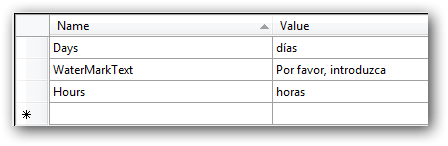

::: {style="DISPLAY: none"}
{#d2h_url_template}{#d2h_package_url style="WIDTH: 0px; DISPLAY: none; HEIGHT: 0px"}
:::

::: {.d2h_secondary_topic style="PADDING-BOTTOM: 10pt; MARGIN: 0pt; PADDING-LEFT: 0pt; PADDING-RIGHT: 0pt; PADDING-TOP: 0pt"}
#### Add Supported Cultures {#add-supported-cultures style="TEXT-JUSTIFY: inter-ideograph; TEXT-ALIGN: justify; tab-stops: 0pt"}

1.   In the Solution Explorer, right-click the sample application project and choose **Unload Project** from the context menu. The project will be unavailable.

2.   Right-click the project again, and select the **Edit SampleProjectName.csproj** option.

3.   In the .csproj file, find the ***\<SupportedCultures\>\</SupportedCultures\>*** tags. By default, the tags will be empty. Add the cultures that you want to be supported, separating each with a semicolon if more than one.

For example: ***\<SupportedCultures\>es\</SupportedCultures\>***

4.   Save the project and right-click the **SampleProjectName.csproj** to reload it.

5.   Choose **Reload SampleProjectName.csproj**.

6.   In the .resx file, change the following value:

{border="0"}

Fig 165: SampleProjectName.csproj after setting value in Spanish culture

[]{#related-topics}
:::
