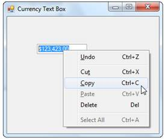
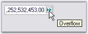
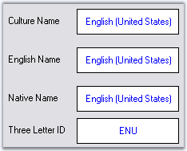

::: {style="DISPLAY: none"}
{#d2h_url_template}{#d2h_package_url style="WIDTH: 0px; DISPLAY: none; HEIGHT: 0px"}
:::

::::::: {.d2h_secondary_topic style="PADDING-BOTTOM: 10pt; MARGIN: 0pt; PADDING-LEFT: 0pt; PADDING-RIGHT: 0pt; PADDING-TOP: 0pt"}
##### Advanced Features {#advanced-features style="tab-stops: 0pt"}

###### 3.3.8.6.6.1 [[Clipboard Support]{style="COLOR: windowtext; TEXT-DECORATION: none; text-underline: none"}](http://help.syncfusion.com/ug_82/WindowsFormsUI_Tools/ClipboardSupport.html) {#clipboard-support style="tab-stops: 0pt"}

The CurrencyTextBox control also provides support for clipboard operations that are compatible with currency data. The**ClipMode** property specifies if formatting characters are to be copied to the clipboard.[]{style="COLOR: black"}

[]{style="COLOR: black"} 

::: {align="center"}
+--------------------------------------------------+---------------------------------------------------------------------------------------------------------------------------------------------+
| CurrencyTextBox Property[]{style="COLOR: black"} | Description[]{style="COLOR: black"}                                                                                                         |
+--------------------------------------------------+---------------------------------------------------------------------------------------------------------------------------------------------+
| ClipMode[]{style="COLOR: black"}                 | Specifies whether to include or exclude literal characters in input mask while doing copy command. The options are,[]{style="COLOR: black"} |
|                                                  |                                                                                                                                             |
|                                                  | []{style="COLOR: black"}                                                                                                                    |
|                                                  |                                                                                                                                             |
|                                                  | *ExcludeFormatting and*[]{style="COLOR: black"}                                                                                             |
|                                                  |                                                                                                                                             |
|                                                  | *IncludeFormatting.*[]{style="COLOR: black"}                                                                                                |
+--------------------------------------------------+---------------------------------------------------------------------------------------------------------------------------------------------+
:::

[]{style="COLOR: black"} 

+-------------------------------------------------------------------------------------------------------------------------------------------------------------------------------------------------------------------------------------+
| **[\[C#\]]{style="FONT-FAMILY: 'Courier New'; COLOR: black"}**[]{style="COLOR: black"}                                                                                                                                              |
|                                                                                                                                                                                                                                     |
| []{style="COLOR: black"}                                                                                                                                                                                                            |
|                                                                                                                                                                                                                                     |
| [this]{style="FONT-FAMILY: 'Courier New'; COLOR: blue"}[.currencyTextBox1.ClipMode = Syncfusion.Windows.Forms.Tools.CurrencyClipModes.ExcludeFormatting;]{style="FONT-FAMILY: 'Courier New'; COLOR: black"}[]{style="COLOR: black"} |
+-------------------------------------------------------------------------------------------------------------------------------------------------------------------------------------------------------------------------------------+

[]{style="COLOR: black"} 

+----------------------------------------------------------------------------------------------------------------------------------------------------------------------------------------------------------------------------------+
| **[\[VB.NET\]]{style="FONT-FAMILY: 'Courier New'; COLOR: black"}**[]{style="COLOR: black"}                                                                                                                                       |
|                                                                                                                                                                                                                                  |
| []{style="COLOR: black"}                                                                                                                                                                                                         |
|                                                                                                                                                                                                                                  |
| [Me]{style="FONT-FAMILY: 'Courier New'; COLOR: blue"}[.currencyTextBox1.ClipMode = Syncfusion.Windows.Forms.Tools.CurrencyClipModes.ExcludeFormatting]{style="FONT-FAMILY: 'Courier New'; COLOR: black"}[]{style="COLOR: black"} |
+----------------------------------------------------------------------------------------------------------------------------------------------------------------------------------------------------------------------------------+

[]{style="COLOR: black"} 

{border="0"}[]{style="COLOR: black"}

[]{style="COLOR: black"} 

Figure 515: CurrencyTextBox with Clipboard Menu[]{style="COLOR: black"}

 

###### 3.3.8.6.6.2 [[Overflow Indicator]{style="COLOR: windowtext; TEXT-DECORATION: none; text-underline: none"}](http://help.syncfusion.com/ug_82/WindowsFormsUI_Tools/OverflowIndicator.html) {#overflow-indicator style="tab-stops: 0pt"}

You can display an indicator in the textbox, when the currency value is displayed, beyond its boundaries. We can also display tooltip for the overflow indicator. The tooltip text is specified in **OverflowIndicatorToolTipText**.** **Set **ShowOverflowIndicator**property to true to enable this feature. Set **ShowOverflowIndicatorToolTip **property to true to display the tooltip text.[]{style="COLOR: black"}

[]{style="COLOR: black"} 

+------------------------------------------------------------------------------------------------------------------------------------------------------------------------------------------------------------------------------------------------------------------------------------------------------------+
| **[\[C#\]]{style="FONT-FAMILY: 'Courier New'; COLOR: black"}**[]{style="COLOR: black"}                                                                                                                                                                                                                     |
|                                                                                                                                                                                                                                                                                                            |
| []{style="COLOR: black"}                                                                                                                                                                                                                                                                                   |
|                                                                                                                                                                                                                                                                                                            |
| [this]{style="FONT-FAMILY: 'Courier New'; COLOR: blue"}[.currencyTextBox1.OverflowIndicatorToolTipText = ]{style="FONT-FAMILY: 'Courier New'; COLOR: black"}[\"Overflow\"]{style="FONT-FAMILY: 'Courier New'; COLOR: maroon"}[;]{style="FONT-FAMILY: 'Courier New'; COLOR: black"}[]{style="COLOR: black"} |
|                                                                                                                                                                                                                                                                                                            |
| [this]{style="FONT-FAMILY: 'Courier New'; COLOR: blue"}[.currencyTextBox1.ShowOverflowIndicator = ]{style="FONT-FAMILY: 'Courier New'; COLOR: black"}[true]{style="FONT-FAMILY: 'Courier New'; COLOR: blue"}[;]{style="FONT-FAMILY: 'Courier New'; COLOR: black"}[]{style="COLOR: black"}                  |
|                                                                                                                                                                                                                                                                                                            |
| [this]{style="FONT-FAMILY: 'Courier New'; COLOR: blue"}[.currencyTextBox1.ShowOverflowIndicatorToolTip = ]{style="FONT-FAMILY: 'Courier New'; COLOR: black"}[true]{style="FONT-FAMILY: 'Courier New'; COLOR: blue"}[;]{style="FONT-FAMILY: 'Courier New'; COLOR: black"}[]{style="COLOR: black"}           |
+------------------------------------------------------------------------------------------------------------------------------------------------------------------------------------------------------------------------------------------------------------------------------------------------------------+

[]{style="COLOR: black"} 

+-----------------------------------------------------------------------------------------------------------------------------------------------------------------------------------------------------------------------------------------------------+
| **[\[VB.NET\]]{style="FONT-FAMILY: 'Courier New'; COLOR: black"}**[]{style="COLOR: black"}                                                                                                                                                          |
|                                                                                                                                                                                                                                                     |
| []{style="COLOR: black"}                                                                                                                                                                                                                            |
|                                                                                                                                                                                                                                                     |
| [Me]{style="FONT-FAMILY: 'Courier New'; COLOR: blue"}[.currencyTextBox1.OverflowIndicatorToolTipText = ]{style="FONT-FAMILY: 'Courier New'; COLOR: black"}[\"Overflow\"]{style="FONT-FAMILY: 'Courier New'; COLOR: maroon"}[]{style="COLOR: black"} |
|                                                                                                                                                                                                                                                     |
| [Me]{style="FONT-FAMILY: 'Courier New'; COLOR: blue"}[.currencyTextBox1.ShowOverflowIndicator = ]{style="FONT-FAMILY: 'Courier New'; COLOR: black"}[True]{style="FONT-FAMILY: 'Courier New'; COLOR: blue"}[]{style="COLOR: black"}                  |
|                                                                                                                                                                                                                                                     |
| [Me]{style="FONT-FAMILY: 'Courier New'; COLOR: blue"}[.currencyTextBox1.ShowOverflowIndicatorToolTip = ]{style="FONT-FAMILY: 'Courier New'; COLOR: black"}[True]{style="FONT-FAMILY: 'Courier New'; COLOR: blue"}[]{style="COLOR: black"}           |
+-----------------------------------------------------------------------------------------------------------------------------------------------------------------------------------------------------------------------------------------------------+

[]{style="COLOR: black"} 

{border="0"}

 

Figure 516: Overflow Indicator with ToolTip

 

###### 3.3.8.6.6.3 [[Globalization]{style="COLOR: windowtext; TEXT-DECORATION: none; text-underline: none"}](http://help.syncfusion.com/ug_82/WindowsFormsUI_Tools/Globalization2.html) {#globalization style="tab-stops: 0pt"}

The CurrencyTextBox class is globalization aware and uses **System.Globalization.CultureInfo** for locale-specific information. You can set the control\'s culture to any installed culture through its **culture** property.[]{style="COLOR: black"}

[]{style="COLOR: black"} 

::: {align="center"}
+----------------------------------------------------+-------------------------------------------------------------------------------------------------------------+
| CurrencyTextBox Properties[]{style="COLOR: black"} | Description[]{style="COLOR: black"}                                                                         |
+----------------------------------------------------+-------------------------------------------------------------------------------------------------------------+
| Culture[]{style="COLOR: black"}                    | It sets the culture that is used for formatting the numeric display.[]{style="COLOR: black"}                |
+----------------------------------------------------+-------------------------------------------------------------------------------------------------------------+
| CurrentCultureRefresh[]{style="COLOR: black"}      | Specifies whether the culture property is to be refreshed when the culture changes.[]{style="COLOR: black"} |
+----------------------------------------------------+-------------------------------------------------------------------------------------------------------------+
| SpecialCultureValue[]{style="COLOR: black"}        | It sets the mode for the cultures. The options includes:[]{style="COLOR: black"}                            |
|                                                    |                                                                                                             |
|                                                    | []{style="COLOR: black"}                                                                                    |
|                                                    |                                                                                                             |
|                                                    | *None,*[]{style="COLOR: black"}                                                                             |
|                                                    |                                                                                                             |
|                                                    | *CurrentCulture (default),*[]{style="COLOR: black"}                                                         |
|                                                    |                                                                                                             |
|                                                    | *InstalledCulture,*[]{style="COLOR: black"}                                                                 |
|                                                    |                                                                                                             |
|                                                    | *UICulture.*[]{style="COLOR: black"}                                                                        |
+----------------------------------------------------+-------------------------------------------------------------------------------------------------------------+
:::

[]{style="COLOR: black"} 

{border="0"}

[]{style="COLOR: black"} 

Figure 517: CultureInfo=\"Arabic (Saudi Arabia)\"

[]{style="COLOR: black"} 

+---------------------------------------------------------------------------------------------------------------------------------------------------------------------------------------------------------------------------------------------------------------------------------------------------------------------------------------------------------------------------------------------------------------------------------+
| **[\[C#\]]{style="FONT-FAMILY: 'Courier New'; COLOR: black"}**[]{style="COLOR: black"}                                                                                                                                                                                                                                                                                                                                          |
|                                                                                                                                                                                                                                                                                                                                                                                                                                 |
| []{style="COLOR: black"}                                                                                                                                                                                                                                                                                                                                                                                                        |
|                                                                                                                                                                                                                                                                                                                                                                                                                                 |
| [this]{style="FONT-FAMILY: 'Courier New'; COLOR: blue"}[.currencyTextBox1.Culture = ]{style="FONT-FAMILY: 'Courier New'; COLOR: black"}[new]{style="FONT-FAMILY: 'Courier New'; COLOR: blue"}[ System.Globalization.CultureInfo(\"]{style="FONT-FAMILY: 'Courier New'; COLOR: black"}[ar-SA]{style="FONT-FAMILY: 'Courier New'; COLOR: maroon"}[\");]{style="FONT-FAMILY: 'Courier New'; COLOR: black"}[]{style="COLOR: black"} |
|                                                                                                                                                                                                                                                                                                                                                                                                                                 |
| [this]{style="FONT-FAMILY: 'Courier New'; COLOR: blue"}[.currencyTextBox1.CurrentCultureRefresh = ]{style="FONT-FAMILY: 'Courier New'; COLOR: black"}[true]{style="FONT-FAMILY: 'Courier New'; COLOR: blue"}[;]{style="FONT-FAMILY: 'Courier New'; COLOR: black"}[]{style="COLOR: black"}                                                                                                                                       |
|                                                                                                                                                                                                                                                                                                                                                                                                                                 |
| [this]{style="FONT-FAMILY: 'Courier New'; COLOR: blue"}[.currencyTextBox1.SpecialCultureValue = Syncfusion.Windows.Forms.Tools.SpecialCultureValues.None;]{style="FONT-FAMILY: 'Courier New'; COLOR: black"}[]{style="COLOR: black"}                                                                                                                                                                                            |
+---------------------------------------------------------------------------------------------------------------------------------------------------------------------------------------------------------------------------------------------------------------------------------------------------------------------------------------------------------------------------------------------------------------------------------+

[]{style="COLOR: black"} 

+------------------------------------------------------------------------------------------------------------------------------------------------------------------------------------------------------------------------------------------------------------------------------------------------------------------------------------------------------------------------------------------------------------------------------+
| **[\[VB.NET\]]{style="FONT-FAMILY: 'Courier New'; COLOR: black"}**[]{style="COLOR: black"}                                                                                                                                                                                                                                                                                                                                   |
|                                                                                                                                                                                                                                                                                                                                                                                                                              |
| []{style="COLOR: black"}                                                                                                                                                                                                                                                                                                                                                                                                     |
|                                                                                                                                                                                                                                                                                                                                                                                                                              |
| [Me]{style="FONT-FAMILY: 'Courier New'; COLOR: blue"}[.currencyTextBox1.Culture = ]{style="FONT-FAMILY: 'Courier New'; COLOR: black"}[New]{style="FONT-FAMILY: 'Courier New'; COLOR: blue"}[ System.Globalization.CultureInfo(]{style="FONT-FAMILY: 'Courier New'; COLOR: black"}[\"ar-SA\"]{style="FONT-FAMILY: 'Courier New'; COLOR: maroon"}[)]{style="FONT-FAMILY: 'Courier New'; COLOR: black"}[]{style="COLOR: black"} |
|                                                                                                                                                                                                                                                                                                                                                                                                                              |
| [Me]{style="FONT-FAMILY: 'Courier New'; COLOR: blue"}[.currencyTextBox1.CurrentCultureRefresh = ]{style="FONT-FAMILY: 'Courier New'; COLOR: black"}[True]{style="FONT-FAMILY: 'Courier New'; COLOR: blue"}[]{style="COLOR: black"}                                                                                                                                                                                           |
|                                                                                                                                                                                                                                                                                                                                                                                                                              |
| [Me]{style="FONT-FAMILY: 'Courier New'; COLOR: blue"}[.currencyTextBox1.SpecialCultureValue = Syncfusion.Windows.Forms.Tools.SpecialCultureValues.None]{style="FONT-FAMILY: 'Courier New'; COLOR: black"}[]{style="COLOR: black"}                                                                                                                                                                                            |
+------------------------------------------------------------------------------------------------------------------------------------------------------------------------------------------------------------------------------------------------------------------------------------------------------------------------------------------------------------------------------------------------------------------------------+

[]{style="COLOR: black"} 

User Override for Culture[]{style="COLOR: black"}

[]{style="COLOR: black"} 

::: {align="center"}
  ---------------------------------------------------- ----------------------------------------------------------------------------------------------------------------------------
  CurrencyTextBox Properties[]{style="COLOR: black"}   Description[]{style="COLOR: black"}
  UseUserOverride[]{style="COLOR: black"}              Specifies if the NumberFormatInfo used for formatting will use the User overrides for the culture.[]{style="COLOR: black"}
  ---------------------------------------------------- ----------------------------------------------------------------------------------------------------------------------------
:::

[]{style="COLOR: black"} 

+------------------------------------------------------------------------------------------------------------------------------------------------------------------------------------------------------------------------------------------------------------------------------------------------------------------------------------------------------------------------------------------------------------------------------------------------------------------------+
| **[\[C#\]]{style="FONT-FAMILY: 'Courier New'; COLOR: black"}**[]{style="COLOR: black"}                                                                                                                                                                                                                                                                                                                                                                                 |
|                                                                                                                                                                                                                                                                                                                                                                                                                                                                        |
| []{style="COLOR: black"}                                                                                                                                                                                                                                                                                                                                                                                                                                               |
|                                                                                                                                                                                                                                                                                                                                                                                                                                                                        |
| [this]{style="FONT-FAMILY: 'Courier New'; COLOR: blue"}[.currencyTextBox1.UseUserOverride = ]{style="FONT-FAMILY: 'Courier New'; COLOR: black"}[false]{style="FONT-FAMILY: 'Courier New'; COLOR: blue"}[;]{style="FONT-FAMILY: 'Courier New'; COLOR: black"}[]{style="COLOR: black"}                                                                                                                                                                                   |
|                                                                                                                                                                                                                                                                                                                                                                                                                                                                        |
| [this]{style="FONT-FAMILY: 'Courier New'; COLOR: blue"}[.currencyTextBox1.Culture = ]{style="FONT-FAMILY: 'Courier New'; COLOR: black"}[new]{style="FONT-FAMILY: 'Courier New'; COLOR: blue"}[ CultureInfo(CultureInfo.CurrentUICulture.LCID,]{style="FONT-FAMILY: 'Courier New'; COLOR: black"}[this]{style="FONT-FAMILY: 'Courier New'; COLOR: blue"}[.currencyTextBox1.UseUserOverride);]{style="FONT-FAMILY: 'Courier New'; COLOR: black"}[]{style="COLOR: black"} |
+------------------------------------------------------------------------------------------------------------------------------------------------------------------------------------------------------------------------------------------------------------------------------------------------------------------------------------------------------------------------------------------------------------------------------------------------------------------------+

[]{style="COLOR: black"} 

+-------------------------------------------------------------------------------------------------------------------------------------------------------------------------------------------------------------------------------------------------------------------------------------------------------------------------------------------------------------------------------------------------------------------------------------------------------------------+
| **[\[VB.NET\]]{style="FONT-FAMILY: 'Courier New'; COLOR: black"}**[]{style="COLOR: black"}                                                                                                                                                                                                                                                                                                                                                                        |
|                                                                                                                                                                                                                                                                                                                                                                                                                                                                   |
| []{style="COLOR: black"}                                                                                                                                                                                                                                                                                                                                                                                                                                          |
|                                                                                                                                                                                                                                                                                                                                                                                                                                                                   |
| [Me]{style="FONT-FAMILY: 'Courier New'; COLOR: blue"}[.currencyTextBox1.UseUserOverride = ]{style="FONT-FAMILY: 'Courier New'; COLOR: black"}[False]{style="FONT-FAMILY: 'Courier New'; COLOR: blue"}[]{style="COLOR: black"}                                                                                                                                                                                                                                     |
|                                                                                                                                                                                                                                                                                                                                                                                                                                                                   |
| [Me]{style="FONT-FAMILY: 'Courier New'; COLOR: blue"}[.currencyTextBox1.Culture = ]{style="FONT-FAMILY: 'Courier New'; COLOR: black"}[New]{style="FONT-FAMILY: 'Courier New'; COLOR: blue"}[ CultureInfo(CultureInfo.CurrentUICulture.LCID,]{style="FONT-FAMILY: 'Courier New'; COLOR: black"}[Me]{style="FONT-FAMILY: 'Courier New'; COLOR: blue"}[.currencyTextBox1.UseUserOverride)]{style="FONT-FAMILY: 'Courier New'; COLOR: black"}[]{style="COLOR: black"} |
+-------------------------------------------------------------------------------------------------------------------------------------------------------------------------------------------------------------------------------------------------------------------------------------------------------------------------------------------------------------------------------------------------------------------------------------------------------------------+

[]{style="COLOR: black"} 

Culture name[]{style="COLOR: black"}

[]{style="COLOR: black"} 

The culture name can be displayed in the different format according to the specified culture value. Refer the following table in detail.[]{style="COLOR: black"}

[]{style="COLOR: black"} 

::: {align="center"}
  ------------------------------------------------------------ ----------------------------------------------------------------------------------------------------------------------------------------------------------------------------
  CurrencyTextBox.Culture Properties[]{style="COLOR: black"}   Description[]{style="COLOR: black"}
  DisplayName[]{style="COLOR: black"}                          Gets the culture name in the format \"\<language full\>(\<country/region full\>)\" in the language of the localized version of the .NET framework.[]{style="COLOR: black"}
  EnglishName[]{style="COLOR: black"}                          Gets the culture name in the format \"\<language full\>(\<country/region full\>)\" in english.[]{style="COLOR: black"}
  NativeName[]{style="COLOR: black"}                           Gets the culture name in the format \"\<language full\>(\<country/region full\>)\" in the language that the culture is set to display.[]{style="COLOR: black"}
  ThreeLetterWindowsLanguageName[]{style="COLOR: black"}       Gets the three letter code for the language as specified in the windows API.[]{style="COLOR: black"}
  ------------------------------------------------------------ ----------------------------------------------------------------------------------------------------------------------------------------------------------------------------
:::

[]{style="COLOR: black"} 

The following figure illustrates this when the culture is \'en-US\'.[]{style="COLOR: black"}

[]{style="COLOR: black"} 

+--------------------------------------------------------------------------------------------------------------------------------------------------------------------------------------------------------------------------------------------------------------------------------------------------------------------------+
| **[\[C#\]]{style="FONT-FAMILY: 'Courier New'; COLOR: black"}**[]{style="COLOR: black"}                                                                                                                                                                                                                                   |
|                                                                                                                                                                                                                                                                                                                          |
| []{style="COLOR: black"}                                                                                                                                                                                                                                                                                                 |
|                                                                                                                                                                                                                                                                                                                          |
| [this]{style="FONT-FAMILY: 'Courier New'; COLOR: blue"}[.label11.Text = ]{style="FONT-FAMILY: 'Courier New'; COLOR: black"}[this]{style="FONT-FAMILY: 'Courier New'; COLOR: blue"}[.currencyTextBox1.Culture.DisplayName;]{style="FONT-FAMILY: 'Courier New'; COLOR: black"}[]{style="COLOR: black"}                     |
|                                                                                                                                                                                                                                                                                                                          |
| [this]{style="FONT-FAMILY: 'Courier New'; COLOR: blue"}[.label12.Text  = ]{style="FONT-FAMILY: 'Courier New'; COLOR: black"}[this]{style="FONT-FAMILY: 'Courier New'; COLOR: blue"}[.currencyTextBox1.Culture.EnglishName;]{style="FONT-FAMILY: 'Courier New'; COLOR: black"}[]{style="COLOR: black"}                    |
|                                                                                                                                                                                                                                                                                                                          |
| [this]{style="FONT-FAMILY: 'Courier New'; COLOR: blue"}[.label13.Text  = ]{style="FONT-FAMILY: 'Courier New'; COLOR: black"}[this]{style="FONT-FAMILY: 'Courier New'; COLOR: blue"}[.currencyTextBox1.Culture.NativeName;]{style="FONT-FAMILY: 'Courier New'; COLOR: black"}[]{style="COLOR: black"}                     |
|                                                                                                                                                                                                                                                                                                                          |
| [this]{style="FONT-FAMILY: 'Courier New'; COLOR: blue"}[.label14.Text  = ]{style="FONT-FAMILY: 'Courier New'; COLOR: black"}[this]{style="FONT-FAMILY: 'Courier New'; COLOR: blue"}[.currencyTextBox1.Culture.ThreeLetterWindowsLanguageName;]{style="FONT-FAMILY: 'Courier New'; COLOR: black"}[]{style="COLOR: black"} |
+--------------------------------------------------------------------------------------------------------------------------------------------------------------------------------------------------------------------------------------------------------------------------------------------------------------------------+

[]{style="COLOR: black"} 

+--------------------------------------------------------------------------------------------------------------------------------------------------------------------------------------------------------------------------------------------------------------------------------------------------------------------+
| **[\[VB.NET\]]{style="FONT-FAMILY: 'Courier New'; COLOR: black"}**[]{style="COLOR: black"}                                                                                                                                                                                                                         |
|                                                                                                                                                                                                                                                                                                                    |
| []{style="COLOR: black"}                                                                                                                                                                                                                                                                                           |
|                                                                                                                                                                                                                                                                                                                    |
| [Me]{style="FONT-FAMILY: 'Courier New'; COLOR: blue"}[.label11.Text = ]{style="FONT-FAMILY: 'Courier New'; COLOR: black"}[Me]{style="FONT-FAMILY: 'Courier New'; COLOR: blue"}[.currencyTextBox1.Culture.DisplayName]{style="FONT-FAMILY: 'Courier New'; COLOR: black"}[]{style="COLOR: black"}                    |
|                                                                                                                                                                                                                                                                                                                    |
| [Me]{style="FONT-FAMILY: 'Courier New'; COLOR: blue"}[.label12.Text = ]{style="FONT-FAMILY: 'Courier New'; COLOR: black"}[Me]{style="FONT-FAMILY: 'Courier New'; COLOR: blue"}[.currencyTextBox1.Culture.EnglishName]{style="FONT-FAMILY: 'Courier New'; COLOR: black"}[]{style="COLOR: black"}                    |
|                                                                                                                                                                                                                                                                                                                    |
| [Me]{style="FONT-FAMILY: 'Courier New'; COLOR: blue"}[.label13.Text = ]{style="FONT-FAMILY: 'Courier New'; COLOR: black"}[Me]{style="FONT-FAMILY: 'Courier New'; COLOR: blue"}[.currencyTextBox1.Culture.NativeName]{style="FONT-FAMILY: 'Courier New'; COLOR: black"}[]{style="COLOR: black"}                     |
|                                                                                                                                                                                                                                                                                                                    |
| [Me]{style="FONT-FAMILY: 'Courier New'; COLOR: blue"}[.label14.Text = ]{style="FONT-FAMILY: 'Courier New'; COLOR: black"}[Me]{style="FONT-FAMILY: 'Courier New'; COLOR: blue"}[.currencyTextBox1.Culture.ThreeLetterWindowsLanguageName]{style="FONT-FAMILY: 'Courier New'; COLOR: black"}[]{style="COLOR: black"} |
+--------------------------------------------------------------------------------------------------------------------------------------------------------------------------------------------------------------------------------------------------------------------------------------------------------------------+

[]{style="COLOR: black"} 

{border="0"}

Figure 518: Culture Settings

 

 

[]{#related-topics}
:::::::
