::: {style="DISPLAY: none"}
{#d2h_url_template}{#d2h_package_url style="WIDTH: 0px; DISPLAY: none; HEIGHT: 0px"}
:::

::::::::: {.d2h_secondary_topic style="PADDING-BOTTOM: 10pt; MARGIN: 0pt; PADDING-LEFT: 0pt; PADDING-RIGHT: 0pt; PADDING-TOP: 0pt"}
##### Advanced Options {#advanced-options style="tab-stops: 0pt"}

[]{style="COLOR: #15428b"} 

This section covers some advanced options available for the Bar items.

[]{style="COLOR: #15428b"} 

###### []{#p880}[]{#_BarItem_Context_Menu}3.5.4.1.4.1 BarItem Context Menu {#baritem-context-menu style="tab-stops: 0pt"}

[]{style="COLOR: #15428b"} 

On right clicking any of the bar items at design time or at run time, displays a context menu. The below image illustrates the various options in the context menu.

[]{style="COLOR: #15428b"} 

::: {style="BORDER-BOTTOM: windowtext 1pt solid; BORDER-LEFT: medium none; PADDING-BOTTOM: 1pt; MARGIN-TOP: 9pt; PADDING-LEFT: 0pt; PADDING-RIGHT: 0pt; MARGIN-BOTTOM: 9pt; BORDER-TOP: windowtext 1pt solid; BORDER-RIGHT: medium none; PADDING-TOP: 1pt"}
{border="0"} Note: At runtime, the context menu will be invoked, only with the customize dialog open.
:::

[]{style="COLOR: #15428b"} 

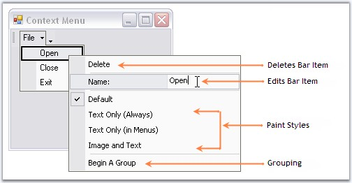{border="0"}

[]{style="COLOR: #15428b"} 

Figure 775: Context Menu for the Bar Item \"Open\" at DesignTime

**[]{style="COLOR: #15428b"}** 

[·      ]{style="FONT-FAMILY: Symbol; COLOR: #15428b"}Deleting a Bar item[.]{style="COLOR: #15428b"}[]{style="COLOR: #15428b"}

[·      ]{style="FONT-FAMILY: Symbol; COLOR: #15428b"}[It lets you edit the text of a bar item using the text area against Name option. ]{style="COLOR: #15428b"}

[·      ]{style="FONT-FAMILY: Symbol; COLOR: #15428b"}[Select ]{style="COLOR: #15428b"}Paint Styles[.]{style="COLOR: #15428b"}[]{style="COLOR: #15428b"}

[·      ]{style="FONT-FAMILY: Symbol; COLOR: #15428b"}Begin a Group[.]{style="COLOR: #15428b"}[]{style="COLOR: #15428b"}

[]{style="COLOR: #15428b"} 

::: {style="BORDER-BOTTOM: windowtext 1pt solid; BORDER-LEFT: medium none; PADDING-BOTTOM: 1pt; MARGIN-TOP: 9pt; PADDING-LEFT: 0pt; PADDING-RIGHT: 0pt; MARGIN-BOTTOM: 9pt; BORDER-TOP: windowtext 1pt solid; BORDER-RIGHT: medium none; PADDING-TOP: 1pt"}
{border="0"} Note: The editing option for the bar item text at run time can be disabled by setting BarManager.AllowUserRenaming property to false.
:::

[]{style="COLOR: #15428b"} 

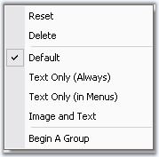{border="0"}

[]{style="COLOR: #15428b"} 

Figure 776: Context Menu at run time without Text Editing Option

***[]{style="COLOR: #15428b"}*** 

***[]{style="COLOR: #15428b"}*** 

[ ]{style="FONT-FAMILY: 'Calibri','sans-serif'"}Image Icon Option of a Baritem for CustomizingPopupMenu

**[]{style="COLOR: #15428b"}** 

**ChangeImage** option is added in **CustomizingPopupMenu**. Baritem's image can be changed using **ChangeImage** option.

[]{style="COLOR: #15428b"} 

1.   Right click at the **baritem** during runtime customization.

::: {style="BORDER-BOTTOM: windowtext 1pt solid; BORDER-LEFT: medium none; PADDING-BOTTOM: 1pt; MARGIN-TOP: 9pt; PADDING-LEFT: 0pt; PADDING-RIGHT: 0pt; MARGIN-BOTTOM: 9pt; BORDER-TOP: windowtext 1pt solid; BORDER-RIGHT: medium none; PADDING-TOP: 1pt"}
{border="0"}Note:  CustomizingPopupMenu appears[.]{style="FONT-FAMILY: 'Calibri','sans-serif'"}
:::

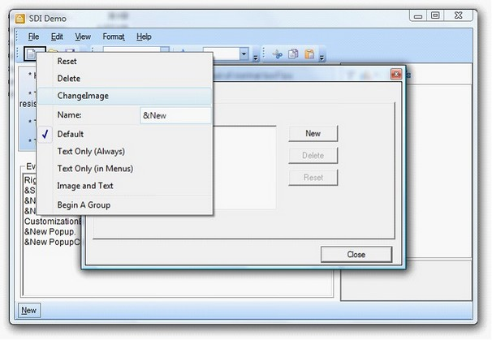{border="0"}

Figure 777: CustomizationPopupMenu

 

2.   Click ChangeImage

::: {style="BORDER-BOTTOM: windowtext 1pt solid; BORDER-LEFT: medium none; PADDING-BOTTOM: 1pt; MARGIN-TOP: 9pt; PADDING-LEFT: 0pt; PADDING-RIGHT: 0pt; MARGIN-BOTTOM: 9pt; BORDER-TOP: windowtext 1pt solid; BORDER-RIGHT: medium none; PADDING-TOP: 1pt"}
{border="0"}Note: File Dialog Opens.
:::

3.   You can select any image for the **baritem** using this dialog.

###### []{#_Deleting_a_Bar}[3.5.4.1.4.2      ]{style="FONT-SIZE: 9pt"}Deleting a Bar Item[]{style="FONT-SIZE: 9pt"} {#deleting-a-bar-item style="tab-stops: 0pt"}

[]{#p881}[]{style="COLOR: #15428b"} 

Design Time

[]{style="COLOR: #15428b"} 

In the designer, right click on the bar item which you want to delete and select \"Delete\" option from the Context Menu.

[]{style="COLOR: #15428b"} 

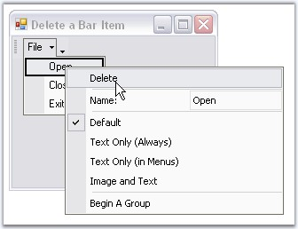{border="0"}

[]{style="COLOR: #15428b"} 

Figure 778: Delete option in the Context Menu

[]{style="COLOR: #15428b"} 

You can remove the BarItem from a submenu using any of the below two methods also.

[]{style="COLOR: #15428b"} 

::: {align="center"}
+-----------------------------------+---------------------------------------------------------------------------------------------------------------+
| BarItem Methods                   | Description                                                                                                   |
+-----------------------------------+---------------------------------------------------------------------------------------------------------------+
| Remove                            | Removes the first occurrence of the specific object.                                                          |
|                                   |                                                                                                               |
|                                   |                                                                                                               |
|                                   |                                                                                                               |
|                                   | *obj[ ]{style="COLOR: black; FONT-SIZE: 8pt"}*- System.object to remove from System.Collections.Arraylist.    |
+-----------------------------------+---------------------------------------------------------------------------------------------------------------+
| RemoveAt                          | Removes the bar item from the ParentBarItems Collection based on the Bar item index(index). The parameter is, |
|                                   |                                                                                                               |
|                                   |                                                                                                               |
|                                   |                                                                                                               |
|                                   | *index* - Index of the bar item.                                                                              |
+-----------------------------------+---------------------------------------------------------------------------------------------------------------+
:::

[]{style="COLOR: #15428b"} 

+--------------------------------------------------------------------------------------------------------------------------------------------------------------------------------------------------------------------------------------+
| **[\[C#\]]{style="FONT-FAMILY: 'Courier New'; COLOR: black"}**                                                                                                                                                                       |
|                                                                                                                                                                                                                                      |
| **[]{style="FONT-FAMILY: 'Courier New'; COLOR: black"}**                                                                                                                                                                             |
|                                                                                                                                                                                                                                      |
| [this]{style="FONT-FAMILY: 'Courier New'; COLOR: blue"}[.parentBarItem1.Items.Remove([this]{style="COLOR: blue"}.barItem1); ]{style="FONT-FAMILY: 'Courier New'"}[ ]{style="FONT-FAMILY: 'Courier New'"}                             |
|                                                                                                                                                                                                                                      |
| [or]{style="FONT-FAMILY: 'Courier New'"}                                                                                                                                                                                             |
|                                                                                                                                                                                                                                      |
| [this]{style="FONT-FAMILY: 'Courier New'; COLOR: blue"}[.parentBarItem1.Items.RemoveAt(1);   ]{style="FONT-FAMILY: 'Courier New'"}                                                                                                   |
|                                                                                                                                                                                                                                      |
| [//where \'1\' refers to the index of the BarItem in its parentBarItems collection.]{style="FONT-FAMILY: 'Courier New'; COLOR: green"}[ ]{style="FONT-FAMILY: 'Courier New'"}[                 ]{style="FONT-FAMILY: 'Courier New'"} |
+--------------------------------------------------------------------------------------------------------------------------------------------------------------------------------------------------------------------------------------+

[]{style="COLOR: #15428b"} 

+-------------------------------------------------------------------------------------------------------------------------------------------------------------+
| **[\[VB.NET\]]{style="FONT-FAMILY: 'Courier New'; COLOR: black"}**                                                                                          |
|                                                                                                                                                             |
| **[]{style="FONT-FAMILY: 'Courier New'; COLOR: black"}**                                                                                                    |
|                                                                                                                                                             |
| [Me]{style="FONT-FAMILY: 'Courier New'; COLOR: blue"}[.parentBarItem1.Items.Remove([Me]{style="COLOR: blue"}.barItem1)]{style="FONT-FAMILY: 'Courier New'"} |
|                                                                                                                                                             |
| [or]{style="FONT-FAMILY: 'Courier New'"}                                                                                                                    |
|                                                                                                                                                             |
| [Me]{style="FONT-FAMILY: 'Courier New'; COLOR: blue"}[.parentBarItem1.Items.RemoveAt(1)]{style="FONT-FAMILY: 'Courier New'"}                                |
|                                                                                                                                                             |
| [\'[where \'1\' refers to the index of the BarItem in its parentBarItems collection.]{style="COLOR: green"}]{style="FONT-FAMILY: 'Courier New'"}            |
+-------------------------------------------------------------------------------------------------------------------------------------------------------------+

[]{style="COLOR: #15428b"} 

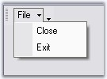{border="0"}

**[]{style="COLOR: #15428b"}** 

Figure 779: \"Open\" Bar Item deleted from the Menu

 

RunTime

[]{style="COLOR: #15428b"} 

This option is available for the end users at run time also. Right-clicking on a bar item at run time invokes the context menu similar to that in the Designer.

[]{style="COLOR: #15428b"} 

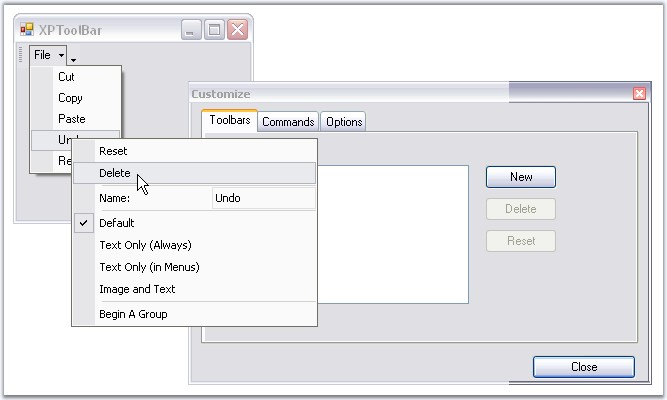{border="0"}

[]{style="COLOR: #15428b"} 

Figure 780: BarItem Context menu at RunTime with Customize Dialog Box Open

###### []{#p882}[]{#_Grouping_Bar_Items}3.5.4.1.4.3 Grouping Bar Items {#grouping-bar-items style="tab-stops: 0pt"}

[]{style="COLOR: #15428b"} 

Design Time

[]{style="COLOR: #15428b"} 

XPMenus lets you group certain bar items using Begin a Group option in the designer, code and programmatically also.

[]{style="COLOR: #15428b"} 

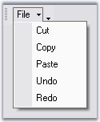{border="0"}

[]{style="COLOR: #15428b"} 

Figure 781: Bar Item without Grouping

**[]{style="COLOR: #15428b"}** 

Select a bar item in the dropdown from which you want to start a group, right click on it and select \"Begin A Group\" option from the Context Menu. This inserts a separator from the bar item selected and starts a group.

[]{style="COLOR: #15428b"} 

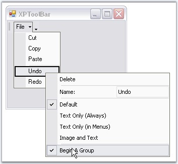{border="0"}

**[]{style="COLOR: #15428b"}** 

Figure 782: Enabling Begin a Group Option in the Designer

[]{style="COLOR: #15428b"} 

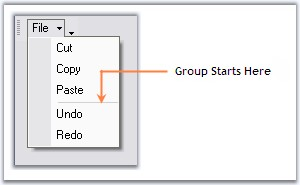{border="0"}

**[]{style="COLOR: #15428b"}** 

Figure 783: Grouped Bar Items

[]{style="COLOR: #15428b"} 

Programmatically

**[]{style="COLOR: #15428b"}** 

If you want to draw a separator between the BarItems in a bar, you have to use BeginGroupAt (BarItem) as shown below:

[]{style="COLOR: #15428b"} 

+------------------------------------------------------------------------------------------------------------------------------------------------------------------------------------------------------+
| **[\[C#\]]{style="FONT-FAMILY: 'Courier New'; COLOR: black"}**                                                                                                                                       |
|                                                                                                                                                                                                      |
| **[]{style="FONT-FAMILY: 'Courier New'; COLOR: black"}**                                                                                                                                             |
|                                                                                                                                                                                                      |
| [//This will draw a separator before barItem1]{style="FONT-FAMILY: 'Courier New'; COLOR: green"}                                                                                                     |
|                                                                                                                                                                                                      |
| [this]{style="FONT-FAMILY: 'Courier New'; COLOR: blue"}[.bar1.BeginGroupAt([this]{style="COLOR: blue"}.BarItem1);    ]{style="FONT-FAMILY: 'Courier New'"}                                           |
|                                                                                                                                                                                                      |
| []{style="FONT-FAMILY: 'Courier New'"}                                                                                                                                                               |
|                                                                                                                                                                                                      |
| [//to draw a separator between BarItems in a submenu, use the following code ]{style="FONT-FAMILY: 'Courier New'; COLOR: green"}                                                                     |
|                                                                                                                                                                                                      |
| [//This will draw a separator above barItem3  ]{style="FONT-FAMILY: 'Courier New'; COLOR: green"}                                                                                                    |
|                                                                                                                                                                                                      |
| [this]{style="FONT-FAMILY: 'Courier New'; COLOR: blue"}[.parentBarItem1.BeginGroupAt([this]{style="COLOR: blue"}.BarItem3);   [         ]{style="COLOR: green"}]{style="FONT-FAMILY: 'Courier New'"} |
+------------------------------------------------------------------------------------------------------------------------------------------------------------------------------------------------------+

[]{style="COLOR: #15428b"} 

+-------------------------------------------------------------------------------------------------------------------------------------------------------------+
| **[\[VB.NET\]]{style="FONT-FAMILY: 'Courier New'; COLOR: black"}**                                                                                          |
|                                                                                                                                                             |
| **[]{style="FONT-FAMILY: 'Courier New'; COLOR: black"}**                                                                                                    |
|                                                                                                                                                             |
| [\'This will draw a separator before barItem1]{style="FONT-FAMILY: 'Courier New'; COLOR: green"}                                                            |
|                                                                                                                                                             |
| [Me]{style="FONT-FAMILY: 'Courier New'; COLOR: blue"}[.bar1.BeginGroupAt([Me]{style="COLOR: blue"}.BarItem1)]{style="FONT-FAMILY: 'Courier New'"}           |
|                                                                                                                                                             |
| []{style="FONT-FAMILY: 'Courier New'"}                                                                                                                      |
|                                                                                                                                                             |
| [\'to draw a separator between barItems in a submenu, use the following code ]{style="FONT-FAMILY: 'Courier New'; COLOR: green"}                            |
|                                                                                                                                                             |
| [\'This will draw a separator above barItem3]{style="FONT-FAMILY: 'Courier New'; COLOR: green"}                                                             |
|                                                                                                                                                             |
| [Me]{style="FONT-FAMILY: 'Courier New'; COLOR: blue"}[.parentBarItem1.BeginGroupAt([Me]{style="COLOR: blue"}.BarItem3)]{style="FONT-FAMILY: 'Courier New'"} |
+-------------------------------------------------------------------------------------------------------------------------------------------------------------+

[]{style="COLOR: #15428b"} 

RunTime

[]{style="COLOR: #15428b"} 

This option is available for the end users at run time also. Right clicking on a bar item at run time, invokes the context menu similar to that in the designer.

[]{style="COLOR: #15428b"} 

::: {style="BORDER-BOTTOM: windowtext 1pt solid; BORDER-LEFT: medium none; PADDING-BOTTOM: 1pt; MARGIN-TOP: 9pt; PADDING-LEFT: 0pt; PADDING-RIGHT: 0pt; MARGIN-BOTTOM: 9pt; BORDER-TOP: windowtext 1pt solid; BORDER-RIGHT: medium none; PADDING-TOP: 1pt"}
{border="0"} Note:[ ]{style="COLOR: black; FONT-SIZE: 8pt"}Context menu will be invoked at run time, only with the customize dialog open.
:::

[]{style="COLOR: #15428b"} 

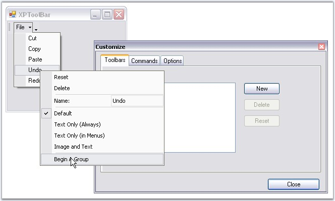{border="0"}

[]{style="COLOR: #15428b"} 

Figure 784: BarItem Context Menu Highlighting Begin a Group option

###### []{#_Adding_Separators}3.5.4.1.4.4 Adding Separators {#adding-separators style="tab-stops: 0pt"}

[]{style="COLOR: #15428b"} 

XPMenus lets you add separators in between the bar items in a Toolbar, and also in between menu items under a ParentBarItem.

[]{style="COLOR: #15428b"} 

Separators for menu items in ParentBarItem Through Designer

[]{style="COLOR: #15428b"} 

To add separators between the menu items under a ParentBarItem, invoke Int32 Collection Editor using **ParentBarItem.SeparatorIndices** property.

[]{style="COLOR: #15428b"} 

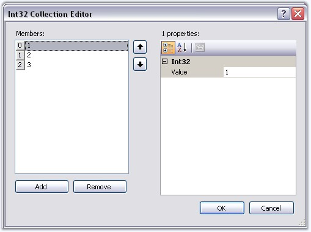{border="0"}

[]{style="COLOR: #15428b"} 

Figure 785: Adding Separator Indices for Menu items of ParentBarItem

**[]{style="COLOR: #15428b"}** 

+----------------------------------------------------------------------------------------------------------------------------------------------------------------------------------------------------------------+
| **[\[C#\]]{style="FONT-FAMILY: 'Courier New'; COLOR: black"}**                                                                                                                                                 |
|                                                                                                                                                                                                                |
| **[]{style="FONT-FAMILY: 'Courier New'; COLOR: black"}**                                                                                                                                                       |
|                                                                                                                                                                                                                |
| [//Add Separators between bar items in a toolbar]{style="FONT-FAMILY: 'Courier New'; COLOR: green"}                                                                                                            |
|                                                                                                                                                                                                                |
| [this]{style="FONT-FAMILY: 'Courier New'; COLOR: blue"}[.bar1.SeparatorIndices.AddRange([new]{style="COLOR: blue"} [int]{style="COLOR: blue"}\[\] { 1, 2 });]{style="FONT-FAMILY: 'Courier New'"}              |
|                                                                                                                                                                                                                |
| []{style="FONT-FAMILY: 'Courier New'"}                                                                                                                                                                         |
|                                                                                                                                                                                                                |
| [//Add Separators between menu items of a ParentBarItem]{style="FONT-FAMILY: 'Courier New'; COLOR: green"}                                                                                                     |
|                                                                                                                                                                                                                |
| [this]{style="FONT-FAMILY: 'Courier New'; COLOR: blue"}[.parentBarItem1.SeparatorIndices.AddRange([new]{style="COLOR: blue"} [int]{style="COLOR: blue"}\[\] { 1, 2, 3 });]{style="FONT-FAMILY: 'Courier New'"} |
|                                                                                                                                                                                                                |
| []{style="FONT-FAMILY: 'Courier New'"}                                                                                                                                                                         |
|                                                                                                                                                                                                                |
| [//Clear Separators]{style="FONT-FAMILY: 'Courier New'; COLOR: green"}                                                                                                                                         |
|                                                                                                                                                                                                                |
| [bar1.SeparatorIndices.Clear();]{style="FONT-FAMILY: 'Courier New'"}                                                                                                                                           |
|                                                                                                                                                                                                                |
| [parentBarItem1.SeparatorIndices.Clear();]{style="FONT-FAMILY: 'Courier New'"}                                                                                                                                 |
+----------------------------------------------------------------------------------------------------------------------------------------------------------------------------------------------------------------+

[]{style="COLOR: #15428b"} 

+--------------------------------------------------------------------------------------------------------------------------------------------------------------------------------------------------------------+
| **[\[VB.NET\]]{style="FONT-FAMILY: 'Courier New'; COLOR: black"}**                                                                                                                                           |
|                                                                                                                                                                                                              |
| **[]{style="FONT-FAMILY: 'Courier New'; COLOR: black"}**                                                                                                                                                     |
|                                                                                                                                                                                                              |
| [\'Add Separators between bar items in a toolbar]{style="FONT-FAMILY: 'Courier New'; COLOR: green"}                                                                                                          |
|                                                                                                                                                                                                              |
| [Me]{style="FONT-FAMILY: 'Courier New'; COLOR: blue"}[.bar1.SeparatorIndices.AddRange([New]{style="COLOR: blue"} [Integer]{style="COLOR: blue"}() {1, 2}) ]{style="FONT-FAMILY: 'Courier New'"}              |
|                                                                                                                                                                                                              |
| []{style="FONT-FAMILY: 'Courier New'"}                                                                                                                                                                       |
|                                                                                                                                                                                                              |
| [\'Add Separators between menu items of a ParentBarItem]{style="FONT-FAMILY: 'Courier New'; COLOR: green"}                                                                                                   |
|                                                                                                                                                                                                              |
| [Me]{style="FONT-FAMILY: 'Courier New'; COLOR: blue"}[.parentBarItem1.SeparatorIndices.AddRange([New]{style="COLOR: blue"} [Integer]{style="COLOR: blue"}() {1, 2, 3}) ]{style="FONT-FAMILY: 'Courier New'"} |
|                                                                                                                                                                                                              |
| []{style="FONT-FAMILY: 'Courier New'"}                                                                                                                                                                       |
|                                                                                                                                                                                                              |
| [\'Clear Separators]{style="FONT-FAMILY: 'Courier New'; COLOR: green"}                                                                                                                                       |
|                                                                                                                                                                                                              |
| [bar1.SeparatorIndices.Clear()]{style="FONT-FAMILY: 'Courier New'"}                                                                                                                                          |
|                                                                                                                                                                                                              |
| [parentBarItem1.SeparatorIndices.Clear()]{style="FONT-FAMILY: 'Courier New'"}                                                                                                                                |
+--------------------------------------------------------------------------------------------------------------------------------------------------------------------------------------------------------------+

[]{style="COLOR: #15428b"} 

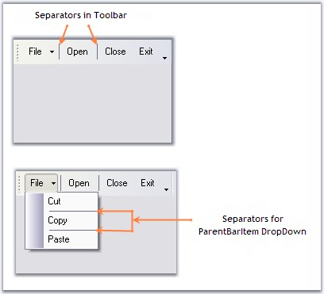{border="0"}

[]{style="COLOR: #15428b"} 

Figure 786: Separators for Bar and ParentBarItem DropDown

[]{#related-topics}
:::::::::
