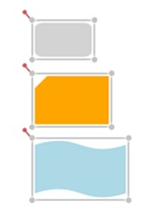
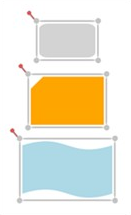
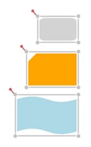
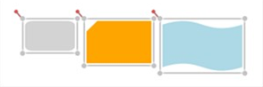
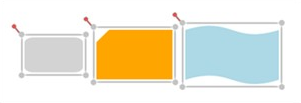

::: {style="DISPLAY: none"}
{#d2h_url_template}{#d2h_package_url style="WIDTH: 0px; DISPLAY: none; HEIGHT: 0px"}
:::

::::: {#nsbanner .d2h_main_nsbanner style="BORDER-BOTTOM: #999999 1px solid; POSITION: relative; PADDING-BOTTOM: 0px; BACKGROUND-COLOR: transparent; PADDING-LEFT: 0px; PADDING-RIGHT: 0px; DISPLAY: none; BORDER-TOP: #999999 1px solid; PADDING-TOP: 0px; LEFT: 0px"}
:::: {#TitleRow .d2h_main_titlerow style="PADDING-BOTTOM: 4px; BACKGROUND-COLOR: transparent; PADDING-LEFT: 22px; WIDTH: 100%; PADDING-RIGHT: 10px; DISPLAY: none; PADDING-TOP: 4px"}
::: {#ienav .d2h_main_ienav style="DISPLAY: none"}
{#D2HPrevious .D2HPreviousEnabled}  {#D2HNext .D2HNextEnabled}
:::
::::
:::::

::::: {#nstext .d2h_main_nstext style="PADDING-BOTTOM: 10px; BACKGROUND-COLOR: transparent; PADDING-LEFT: 22px; PADDING-RIGHT: 10px; HEIGHT: 100%; OVERFLOW: auto; PADDING-TOP: 5px" hasuserbackground="true" valign="bottom"}
::: {#d2h_breadcrumbs .d2h_breadcrumbs}
[Essential Studio User Guide Documentation](ms-xhelp:///?Id=12457748-09e3-4d74-a240-8e049cedf030){.d2h_breadcrumbsNormal}[ \> ]{.d2h_breadcrumbsLinkSeparator}[User Interface Edition](ms-xhelp:///?Id=c29296b7-531c-413b-a0ec-488ca1f7f669){.d2h_breadcrumbsNormal}[ \> ]{.d2h_breadcrumbsLinkSeparator}[Essential Silverlight](ms-xhelp:///?Id=66221bd1-ba2e-43c2-94a7-618f50e01d24){.d2h_breadcrumbsNormal}[ \> ]{.d2h_breadcrumbsLinkSeparator}[Essential Diagram]{.d2h_breadcrumbsContentsOnly}[ \> ]{.d2h_breadcrumbsLinkSeparator}[Concepts and Features](ms-xhelp:///?Id=d592a058-dcc0-44a4-994e-e7901da8db52){.d2h_breadcrumbsNormal}[ \> ]{.d2h_breadcrumbsLinkSeparator}[Diagram View](ms-xhelp:///?Id=4568432e-bb61-4069-b712-775b3032bf95){.d2h_breadcrumbsNormal}
:::

### Alignment Commands {#alignment-commands style="tab-stops: 0pt"}

[]{style="FONT-FAMILY: 'Trebuchet MS','sans-serif'; COLOR: #15428b; FONT-SIZE: 9pt"} 

Alignment commands enable you to align selected objects (nodes and connectors) on a page with respect to a reference object. The first object in the selection is considered as the reference object.

Perform Alignment Operation

[]{style="FONT-FAMILY: 'Trebuchet MS','sans-serif'; COLOR: #15428b; FONT-SIZE: 9pt"} 

The following alignment commands are used to align objects:

Left Alignment

The AlignLeft command aligns all selected objects along the left corner of the reference object. This command can be executed in XAML and code behind. In the following code snippet, diagramControl is an instance of DiagramControl,  and the XAML code snippet shows a button bound to the AlignLeft command.

[]{style="FONT-FAMILY: 'Trebuchet MS','sans-serif'; COLOR: #15428b; FONT-SIZE: 9pt"} 

+------------------------------------------------------------------------------------------------------------------------------------------------------------------------------------------------------------------------------------------------------------------------------------------------------------------------------------------------------------------------------------------------------------------------------------------------------------------------------------------------------------------------------------------------------------------------------------------------------------------------------------------------------------------------------------------------------------------------+
| **[\[Xaml\]]{style="FONT-FAMILY: 'Courier New'; COLOR: black"}**                                                                                                                                                                                                                                                                                                                                                                                                                                                                                                                                                                                                                                                       |
|                                                                                                                                                                                                                                                                                                                                                                                                                                                                                                                                                                                                                                                                                                                        |
| []{style="FONT-FAMILY: 'Courier New'"}                                                                                                                                                                                                                                                                                                                                                                                                                                                                                                                                                                                                                                                                                 |
|                                                                                                                                                                                                                                                                                                                                                                                                                                                                                                                                                                                                                                                                                                                        |
| [\<]{style="FONT-FAMILY: 'Courier New'; COLOR: blue"}[Button]{style="FONT-FAMILY: 'Courier New'; COLOR: #a31515"}[ Content]{style="FONT-FAMILY: 'Courier New'; COLOR: red"}[=\"AlignLeft\"]{style="FONT-FAMILY: 'Courier New'; COLOR: blue"}[ Command]{style="FONT-FAMILY: 'Courier New'; COLOR: red"}[=\"{]{style="FONT-FAMILY: 'Courier New'; COLOR: blue"}[Binding]{style="FONT-FAMILY: 'Courier New'; COLOR: #a31515"}[ AlignLeft]{style="FONT-FAMILY: 'Courier New'; COLOR: red"}[,]{style="FONT-FAMILY: 'Courier New'; COLOR: blue"}[ ElementName]{style="FONT-FAMILY: 'Courier New'; COLOR: red"}[=diagramControl}\"/\>]{style="FONT-FAMILY: 'Courier New'; COLOR: blue"}[]{style="FONT-FAMILY: 'Courier New'"} |
+------------------------------------------------------------------------------------------------------------------------------------------------------------------------------------------------------------------------------------------------------------------------------------------------------------------------------------------------------------------------------------------------------------------------------------------------------------------------------------------------------------------------------------------------------------------------------------------------------------------------------------------------------------------------------------------------------------------------+

 

+-----------------------------------------------------------------------------------------------------------------------------------------------------+
| **[\[C#\]]{style="FONT-FAMILY: 'Courier New'; COLOR: black"}**                                                                                      |
|                                                                                                                                                     |
| []{style="FONT-FAMILY: 'Courier New'"}                                                                                                              |
|                                                                                                                                                     |
| [diagramControl.AlignLeft.Execute(diagramControl.View);]{style="FONT-FAMILY: 'Courier New'"}                                                        |
+-----------------------------------------------------------------------------------------------------------------------------------------------------+
| **[\[VB\]]{style="FONT-FAMILY: 'Courier New'; COLOR: black"}**                                                                                      |
|                                                                                                                                                     |
| []{style="FONT-FAMILY: 'Courier New'"}                                                                                                              |
|                                                                                                                                                     |
| [diagramControl.AlignLeft.Execute(diagramControl.View)]{style="FONT-FAMILY: 'Courier New'"}**[]{style="FONT-FAMILY: 'Courier New'; COLOR: black"}** |
+-----------------------------------------------------------------------------------------------------------------------------------------------------+

[]{style="FONT-FAMILY: 'Trebuchet MS','sans-serif'; COLOR: #15428b; FONT-SIZE: 9pt"} 

The following screen shot illustrates the allignment of the last two nodes to the left with respect to the first node.

[]{style="FONT-FAMILY: 'Trebuchet MS','sans-serif'; COLOR: #15428b; FONT-SIZE: 9pt"} 

{border="0"}

Figure 124 - AlignLeft command applied to Diagram Objects[]{style="FONT-FAMILY: 'Trebuchet MS','sans-serif'; COLOR: #15428b"}

 

Center Alignment (Horizontal Axis)

The AlignCenter command aligns all the selected objects to the center. This command center-aligns selected objects with respect to the horizontal axis, i.e., by changing the x-coordinate of the object. This command can be executed in XAML and code behind. In the following code snippet, diagramControl is an instance of DiagramControl,  and the XAML code snippet shows a button bound to the AlignCenter command.

[]{style="FONT-FAMILY: 'Courier New'; COLOR: #15428b"} 

+----------------------------------------------------------------------------------------------------------------------------------------------------------------------------------------------------------------------------------------------------------------------------------------------------------------------------------------------------------------------------------------------------------------------------------------------------------------------------------------------------------------------------------------------------------------------------------------------------------------------------------------------------------------------------------------------------------------------------+
| **[\[Xaml\]]{style="FONT-FAMILY: 'Courier New'; COLOR: black"}**                                                                                                                                                                                                                                                                                                                                                                                                                                                                                                                                                                                                                                                           |
|                                                                                                                                                                                                                                                                                                                                                                                                                                                                                                                                                                                                                                                                                                                            |
| **[]{style="FONT-FAMILY: 'Courier New'; COLOR: black"}**                                                                                                                                                                                                                                                                                                                                                                                                                                                                                                                                                                                                                                                                   |
|                                                                                                                                                                                                                                                                                                                                                                                                                                                                                                                                                                                                                                                                                                                            |
| [\<]{style="FONT-FAMILY: 'Courier New'; COLOR: blue"}[Button]{style="FONT-FAMILY: 'Courier New'; COLOR: #a31515"}[ Content]{style="FONT-FAMILY: 'Courier New'; COLOR: red"}[=\"AlignCenter\"]{style="FONT-FAMILY: 'Courier New'; COLOR: blue"}[ Command]{style="FONT-FAMILY: 'Courier New'; COLOR: red"}[=\"{]{style="FONT-FAMILY: 'Courier New'; COLOR: blue"}[Binding]{style="FONT-FAMILY: 'Courier New'; COLOR: #a31515"}[ AlignCenter]{style="FONT-FAMILY: 'Courier New'; COLOR: red"}[,]{style="FONT-FAMILY: 'Courier New'; COLOR: blue"}[ ElementName]{style="FONT-FAMILY: 'Courier New'; COLOR: red"}[=diagramControl}\"/\>]{style="FONT-FAMILY: 'Courier New'; COLOR: blue"}[]{style="FONT-FAMILY: 'Courier New'"} |
+----------------------------------------------------------------------------------------------------------------------------------------------------------------------------------------------------------------------------------------------------------------------------------------------------------------------------------------------------------------------------------------------------------------------------------------------------------------------------------------------------------------------------------------------------------------------------------------------------------------------------------------------------------------------------------------------------------------------------+

[]{style="FONT-FAMILY: 'Trebuchet MS','sans-serif'; COLOR: #15428b; FONT-SIZE: 9pt"} 

+-------------------------------------------------------------------------------------------------------------------------------------------------------+
| **[\[C#\]]{style="FONT-FAMILY: 'Courier New'; COLOR: black"}**                                                                                        |
|                                                                                                                                                       |
| []{style="FONT-FAMILY: 'Courier New'"}                                                                                                                |
|                                                                                                                                                       |
| [diagramControl.AlignCenter.Execute(diagramControl.View);]{style="FONT-FAMILY: 'Courier New'"}                                                        |
+-------------------------------------------------------------------------------------------------------------------------------------------------------+
| **[\[VB\]]{style="FONT-FAMILY: 'Courier New'; COLOR: black"}**                                                                                        |
|                                                                                                                                                       |
| []{style="FONT-FAMILY: 'Courier New'"}                                                                                                                |
|                                                                                                                                                       |
| [diagramControl.AlignCenter.Execute(diagramControl.View)]{style="FONT-FAMILY: 'Courier New'"}**[]{style="FONT-FAMILY: 'Courier New'; COLOR: black"}** |
+-------------------------------------------------------------------------------------------------------------------------------------------------------+

 

The following screen shot illustrates the allignment of the last two nodes to the center with respect to the horizontal axis of the first node.

[]{style="FONT-FAMILY: 'Trebuchet MS','sans-serif'; COLOR: #15428b; FONT-SIZE: 9pt"} 

{border="0"}

Figure 125 - AlignCenter command applied to Diagram Objects[]{style="FONT-FAMILY: 'Trebuchet MS','sans-serif'; COLOR: #15428b"}

[]{style="FONT-FAMILY: 'Trebuchet MS','sans-serif'; COLOR: #15428b; FONT-SIZE: 9pt"} 

 

Right Alignment

The AlignRight command aligns all selected objects along the right corner of the reference object. This command can be executed in XAML and code behind. In the following code snippet, diagramControl is an instance of DiagramControl,  and the XAML code snippet shows a button bound to the AlignRight command.

[]{style="FONT-FAMILY: 'Trebuchet MS','sans-serif'; COLOR: #15428b; FONT-SIZE: 9pt"} 

+--------------------------------------------------------------------------------------------------------------------------------------------------------------------------------------------------------------------------------------------------------------------------------------------------------------------------------------------------------------------------------------------------------------------------------------------------------------------------------------------------------------------------------------------------------------------------------------------------------------------------------------------------------------------------------------------------------------------------+
| **[\[Xaml\]]{style="FONT-FAMILY: 'Courier New'; COLOR: black"}**                                                                                                                                                                                                                                                                                                                                                                                                                                                                                                                                                                                                                                                         |
|                                                                                                                                                                                                                                                                                                                                                                                                                                                                                                                                                                                                                                                                                                                          |
| **[]{style="FONT-FAMILY: 'Courier New'; COLOR: black"}**                                                                                                                                                                                                                                                                                                                                                                                                                                                                                                                                                                                                                                                                 |
|                                                                                                                                                                                                                                                                                                                                                                                                                                                                                                                                                                                                                                                                                                                          |
| [\<]{style="FONT-FAMILY: 'Courier New'; COLOR: blue"}[Button]{style="FONT-FAMILY: 'Courier New'; COLOR: #a31515"}[ Content]{style="FONT-FAMILY: 'Courier New'; COLOR: red"}[=\"AlignRight\"]{style="FONT-FAMILY: 'Courier New'; COLOR: blue"}[ Command]{style="FONT-FAMILY: 'Courier New'; COLOR: red"}[=\"{]{style="FONT-FAMILY: 'Courier New'; COLOR: blue"}[Binding]{style="FONT-FAMILY: 'Courier New'; COLOR: #a31515"}[ AlignRight]{style="FONT-FAMILY: 'Courier New'; COLOR: red"}[,]{style="FONT-FAMILY: 'Courier New'; COLOR: blue"}[ ElementName]{style="FONT-FAMILY: 'Courier New'; COLOR: red"}[=diagramControl}\"/\>]{style="FONT-FAMILY: 'Courier New'; COLOR: blue"}[]{style="FONT-FAMILY: 'Courier New'"} |
+--------------------------------------------------------------------------------------------------------------------------------------------------------------------------------------------------------------------------------------------------------------------------------------------------------------------------------------------------------------------------------------------------------------------------------------------------------------------------------------------------------------------------------------------------------------------------------------------------------------------------------------------------------------------------------------------------------------------------+

[]{style="FONT-FAMILY: 'Trebuchet MS','sans-serif'; COLOR: #15428b; FONT-SIZE: 9pt"} 

[]{style="FONT-FAMILY: 'Trebuchet MS','sans-serif'; COLOR: #15428b; FONT-SIZE: 9pt"} 

+------------------------------------------------------------------------------------------------------------------------------------------------------+
| **[\[C#\]]{style="FONT-FAMILY: 'Courier New'; COLOR: black"}**                                                                                       |
|                                                                                                                                                      |
| []{style="FONT-FAMILY: 'Courier New'"}                                                                                                               |
|                                                                                                                                                      |
| [diagramControl.AlignRight.Execute(diagramControl.View);]{style="FONT-FAMILY: 'Courier New'"}                                                        |
+------------------------------------------------------------------------------------------------------------------------------------------------------+
| **[\[VB\]]{style="FONT-FAMILY: 'Courier New'; COLOR: black"}**                                                                                       |
|                                                                                                                                                      |
| []{style="FONT-FAMILY: 'Courier New'"}                                                                                                               |
|                                                                                                                                                      |
| [diagramControl.AlignRight.Execute(diagramControl.View)]{style="FONT-FAMILY: 'Courier New'"}**[]{style="FONT-FAMILY: 'Courier New'; COLOR: black"}** |
+------------------------------------------------------------------------------------------------------------------------------------------------------+

[]{style="FONT-FAMILY: 'Trebuchet MS','sans-serif'; COLOR: #15428b; FONT-SIZE: 9pt"} 

The following screen shot illustrates the allignment of the last two nodes to the right with respect to the first node.

[]{style="FONT-FAMILY: 'Trebuchet MS','sans-serif'; COLOR: #15428b; FONT-SIZE: 9pt"} 

{border="0"}

Figure 126 - AlignRight command applied to Diagram Objects[]{style="FONT-FAMILY: 'Trebuchet MS','sans-serif'; COLOR: #15428b"}

Top Alignment

The AlignTop command aligns all the selected objects on the top of the reference object. This command can be executed in XAML and code behind. In the following code snippet, diagramControl is an instance of DiagramControl,  and the XAML code snippet shows a button bound to the AlignTop command.

[]{style="FONT-FAMILY: 'Trebuchet MS','sans-serif'; COLOR: #15428b; FONT-SIZE: 9pt"} 

+-----------------------------------------------------------------------------------------------------------------------------------------------------------------------------------------------------------------------------------------------------------------------------------------------------------------------------------------------------------------------------------------------------------------------------------------------------------------------------------------------------------------------------------------------------------------------------------------------------------------------------------------------------------------------------------------------------------------------+
| **[\[Xaml\]]{style="FONT-FAMILY: 'Courier New'; COLOR: black"}**                                                                                                                                                                                                                                                                                                                                                                                                                                                                                                                                                                                                                                                      |
|                                                                                                                                                                                                                                                                                                                                                                                                                                                                                                                                                                                                                                                                                                                       |
| **[]{style="FONT-FAMILY: 'Courier New'; COLOR: black"}**                                                                                                                                                                                                                                                                                                                                                                                                                                                                                                                                                                                                                                                              |
|                                                                                                                                                                                                                                                                                                                                                                                                                                                                                                                                                                                                                                                                                                                       |
| [\<]{style="FONT-FAMILY: 'Courier New'; COLOR: blue"}[Button]{style="FONT-FAMILY: 'Courier New'; COLOR: #a31515"}[ Content]{style="FONT-FAMILY: 'Courier New'; COLOR: red"}[=\"AlignTop\"]{style="FONT-FAMILY: 'Courier New'; COLOR: blue"}[ Command]{style="FONT-FAMILY: 'Courier New'; COLOR: red"}[=\"{]{style="FONT-FAMILY: 'Courier New'; COLOR: blue"}[Binding]{style="FONT-FAMILY: 'Courier New'; COLOR: #a31515"}[ AlignTop]{style="FONT-FAMILY: 'Courier New'; COLOR: red"}[,]{style="FONT-FAMILY: 'Courier New'; COLOR: blue"}[ ElementName]{style="FONT-FAMILY: 'Courier New'; COLOR: red"}[= diagramControl}\"/\>]{style="FONT-FAMILY: 'Courier New'; COLOR: blue"}[]{style="FONT-FAMILY: 'Courier New'"} |
+-----------------------------------------------------------------------------------------------------------------------------------------------------------------------------------------------------------------------------------------------------------------------------------------------------------------------------------------------------------------------------------------------------------------------------------------------------------------------------------------------------------------------------------------------------------------------------------------------------------------------------------------------------------------------------------------------------------------------+

[]{style="FONT-FAMILY: 'Trebuchet MS','sans-serif'; COLOR: #15428b; FONT-SIZE: 9pt"} 

[]{style="FONT-FAMILY: 'Trebuchet MS','sans-serif'; COLOR: #15428b; FONT-SIZE: 9pt"} 

+--------------------------------------------------------------------------------------------------------------------------------------------------------------+
| **[\[C#\]]{style="FONT-FAMILY: 'Courier New'; COLOR: black"}**                                                                                               |
|                                                                                                                                                              |
| []{style="FONT-FAMILY: 'Courier New'"}                                                                                                                       |
|                                                                                                                                                              |
| [diagramControl.AlignTop.Execute(diagramView.Page, diagramView);]{style="FONT-FAMILY: 'Courier New'"}                                                        |
+--------------------------------------------------------------------------------------------------------------------------------------------------------------+
| **[\[VB\]]{style="FONT-FAMILY: 'Courier New'; COLOR: black"}**                                                                                               |
|                                                                                                                                                              |
| []{style="FONT-FAMILY: 'Courier New'"}                                                                                                                       |
|                                                                                                                                                              |
| [diagramControl.AlignTop.Execute(diagramView.Page, diagramView)]{style="FONT-FAMILY: 'Courier New'"}**[]{style="FONT-FAMILY: 'Courier New'; COLOR: black"}** |
+--------------------------------------------------------------------------------------------------------------------------------------------------------------+

[]{style="FONT-FAMILY: 'Trebuchet MS','sans-serif'; COLOR: #15428b; FONT-SIZE: 9pt"} 

The following screen shot illustrates the allignment of the last two nodes to the top with respect to the first node.

[]{style="FONT-FAMILY: 'Trebuchet MS','sans-serif'; COLOR: #15428b; FONT-SIZE: 9pt"} 

{border="0"}

Figure 127 - AlignTop command applied to Diagram Objects[]{style="FONT-FAMILY: 'Trebuchet MS','sans-serif'; COLOR: #15428b"}

 

Center Alignment (Vertical Axis)

The AlignMiddle command aligns all the selected objects at the center. This command center-aligns selected objects with respect to the vertical axis, i.e., by changing the y-coordinate of the object. This command can be executed in XAML and code behind. In the following code snippet, diagramControl is an instance of DiagramControl,  and the XAML code snippet shows a button bound to the AlignMiddle command.

[]{style="FONT-FAMILY: 'Trebuchet MS','sans-serif'; COLOR: #15428b; FONT-SIZE: 9pt"} 

+-----------------------------------------------------------------------------------------------------------------------------------------------------------------------------------------------------------------------------------------------------------------------------------------------------------------------------------------------------------------------------------------------------------------------------------------------------------------------------------------------------------------------------------------------------------------------------------------------------------------------------------------------------------------------------------------------------------------------------+
| **[\[Xaml\]]{style="FONT-FAMILY: 'Courier New'; COLOR: black"}**                                                                                                                                                                                                                                                                                                                                                                                                                                                                                                                                                                                                                                                            |
|                                                                                                                                                                                                                                                                                                                                                                                                                                                                                                                                                                                                                                                                                                                             |
| **[]{style="FONT-FAMILY: 'Courier New'; COLOR: black"}**                                                                                                                                                                                                                                                                                                                                                                                                                                                                                                                                                                                                                                                                    |
|                                                                                                                                                                                                                                                                                                                                                                                                                                                                                                                                                                                                                                                                                                                             |
| [\<]{style="FONT-FAMILY: 'Courier New'; COLOR: blue"}[Button]{style="FONT-FAMILY: 'Courier New'; COLOR: #a31515"}[ Content]{style="FONT-FAMILY: 'Courier New'; COLOR: red"}[=\"AlignMiddle\"]{style="FONT-FAMILY: 'Courier New'; COLOR: blue"}[ Command]{style="FONT-FAMILY: 'Courier New'; COLOR: red"}[=\"{]{style="FONT-FAMILY: 'Courier New'; COLOR: blue"}[Binding]{style="FONT-FAMILY: 'Courier New'; COLOR: #a31515"}[ AlignMiddle]{style="FONT-FAMILY: 'Courier New'; COLOR: red"}[,]{style="FONT-FAMILY: 'Courier New'; COLOR: blue"}[ ElementName]{style="FONT-FAMILY: 'Courier New'; COLOR: red"}[= diagramControl}\"/\>]{style="FONT-FAMILY: 'Courier New'; COLOR: blue"}[]{style="FONT-FAMILY: 'Courier New'"} |
+-----------------------------------------------------------------------------------------------------------------------------------------------------------------------------------------------------------------------------------------------------------------------------------------------------------------------------------------------------------------------------------------------------------------------------------------------------------------------------------------------------------------------------------------------------------------------------------------------------------------------------------------------------------------------------------------------------------------------------+

[]{style="FONT-FAMILY: 'Trebuchet MS','sans-serif'; COLOR: #15428b; FONT-SIZE: 9pt"} 

[]{style="FONT-FAMILY: 'Trebuchet MS','sans-serif'; COLOR: #15428b; FONT-SIZE: 9pt"} 

+------------------------------------------------------------------------------------------------------------------------------------------------------------+
| **[\[C#\]]{style="FONT-FAMILY: 'Courier New'; COLOR: black"}**                                                                                             |
|                                                                                                                                                            |
| []{style="FONT-FAMILY: 'Courier New'"}                                                                                                                     |
|                                                                                                                                                            |
| [diagramControl.AlignMiddle.Execute(diagramControl.View);    ]{style="FONT-FAMILY: 'Courier New'"}                                                         |
+------------------------------------------------------------------------------------------------------------------------------------------------------------+
| **[\[VB\]]{style="FONT-FAMILY: 'Courier New'; COLOR: black"}**                                                                                             |
|                                                                                                                                                            |
| []{style="FONT-FAMILY: 'Courier New'"}                                                                                                                     |
|                                                                                                                                                            |
| [diagramControl.AlignMiddle.Execute(diagramControl.View)     ]{style="FONT-FAMILY: 'Courier New'"}**[]{style="FONT-FAMILY: 'Courier New'; COLOR: black"}** |
+------------------------------------------------------------------------------------------------------------------------------------------------------------+

[]{style="FONT-FAMILY: 'Trebuchet MS','sans-serif'; COLOR: #15428b; FONT-SIZE: 9pt"} 

The following screen shot illustrates the allignment of the last two nodes to the center with respect to the vertical axis of the first node.

[]{style="FONT-FAMILY: 'Trebuchet MS','sans-serif'; COLOR: #15428b; FONT-SIZE: 9pt"} 

{border="0"}

Figure 128 - AlignMiddle command applied to Diagram Objects

[]{style="FONT-FAMILY: 'Myriad Pro','sans-serif'"} 

Bottom Alignment

The AlignBottom command aligns all the selected objects along the bottom of the reference object. This command can be executed in XAML and code behind. In the following code snippet, diagramControl is an instance of DiagramControl,  and the XAML code snippet shows a button bound to the AlignBottom command.

[]{style="FONT-FAMILY: 'Courier New'; COLOR: #15428b"} 

+-----------------------------------------------------------------------------------------------------------------------------------------------------------------------------------------------------------------------------------------------------------------------------------------------------------------------------------------------------------------------------------------------------------------------------------------------------------------------------------------------------------------------------------------------------------------------------------------------------------------------------------------------------------------------------------------------------------------------------+
| **[\[Xaml\]]{style="FONT-FAMILY: 'Courier New'; COLOR: black"}**                                                                                                                                                                                                                                                                                                                                                                                                                                                                                                                                                                                                                                                            |
|                                                                                                                                                                                                                                                                                                                                                                                                                                                                                                                                                                                                                                                                                                                             |
| **[]{style="FONT-FAMILY: 'Courier New'; COLOR: black"}**                                                                                                                                                                                                                                                                                                                                                                                                                                                                                                                                                                                                                                                                    |
|                                                                                                                                                                                                                                                                                                                                                                                                                                                                                                                                                                                                                                                                                                                             |
| [\<]{style="FONT-FAMILY: 'Courier New'; COLOR: blue"}[Button]{style="FONT-FAMILY: 'Courier New'; COLOR: #a31515"}[ Content]{style="FONT-FAMILY: 'Courier New'; COLOR: red"}[=\"AlignBottom\"]{style="FONT-FAMILY: 'Courier New'; COLOR: blue"}[ Command]{style="FONT-FAMILY: 'Courier New'; COLOR: red"}[=\"{]{style="FONT-FAMILY: 'Courier New'; COLOR: blue"}[Binding]{style="FONT-FAMILY: 'Courier New'; COLOR: #a31515"}[ AlignBottom]{style="FONT-FAMILY: 'Courier New'; COLOR: red"}[,]{style="FONT-FAMILY: 'Courier New'; COLOR: blue"}[ ElementName]{style="FONT-FAMILY: 'Courier New'; COLOR: red"}[= diagramControl}\"/\>]{style="FONT-FAMILY: 'Courier New'; COLOR: blue"}[]{style="FONT-FAMILY: 'Courier New'"} |
+-----------------------------------------------------------------------------------------------------------------------------------------------------------------------------------------------------------------------------------------------------------------------------------------------------------------------------------------------------------------------------------------------------------------------------------------------------------------------------------------------------------------------------------------------------------------------------------------------------------------------------------------------------------------------------------------------------------------------------+

[]{style="FONT-FAMILY: 'Trebuchet MS','sans-serif'; COLOR: #15428b; FONT-SIZE: 9pt"} 

[]{style="FONT-FAMILY: 'Trebuchet MS','sans-serif'; COLOR: #15428b; FONT-SIZE: 9pt"} 

+-------------------------------------------------------------------------------------------------------------------------------------------------------+
| **[\[C#\]]{style="FONT-FAMILY: 'Courier New'; COLOR: black"}**                                                                                        |
|                                                                                                                                                       |
| []{style="FONT-FAMILY: 'Courier New'"}                                                                                                                |
|                                                                                                                                                       |
| [diagramControl.AlignBottom.Execute(diagramControl.View);]{style="FONT-FAMILY: 'Courier New'"}                                                        |
+-------------------------------------------------------------------------------------------------------------------------------------------------------+
| **[\[VB\]]{style="FONT-FAMILY: 'Courier New'; COLOR: black"}**                                                                                        |
|                                                                                                                                                       |
| []{style="FONT-FAMILY: 'Courier New'"}                                                                                                                |
|                                                                                                                                                       |
| [diagramControl.AlignBottom.Execute(diagramControl.View)]{style="FONT-FAMILY: 'Courier New'"}**[]{style="FONT-FAMILY: 'Courier New'; COLOR: black"}** |
+-------------------------------------------------------------------------------------------------------------------------------------------------------+

[]{style="FONT-FAMILY: 'Trebuchet MS','sans-serif'; COLOR: #15428b; FONT-SIZE: 9pt"} 

The following screen shot illustrates the allignment of the last two nodes to the bottom with respect to the first node.

[]{style="FONT-FAMILY: 'Trebuchet MS','sans-serif'; COLOR: #15428b; FONT-SIZE: 9pt"} 

{border="0"}

Figure 129 - AlignBottom command applied to Diagram Objects[]{style="FONT-FAMILY: 'Trebuchet MS','sans-serif'; COLOR: #15428b"}

[]{style="FONT-FAMILY: 'Trebuchet MS','sans-serif'; COLOR: #15428b; FONT-SIZE: 9pt"} 

[]{style="FONT-FAMILY: 'Trebuchet MS','sans-serif'; COLOR: #15428b; FONT-SIZE: 9pt"} 

::: {style="BORDER-BOTTOM: windowtext 1pt solid; BORDER-LEFT: medium none; PADDING-BOTTOM: 1pt; MARGIN-TOP: 9pt; PADDING-LEFT: 0pt; PADDING-RIGHT: 0pt; MARGIN-BOTTOM: 9pt; BORDER-TOP: windowtext 1pt solid; BORDER-RIGHT: medium none; PADDING-TOP: 1pt"}
Note: The connector gets aligned only when the head node and the tail node of the connector is null.
:::

[]{style="FONT-FAMILY: 'Trebuchet MS','sans-serif'; COLOR: #15428b; FONT-SIZE: 9pt"} 

Alignment commands are useful for ordering the layout of the objects on a page and provides a professional appearance to the diagram.

[]{style="FONT-FAMILY: 'Trebuchet MS','sans-serif'; COLOR: #15428b; FONT-SIZE: 9pt"} 

[]{#p88}Sample Link

To view the samples:

Open the **Diagram** Sample Browser from the dashboard. (Refer to Samples and Location chapter).

Navigate to **Product Showcase** -\> **Feature Demo**.

 

[]{#related-topics}
:::::
