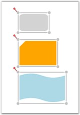
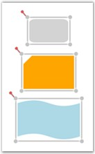
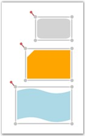
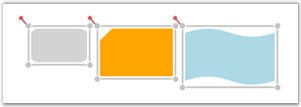
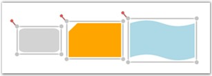
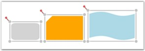

::: {style="DISPLAY: none"}
{#d2h_url_template}{#d2h_package_url style="WIDTH: 0px; DISPLAY: none; HEIGHT: 0px"}
:::

::::: {#nsbanner .d2h_main_nsbanner style="BORDER-BOTTOM: #999999 1px solid; POSITION: relative; PADDING-BOTTOM: 0px; BACKGROUND-COLOR: transparent; PADDING-LEFT: 0px; PADDING-RIGHT: 0px; DISPLAY: none; BORDER-TOP: #999999 1px solid; PADDING-TOP: 0px; LEFT: 0px"}
:::: {#TitleRow .d2h_main_titlerow style="PADDING-BOTTOM: 4px; BACKGROUND-COLOR: transparent; PADDING-LEFT: 22px; WIDTH: 100%; PADDING-RIGHT: 10px; DISPLAY: none; PADDING-TOP: 4px"}
::: {#ienav .d2h_main_ienav style="DISPLAY: none"}
{#D2HPrevious .D2HPreviousEnabled}  {#D2HNext .D2HNextEnabled}
:::
::::
:::::

::::: {#nstext .d2h_main_nstext style="PADDING-BOTTOM: 10px; BACKGROUND-COLOR: transparent; PADDING-LEFT: 22px; PADDING-RIGHT: 10px; HEIGHT: 100%; OVERFLOW: auto; PADDING-TOP: 5px" hasuserbackground="true" valign="bottom"}
::: {#d2h_breadcrumbs .d2h_breadcrumbs}
[Essential Studio User Guide Documentation](ms-xhelp:///?Id=12457748-09e3-4d74-a240-8e049cedf030){.d2h_breadcrumbsNormal}[ \> ]{.d2h_breadcrumbsLinkSeparator}[User Interface Edition](ms-xhelp:///?Id=c29296b7-531c-413b-a0ec-488ca1f7f669){.d2h_breadcrumbsNormal}[ \> ]{.d2h_breadcrumbsLinkSeparator}[Essential WPF](ms-xhelp:///?Id=7f4f82c5-151c-4262-94d0-75c4626c77bc){.d2h_breadcrumbsNormal}[ \> ]{.d2h_breadcrumbsLinkSeparator}[Essential Diagram]{.d2h_breadcrumbsContentsOnly}[ \> ]{.d2h_breadcrumbsLinkSeparator}[Concepts and Features](ms-xhelp:///?Id=8625d466-6e21-495a-b811-4ecee754da81){.d2h_breadcrumbsNormal}[ \> ]{.d2h_breadcrumbsLinkSeparator}[Diagram View](ms-xhelp:///?Id=5fbfa644-6dd8-4969-8866-3f1b867be204){.d2h_breadcrumbsNormal}
:::

### Alignment Commands {#alignment-commands style="tab-stops: 0pt"}

Alignment commands enable you to align selected objects (nodes and connectors) on a page with respect to a reference object. The first object in the selection is considered the reference object.

 

The following alignment commands are used to align objects.

[]{style="FONT-FAMILY: 'Trebuchet MS','sans-serif'; COLOR: #15428b; FONT-SIZE: 9pt"} 

Left Alignment

The **AlignLeft** command aligns all selected objects along the left corner of the reference object.

+------------------------------------------------------------------------------------------------------------------------------------------------------------------------------------------------+
| **[\[C#\]]{style="FONT-FAMILY: 'Courier New'; COLOR: black"}**                                                                                                                                 |
|                                                                                                                                                                                                |
| []{style="FONT-FAMILY: 'Courier New'"}                                                                                                                                                         |
|                                                                                                                                                                                                |
| [DiagramCommandManager]{style="FONT-FAMILY: 'Courier New'; COLOR: #2b91af"}[.AlignLeft.Execute(diagramView.Page, diagramView);]{style="FONT-FAMILY: 'Courier New'"}                            |
+------------------------------------------------------------------------------------------------------------------------------------------------------------------------------------------------+
| **[\[VB\]]{style="FONT-FAMILY: 'Courier New'; COLOR: black"}**                                                                                                                                 |
|                                                                                                                                                                                                |
| **[]{style="FONT-FAMILY: 'Courier New'; COLOR: black"}**                                                                                                                                       |
|                                                                                                                                                                                                |
| [DiagramCommandManager]{style="FONT-FAMILY: 'Courier New'; COLOR: #2b91af"}[.AlignLeft.Execute(diagramView.Page, diagramView)**[]{style="COLOR: black"}**]{style="FONT-FAMILY: 'Courier New'"} |
+------------------------------------------------------------------------------------------------------------------------------------------------------------------------------------------------+

The following screen shot illustrates how the last two nodes are aligned to the left with respect to the first node.

[]{style="FONT-FAMILY: 'Trebuchet MS','sans-serif'; COLOR: #15428b; FONT-SIZE: 9pt"} 

{border="0"}

Figure 154: AlignLeft command applied to Diagram Objects[]{style="FONT-FAMILY: 'Trebuchet MS','sans-serif'; COLOR: #15428b"}

**[]{style="FONT-FAMILY: 'Trebuchet MS','sans-serif'; COLOR: #15428b"}** 

Center Alignment (Horizontal Axis)

The **AlignCenter** command aligns all selected objects to the center. This command center-aligns selected objects with respect to the horizontal axis, i.e., by changing the x-coordinate of the object.

+--------------------------------------------------------------------------------------------------------------------------------------------------------------------------------------------------+
| **[\[C#\]]{style="FONT-FAMILY: 'Courier New'; COLOR: black"}**                                                                                                                                   |
|                                                                                                                                                                                                  |
| []{style="FONT-FAMILY: 'Courier New'"}                                                                                                                                                           |
|                                                                                                                                                                                                  |
| [DiagramCommandManager]{style="FONT-FAMILY: 'Courier New'; COLOR: #2b91af"}[.AlignCenter.Execute(diagramView.Page, diagramView);]{style="FONT-FAMILY: 'Courier New'"}                            |
+--------------------------------------------------------------------------------------------------------------------------------------------------------------------------------------------------+
| **[\[VB\]]{style="FONT-FAMILY: 'Courier New'; COLOR: black"}**                                                                                                                                   |
|                                                                                                                                                                                                  |
| **[]{style="FONT-FAMILY: 'Courier New'; COLOR: black"}**                                                                                                                                         |
|                                                                                                                                                                                                  |
| [DiagramCommandManager]{style="FONT-FAMILY: 'Courier New'; COLOR: #2b91af"}[.AlignCenter.Execute(diagramView.Page, diagramView)**[]{style="COLOR: black"}**]{style="FONT-FAMILY: 'Courier New'"} |
+--------------------------------------------------------------------------------------------------------------------------------------------------------------------------------------------------+

[]{style="FONT-FAMILY: 'Trebuchet MS','sans-serif'; COLOR: #15428b; FONT-SIZE: 9pt"} 

[]{style="FONT-FAMILY: 'Trebuchet MS','sans-serif'; COLOR: #15428b; FONT-SIZE: 9pt"} 

The following screen shot illustrates how the last two nodes are aligned to the center with respect to the horizontal axis of the first node.

[]{style="FONT-FAMILY: 'Trebuchet MS','sans-serif'; COLOR: #15428b; FONT-SIZE: 9pt"} 

{border="0"}

Figure 155: AlignCenter command applied to Diagram Objects[]{style="FONT-FAMILY: 'Trebuchet MS','sans-serif'; COLOR: #15428b"}

[]{style="FONT-FAMILY: 'Trebuchet MS','sans-serif'; COLOR: #15428b; FONT-SIZE: 9pt"} 

Right Alignment

The **AlignRight** command aligns all selected objects along the right corner of the reference object.

+-------------------------------------------------------------------------------------------------------------------------------------------------------------------------------------------------+
| **[\[C#\]]{style="FONT-FAMILY: 'Courier New'; COLOR: black"}**                                                                                                                                  |
|                                                                                                                                                                                                 |
| []{style="FONT-FAMILY: 'Courier New'"}                                                                                                                                                          |
|                                                                                                                                                                                                 |
| [DiagramCommandManager]{style="FONT-FAMILY: 'Courier New'; COLOR: #2b91af"}[.AlignRight.Execute(diagramView.Page, diagramView);]{style="FONT-FAMILY: 'Courier New'"}                            |
+-------------------------------------------------------------------------------------------------------------------------------------------------------------------------------------------------+
| **[\[VB\]]{style="FONT-FAMILY: 'Courier New'; COLOR: black"}**                                                                                                                                  |
|                                                                                                                                                                                                 |
| **[]{style="FONT-FAMILY: 'Courier New'; COLOR: black"}**                                                                                                                                        |
|                                                                                                                                                                                                 |
| [DiagramCommandManager]{style="FONT-FAMILY: 'Courier New'; COLOR: #2b91af"}[.AlignRight.Execute(diagramView.Page, diagramView)**[]{style="COLOR: black"}**]{style="FONT-FAMILY: 'Courier New'"} |
+-------------------------------------------------------------------------------------------------------------------------------------------------------------------------------------------------+

[]{style="FONT-FAMILY: 'Trebuchet MS','sans-serif'; COLOR: #15428b; FONT-SIZE: 9pt"} 

[]{style="FONT-FAMILY: 'Trebuchet MS','sans-serif'; COLOR: #15428b; FONT-SIZE: 9pt"} 

The following screen shot illustrates how the last two nodes are aligned to the right with respect to the first node.

[]{style="FONT-FAMILY: 'Trebuchet MS','sans-serif'; COLOR: #15428b; FONT-SIZE: 9pt"} 

{border="0"}

Figure 156: AlignRight command applied to Diagram Objects[]{style="FONT-FAMILY: 'Trebuchet MS','sans-serif'; COLOR: #15428b"}

**[]{style="FONT-FAMILY: 'Trebuchet MS','sans-serif'; COLOR: #15428b"}** 

Top Alignment

The **AlignTop** command aligns all selected objects along the top surface of the reference object.

+-----------------------------------------------------------------------------------------------------------------------------------------------------------------------------------------------+
| **[\[C#\]]{style="FONT-FAMILY: 'Courier New'; COLOR: black"}**                                                                                                                                |
|                                                                                                                                                                                               |
| []{style="FONT-FAMILY: 'Courier New'"}                                                                                                                                                        |
|                                                                                                                                                                                               |
| [DiagramCommandManager]{style="FONT-FAMILY: 'Courier New'; COLOR: #2b91af"}[.AlignTop.Execute(diagramView.Page, diagramView);]{style="FONT-FAMILY: 'Courier New'"}                            |
+-----------------------------------------------------------------------------------------------------------------------------------------------------------------------------------------------+
| **[\[VB\]]{style="FONT-FAMILY: 'Courier New'; COLOR: black"}**                                                                                                                                |
|                                                                                                                                                                                               |
| **[]{style="FONT-FAMILY: 'Courier New'; COLOR: black"}**                                                                                                                                      |
|                                                                                                                                                                                               |
| [DiagramCommandManager]{style="FONT-FAMILY: 'Courier New'; COLOR: #2b91af"}[.AlignTop.Execute(diagramView.Page, diagramView)**[]{style="COLOR: black"}**]{style="FONT-FAMILY: 'Courier New'"} |
+-----------------------------------------------------------------------------------------------------------------------------------------------------------------------------------------------+

[]{style="FONT-FAMILY: 'Trebuchet MS','sans-serif'; COLOR: #15428b; FONT-SIZE: 9pt"} 

[]{style="FONT-FAMILY: 'Trebuchet MS','sans-serif'; COLOR: #15428b; FONT-SIZE: 9pt"} 

The following screen shot illustrates how the last two nodes are aligned to the top with respect to the first node.

[]{style="FONT-FAMILY: 'Trebuchet MS','sans-serif'; COLOR: #15428b; FONT-SIZE: 9pt"} 

{border="0"}

Figure 157: AlignTop command applied to Diagram Objects

[]{style="FONT-FAMILY: 'Trebuchet MS','sans-serif'; COLOR: #15428b"} 

[]{style="FONT-FAMILY: 'Trebuchet MS','sans-serif'; COLOR: #15428b; FONT-SIZE: 9pt"} 

Center Alignment (Vertical Axis)

The **AlignMiddle** command aligns all selected objects at the center. This command center-aligns selected objects with respect to the vertical axis, i.e., by changing the y-coordinate of the object.

+--------------------------------------------------------------------------------------------------------------------------------------------------------------------------------------------------+
| **[\[C#\]]{style="FONT-FAMILY: 'Courier New'; COLOR: black"}**                                                                                                                                   |
|                                                                                                                                                                                                  |
| []{style="FONT-FAMILY: 'Courier New'"}                                                                                                                                                           |
|                                                                                                                                                                                                  |
| [DiagramCommandManager]{style="FONT-FAMILY: 'Courier New'; COLOR: #2b91af"}[.AlignMiddle.Execute(diagramView.Page, diagramView);]{style="FONT-FAMILY: 'Courier New'"}                            |
+--------------------------------------------------------------------------------------------------------------------------------------------------------------------------------------------------+
| **[\[VB\]]{style="FONT-FAMILY: 'Courier New'; COLOR: black"}**                                                                                                                                   |
|                                                                                                                                                                                                  |
| **[]{style="FONT-FAMILY: 'Courier New'; COLOR: black"}**                                                                                                                                         |
|                                                                                                                                                                                                  |
| [DiagramCommandManager]{style="FONT-FAMILY: 'Courier New'; COLOR: #2b91af"}[.AlignMiddle.Execute(diagramView.Page, diagramView)**[]{style="COLOR: black"}**]{style="FONT-FAMILY: 'Courier New'"} |
+--------------------------------------------------------------------------------------------------------------------------------------------------------------------------------------------------+

[]{style="FONT-FAMILY: 'Trebuchet MS','sans-serif'; COLOR: #15428b; FONT-SIZE: 9pt"} 

 

The following screen shot illustrates how the last two nodes are aligned to the center with respect to the vertical axis of the first node.

[]{style="FONT-FAMILY: 'Trebuchet MS','sans-serif'; COLOR: #15428b; FONT-SIZE: 9pt"} 

{border="0"}

Figure 158: AlignMiddle command applied to Diagram Objects[]{style="FONT-FAMILY: 'Trebuchet MS','sans-serif'; COLOR: #15428b"}

**[]{style="FONT-FAMILY: 'Trebuchet MS','sans-serif'; COLOR: #15428b"}** 

Bottom Alignment

The **AlignBottom** command aligns all selected objects along the bottom surface of the reference object.

+--------------------------------------------------------------------------------------------------------------------------------------------------------------------------------------------------+
| **[\[C#\]]{style="FONT-FAMILY: 'Courier New'; COLOR: black"}**                                                                                                                                   |
|                                                                                                                                                                                                  |
| []{style="FONT-FAMILY: 'Courier New'"}                                                                                                                                                           |
|                                                                                                                                                                                                  |
| [DiagramCommandManager]{style="FONT-FAMILY: 'Courier New'; COLOR: #2b91af"}[.AlignBottom.Execute(diagramView.Page, diagramView);]{style="FONT-FAMILY: 'Courier New'"}                            |
+--------------------------------------------------------------------------------------------------------------------------------------------------------------------------------------------------+
| **[\[VB\]]{style="FONT-FAMILY: 'Courier New'; COLOR: black"}**                                                                                                                                   |
|                                                                                                                                                                                                  |
| **[]{style="FONT-FAMILY: 'Courier New'; COLOR: black"}**                                                                                                                                         |
|                                                                                                                                                                                                  |
| [DiagramCommandManager]{style="FONT-FAMILY: 'Courier New'; COLOR: #2b91af"}[.AlignBottom.Execute(diagramView.Page, diagramView)**[]{style="COLOR: black"}**]{style="FONT-FAMILY: 'Courier New'"} |
+--------------------------------------------------------------------------------------------------------------------------------------------------------------------------------------------------+

[]{style="FONT-FAMILY: 'Trebuchet MS','sans-serif'; COLOR: #15428b; FONT-SIZE: 9pt"} 

[]{style="FONT-FAMILY: 'Trebuchet MS','sans-serif'; COLOR: #15428b; FONT-SIZE: 9pt"} 

The following screen shot illustrates how the last two nodes are aligned to the bottom with respect to the first node.

[]{style="FONT-FAMILY: 'Trebuchet MS','sans-serif'; COLOR: #15428b; FONT-SIZE: 9pt"} 

{border="0"}

Figure 159: AlignBottom command applied to Diagram Objects[]{style="FONT-FAMILY: 'Trebuchet MS','sans-serif'; COLOR: #15428b"}

[]{style="FONT-FAMILY: 'Trebuchet MS','sans-serif'; COLOR: #15428b; FONT-SIZE: 9pt"} 

::: {style="BORDER-BOTTOM: windowtext 1pt solid; BORDER-LEFT: medium none; PADDING-BOTTOM: 1pt; MARGIN-TOP: 9pt; PADDING-LEFT: 0pt; PADDING-RIGHT: 0pt; MARGIN-BOTTOM: 9pt; BORDER-TOP: windowtext 1pt solid; BORDER-RIGHT: medium none; PADDING-TOP: 1pt"}
{border="0"}Note: The connector gets aligned only when the head node and the tail node of the connector is Null.
:::

[]{style="FONT-FAMILY: 'Trebuchet MS','sans-serif'; COLOR: #15428b; FONT-SIZE: 9pt"} 

Alignment commands are useful for ordering the layout of the objects on a page and provides a professional appearance to the diagram.

[]{#p88} 

[]{#related-topics}
:::::
