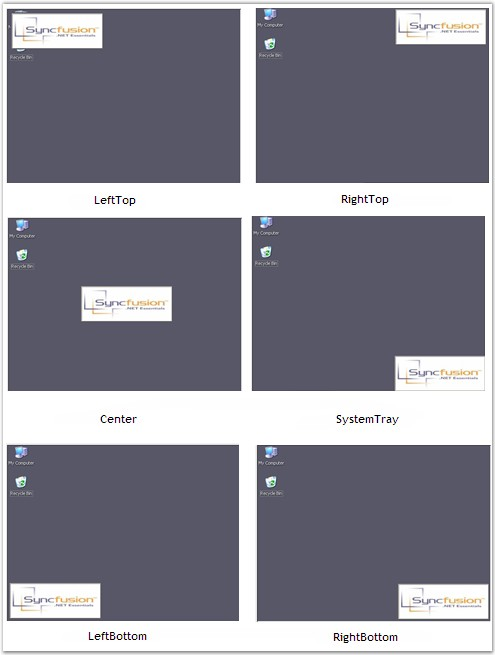

::: {style="DISPLAY: none"}
{#d2h_url_template}{#d2h_package_url style="WIDTH: 0px; DISPLAY: none; HEIGHT: 0px"}
:::

:::: {.d2h_secondary_topic style="PADDING-BOTTOM: 10pt; MARGIN: 0pt; PADDING-LEFT: 0pt; PADDING-RIGHT: 0pt; PADDING-TOP: 0pt"}
##### Alignment Settings {#alignment-settings style="MARGIN-LEFT: 18pt; tab-stops: 18.0pt"}

[]{style="COLOR: #15428b"} 

This section discusses the alignment settings available in SplashControl.

 

SplashControl provides options to customize the alignment of the splash image in the desktop. The property that is related to this feature is given below.

[]{style="COLOR: #4a5c8c; FONT-SIZE: 8pt"} 

::: {align="center"}
+-----------------------------------+-----------------------------------------------------------------------------------------+
| SplashControl Property            | Description                                                                             |
+-----------------------------------+-----------------------------------------------------------------------------------------+
| DesktopAlignment                  | Specifies the desktop alignment of the splash image. It includes the following options. |
|                                   |                                                                                         |
|                                   |                                                                                         |
|                                   |                                                                                         |
|                                   | [·      ]{style="FONT-FAMILY: Symbol"}SystemTray,                                       |
|                                   |                                                                                         |
|                                   | [·      ]{style="FONT-FAMILY: Symbol"}Center,                                           |
|                                   |                                                                                         |
|                                   | [·      ]{style="FONT-FAMILY: Symbol"}LeftTop,                                          |
|                                   |                                                                                         |
|                                   | [·      ]{style="FONT-FAMILY: Symbol"}LeftBottom,                                       |
|                                   |                                                                                         |
|                                   | [·      ]{style="FONT-FAMILY: Symbol"}RightTop,                                         |
|                                   |                                                                                         |
|                                   | [·      ]{style="FONT-FAMILY: Symbol"}RightBottom and                                   |
|                                   |                                                                                         |
|                                   | [·      ]{style="FONT-FAMILY: Symbol"}Custom.                                           |
+-----------------------------------+-----------------------------------------------------------------------------------------+
:::

[]{style="COLOR: #15428b"} 

This can be done through code using the code snippet below.

[]{style="COLOR: #15428b"} 

+-------------------------------------------------------------------------------------------------------------------------------------------------------------------------------------------------------------------+
| **[\[C#\]]{style="FONT-FAMILY: 'Courier New'; COLOR: black"}**                                                                                                                                                    |
|                                                                                                                                                                                                                   |
| []{style="FONT-FAMILY: 'Courier New'; COLOR: black"}                                                                                                                                                              |
|                                                                                                                                                                                                                   |
| [this]{style="FONT-FAMILY: 'Courier New'; COLOR: blue"}[.splashControl1.DesktopAlignment = Syncfusion.Windows.Forms.Tools.[SplashAlignment]{style="COLOR: teal"}.SystemTray;]{style="FONT-FAMILY: 'Courier New'"} |
+-------------------------------------------------------------------------------------------------------------------------------------------------------------------------------------------------------------------+

[]{style="COLOR: #15428b"} 

+-----------------------------------------------------------------------------------------------------------------------------------------------------------------------------------------+
| **[\[VB.NET\]]{style="FONT-FAMILY: 'Courier New'; COLOR: black"}**                                                                                                                      |
|                                                                                                                                                                                         |
| []{style="FONT-FAMILY: 'Courier New'; COLOR: black"}                                                                                                                                    |
|                                                                                                                                                                                         |
| [Me]{style="FONT-FAMILY: 'Courier New'; COLOR: blue"}[.SplashControl1.DesktopAlignment = Syncfusion.Windows.Forms.Tools.SplashAlignment.SystemTray]{style="FONT-FAMILY: 'Courier New'"} |
+-----------------------------------------------------------------------------------------------------------------------------------------------------------------------------------------+

[]{style="COLOR: #15428b"} 

{border="0"}

[]{style="COLOR: #15428b"} 

Figure 987: Desktop Alignment Options

 

 

 

 

[]{#related-topics}
::::
