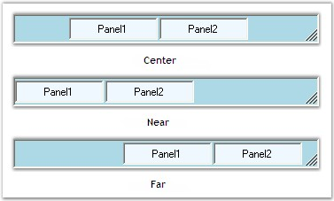
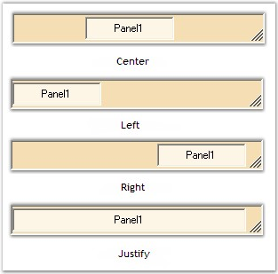

::: {style="DISPLAY: none"}
{#d2h_url_template}{#d2h_package_url style="WIDTH: 0px; DISPLAY: none; HEIGHT: 0px"}
:::

::::::: {.d2h_secondary_topic style="PADDING-BOTTOM: 10pt; MARGIN: 0pt; PADDING-LEFT: 0pt; PADDING-RIGHT: 0pt; PADDING-TOP: 0pt"}
##### Alignment Settings {#alignment-settings style="MARGIN-LEFT: 18pt; tab-stops: 18.0pt"}

 

The panels and child controls that are added to the StatusBarAdv control can be aligned according to the needs of the user using the property given below.

[]{style="COLOR: #15428b"} 

::: {align="center"}
+-----------------------------------+-------------------------------------------------------------------------------+
| StatusBarAdv Property             | Description                                                                   |
+-----------------------------------+-------------------------------------------------------------------------------+
| Alignment                         | Determines the alignment of the panels. The options included are given below. |
|                                   |                                                                               |
|                                   |                                                                               |
|                                   |                                                                               |
|                                   | [·      ]{style="FONT-FAMILY: Symbol"}Center,                                 |
|                                   |                                                                               |
|                                   | [·      ]{style="FONT-FAMILY: Symbol"}Near,                                   |
|                                   |                                                                               |
|                                   | [·      ]{style="FONT-FAMILY: Symbol"}Far and                                 |
|                                   |                                                                               |
|                                   | [·      ]{style="FONT-FAMILY: Symbol"}ChildConstraints.                       |
+-----------------------------------+-------------------------------------------------------------------------------+
:::

[]{style="COLOR: #15428b"} 

+-----------------------------------------------------------------------------------------------------------------------------------------------------------------------------------------------------+
| **[\[C#\]]{style="FONT-FAMILY: 'Courier New'; COLOR: black"}**                                                                                                                                      |
|                                                                                                                                                                                                     |
| []{style="FONT-FAMILY: 'Courier New'; COLOR: black"}                                                                                                                                                |
|                                                                                                                                                                                                     |
| [this]{style="FONT-FAMILY: 'Courier New'; COLOR: blue"}[.statusBarAdv1.Alignment = Syncfusion.Windows.Forms.Tools.[FlowAlignment]{style="COLOR: teal"}.Center;]{style="FONT-FAMILY: 'Courier New'"} |
+-----------------------------------------------------------------------------------------------------------------------------------------------------------------------------------------------------+

[]{style="COLOR: #15428b"} 

+---------------------------------------------------------------------------------------------------------------------------------------------------------------------------+
| **[\[VB.NET\]]{style="FONT-FAMILY: 'Courier New'; COLOR: black"}**                                                                                                        |
|                                                                                                                                                                           |
| []{style="FONT-FAMILY: 'Courier New'; COLOR: black"}                                                                                                                      |
|                                                                                                                                                                           |
| [Me]{style="FONT-FAMILY: 'Courier New'; COLOR: blue"}[.statusBarAdv1.Alignment = Syncfusion.Windows.Forms.Tools.FlowAlignment.Center]{style="FONT-FAMILY: 'Courier New'"} |
+---------------------------------------------------------------------------------------------------------------------------------------------------------------------------+

[]{style="COLOR: #15428b"} 

{border="0"}

[]{style="COLOR: #15428b"} 

Figure 1015: Alignment Options

[]{style="COLOR: #15428b"} 

If the **Alignment** property is set to \'ChildConstraints\', the positioning and resizing of the panels and child controls can be set by calling the **SetHAlign()** method.

[]{style="COLOR: #15428b"} 

::: {align="center"}
  ----------- --------------------------------------------------------
  Method      Description
  SetHAlign   Sets the horizontal alignment options for the control.
  ----------- --------------------------------------------------------
:::

[]{style="COLOR: #15428b"} 

The parameters discussed for the SetHAlign() method are as follows.

[]{style="COLOR: #15428b"} 

::: {align="center"}
+-----------------------------------+-----------------------------------------------------------------------------------------------------------+
| Parameters                        | Description                                                                                               |
+-----------------------------------+-----------------------------------------------------------------------------------------------------------+
| control                           | The control whose HAlign has to be set.                                                                   |
+-----------------------------------+-----------------------------------------------------------------------------------------------------------+
| align                             | Represents the alignment option to be set for the specified control. It includes the options given below. |
|                                   |                                                                                                           |
|                                   |                                                                                                           |
|                                   |                                                                                                           |
|                                   | [·      ]{style="FONT-FAMILY: Symbol"}Center,                                                             |
|                                   |                                                                                                           |
|                                   | [·      ]{style="FONT-FAMILY: Symbol"}Left,                                                               |
|                                   |                                                                                                           |
|                                   | [·      ]{style="FONT-FAMILY: Symbol"}Right and                                                           |
|                                   |                                                                                                           |
|                                   | [·      ]{style="FONT-FAMILY: Symbol"}Justify.                                                            |
|                                   |                                                                                                           |
|                                   |                                                                                                           |
|                                   |                                                                                                           |
|                                   | The \'Justify\' option will expand the panel to occupy any extra spaces in the control.                   |
+-----------------------------------+-----------------------------------------------------------------------------------------------------------+
:::

[]{style="COLOR: #ff6600; FONT-SIZE: 8pt"} 

+-----------------------------------------------------------------------------------------------------------------------------------------------------------------------------------------------------------------------------------------------------+
| **[\[C#\]]{style="FONT-FAMILY: 'Courier New'; COLOR: black"}**                                                                                                                                                                                      |
|                                                                                                                                                                                                                                                     |
| []{style="FONT-FAMILY: 'Courier New'; COLOR: black"}                                                                                                                                                                                                |
|                                                                                                                                                                                                                                                     |
| [this]{style="FONT-FAMILY: 'Courier New'; COLOR: blue"}[.statusBarAdv1.Alignment = Syncfusion.Windows.Forms.Tools.[FlowAlignment]{style="COLOR: teal"}.ChildConstraints;]{style="FONT-FAMILY: 'Courier New'"}                                       |
|                                                                                                                                                                                                                                                     |
| []{style="FONT-FAMILY: 'Courier New'"}                                                                                                                                                                                                              |
|                                                                                                                                                                                                                                                     |
| [// Sets the horizontal alignment using the SetHAlign() method.]{style="FONT-FAMILY: 'Courier New'; COLOR: green"}                                                                                                                                  |
|                                                                                                                                                                                                                                                     |
| [this]{style="FONT-FAMILY: 'Courier New'; COLOR: blue"}[.statusBarAdv1.SetHAlign([this]{style="COLOR: blue"}.statusBarAdvPanel1, Syncfusion.Windows.Forms.Tools.[HorzFlowAlign]{style="COLOR: teal"}.Justify);]{style="FONT-FAMILY: 'Courier New'"} |
+-----------------------------------------------------------------------------------------------------------------------------------------------------------------------------------------------------------------------------------------------------+

[]{style="COLOR: #15428b"} 

+-------------------------------------------------------------------------------------------------------------------------------------------------------------------------------------------------------------------------+
| **[\[VB.NET\]]{style="FONT-FAMILY: 'Courier New'; COLOR: black"}**                                                                                                                                                      |
|                                                                                                                                                                                                                         |
| []{style="FONT-FAMILY: 'Courier New'; COLOR: black"}                                                                                                                                                                    |
|                                                                                                                                                                                                                         |
| [Me]{style="FONT-FAMILY: 'Courier New'; COLOR: blue"}[.statusBarAdv1.Alignment = Syncfusion.Windows.Forms.Tools.FlowAlignment.ChildConstraints]{style="FONT-FAMILY: 'Courier New'"}                                     |
|                                                                                                                                                                                                                         |
| []{style="FONT-FAMILY: 'Courier New'; COLOR: green"}                                                                                                                                                                    |
|                                                                                                                                                                                                                         |
| [\' Sets the horizontal alignment using the SetHAlign() method.]{style="FONT-FAMILY: 'Courier New'; COLOR: green"}                                                                                                      |
|                                                                                                                                                                                                                         |
| [Me]{style="FONT-FAMILY: 'Courier New'; COLOR: blue"}[.statusBarAdv1.SetHAlign([Me]{style="COLOR: blue"}.statusBarAdvPanel1, Syncfusion.Windows.Forms.Tools.HorzFlowAlign.Justify)]{style="FONT-FAMILY: 'Courier New'"} |
+-------------------------------------------------------------------------------------------------------------------------------------------------------------------------------------------------------------------------+

[]{style="COLOR: #15428b"} 

{border="0"}

[]{style="COLOR: #15428b"} 

Figure 1016: SetHAlign Options

[]{style="COLOR: #15428b"} 

::: {style="BORDER-BOTTOM: windowtext 1pt solid; BORDER-LEFT: medium none; PADDING-BOTTOM: 1pt; MARGIN: 9pt 0pt 9pt 18pt; PADDING-LEFT: 0pt; PADDING-RIGHT: 0pt; BORDER-TOP: windowtext 1pt solid; BORDER-RIGHT: medium none; PADDING-TOP: 1pt"}
{border="0"} Note: The panels can be aligned using the HAlign property of the StatusBarAdvPanel control. See [Alignment Settings]{style="COLOR: black"} topic under StatusBarAdvPanel.
:::

 

 

 

 

[]{#related-topics}
:::::::
