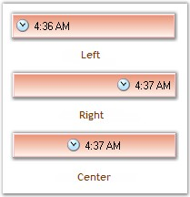
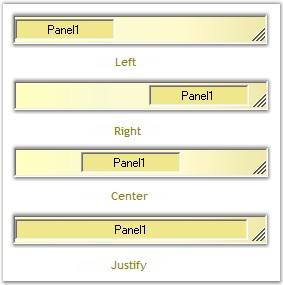

::: {style="DISPLAY: none"}
{#d2h_url_template}{#d2h_package_url style="WIDTH: 0px; DISPLAY: none; HEIGHT: 0px"}
:::

::::: {.d2h_secondary_topic style="PADDING-BOTTOM: 10pt; MARGIN: 0pt; PADDING-LEFT: 0pt; PADDING-RIGHT: 0pt; PADDING-TOP: 0pt"}
##### Alignment Settings {#alignment-settings style="MARGIN-LEFT: 18pt; tab-stops: 18.0pt"}

[]{style="COLOR: #15428b"} 

This section discusses the alignment settings of the StatusBarAdvPanel control.

 

The contents of the StatusBarAdvPanel can be aligned using the property given below.

[]{style="COLOR: #15428b"} 

::: {align="center"}
+-----------------------------------+------------------------------------------------------------------------------------------------------+
| StatusBarAdvPanel Property        | Description                                                                                          |
+-----------------------------------+------------------------------------------------------------------------------------------------------+
| Alignment                         | Indicates the alignment type of the text and icon of the panel. The options included are as follows. |
|                                   |                                                                                                      |
|                                   |                                                                                                      |
|                                   |                                                                                                      |
|                                   | [·      ]{style="FONT-FAMILY: Symbol"}Left,                                                          |
|                                   |                                                                                                      |
|                                   | [·      ]{style="FONT-FAMILY: Symbol"}Right and                                                      |
|                                   |                                                                                                      |
|                                   | [·      ]{style="FONT-FAMILY: Symbol"}Center.                                                        |
+-----------------------------------+------------------------------------------------------------------------------------------------------+
:::

[]{style="COLOR: #15428b"} 

+----------------------------------------------------------------------------------------------------------------------------------------------------------------------------------------------------+
| **[\[C#\]]{style="FONT-FAMILY: 'Courier New'; COLOR: black"}**                                                                                                                                     |
|                                                                                                                                                                                                    |
| []{style="FONT-FAMILY: 'Courier New'; COLOR: black"}                                                                                                                                               |
|                                                                                                                                                                                                    |
| [this]{style="FONT-FAMILY: 'Courier New'; COLOR: blue"}[.statusBarAdvPanel1.Alignment = System.Windows.Forms.[HorizontalAlignment]{style="COLOR: teal"}.Left;]{style="FONT-FAMILY: 'Courier New'"} |
+----------------------------------------------------------------------------------------------------------------------------------------------------------------------------------------------------+

[]{style="COLOR: #15428b"} 

+--------------------------------------------------------------------------------------------------------------------------------------------------------------------------+
| **[\[VB.NET\]]{style="FONT-FAMILY: 'Courier New'; COLOR: black"}**                                                                                                       |
|                                                                                                                                                                          |
| []{style="FONT-FAMILY: 'Courier New'; COLOR: black"}                                                                                                                     |
|                                                                                                                                                                          |
| [Me]{style="FONT-FAMILY: 'Courier New'; COLOR: blue"}[.statusBarAdvPanel1.Alignment = System.Windows.Forms.HorizontalAlignment.Left]{style="FONT-FAMILY: 'Courier New'"} |
+--------------------------------------------------------------------------------------------------------------------------------------------------------------------------+

[]{style="COLOR: #15428b"} 

{border="0"}

[]{style="COLOR: #15428b"} 

Figure 1026: Alignment Options

[]{style="COLOR: #15428b"} 

HAlign

[]{style="COLOR: #15428b"} 

The horizontal alignment of the StatusBarAdvPanels in the StatusBarAdv control can be customized using the property given below.

[]{style="COLOR: #15428b"} 

::: {align="center"}
+-----------------------------------+--------------------------------------------------------------------------------------------+
| StatusBarAdvPanel Property        | Description                                                                                |
+-----------------------------------+--------------------------------------------------------------------------------------------+
| HAlign                            | Indicates the horizontal alignment in the FlowLayout. It includes the options given below. |
|                                   |                                                                                            |
|                                   |                                                                                            |
|                                   |                                                                                            |
|                                   | [·      ]{style="FONT-FAMILY: Symbol"}Left,                                                |
|                                   |                                                                                            |
|                                   | [·      ]{style="FONT-FAMILY: Symbol"}Right,                                               |
|                                   |                                                                                            |
|                                   | [·      ]{style="FONT-FAMILY: Symbol"}Center and                                           |
|                                   |                                                                                            |
|                                   | [·      ]{style="FONT-FAMILY: Symbol"}Justify.                                             |
|                                   |                                                                                            |
|                                   |                                                                                            |
|                                   |                                                                                            |
|                                   | The \'Justify\' option will expand the panel to occupy any extra spaces in the control.    |
+-----------------------------------+--------------------------------------------------------------------------------------------+
:::

[]{style="COLOR: #15428b"} 

+-----------------------------------------------------------------------------------------------------------------------------------------------------------------------------------------------------+
| **[\[C#\]]{style="FONT-FAMILY: 'Courier New'; COLOR: black"}**                                                                                                                                      |
|                                                                                                                                                                                                     |
| []{style="FONT-FAMILY: 'Courier New'; COLOR: black"}                                                                                                                                                |
|                                                                                                                                                                                                     |
| [this]{style="FONT-FAMILY: 'Courier New'; COLOR: blue"}[.statusBarAdvPanel1.HAlign = Syncfusion.Windows.Forms.Tools.[HorzFlowAlign]{style="COLOR: teal"}.Left;]{style="FONT-FAMILY: 'Courier New'"} |
+-----------------------------------------------------------------------------------------------------------------------------------------------------------------------------------------------------+

[]{style="COLOR: #15428b"} 

+----------------------------------------------------------------------------------------------------------------------------------------------------------------------------+
| **[\[VB.NET\]]{style="FONT-FAMILY: 'Courier New'; COLOR: black"}**                                                                                                         |
|                                                                                                                                                                            |
| []{style="FONT-FAMILY: 'Courier New'; COLOR: black"}                                                                                                                       |
|                                                                                                                                                                            |
| [Me]{style="FONT-FAMILY: 'Courier New'; COLOR: blue"}[.statusBarAdvPanel1.HAlign = Syncfusion.Windows.Forms.Tools.HorzFlowAlign.Left;]{style="FONT-FAMILY: 'Courier New'"} |
+----------------------------------------------------------------------------------------------------------------------------------------------------------------------------+

[]{style="COLOR: #15428b"} 

{border="0"}

[]{style="COLOR: #15428b"} 

Figure 1027: HAlign Options

 

 

 

 

[]{#related-topics}
:::::
