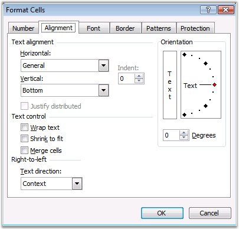
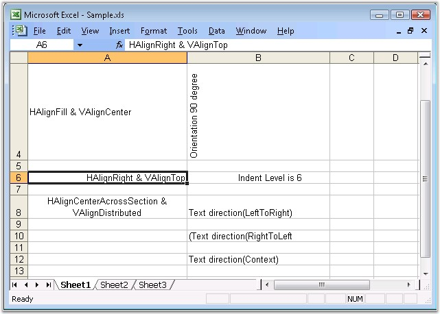

::: {style="DISPLAY: none"}
{#d2h_url_template}{#d2h_package_url style="WIDTH: 0px; DISPLAY: none; HEIGHT: 0px"}
:::

::: {.d2h_secondary_topic style="PADDING-BOTTOM: 10pt; MARGIN: 0pt; PADDING-LEFT: 0pt; PADDING-RIGHT: 0pt; PADDING-TOP: 0pt"}
#### Alignment Settings {#alignment-settings style="tab-stops: 0pt"}

 

The following are some of the alignment settings available in Excel.

 

**Text Alignment**

 

Text has to be aligned inside the cells to properly fit in any data. This is done in Excel by using the Horizontal and Vertical alignment settings either through the **Formatting** toolbar or through the options provided by the **Alignment** tab in the **Format Cells** dialog box. In addition to the Left, Center, and Right alignments, Horizontal alignment option goes further and allows text to be justified. This can be especially useful, if the text is significantly long. Vertical alignment option allows you to align the contents of a cell towards the Top, Middle or Bottom area of a cell.

 

{border="0"}

Figure 36: Alignment Settings in MS Excel[]{style="FONT-FAMILY: 'Trebuchet MS','sans-serif'; COLOR: #15428b"}

[]{style="FONT-FAMILY: 'Trebuchet MS','sans-serif'; COLOR: #15428b; FONT-SIZE: 9pt"} 

[]{style="FONT-FAMILY: 'Trebuchet MS','sans-serif'; COLOR: #15428b; FONT-SIZE: 9pt"} 

Indentation

[]{style="FONT-FAMILY: 'Trebuchet MS','sans-serif'; COLOR: #15428b; FONT-SIZE: 9pt"} 

In some circumstances, you may neither want to center the text nor keep it left or right aligned. In such cases, indentation can be done. Indentation consists of \"pushing\" the text to the left or right, without aligning it to center. To indent a text, you need to specify the number of units in the **Indent** box.

[]{style="FONT-FAMILY: 'Trebuchet MS','sans-serif'; COLOR: #15428b; FONT-SIZE: 9pt"} 

Alignment Settings in XlsIO

[]{style="FONT-FAMILY: 'Trebuchet MS','sans-serif'; COLOR: #15428b; FONT-SIZE: 9pt"} 

XlsIO supports alignment properties similar to Excel. The following code example illustrates the alignment settings that can be applied to the cells by using XlsIO.

[]{style="FONT-FAMILY: 'Trebuchet MS','sans-serif'; COLOR: #15428b; FONT-SIZE: 9pt"} 

+------------------------------------------------------------------------------------------------------------------------------------------------------------------------------------------+
| **[\[C#\]]{style="FONT-FAMILY: 'Courier New'"}**                                                                                                                                         |
|                                                                                                                                                                                          |
| **[]{style="FONT-FAMILY: 'Courier New'"}**                                                                                                                                               |
|                                                                                                                                                                                          |
| [// Text Alignment Setting (Horizontal Alignment).]{style="FONT-FAMILY: 'Courier New'; COLOR: green"}                                                                                    |
|                                                                                                                                                                                          |
| [sheet.Range\[[\"A2\"]{style="COLOR: #a31515"}\].CellStyle.HorizontalAlignment = [ExcelHAlign]{style="COLOR: #2b91af"}.HAlignCenter;]{style="FONT-FAMILY: 'Courier New'"}                |
|                                                                                                                                                                                          |
| [sheet.Range\[[\"A4\"]{style="COLOR: #a31515"}\].CellStyle.HorizontalAlignment = [ExcelHAlign]{style="COLOR: #2b91af"}.HAlignFill;]{style="FONT-FAMILY: 'Courier New'"}                  |
|                                                                                                                                                                                          |
| [sheet.Range\[[\"A6\"]{style="COLOR: #a31515"}\].CellStyle.HorizontalAlignment = [ExcelHAlign]{style="COLOR: #2b91af"}.HAlignRight;]{style="FONT-FAMILY: 'Courier New'"}                 |
|                                                                                                                                                                                          |
| [sheet.Range\[[\"A8\"]{style="COLOR: #a31515"}\].CellStyle.HorizontalAlignment = [ExcelHAlign]{style="COLOR: #2b91af"}.HAlignCenterAcrossSelection;]{style="FONT-FAMILY: 'Courier New'"} |
|                                                                                                                                                                                          |
| []{style="FONT-FAMILY: 'Courier New'"}                                                                                                                                                   |
|                                                                                                                                                                                          |
| [// Text Alignment Setting (Vertical Alignment).]{style="FONT-FAMILY: 'Courier New'; COLOR: green"}                                                                                      |
|                                                                                                                                                                                          |
| [sheet.Range\[[\"A2\"]{style="COLOR: #a31515"}\].CellStyle.VerticalAlignment = [ExcelVAlign]{style="COLOR: #2b91af"}.VAlignBottom;]{style="FONT-FAMILY: 'Courier New'"}                  |
|                                                                                                                                                                                          |
| [sheet.Range\[[\"A4\"]{style="COLOR: #a31515"}\].CellStyle.VerticalAlignment = [ExcelVAlign]{style="COLOR: #2b91af"}.VAlignCenter;]{style="FONT-FAMILY: 'Courier New'"}                  |
|                                                                                                                                                                                          |
| [sheet.Range\[[\"A6\"]{style="COLOR: #a31515"}\].CellStyle.VerticalAlignment = [ExcelVAlign]{style="COLOR: #2b91af"}.VAlignTop;]{style="FONT-FAMILY: 'Courier New'"}                     |
|                                                                                                                                                                                          |
| [sheet.Range\[[\"A8\"]{style="COLOR: #a31515"}\].CellStyle.VerticalAlignment = [ExcelVAlign]{style="COLOR: #2b91af"}.VAlignDistributed;]{style="FONT-FAMILY: 'Courier New'"}             |
|                                                                                                                                                                                          |
| []{style="FONT-FAMILY: 'Courier New'"}                                                                                                                                                   |
|                                                                                                                                                                                          |
| [// Text Indent Setting.]{style="FONT-FAMILY: 'Courier New'; COLOR: green"}                                                                                                              |
|                                                                                                                                                                                          |
| [sheet.Range\[[\"B6\"]{style="COLOR: #a31515"}\].CellStyle.IndentLevel = 6;]{style="FONT-FAMILY: 'Courier New'"}                                                                         |
+------------------------------------------------------------------------------------------------------------------------------------------------------------------------------------------+

[]{style="FONT-FAMILY: 'Trebuchet MS','sans-serif'; COLOR: #15428b; FONT-SIZE: 9pt"} 

+------------------------------------------------------------------------------------------------------------------------------------------------------------+
| **[\[VB.NET\]]{style="FONT-FAMILY: 'Courier New'"}**                                                                                                       |
|                                                                                                                                                            |
| **[]{style="FONT-FAMILY: 'Courier New'"}**                                                                                                                 |
|                                                                                                                                                            |
| [\' Text Alignment Setting (Horizontal Alignment).]{style="FONT-FAMILY: 'Courier New'; COLOR: green"}                                                      |
|                                                                                                                                                            |
| [sheet.Range([\"A2\"]{style="COLOR: maroon"}).CellStyle.HorizontalAlignment = ExcelHAlign.HAlignCenter]{style="FONT-FAMILY: 'Courier New'"}                |
|                                                                                                                                                            |
| [sheet.Range([\"A4\"]{style="COLOR: maroon"}).CellStyle.HorizontalAlignment = ExcelHAlign.HAlignFill]{style="FONT-FAMILY: 'Courier New'"}                  |
|                                                                                                                                                            |
| [sheet.Range([\"A6\"]{style="COLOR: maroon"}).CellStyle.HorizontalAlignment = ExcelHAlign.HAlignRight]{style="FONT-FAMILY: 'Courier New'"}                 |
|                                                                                                                                                            |
| [sheet.Range([\"A8\"]{style="COLOR: maroon"}).CellStyle.HorizontalAlignment = ExcelHAlign.HAlignCenterAcrossSelection]{style="FONT-FAMILY: 'Courier New'"} |
|                                                                                                                                                            |
| []{style="FONT-FAMILY: 'Courier New'"}                                                                                                                     |
|                                                                                                                                                            |
| [\' Text Alignment Setting (Vertical Alignment.]{style="FONT-FAMILY: 'Courier New'; COLOR: green"}                                                         |
|                                                                                                                                                            |
| [sheet.Range([\"A2\"]{style="COLOR: maroon"}).CellStyle.VerticalAlignment = ExcelVAlign.VAlignBottom]{style="FONT-FAMILY: 'Courier New'"}                  |
|                                                                                                                                                            |
| [sheet.Range([\"A4\"]{style="COLOR: maroon"}).CellStyle.VerticalAlignment = ExcelVAlign.VAlignCenter]{style="FONT-FAMILY: 'Courier New'"}                  |
|                                                                                                                                                            |
| [sheet.Range([\"A6\"]{style="COLOR: maroon"}).CellStyle.VerticalAlignment = ExcelVAlign.VAlignTop]{style="FONT-FAMILY: 'Courier New'"}                     |
|                                                                                                                                                            |
| [sheet.Range([\"A8\"]{style="COLOR: maroon"}).CellStyle.VerticalAlignment = ExcelVAlign.VAlignDistributed]{style="FONT-FAMILY: 'Courier New'"}             |
|                                                                                                                                                            |
| []{style="FONT-FAMILY: 'Courier New'"}                                                                                                                     |
|                                                                                                                                                            |
| [\' Text Indent Setting.]{style="FONT-FAMILY: 'Courier New'; COLOR: green"}                                                                                |
|                                                                                                                                                            |
| [sheet.Range([\"B6\"]{style="COLOR: maroon"}).CellStyle.IndentLevel = 6]{style="FONT-FAMILY: 'Courier New'"}                                               |
+------------------------------------------------------------------------------------------------------------------------------------------------------------+

[]{style="FONT-FAMILY: 'Trebuchet MS','sans-serif'; COLOR: #15428b; FONT-SIZE: 9pt"} 

Text Control

[]{style="FONT-FAMILY: 'Trebuchet MS','sans-serif'; COLOR: #15428b; FONT-SIZE: 9pt"} 

The Text Control section provides three options: Wrap Text, Shrink To Fit, and Merge Cells.

 

At times, the text you enter in a cell will be wider than the cell. In such situations, the text may be hidden beyond the edge of the cell. Although one solution to this problem is to resize the cell, there are two additional solutions. They are, to Shrink the text to fit the cell, or Wrap the text so that it is displayed in multiple lines within the cell.

 

Yet another solution could be to merge multiple cells, so that the text can be fully displayed.

 

XlsIO allows to set these text control options by using the following APIs.

 

+--------------------------------------------------------------------------------------------------------------------------------+
| **[\[C#\]]{style="FONT-FAMILY: 'Courier New'"}**                                                                               |
|                                                                                                                                |
| []{style="FONT-FAMILY: 'Courier New'"}                                                                                         |
|                                                                                                                                |
| [// Merging of Cells.]{style="FONT-FAMILY: 'Courier New'; COLOR: green"}                                                       |
|                                                                                                                                |
| [sheet.Range\[[\"A16:C16\"]{style="COLOR: #a31515"}\].Merge();]{style="FONT-FAMILY: 'Courier New'"}                            |
|                                                                                                                                |
| []{style="FONT-FAMILY: 'Courier New'"}                                                                                         |
|                                                                                                                                |
| [// Wrapping Text.]{style="FONT-FAMILY: 'Courier New'; COLOR: green"}                                                          |
|                                                                                                                                |
| [sheet.Range\[[\"A14\"]{style="COLOR: #a31515"}\].WrapText = [true]{style="COLOR: blue"};]{style="FONT-FAMILY: 'Courier New'"} |
+--------------------------------------------------------------------------------------------------------------------------------+

[]{style="FONT-FAMILY: 'Trebuchet MS','sans-serif'; COLOR: #15428b; FONT-SIZE: 9pt"} 

+----------------------------------------------------------------------------------------------------------------------------+
| **[\[VB.NET\]]{style="FONT-FAMILY: 'Courier New'"}**                                                                       |
|                                                                                                                            |
| **[]{style="FONT-FAMILY: 'Courier New'"}**                                                                                 |
|                                                                                                                            |
| [\' Merging of Cells.]{style="FONT-FAMILY: 'Courier New'; COLOR: green"}                                                   |
|                                                                                                                            |
| [sheet.Range([\"A16:C16\"]{style="COLOR: maroon"}).Merge()]{style="FONT-FAMILY: 'Courier New'"}                            |
|                                                                                                                            |
| []{style="FONT-FAMILY: 'Courier New'"}                                                                                     |
|                                                                                                                            |
| [\' Wrapping Text.]{style="FONT-FAMILY: 'Courier New'; COLOR: green"}                                                      |
|                                                                                                                            |
| [sheet.Range([\"A14\"]{style="COLOR: maroon"}).WrapText = [True]{style="COLOR: blue"}]{style="FONT-FAMILY: 'Courier New'"} |
+----------------------------------------------------------------------------------------------------------------------------+

[]{style="FONT-FAMILY: 'Trebuchet MS','sans-serif'; COLOR: #15428b; FONT-SIZE: 9pt"} 

Orientation

 

The Orientation section enables you to bend the text to a fixed angle. There are two ways to set an angle. By dragging the small red diamond, one can specify the desired angle. You can also click one of the arrows of the **Degrees** spin button.

 

+--------------------------------------------------------------------------------------+
| **[\[C#\]]{style="FONT-FAMILY: 'Courier New'"}**                                     |
|                                                                                      |
| []{style="FONT-FAMILY: 'Courier New'"}                                               |
|                                                                                      |
| [// Text Orientation Settings.]{style="FONT-FAMILY: 'Courier New'; COLOR: green"}    |
|                                                                                      |
| [sheet.Range\[\"B2\"\].CellStyle.Rotation = 60;]{style="FONT-FAMILY: 'Courier New'"} |
|                                                                                      |
| [sheet.Range\[\"B4\"\].CellStyle.Rotation = 90;]{style="FONT-FAMILY: 'Courier New'"} |
+--------------------------------------------------------------------------------------+

[]{style="FONT-FAMILY: 'Trebuchet MS','sans-serif'; COLOR: #15428b; FONT-SIZE: 9pt"} 

+--------------------------------------------------------------------------------------------------+
| **[\[VB.NET\]]{style="FONT-FAMILY: 'Courier New'"}**                                             |
|                                                                                                  |
| []{style="FONT-FAMILY: 'Courier New'"}                                                           |
|                                                                                                  |
| [\' Text Orientation Settings.]{style="FONT-FAMILY: 'Courier New'; COLOR: green"}                |
|                                                                                                  |
| [sheet.Range(\"B2\").CellStyle.Rotation = 60;]{style="FONT-FAMILY: 'Courier New'; COLOR: black"} |
|                                                                                                  |
| [sheet.Range(\"B4\").CellStyle.Rotation = 90]{style="FONT-FAMILY: 'Courier New'; COLOR: black"}  |
+--------------------------------------------------------------------------------------------------+

**[]{style="FONT-FAMILY: 'Trebuchet MS','sans-serif'; COLOR: #15428b"}** 

Text Direction

**[]{style="FONT-FAMILY: 'Trebuchet MS','sans-serif'; COLOR: #15428b; FONT-SIZE: 9pt"}** 

You can specify the text orientation by using the **ReadingOrder** property. The following code example illustrates this.

 

+-----------------------------------------------------------------------------------------------------------------------------------------+
| **[\[C#\]]{style="FONT-FAMILY: 'Courier New'"}**                                                                                        |
|                                                                                                                                         |
| **[]{style="FONT-FAMILY: 'Courier New'"}**                                                                                              |
|                                                                                                                                         |
| [// Text Direction Setting.]{style="FONT-FAMILY: 'Courier New'; COLOR: green"}                                                          |
|                                                                                                                                         |
| [sheet.Range(\"B8\").CellStyle.ReadingOrder = Syncfusion.XlsIO.ExcelReadingOrderType.LeftToRight;]{style="FONT-FAMILY: 'Courier New'"}  |
|                                                                                                                                         |
| [sheet.Range(\"B10\").CellStyle.ReadingOrder = Syncfusion.XlsIO.ExcelReadingOrderType.RightToLeft;]{style="FONT-FAMILY: 'Courier New'"} |
|                                                                                                                                         |
| [sheet.Range(\"B12\").CellStyle.ReadingOrder = Syncfusion.XlsIO.ExcelReadingOrderType.Context;]{style="FONT-FAMILY: 'Courier New'"}     |
+-----------------------------------------------------------------------------------------------------------------------------------------+

[]{style="FONT-FAMILY: 'Trebuchet MS','sans-serif'; COLOR: #15428b; FONT-SIZE: 9pt"} 

+------------------------------------------------------------------------------------------------------------------------------------------------------+
| **[\[VB.NET\]]{style="FONT-FAMILY: 'Courier New'"}**                                                                                                 |
|                                                                                                                                                      |
| **[]{style="FONT-FAMILY: 'Courier New'"}**                                                                                                           |
|                                                                                                                                                      |
| [\' Text Direction Setting.]{style="FONT-FAMILY: 'Courier New'; COLOR: green"}                                                                       |
|                                                                                                                                                      |
| [sheet.Range(\"B8\").CellStyle.ReadingOrder = Syncfusion.XlsIO.ExcelReadingOrderType.LeftToRight]{style="FONT-FAMILY: 'Courier New'; COLOR: black"}  |
|                                                                                                                                                      |
| [sheet.Range(\"B10\").CellStyle.ReadingOrder = Syncfusion.XlsIO.ExcelReadingOrderType.RightToLeft]{style="FONT-FAMILY: 'Courier New'; COLOR: black"} |
|                                                                                                                                                      |
| [sheet.Range(\"B12\").CellStyle.ReadingOrder = Syncfusion.XlsIO.ExcelReadingOrderType.Context]{style="FONT-FAMILY: 'Courier New'; COLOR: black"}     |
+------------------------------------------------------------------------------------------------------------------------------------------------------+

**[]{style="FONT-FAMILY: 'Trebuchet MS','sans-serif'; COLOR: #15428b; FONT-SIZE: 9pt"}** 

{border="0"}

Figure 37: XlsIO with Alignment Settings**[]{style="FONT-FAMILY: 'Trebuchet MS','sans-serif'; COLOR: #15428b"}**

[]{#p40}**[]{style="FONT-FAMILY: 'Segoe UI','sans-serif'; COLOR: black"}** 

[]{#related-topics}
:::
