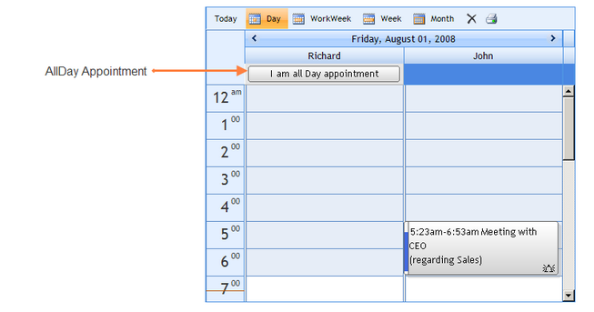
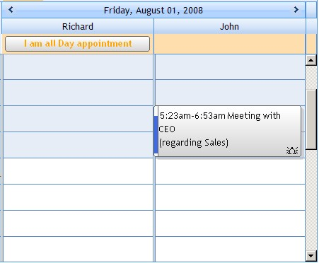

::: {style="DISPLAY: none"}
{#d2h_url_template}{#d2h_package_url style="WIDTH: 0px; DISPLAY: none; HEIGHT: 0px"}
:::

::::: {#nsbanner .d2h_main_nsbanner style="BORDER-BOTTOM: #999999 1px solid; POSITION: relative; PADDING-BOTTOM: 0px; BACKGROUND-COLOR: transparent; PADDING-LEFT: 0px; PADDING-RIGHT: 0px; DISPLAY: none; BORDER-TOP: #999999 1px solid; PADDING-TOP: 0px; LEFT: 0px"}
:::: {#TitleRow .d2h_main_titlerow style="PADDING-BOTTOM: 4px; BACKGROUND-COLOR: transparent; PADDING-LEFT: 22px; WIDTH: 100%; PADDING-RIGHT: 10px; DISPLAY: none; PADDING-TOP: 4px"}
::: {#ienav .d2h_main_ienav style="DISPLAY: none"}
{#D2HPrevious .D2HPreviousEnabled}  {#D2HNext .D2HNextEnabled}
:::
::::
:::::

:::::: {#nstext .d2h_main_nstext style="PADDING-BOTTOM: 10px; BACKGROUND-COLOR: transparent; PADDING-LEFT: 22px; PADDING-RIGHT: 10px; HEIGHT: 100%; OVERFLOW: auto; PADDING-TOP: 5px" hasuserbackground="true" valign="bottom"}
::: {#d2h_breadcrumbs .d2h_breadcrumbs}
[Essential Studio User Guide Documentation](ms-xhelp:///?Id=12457748-09e3-4d74-a240-8e049cedf030){.d2h_breadcrumbsNormal}[ \> ]{.d2h_breadcrumbsLinkSeparator}[User Interface Edition](ms-xhelp:///?Id=c29296b7-531c-413b-a0ec-488ca1f7f669){.d2h_breadcrumbsNormal}[ \> ]{.d2h_breadcrumbsLinkSeparator}[Essential ASP.NET](ms-xhelp:///?Id=25c35330-c127-4dad-9a92-ed79dc7261a6){.d2h_breadcrumbsNormal}[ \> ]{.d2h_breadcrumbsLinkSeparator}[Essential Schedule]{.d2h_breadcrumbsContentsOnly}[ \> ]{.d2h_breadcrumbsLinkSeparator}[Concepts and Features](ms-xhelp:///?Id=64869483-f57f-4838-b322-b1a3d1ce8e40){.d2h_breadcrumbsNormal}[ \> ]{.d2h_breadcrumbsLinkSeparator}[Appointments](ms-xhelp:///?Id=8545e8cf-5b26-43a2-932f-f0087c9a1e0a){.d2h_breadcrumbsNormal}
:::

### AllDay Appointment {#allday-appointment style="tab-stops: 0pt"}

[]{style="FONT-FAMILY: 'Trebuchet MS','sans-serif'; COLOR: #15428b; FONT-SIZE: 9pt"} 

Appointments which extend for an entire day are termed as \"AllDay Appointments\".

[]{style="FONT-FAMILY: 'Trebuchet MS','sans-serif'; COLOR: #15428b; FONT-SIZE: 9pt"} 

{border="0"}[]{style="FONT-SIZE: 12pt"}

Figure 52[]{style="FONT-SIZE: 12pt"}

[]{style="FONT-FAMILY: 'Trebuchet MS','sans-serif'; COLOR: #15428b; FONT-SIZE: 9pt"} 

To set an appointment as an AllDay appointment, the **AllDay** property (in the ScheduleWebAppointment Collection Editor) for that appointment must be set to **True**.

[]{style="FONT-FAMILY: 'Trebuchet MS','sans-serif'; COLOR: #15428b; FONT-SIZE: 9pt"} 

::: {align="center"}
+-----------------------------------+--------------------------------------------------------------------+
|                                   |                                                                    |
|                                   |                                                                    |
| Appointment Property              | Description                                                        |
+-----------------------------------+--------------------------------------------------------------------+
| AllDay                            | Specifies whether to mark an appointment as an allday appointment. |
+-----------------------------------+--------------------------------------------------------------------+
:::

[]{style="FONT-FAMILY: 'Trebuchet MS','sans-serif'; COLOR: #15428b; FONT-SIZE: 9pt"} 

+--------------------------------------------------------------------------------------------------------------------------------------------------------------------------------------------------------------------------------------------------------------------------------------------------------------------------------------------------------------------------------------------------------------------------------------------------------------------------+
| **[\[ASPX\]]{style="FONT-FAMILY: 'Courier New'"}**                                                                                                                                                                                                                                                                                                                                                                                                                       |
|                                                                                                                                                                                                                                                                                                                                                                                                                                                                          |
| []{style="FONT-FAMILY: 'Courier New'"}                                                                                                                                                                                                                                                                                                                                                                                                                                   |
|                                                                                                                                                                                                                                                                                                                                                                                                                                                                          |
| [\<]{style="FONT-FAMILY: 'Courier New'; COLOR: blue"}[syncfusion]{style="FONT-FAMILY: 'Courier New'; COLOR: #a31515"}[:]{style="FONT-FAMILY: 'Courier New'; COLOR: blue"}[Schedule]{style="FONT-FAMILY: 'Courier New'; COLOR: #a31515"}[ [ID]{style="COLOR: red"}[=\"Schedule1\"]{style="COLOR: blue"} [runat]{style="COLOR: red"}[=\"server\"]{style="COLOR: blue"} [AllDay]{style="COLOR: red"}[=\"true\"\>]{style="COLOR: blue"}]{style="FONT-FAMILY: 'Courier New'"} |
|                                                                                                                                                                                                                                                                                                                                                                                                                                                                          |
| [\</]{style="FONT-FAMILY: 'Courier New'; COLOR: blue"}[syncfusion]{style="FONT-FAMILY: 'Courier New'; COLOR: #a31515"}[:]{style="FONT-FAMILY: 'Courier New'; COLOR: blue"}[Schedule]{style="FONT-FAMILY: 'Courier New'; COLOR: #a31515"}[\>]{style="FONT-FAMILY: 'Courier New'; COLOR: blue"}                                                                                                                                                                            |
+--------------------------------------------------------------------------------------------------------------------------------------------------------------------------------------------------------------------------------------------------------------------------------------------------------------------------------------------------------------------------------------------------------------------------------------------------------------------------+

[]{style="FONT-FAMILY: 'Trebuchet MS','sans-serif'; COLOR: #15428b; FONT-SIZE: 9pt"} 

+----------------------------------------------------------------------------------+
| **[\[C#\]]{style="FONT-FAMILY: 'Courier New'"}**                                 |
|                                                                                  |
| []{style="FONT-FAMILY: 'Courier New'"}                                           |
|                                                                                  |
| [app1.AllDay = [true]{style="COLOR: blue"};]{style="FONT-FAMILY: 'Courier New'"} |
+----------------------------------------------------------------------------------+

[]{style="FONT-FAMILY: 'Trebuchet MS','sans-serif'; COLOR: #15428b; FONT-SIZE: 9pt"} 

+--------------------------------------------------------------------------------------------------------------------------------------------+
| **[\[VB\]]{style="FONT-FAMILY: 'Courier New'"}**                                                                                           |
|                                                                                                                                            |
| []{style="FONT-FAMILY: 'Courier New'"}                                                                                                     |
|                                                                                                                                            |
| [Private ]{style="FONT-FAMILY: 'Courier New'; COLOR: blue"}[app1.AllDay = [True]{style="COLOR: blue"}]{style="FONT-FAMILY: 'Courier New'"} |
+--------------------------------------------------------------------------------------------------------------------------------------------+

[]{style="FONT-FAMILY: 'Trebuchet MS','sans-serif'; COLOR: #15428b; FONT-SIZE: 9pt"} 

Unlike the normal appointments, allday appointments will be displayed on the header below the resource text. Also, they can be displayed with different row styles using the **AllDayAppointmentRowStyle** property.

 

The **AllDayAppointmentRowVisible** property can be used to show / hide the allday appointments.

[]{style="FONT-FAMILY: 'Trebuchet MS','sans-serif'; COLOR: #15428b; FONT-SIZE: 9pt"} 

::: {align="center"}
+-----------------------------------+--------------------------------------------------------------------+
|                                   |                                                                    |
|                                   |                                                                    |
| Schedule Property                 | Description                                                        |
+-----------------------------------+--------------------------------------------------------------------+
| AllDayAppointmentRowStyle         | Specifies styles for the allday appointment\'s rows.               |
+-----------------------------------+--------------------------------------------------------------------+
| AllDayAppointmentRowVisible       | Specifies whether a row containing allday appointments is visible. |
|                                   |                                                                    |
|                                   |                                                                    |
|                                   |                                                                    |
|                                   | The default value is set to True.                                  |
+-----------------------------------+--------------------------------------------------------------------+
:::

[]{style="FONT-FAMILY: 'Trebuchet MS','sans-serif'; COLOR: #15428b; FONT-SIZE: 9pt"} 

+------------------------------------------------------------------------------------------------------------------------------------------------+
| **[\[C#\]]{style="FONT-FAMILY: 'Courier New'"}**                                                                                               |
|                                                                                                                                                |
| []{style="FONT-FAMILY: 'Courier New'"}                                                                                                         |
|                                                                                                                                                |
| [Schedule1.AllDayAppointmentRowStyle.BackColor = System.Drawing.[Color]{style="COLOR: teal"}.NavajoWhite;]{style="FONT-FAMILY: 'Courier New'"} |
|                                                                                                                                                |
| [Schedule1.AllDayAppointmentRowStyle.ForeColor = System.Drawing.[Color]{style="COLOR: teal"}.Orange;]{style="FONT-FAMILY: 'Courier New'"}      |
|                                                                                                                                                |
| [Schedule1.AllDayAppointmentRowStyle.Font.Name = [\"TimesNewRoman\"]{style="COLOR: maroon"};]{style="FONT-FAMILY: 'Courier New'"}              |
|                                                                                                                                                |
| [Schedule1.AllDayAppointmentRowStyle.Font.Size = 12;]{style="FONT-FAMILY: 'Courier New'"}                                                      |
|                                                                                                                                                |
| [Schedule1.AllDayAppointmentRowStyle.Font.Bold = [true]{style="COLOR: blue"};]{style="FONT-FAMILY: 'Courier New'"}                             |
|                                                                                                                                                |
| []{style="FONT-FAMILY: 'Courier New'"}                                                                                                         |
|                                                                                                                                                |
| [Schedule1.AllDayAppointmentRowVisible = [true]{style="COLOR: blue"};]{style="FONT-FAMILY: 'Courier New'"}                                     |
+------------------------------------------------------------------------------------------------------------------------------------------------+

[]{style="FONT-FAMILY: 'Trebuchet MS','sans-serif'; COLOR: #15428b; FONT-SIZE: 9pt"} 

+----------------------------------------------------------------------------------------------------------------------------------------------------------------------------------------------+
| **[\[VB\]]{style="FONT-FAMILY: 'Courier New'"}**                                                                                                                                             |
|                                                                                                                                                                                              |
| []{style="FONT-FAMILY: 'Courier New'"}                                                                                                                                                       |
|                                                                                                                                                                                              |
| [Private ]{style="FONT-FAMILY: 'Courier New'; COLOR: blue"}[Schedule1.AllDayAppointmentRowStyle.BackColor = System.Drawing.Color.NavajoWhite]{style="FONT-FAMILY: 'Courier New'"}            |
|                                                                                                                                                                                              |
| [Private ]{style="FONT-FAMILY: 'Courier New'; COLOR: blue"}[Schedule1.AllDayAppointmentRowStyle.ForeColor = System.Drawing.Color.Orange]{style="FONT-FAMILY: 'Courier New'"}                 |
|                                                                                                                                                                                              |
| [Private ]{style="FONT-FAMILY: 'Courier New'; COLOR: blue"}[Schedule1.AllDayAppointmentRowStyle.Font.Name = [\"TimesNewRoman\"]{style="COLOR: #a31515"}]{style="FONT-FAMILY: 'Courier New'"} |
|                                                                                                                                                                                              |
| [Private ]{style="FONT-FAMILY: 'Courier New'; COLOR: blue"}[Schedule1.AllDayAppointmentRowStyle.Font.Size = 12]{style="FONT-FAMILY: 'Courier New'"}                                          |
|                                                                                                                                                                                              |
| [Private ]{style="FONT-FAMILY: 'Courier New'; COLOR: blue"}[Schedule1.AllDayAppointmentRowStyle.Font.Bold = [True]{style="COLOR: blue"}]{style="FONT-FAMILY: 'Courier New'"}                 |
|                                                                                                                                                                                              |
| []{style="FONT-FAMILY: 'Courier New'; COLOR: blue"}                                                                                                                                          |
|                                                                                                                                                                                              |
| [Private ]{style="FONT-FAMILY: 'Courier New'; COLOR: blue"}[Schedule1.AllDayAppointmentRowVisible = [True]{style="COLOR: blue"}]{style="FONT-FAMILY: 'Courier New'"}                         |
+----------------------------------------------------------------------------------------------------------------------------------------------------------------------------------------------+

[]{style="FONT-FAMILY: 'Trebuchet MS','sans-serif'; COLOR: #15428b; FONT-SIZE: 9pt"} 

{border="0"}[]{style="FONT-SIZE: 12pt"}

[]{style="FONT-FAMILY: 'Trebuchet MS','sans-serif'; COLOR: #15428b; FONT-SIZE: 9pt"} 

Figure 53: AllDayAppointmentRowVisible = \"True\" and AllDayAppointmentRowStyle - BackColor = \"NavajoWhite\"; ForeColor = Orange; FontName = \"TimesNewRoman\"; FontSize = \"12\"; FontBold = \"True\"

[]{#p36} 

[]{#related-topics}
::::::
