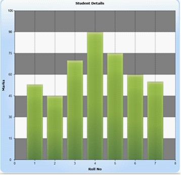

::: {style="DISPLAY: none"}
{#d2h_url_template}{#d2h_package_url style="WIDTH: 0px; DISPLAY: none; HEIGHT: 0px"}
:::

::::: {#nsbanner .d2h_main_nsbanner style="BORDER-BOTTOM: #999999 1px solid; POSITION: relative; PADDING-BOTTOM: 0px; BACKGROUND-COLOR: transparent; PADDING-LEFT: 0px; PADDING-RIGHT: 0px; DISPLAY: none; BORDER-TOP: #999999 1px solid; PADDING-TOP: 0px; LEFT: 0px"}
:::: {#TitleRow .d2h_main_titlerow style="PADDING-BOTTOM: 4px; BACKGROUND-COLOR: transparent; PADDING-LEFT: 22px; WIDTH: 100%; PADDING-RIGHT: 10px; DISPLAY: none; PADDING-TOP: 4px"}
::: {#ienav .d2h_main_ienav style="DISPLAY: none"}
{#D2HPrevious .D2HPreviousEnabled}  {#D2HNext .D2HNextEnabled}
:::
::::
:::::

::::: {#nstext .d2h_main_nstext style="PADDING-BOTTOM: 10px; BACKGROUND-COLOR: transparent; PADDING-LEFT: 22px; PADDING-RIGHT: 10px; HEIGHT: 100%; OVERFLOW: auto; PADDING-TOP: 5px" hasuserbackground="true" valign="bottom"}
::: {#d2h_breadcrumbs .d2h_breadcrumbs}
[Essential Studio User Guide Documentation](ms-xhelp:///?Id=12457748-09e3-4d74-a240-8e049cedf030){.d2h_breadcrumbsNormal}[ \> ]{.d2h_breadcrumbsLinkSeparator}[User Interface Edition](ms-xhelp:///?Id=c29296b7-531c-413b-a0ec-488ca1f7f669){.d2h_breadcrumbsNormal}[ \> ]{.d2h_breadcrumbsLinkSeparator}[Essential Silverlight](ms-xhelp:///?Id=66221bd1-ba2e-43c2-94a7-618f50e01d24){.d2h_breadcrumbsNormal}[ \> ]{.d2h_breadcrumbsLinkSeparator}[Essential Chart]{.d2h_breadcrumbsContentsOnly}[ \> ]{.d2h_breadcrumbsLinkSeparator}[Concepts and Features](ms-xhelp:///?Id=0f820843-9cdd-4436-8cae-3dc5a65fd5cd){.d2h_breadcrumbsNormal}[ \> ]{.d2h_breadcrumbsLinkSeparator}[Chart Area](ms-xhelp:///?Id=5198ad98-8dcd-425b-9488-3684f17e10f2){.d2h_breadcrumbsNormal}
:::

### Alternating Background {#alternating-background style="tab-stops: 0pt"}

 

Essential Chart Silverlight is now enhanced with horizontal or vertical background in intervals of a chart area.

**[]{style="COLOR: #15428b"}** 

Properties

Alternating Background, Alternating Fill Mode, and Alternating Fill Direction properties in the class Chart Area are used to apply alternating backgrounds to the chart area.

The following tabular column contains the properties detail.

[]{style="COLOR: #15428b"} 

::: {align="center"}
+-----------------------+----------------------------------------------------------------+----------------------+-----------------------------------------------+
| Name of the Property  | Description                                                    | Type of the Property | Value It Accepts                              |
+-----------------------+----------------------------------------------------------------+----------------------+-----------------------------------------------+
| AlternatingBackground | Determines whether to fill the grid with alternate Color.      | Dependency Property  | Bool                                          |
+-----------------------+----------------------------------------------------------------+----------------------+-----------------------------------------------+
| AlternatingFillMode   | Fills the color alternately in the odd/even grid as specified. | Dependency Property  | Odd or Even                                   |
+-----------------------+----------------------------------------------------------------+----------------------+-----------------------------------------------+
| AlternatingFillMode   | Set as Horizontal to fills the color in grid row.              | Dependency Property  | Enum from the type AlternatingFillDirection   |
|                       |                                                                |                      |                                               |
|                       | Set as Vertical to fills the color in grid column.             |                      |                                               |
+-----------------------+----------------------------------------------------------------+----------------------+-----------------------------------------------+
:::

[]{style="COLOR: #15428b"} 

**[]{style="COLOR: #15428b"}** 

**[]{style="COLOR: #15428b"}** 

**[]{style="COLOR: #15428b"}** 

Applying Background in Intervals of a Chart Area

 Apply background in intervals of a chart area, by using the following code.

[]{style="COLOR: #15428b"} 

+------------------------------------------------------------------------------------------------------------------------------------------------------------------------------------------------------------------------------------------------------------------------------------------------------------------------------------------------------------------------------------------------------------------------------------------------------------------------------------------------------------------------------------------------------------------------+
| [\[Xaml\] ]{style="FONT-FAMILY: 'Courier New'"}                                                                                                                                                                                                                                                                                                                                                                                                                                                                                                                        |
|                                                                                                                                                                                                                                                                                                                                                                                                                                                                                                                                                                        |
| **[]{style="FONT-FAMILY: 'Courier New'"}**                                                                                                                                                                                                                                                                                                                                                                                                                                                                                                                             |
|                                                                                                                                                                                                                                                                                                                                                                                                                                                                                                                                                                        |
| [\<]{style="FONT-FAMILY: 'Courier New'; COLOR: blue"}[syncfusion]{style="FONT-FAMILY: 'Courier New'; COLOR: #a31515"}[:]{style="FONT-FAMILY: 'Courier New'; COLOR: blue"}[ChartArea]{style="FONT-FAMILY: 'Courier New'; COLOR: #a31515"}[ CornerRadius]{style="FONT-FAMILY: 'Courier New'; COLOR: red"}[=\"20\"]{style="FONT-FAMILY: 'Courier New'; COLOR: blue"}[ AlternatingGridBackground]{style="FONT-FAMILY: 'Courier New'; COLOR: red"}[=\"AliceBlue\"]{style="FONT-FAMILY: 'Courier New'; COLOR: blue"}[      ]{style="FONT-FAMILY: 'Courier New'; COLOR: red"} |
|                                                                                                                                                                                                                                                                                                                                                                                                                                                                                                                                                                        |
| [                             AlternatingFillDirection]{style="FONT-FAMILY: 'Courier New'; COLOR: red"}[=\"Horizontal\"]{style="FONT-FAMILY: 'Courier New'; COLOR: blue"}[ AlternatingFillMode]{style="FONT-FAMILY: 'Courier New'; COLOR: red"}[=\"Odd\"\>]{style="FONT-FAMILY: 'Courier New'; COLOR: blue"}                                                                                                                                                                                                                                                           |
|                                                                                                                                                                                                                                                                                                                                                                                                                                                                                                                                                                        |
| [           . . . .]{style="FONT-FAMILY: 'Courier New'; COLOR: blue"}                                                                                                                                                                                                                                                                                                                                                                                                                                                                                                  |
|                                                                                                                                                                                                                                                                                                                                                                                                                                                                                                                                                                        |
| [           . . . .]{style="FONT-FAMILY: 'Courier New'; COLOR: blue"}                                                                                                                                                                                                                                                                                                                                                                                                                                                                                                  |
|                                                                                                                                                                                                                                                                                                                                                                                                                                                                                                                                                                        |
| [     ]{style="FONT-FAMILY: 'Courier New'; COLOR: black"}[\</]{style="FONT-FAMILY: 'Courier New'; COLOR: blue"}[syncfusion]{style="FONT-FAMILY: 'Courier New'; COLOR: #a31515"}[:]{style="FONT-FAMILY: 'Courier New'; COLOR: blue"}[ChartArea]{style="FONT-FAMILY: 'Courier New'; COLOR: #a31515"}[\>]{style="FONT-FAMILY: 'Courier New'; COLOR: blue"}[ ]{style="FONT-FAMILY: 'Courier New'; COLOR: black"}                                                                                                                                                           |
+------------------------------------------------------------------------------------------------------------------------------------------------------------------------------------------------------------------------------------------------------------------------------------------------------------------------------------------------------------------------------------------------------------------------------------------------------------------------------------------------------------------------------------------------------------------------+

[]{style="FONT-FAMILY: 'Times New Roman','serif'"} 

+--------------------------------------------------------------------------------------------------------------------------------------------------------------------------------------------------------------------------+
| [\[C# \]]{style="FONT-FAMILY: 'Courier New'"}                                                                                                                                                                            |
|                                                                                                                                                                                                                          |
| []{style="FONT-FAMILY: 'Courier New'"}                                                                                                                                                                                   |
|                                                                                                                                                                                                                          |
| [chart.Areas\[0\].AlternatingFillMode = ]{style="FONT-FAMILY: 'Courier New'; COLOR: black"}[AlternatingFillMode]{style="FONT-FAMILY: 'Courier New'; COLOR: #2b91af"}[.Odd;]{style="FONT-FAMILY: 'Courier New'"}          |
|                                                                                                                                                                                                                          |
| [     chart.Areas\[0\].AlternatingFillDirection = ]{style="FONT-FAMILY: 'Courier New'; COLOR: black"}[Orientation]{style="FONT-FAMILY: 'Courier New'; COLOR: #2b91af"}[.Horizontal;]{style="FONT-FAMILY: 'Courier New'"} |
|                                                                                                                                                                                                                          |
| [     chart.Areas\[0\].AlternatingGridBackground = [new]{style="COLOR: blue"} [SolidColorBrush]{style="COLOR: #2b91af"}([Colors]{style="COLOR: #2b91af"}.Gray);]{style="FONT-FAMILY: 'Courier New'"}                     |
+--------------------------------------------------------------------------------------------------------------------------------------------------------------------------------------------------------------------------+

[]{style="COLOR: #15428b"} 

When the code runs, the following output displays.

[]{style="FONT-FAMILY: 'Times New Roman','serif'; FONT-SIZE: 12pt"} 

{border="0"}

Figure 61: Horizontal Back Ground

[]{style="FONT-FAMILY: 'Times New Roman','serif'"} 

[]{#related-topics}
:::::
