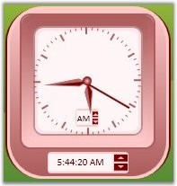

::: {style="DISPLAY: none"}
{#d2h_url_template}{#d2h_package_url style="WIDTH: 0px; DISPLAY: none; HEIGHT: 0px"}
:::

::: {.d2h_secondary_topic style="PADDING-BOTTOM: 10pt; MARGIN: 0pt; PADDING-LEFT: 0pt; PADDING-RIGHT: 0pt; PADDING-TOP: 0pt"}
##### AMPMSelector and DigitalAMPMSelector {#ampmselector-and-digitalampmselector style="tab-stops: 0pt"}

The visibility of the AMPMSelector is controlled using the IsInsideAMPMVisible property. Using this property, you can show or hide the AMPMSelector inside of the clock.

 

To set IsInsideAMPMVisible, use the below code.

 

+-----------------------------------------------------------------------------------------------------------------------------------------------------------------------------------------------------------------------------------------------------------------------------------------------------------------------------------------------------------------------------------------------------------------------------------------------------------------------------------------------------+
| **[\[XAML\]]{style="FONT-FAMILY: 'Courier New'; COLOR: black; FONT-SIZE: 9pt"}**                                                                                                                                                                                                                                                                                                                                                                                                                    |
|                                                                                                                                                                                                                                                                                                                                                                                                                                                                                                     |
| []{style="FONT-FAMILY: 'Courier New'; COLOR: blue; FONT-SIZE: 9pt"}                                                                                                                                                                                                                                                                                                                                                                                                                                 |
|                                                                                                                                                                                                                                                                                                                                                                                                                                                                                                     |
| [\<]{style="FONT-FAMILY: 'Courier New'; COLOR: blue; FONT-SIZE: 9pt"}[sftools]{style="FONT-FAMILY: 'Courier New'; COLOR: #a31515; FONT-SIZE: 9pt"}[:]{style="FONT-FAMILY: 'Courier New'; COLOR: blue; FONT-SIZE: 9pt"}[Clock]{style="FONT-FAMILY: 'Courier New'; COLOR: #a31515; FONT-SIZE: 9pt"}[ [Name]{style="COLOR: red"}[=\"ctlClock\"]{style="COLOR: blue"} [IsInsideAmPmVisible]{style="COLOR: red"}[=\"True\"/\>]{style="COLOR: blue"}]{style="FONT-FAMILY: 'Courier New'; FONT-SIZE: 9pt"} |
+-----------------------------------------------------------------------------------------------------------------------------------------------------------------------------------------------------------------------------------------------------------------------------------------------------------------------------------------------------------------------------------------------------------------------------------------------------------------------------------------------------+

[]{style="FONT-FAMILY: 'Trebuchet MS','sans-serif'; COLOR: #15428b; FONT-SIZE: 9pt"} 

+-----------------------------------------------------------------------------------------------------------------+
| **[\[C#\]]{style="FONT-FAMILY: 'Courier New'; COLOR: black; FONT-SIZE: 9pt"}**                                  |
|                                                                                                                 |
| []{style="FONT-FAMILY: 'Courier New'; COLOR: black; FONT-SIZE: 9pt"}                                            |
|                                                                                                                 |
| [ctlClock.IsInsideAmPmVisible=[true]{style="COLOR: blue"};]{style="FONT-FAMILY: 'Courier New'; FONT-SIZE: 9pt"} |
+-----------------------------------------------------------------------------------------------------------------+

**[]{style="FONT-FAMILY: 'Trebuchet MS','sans-serif'; COLOR: #15428b; FONT-SIZE: 9pt"}** 

{border="0"}

Figure 139: IsInsideAmPmVisible = \"True\"

 

The visibility of the DigitalAMPMSelector is controlled using the **IsDigitalAmPmVisible** property. Using this property, user can show or hide the DigitalAMPMSelector.

 

To set the IsDigitalAmPmVisible property, use the below code.

 

+------------------------------------------------------------------------------------------------------------------------------------------------------------------------------------------------------------------------------------------------------------------------------------------------------------------------------------------------------------------------------------------------------------------------------------------------------------------------------------------------------+
| **[\[XAML\]]{style="FONT-FAMILY: 'Courier New'; COLOR: black; FONT-SIZE: 9pt"}**                                                                                                                                                                                                                                                                                                                                                                                                                     |
|                                                                                                                                                                                                                                                                                                                                                                                                                                                                                                      |
| []{style="FONT-FAMILY: 'Courier New'; COLOR: blue; FONT-SIZE: 9pt"}                                                                                                                                                                                                                                                                                                                                                                                                                                  |
|                                                                                                                                                                                                                                                                                                                                                                                                                                                                                                      |
| [\<]{style="FONT-FAMILY: 'Courier New'; COLOR: blue; FONT-SIZE: 9pt"}[sftools]{style="FONT-FAMILY: 'Courier New'; COLOR: #a31515; FONT-SIZE: 9pt"}[:]{style="FONT-FAMILY: 'Courier New'; COLOR: blue; FONT-SIZE: 9pt"}[Clock]{style="FONT-FAMILY: 'Courier New'; COLOR: #a31515; FONT-SIZE: 9pt"}[ [Name]{style="COLOR: red"}[=\"ctlClock\"]{style="COLOR: blue"} [IsDigitalAmPmVisible]{style="COLOR: red"}[=\"True\"/\>]{style="COLOR: blue"}]{style="FONT-FAMILY: 'Courier New'; FONT-SIZE: 9pt"} |
+------------------------------------------------------------------------------------------------------------------------------------------------------------------------------------------------------------------------------------------------------------------------------------------------------------------------------------------------------------------------------------------------------------------------------------------------------------------------------------------------------+

[]{style="FONT-FAMILY: 'Trebuchet MS','sans-serif'; COLOR: #15428b; FONT-SIZE: 9pt"} 

+------------------------------------------------------------------------------------------------------------------+
| **[\[C#\]]{style="FONT-FAMILY: 'Courier New'; COLOR: black; FONT-SIZE: 9pt"}**                                   |
|                                                                                                                  |
| **[]{style="FONT-FAMILY: 'Courier New'; COLOR: black; FONT-SIZE: 9pt"}**                                         |
|                                                                                                                  |
| [ctlClock.IsDigitalAmPmVisible=[true]{style="COLOR: blue"};]{style="FONT-FAMILY: 'Courier New'; FONT-SIZE: 9pt"} |
+------------------------------------------------------------------------------------------------------------------+

[]{style="FONT-FAMILY: 'Trebuchet MS','sans-serif'; COLOR: #15428b; FONT-SIZE: 9pt"} 

{border="0"}

Figure 140: IsDigitalAmPmVisible = \"True\"

**[]{style="FONT-FAMILY: 'Trebuchet MS','sans-serif'; COLOR: #15428b; FONT-SIZE: 9pt"}** 

{border="0"}

Figure 141: IsDigitalAmPmVisible = \"False\"

[]{style="FONT-FAMILY: 'Trebuchet MS','sans-serif'; COLOR: #15428b; FONT-SIZE: 9pt"} 

**See Also**

[AMPMSelector Position](ms-xhelp:///?Id=7d640d4d-88ca-45b4-bdec-dea8eb32a2c4)[]{style="COLOR: black"}

 

[]{#p71} 

[]{#related-topics}
:::
