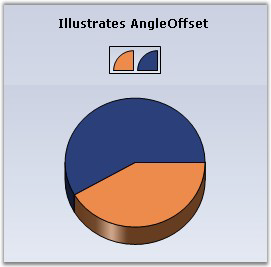
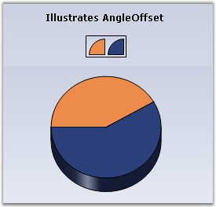
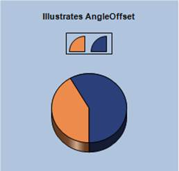

::: {style="DISPLAY: none"}
{#d2h_url_template}{#d2h_package_url style="WIDTH: 0px; DISPLAY: none; HEIGHT: 0px"}
:::

:::: {.d2h_secondary_topic style="PADDING-BOTTOM: 10pt; MARGIN: 0pt; PADDING-LEFT: 0pt; PADDING-RIGHT: 0pt; PADDING-TOP: 0pt"}
#### AngleOffset {#angleoffset style="tab-stops: 0pt"}

 

The following are the offset angle that can be used when rendering Pie charts:

 

::: {align="center"}
+------------------------------+---------------------------------------------------------------------+
| Details                                                                                            |
+------------------------------+---------------------------------------------------------------------+
| **Possible Values**          | Accepts real values like 45f, 90f etc.[\*]{style="FONT-SIZE: 14pt"} |
+------------------------------+---------------------------------------------------------------------+
| **Default Value    **        | **0**                                                               |
+------------------------------+---------------------------------------------------------------------+
| **2D / 3D Limitations**      | No                                                                  |
+------------------------------+---------------------------------------------------------------------+
| **Applies to Chart Element** | All Series                                                          |
+------------------------------+---------------------------------------------------------------------+
| **Applies to Chart Types**   | PieChart                                                            |
+------------------------------+---------------------------------------------------------------------+
:::

[]{style="FONT-SIZE: 14pt"} 

{border="0"}     In Essential Chart for ASP.NET, the entire pie chart circle is considered as 90 degree. To set the AngleOffset value, divide the entire circle into 4, i.e. divide 360 degrees by 4.

 

The following code illustrates how to set the AngleOffset for pie chart, by manually calculating the angle:

 

+----------------------------------------------------------------------------------------------------------------------------------------------------------------------------------------------------------------+
| **[\[C#\]]{style="FONT-FAMILY: 'Courier New'; COLOR: black"}**                                                                                                                                                 |
|                                                                                                                                                                                                                |
|                                                                                                                                                                                                                |
|                                                                                                                                                                                                                |
| [ // Create chart series and add data points.]{style="FONT-FAMILY: 'Courier New'; COLOR: green"}                                                                                                               |
|                                                                                                                                                                                                                |
| [ChartSeries]{style="FONT-FAMILY: 'Courier New'; COLOR: teal"}[ series1 = [this]{style="COLOR: blue"}.chartControl1.Model.NewSeries([\"Market\"]{style="COLOR: maroon"});]{style="FONT-FAMILY: 'Courier New'"} |
|                                                                                                                                                                                                                |
| [series1.Points.Add(0, 20);]{style="FONT-FAMILY: 'Courier New'"}                                                                                                                                               |
|                                                                                                                                                                                                                |
| [series1.Points.Add(1, 28);]{style="FONT-FAMILY: 'Courier New'"}                                                                                                                                               |
|                                                                                                                                                                                                                |
| [series1.Type = [ChartSeriesType]{style="COLOR: teal"}.Pie;]{style="FONT-FAMILY: 'Courier New'"}                                                                                                               |
|                                                                                                                                                                                                                |
| [ [// Add the series to the chart series collection.]{style="COLOR: green"}]{style="FONT-FAMILY: 'Courier New'"}                                                                                               |
|                                                                                                                                                                                                                |
| [this]{style="FONT-FAMILY: 'Courier New'; COLOR: blue"}[.chartControl1.Series.Add(series1);]{style="FONT-FAMILY: 'Courier New'"}                                                                               |
|                                                                                                                                                                                                                |
| [          ]{style="FONT-FAMILY: 'Courier New'"}                                                                                                                                                               |
|                                                                                                                                                                                                                |
| [this]{style="FONT-FAMILY: 'Courier New'; COLOR: blue"}[.chartControl1.Series3D = [true]{style="COLOR: blue"};]{style="FONT-FAMILY: 'Courier New'"}                                                            |
|                                                                                                                                                                                                                |
| [this]{style="FONT-FAMILY: 'Courier New'; COLOR: blue"}[.chartControl1.Series\[0\].ConfigItems.PieItem.AngleOffset = 45f;]{style="FONT-FAMILY: 'Courier New'"}                                                 |
+----------------------------------------------------------------------------------------------------------------------------------------------------------------------------------------------------------------+

 

+-------------------------------------------------------------------------------------------------------------------------------------------------------------------------------------------------------------------------+
| **[\[VB.NET\]]{style="FONT-FAMILY: 'Courier New'; COLOR: black"}**                                                                                                                                                      |
|                                                                                                                                                                                                                         |
|                                                                                                                                                                                                                         |
|                                                                                                                                                                                                                         |
| [\'Create chart series and add data points.]{style="FONT-FAMILY: 'Courier New'; COLOR: green"}                                                                                                                          |
|                                                                                                                                                                                                                         |
| [Private]{style="FONT-FAMILY: 'Courier New'; COLOR: blue"}[ series1 As ChartSeries = [Me]{style="COLOR: blue"}.chartControl1.Model.NewSeries([\"Market\"]{style="COLOR: #993300"})]{style="FONT-FAMILY: 'Courier New'"} |
|                                                                                                                                                                                                                         |
| [series1.Points.Add(0, 20)]{style="FONT-FAMILY: 'Courier New'"}                                                                                                                                                         |
|                                                                                                                                                                                                                         |
| [series1.Points.Add(1, 28)]{style="FONT-FAMILY: 'Courier New'"}                                                                                                                                                         |
|                                                                                                                                                                                                                         |
| [series1.Type = [ChartSeriesType]{style="COLOR: teal"}.Pie]{style="FONT-FAMILY: 'Courier New'"}                                                                                                                         |
|                                                                                                                                                                                                                         |
| [ [\'Add the series to the chart series collection.]{style="COLOR: green"}]{style="FONT-FAMILY: 'Courier New'"}                                                                                                         |
|                                                                                                                                                                                                                         |
| [Me]{style="FONT-FAMILY: 'Courier New'; COLOR: blue"}[.chartControl1.Series.Add(series1)]{style="FONT-FAMILY: 'Courier New'"}                                                                                           |
|                                                                                                                                                                                                                         |
|                                                                                                                                                                                                                         |
|                                                                                                                                                                                                                         |
| [Me]{style="FONT-FAMILY: 'Courier New'; COLOR: blue"}[.chartControl1.Series3D = [True]{style="COLOR: blue"}]{style="FONT-FAMILY: 'Courier New'"}                                                                        |
|                                                                                                                                                                                                                         |
| [Me]{style="FONT-FAMILY: 'Courier New'; COLOR: blue"}[.chartControl1.Series(0).ConfigItems.PieItem.AngleOffset = 45f]{style="FONT-FAMILY: 'Courier New'"}                                                               |
+-------------------------------------------------------------------------------------------------------------------------------------------------------------------------------------------------------------------------+

 

{border="0"}

Figure 1: PieChart with No AngleOffset

 

 

{border="0"}

Figure 2: PieChart with AngleOffset = \"45f\"

 

 

You can also set the calculation in the code as given in the following example:

 

+--------------------------------------------------------------------------------------------------------------------------------------------------------------------------------------------------------+
| \[C#\]                                                                                                                                                                                                 |
|                                                                                                                                                                                                        |
|                                                                                                                                                                                                        |
|                                                                                                                                                                                                        |
| [this]{style="FONT-FAMILY: 'Courier New'; COLOR: blue; FONT-SIZE: 9.5pt"}[.chartControl1.Series\[0\].ConfigItems.PieItem.AngleOffset = 90 / 4f;]{style="FONT-FAMILY: 'Courier New'; FONT-SIZE: 9.5pt"} |
+--------------------------------------------------------------------------------------------------------------------------------------------------------------------------------------------------------+

 

+-------------------------------------------------------------------------------------------------------------------------------------------------------------------------------------------------+
| \[VB\]                                                                                                                                                                                          |
|                                                                                                                                                                                                 |
| [Me]{style="FONT-FAMILY: 'Courier New'; COLOR: blue; FONT-SIZE: 9.5pt"}[.chartControl1.Series(0).ConfigItems.PieItem.AngleOffset = 90/4f]{style="FONT-FAMILY: 'Courier New'; FONT-SIZE: 9.5pt"} |
|                                                                                                                                                                                                 |
|                                                                                                                                                                                                 |
+-------------------------------------------------------------------------------------------------------------------------------------------------------------------------------------------------+

 

{border="0"}

Figure 3: PieChart with AngleOffset = \"90/4f\"

 

**[]{style="FONT-FAMILY: 'Trebuchet MS','sans-serif'; FONT-SIZE: 9pt"}** 

See Also

[]{style="FONT-FAMILY: 'Segoe UI','sans-serif'; COLOR: black; FONT-SIZE: 9pt"} 

[[Pie Chart]{.UGHyperlink}](ms-xhelp:///?Id=66fb3cf6-16b4-4a4b-8c0d-9af784be683c)[]{.UGHyperlink}

[]{#p80} 

[]{#related-topics}
::::
