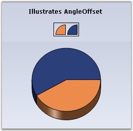
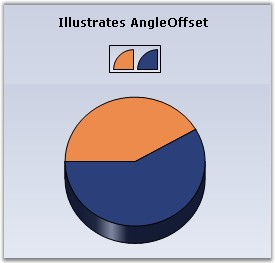

::: {style="DISPLAY: none"}
{#d2h_url_template}{#d2h_package_url style="WIDTH: 0px; DISPLAY: none; HEIGHT: 0px"}
:::

:::: {.d2h_secondary_topic style="PADDING-BOTTOM: 10pt; MARGIN: 0pt; PADDING-LEFT: 0pt; PADDING-RIGHT: 0pt; PADDING-TOP: 0pt"}
#### AngleOffset {#angleoffset style="tab-stops: 0pt"}

 

The offset angle that is to be used when rendering Pie charts.

[]{style="COLOR: red; FONT-SIZE: 8pt"} 

::: {align="center"}
+-------------------------------------+----------------------------------------+
|                                                                              |
|                                                                              |
| Details                                                                      |
+-------------------------------------+----------------------------------------+
| **Possible Values**                 | Accepts real values like 45f, 90f etc. |
+-------------------------------------+----------------------------------------+
| **Default Value    **               | **0**                                  |
+-------------------------------------+----------------------------------------+
| **2D / 3D Limitations**             | No                                     |
+-------------------------------------+----------------------------------------+
| **Applies to Chart Element**        | All Series                             |
+-------------------------------------+----------------------------------------+
| **Applies to Chart Types**          | PieChart                               |
+-------------------------------------+----------------------------------------+
:::

 

Here is some sample code.

 

+----------------------------------------------------------------------------------------------------------------------------------------------------------------------------------------------------------------+
| **[\[C#\]]{style="FONT-FAMILY: 'Courier New'; COLOR: black"}**                                                                                                                                                 |
|                                                                                                                                                                                                                |
| []{style="FONT-FAMILY: 'Courier New'; COLOR: green"}                                                                                                                                                           |
|                                                                                                                                                                                                                |
| [ // Create chart series and add data points into it.]{style="FONT-FAMILY: 'Courier New'; COLOR: green"}                                                                                                       |
|                                                                                                                                                                                                                |
| [ChartSeries]{style="FONT-FAMILY: 'Courier New'; COLOR: teal"}[ series1 = [this]{style="COLOR: blue"}.chartControl1.Model.NewSeries([\"Market\"]{style="COLOR: maroon"});]{style="FONT-FAMILY: 'Courier New'"} |
|                                                                                                                                                                                                                |
| [series1.Points.Add(0, 20);]{style="FONT-FAMILY: 'Courier New'"}                                                                                                                                               |
|                                                                                                                                                                                                                |
| [series1.Points.Add(1, 28);]{style="FONT-FAMILY: 'Courier New'"}                                                                                                                                               |
|                                                                                                                                                                                                                |
| [series1.Type = [ChartSeriesType]{style="COLOR: teal"}.Pie;]{style="FONT-FAMILY: 'Courier New'"}                                                                                                               |
|                                                                                                                                                                                                                |
| [ [// Add the series to the chart series collection.]{style="COLOR: green"}]{style="FONT-FAMILY: 'Courier New'"}                                                                                               |
|                                                                                                                                                                                                                |
| [this]{style="FONT-FAMILY: 'Courier New'; COLOR: blue"}[.chartControl1.Series.Add(series1);]{style="FONT-FAMILY: 'Courier New'"}                                                                               |
|                                                                                                                                                                                                                |
| [          ]{style="FONT-FAMILY: 'Courier New'"}                                                                                                                                                               |
|                                                                                                                                                                                                                |
| [this]{style="FONT-FAMILY: 'Courier New'; COLOR: blue"}[.chartControl1.Series3D = [true]{style="COLOR: blue"};]{style="FONT-FAMILY: 'Courier New'"}                                                            |
|                                                                                                                                                                                                                |
| [this]{style="FONT-FAMILY: 'Courier New'; COLOR: blue"}[.chartControl1.Series\[0\].ConfigItems.PieItem.AngleOffset = 45f;]{style="FONT-FAMILY: 'Courier New'"}                                                 |
+----------------------------------------------------------------------------------------------------------------------------------------------------------------------------------------------------------------+

 

+-------------------------------------------------------------------------------------------------------------------------------------------------------------------------------------------------------------------------+
| **[\[VB.NET\]]{style="FONT-FAMILY: 'Courier New'; COLOR: black"}**                                                                                                                                                      |
|                                                                                                                                                                                                                         |
| **[]{style="FONT-FAMILY: 'Courier New'; COLOR: black"}**                                                                                                                                                                |
|                                                                                                                                                                                                                         |
| [\' Create chart series and add data points into it.]{style="FONT-FAMILY: 'Courier New'; COLOR: green"}                                                                                                                 |
|                                                                                                                                                                                                                         |
| [Private]{style="FONT-FAMILY: 'Courier New'; COLOR: blue"}[ series1 As ChartSeries = [Me]{style="COLOR: blue"}.chartControl1.Model.NewSeries([\"Market\"]{style="COLOR: #993300"})]{style="FONT-FAMILY: 'Courier New'"} |
|                                                                                                                                                                                                                         |
| [series1.Points.Add(0, 20)]{style="FONT-FAMILY: 'Courier New'"}                                                                                                                                                         |
|                                                                                                                                                                                                                         |
| [series1.Points.Add(1, 28)]{style="FONT-FAMILY: 'Courier New'"}                                                                                                                                                         |
|                                                                                                                                                                                                                         |
| [series1.Type = [ChartSeriesType]{style="COLOR: teal"}.Pie]{style="FONT-FAMILY: 'Courier New'"}                                                                                                                         |
|                                                                                                                                                                                                                         |
| [ [\' Add the series to the chart series collection.]{style="COLOR: green"}]{style="FONT-FAMILY: 'Courier New'"}                                                                                                        |
|                                                                                                                                                                                                                         |
| [Me]{style="FONT-FAMILY: 'Courier New'; COLOR: blue"}[.chartControl1.Series.Add(series1)]{style="FONT-FAMILY: 'Courier New'"}                                                                                           |
|                                                                                                                                                                                                                         |
| []{style="FONT-FAMILY: 'Courier New'; COLOR: blue"}                                                                                                                                                                     |
|                                                                                                                                                                                                                         |
| [Me]{style="FONT-FAMILY: 'Courier New'; COLOR: blue"}[.chartControl1.Series3D = [True]{style="COLOR: blue"}]{style="FONT-FAMILY: 'Courier New'"}                                                                        |
|                                                                                                                                                                                                                         |
| [Me]{style="FONT-FAMILY: 'Courier New'; COLOR: blue"}[.chartControl1.Series(0).ConfigItems.PieItem.AngleOffset = 45f]{style="FONT-FAMILY: 'Courier New'"}                                                               |
+-------------------------------------------------------------------------------------------------------------------------------------------------------------------------------------------------------------------------+

 

{border="0"}

 

Figure 95**[: PieChart with No AngleOffset]{style="FONT-STYLE: normal"}**

 

{border="0"}

 

Figure 96**[: PieChart with AngleOffset = \"45f\"]{style="FONT-STYLE: normal"}**

 

See Also

[[]{style="TEXT-DECORATION: none"}]{.UGHyperlink} 

[Pie Chart]{.UGHyperlink}[]{.UGHyperlink}

[]{#p78} 

 

[]{#related-topics}
::::
