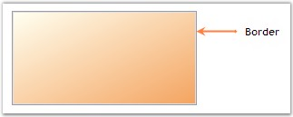
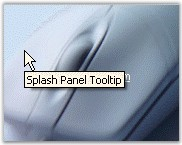

::: {style="DISPLAY: none"}
{#d2h_url_template}{#d2h_package_url style="WIDTH: 0px; DISPLAY: none; HEIGHT: 0px"}
:::

::::::::::::::: {.d2h_secondary_topic style="PADDING-BOTTOM: 10pt; MARGIN: 0pt; PADDING-LEFT: 0pt; PADDING-RIGHT: 0pt; PADDING-TOP: 0pt"}
##### Animation Settings {#animation-settings style="MARGIN-LEFT: 18pt; tab-stops: 18.0pt"}

 

This section demonstrates how to display a splash image with animation.

 

When animation is set for the splash image, by default, the splash image will be drawn from left to right.

[]{style="FONT-SIZE: 8pt"} 

::: {align="center"}
  ---------------------- -------------------------------------------------------------------------------------------------------
  SplashPanel Property   Description
  AnimationSpeed         Indicates the speed at which the animation unfolds on the screen and the SplashPanel becomes visible.
  ShowAnimation          Specifies if the window display should be animated.
  ShowAsTopMost          Specifies if the SplashPanel is to be displayed as a topmost window.
  ---------------------- -------------------------------------------------------------------------------------------------------
:::

 

This can be achieved through code also. Create a SplashPanel and set the below properties.

[]{style="FONT-SIZE: 8pt"} 

+---------------------------------------------------------------------------------------------------------------------------------------------------------+
| **[\[C#\]]{style="FONT-FAMILY: 'Courier New'; COLOR: black"}**                                                                                          |
|                                                                                                                                                         |
| []{style="FONT-FAMILY: 'Courier New'; COLOR: black"}                                                                                                    |
|                                                                                                                                                         |
| [this]{style="FONT-FAMILY: 'Courier New'; COLOR: blue"}[.splashPanel1.AnimationSpeed = 30;]{style="FONT-FAMILY: 'Courier New'"}                         |
|                                                                                                                                                         |
| [this]{style="FONT-FAMILY: 'Courier New'; COLOR: blue"}[.splashPanel1.ShowAnimation = [true;]{style="COLOR: blue"}]{style="FONT-FAMILY: 'Courier New'"} |
|                                                                                                                                                         |
| [this]{style="FONT-FAMILY: 'Courier New'; COLOR: blue"}[.splashPanel1.ShowAsTopMost = [true;]{style="COLOR: blue"}]{style="FONT-FAMILY: 'Courier New'"} |
+---------------------------------------------------------------------------------------------------------------------------------------------------------+

[]{style="COLOR: #15428b"} 

+------------------------------------------------------------------------------------------------------------------------------------------------------+
| **[\[VB.NET\]]{style="FONT-FAMILY: 'Courier New'; COLOR: black"}**                                                                                   |
|                                                                                                                                                      |
| []{style="FONT-FAMILY: 'Courier New'; COLOR: black"}                                                                                                 |
|                                                                                                                                                      |
| [Me]{style="FONT-FAMILY: 'Courier New'; COLOR: blue"}[.splashPanel1.AnimationSpeed = 30]{style="FONT-FAMILY: 'Courier New'"}                         |
|                                                                                                                                                      |
| [Me]{style="FONT-FAMILY: 'Courier New'; COLOR: blue"}[.splashPanel1.ShowAnimation = [True]{style="COLOR: blue"}]{style="FONT-FAMILY: 'Courier New'"} |
|                                                                                                                                                      |
| [Me]{style="FONT-FAMILY: 'Courier New'; COLOR: blue"}[.splashPanel1.ShowAsTopMost = [True]{style="COLOR: blue"}]{style="FONT-FAMILY: 'Courier New'"} |
+------------------------------------------------------------------------------------------------------------------------------------------------------+

[]{style="FONT-SIZE: 8pt"} 

Sliding Style

 

The splash image, can not only be displayed from left to right, but can be displayed in different styles using the property given below.

[]{style="COLOR: #15428b"} 

::: {align="center"}
+-----------------------------------+---------------------------------------------------------------------------------------+
| SplashPanel Property              | Description                                                                           |
+-----------------------------------+---------------------------------------------------------------------------------------+
| SlideStyle                        | Gets / sets the slide style for the SplashPanel. The options included are as follows. |
|                                   |                                                                                       |
|                                   |                                                                                       |
|                                   |                                                                                       |
|                                   | [·      ]{style="FONT-FAMILY: Symbol"}Horizontal,                                     |
|                                   |                                                                                       |
|                                   | [·      ]{style="FONT-FAMILY: Symbol"}Vertical,                                       |
|                                   |                                                                                       |
|                                   | [·      ]{style="FONT-FAMILY: Symbol"}LeftToRight,                                    |
|                                   |                                                                                       |
|                                   | [·      ]{style="FONT-FAMILY: Symbol"}RightToLeft,                                    |
|                                   |                                                                                       |
|                                   | [·      ]{style="FONT-FAMILY: Symbol"}TopToBottom,                                    |
|                                   |                                                                                       |
|                                   | [·      ]{style="FONT-FAMILY: Symbol"}BottomToTop and                                 |
|                                   |                                                                                       |
|                                   | [·      ]{style="FONT-FAMILY: Symbol"}FadeIn.                                         |
|                                   |                                                                                       |
|                                   |                                                                                       |
|                                   |                                                                                       |
|                                   | The ShowAnimation property must be set to \'True\'.                                   |
+-----------------------------------+---------------------------------------------------------------------------------------+
:::

[]{style="COLOR: #15428b"} 

+--------------------------------------------------------------------------------------------------------------------------------------------------------------------------------------------------+
| **[\[C#\]]{style="FONT-FAMILY: 'Courier New'; COLOR: black"}**                                                                                                                                   |
|                                                                                                                                                                                                  |
| []{style="FONT-FAMILY: 'Courier New'; COLOR: black"}                                                                                                                                             |
|                                                                                                                                                                                                  |
| [this]{style="FONT-FAMILY: 'Courier New'; COLOR: blue"}[.splashPanel1.SlideStyle = Syncfusion.Windows.Forms.Tools.[SlideStyle]{style="COLOR: teal"}.FadeIn;]{style="FONT-FAMILY: 'Courier New'"} |
+--------------------------------------------------------------------------------------------------------------------------------------------------------------------------------------------------+

[]{style="COLOR: #15428b"} 

+------------------------------------------------------------------------------------------------------------------------------------------------------------------------+
| **[\[VB.NET\]]{style="FONT-FAMILY: 'Courier New'; COLOR: black"}**                                                                                                     |
|                                                                                                                                                                        |
| []{style="FONT-FAMILY: 'Courier New'; COLOR: black"}                                                                                                                   |
|                                                                                                                                                                        |
| [Me]{style="FONT-FAMILY: 'Courier New'; COLOR: blue"}[.splashPanel1.SlideStyle = Syncfusion.Windows.Forms.Tools.SlideStyle.FadeIn]{style="FONT-FAMILY: 'Courier New'"} |
+------------------------------------------------------------------------------------------------------------------------------------------------------------------------+

[]{style="COLOR: #15428b"} 

 

 

 

 

###### []{#_AutoClose}3.7.3.3.2.1      AutoClose {#autoclose style="MARGIN-LEFT: 18pt; tab-stops: 18.0pt"}

[]{style="COLOR: #15428b"} 

This section discusses the properties that can be set for the animation of SplashPanel.

 

**AutoClose**

[]{style="FONT-FAMILY: 'Verdana','sans-serif'; COLOR: #4a5c8c; FONT-SIZE: 8pt"} 

Auto closing of the SplashPanel can be accomplished using the property given below.

[]{style="COLOR: #4a5c8c; FONT-SIZE: 8pt"} 

::: {align="center"}
  ------------------------------- -----------------------------------------------------------------------------------
  SplashPanel Property            Description
  SuspendAutoCloseWhenMouseOver   Indicates whether the SplashPanel should not be closed when the mouse is over it.
  ------------------------------- -----------------------------------------------------------------------------------
:::

 

This property which is available in SplashPanel, when enabled, will close the SplashPanel at run time before the specified time interval ends, when the mouse is moved over it. By default this will be set to \'False\'.

[]{style="COLOR: #15428b"} 

::: {style="BORDER-BOTTOM: windowtext 1pt solid; BORDER-LEFT: medium none; PADDING-BOTTOM: 1pt; MARGIN: 9pt 0pt 9pt 18pt; PADDING-LEFT: 0pt; PADDING-RIGHT: 0pt; BORDER-TOP: windowtext 1pt solid; BORDER-RIGHT: medium none; PADDING-TOP: 1pt"}
{border="0"} Note:[ ]{style="COLOR: black; FONT-SIZE: 8pt"}[The ]{style="FONT-FAMILY: 'Times New Roman TUR','serif'"}[CloseOnClick]{style="COLOR: black"} property can also be used to close the SplashPanel by a single mouse click.
:::

[]{style="COLOR: #15428b"} 

+-------------------------------------------------------------------------------------------------------------------------------------------------------------------------+
| **[\[C#\]]{style="FONT-FAMILY: 'Courier New'; COLOR: black"}**                                                                                                          |
|                                                                                                                                                                         |
| []{style="FONT-FAMILY: 'Courier New'; COLOR: black"}                                                                                                                    |
|                                                                                                                                                                         |
| [this]{style="FONT-FAMILY: 'Courier New'; COLOR: blue"}[.splashPanel1.SuspendAutoCloseWhenMouseOver = [true]{style="COLOR: blue"};]{style="FONT-FAMILY: 'Courier New'"} |
+-------------------------------------------------------------------------------------------------------------------------------------------------------------------------+

[]{style="COLOR: #15428b"} 

+----------------------------------------------------------------------------------------------------------------------------------------------------------------------+
| **[\[VB.NET\]]{style="FONT-FAMILY: 'Courier New'; COLOR: black"}**                                                                                                   |
|                                                                                                                                                                      |
| []{style="FONT-FAMILY: 'Courier New'; COLOR: black"}                                                                                                                 |
|                                                                                                                                                                      |
| [Me]{style="FONT-FAMILY: 'Courier New'; COLOR: blue"}[.splashPanel1.SuspendAutoCloseWhenMouseOver = [True]{style="COLOR: blue"}]{style="FONT-FAMILY: 'Courier New'"} |
+----------------------------------------------------------------------------------------------------------------------------------------------------------------------+

[]{style="FONT-SIZE: 8pt"} 

AutoClose mode of the splash screen can be suspended or restored using the below methods.

[]{style="COLOR: #15428b"} 

::: {align="center"}
  ---------------------- -----------------------------------------------------------------------
  Methods                Description
  SuspendAutoCloseMode   Suspends the auto closing of the SplashPanel after the TimerInterval.
  RestoreAutoCloseMode   Restores the auto closing of the SplashPanel.
  ---------------------- -----------------------------------------------------------------------
:::

[]{style="COLOR: #15428b"} 

[·      ]{style="FONT-FAMILY: Symbol"}**SuspendAutoCloseMode()** - The splash screen will be displayed at run time for a specific time interval and it closes automatically by default. This auto closing of the splash screen can be suspended by calling this method.

 

On calling this method, the splash screen will be displayed till the application is closed or the RestoreAutoCloseMode() method is called. You can use the below code snippet to call this method.

[]{style="COLOR: #ff6600; FONT-SIZE: 8pt"} 

+----------------------------------------------------------------------------------------------------------------------------------------------------------------------------------------------------------------------+
| **[\[C#\]]{style="FONT-FAMILY: 'Courier New'; COLOR: black"}**                                                                                                                                                       |
|                                                                                                                                                                                                                      |
| []{style="FONT-FAMILY: 'Courier New'; COLOR: #ff6600"}                                                                                                                                                               |
|                                                                                                                                                                                                                      |
| [private]{style="FONT-FAMILY: 'Courier New'; COLOR: blue"}[ [void]{style="COLOR: blue"} button1_Click([object]{style="COLOR: blue"} sender, [EventArgs]{style="COLOR: teal"} e)]{style="FONT-FAMILY: 'Courier New'"} |
|                                                                                                                                                                                                                      |
| [{]{style="FONT-FAMILY: 'Courier New'"}                                                                                                                                                                              |
|                                                                                                                                                                                                                      |
| [this]{style="FONT-FAMILY: 'Courier New'; COLOR: blue"}[.splashPanel1.SuspendAutoCloseMode();]{style="FONT-FAMILY: 'Courier New'"}                                                                                   |
|                                                                                                                                                                                                                      |
| [}]{style="FONT-FAMILY: 'Courier New'"}                                                                                                                                                                              |
+----------------------------------------------------------------------------------------------------------------------------------------------------------------------------------------------------------------------+

[]{style="COLOR: #ff6600; FONT-SIZE: 8pt"} 

+------------------------------------------------------------------------------------------------------------------------------------------------------------------------------------------------------------------------------------------------------------------------------------------------------------+
| **[\[VB.NET\]]{style="FONT-FAMILY: 'Courier New'; COLOR: black"}**                                                                                                                                                                                                                                         |
|                                                                                                                                                                                                                                                                                                            |
| []{style="FONT-FAMILY: 'Courier New'; COLOR: #ff6600"}                                                                                                                                                                                                                                                     |
|                                                                                                                                                                                                                                                                                                            |
| [Private]{style="FONT-FAMILY: 'Courier New'; COLOR: blue"}[ [Sub]{style="COLOR: blue"} button1_Click([ByVal]{style="COLOR: blue"} sender [As]{style="COLOR: blue"} [Object]{style="COLOR: blue"}, [ByVal]{style="COLOR: blue"} e [As]{style="COLOR: blue"} EventArgs)]{style="FONT-FAMILY: 'Courier New'"} |
|                                                                                                                                                                                                                                                                                                            |
| [Me]{style="FONT-FAMILY: 'Courier New'; COLOR: blue"}[.splashPanel1.SuspendAutoCloseMode()]{style="FONT-FAMILY: 'Courier New'"}                                                                                                                                                                            |
|                                                                                                                                                                                                                                                                                                            |
| [End]{style="FONT-FAMILY: 'Courier New'; COLOR: blue"}[ [Sub]{style="COLOR: blue"}]{style="FONT-FAMILY: 'Courier New'"}                                                                                                                                                                                    |
+------------------------------------------------------------------------------------------------------------------------------------------------------------------------------------------------------------------------------------------------------------------------------------------------------------+

[]{style="COLOR: #ff6600; FONT-SIZE: 8pt"} 

[·      ]{style="FONT-FAMILY: Symbol"}**RestoreAutoCloseMode()** - This method will restore the auto closing of the splash screen which was suspended by calling the SuspendAutoCloseMode() method.

[]{style="COLOR: #ff6600; FONT-SIZE: 8pt"} 

+----------------------------------------------------------------------------------------------------------------------------------------------------------------------------------------------------------------------+
| **[\[C#\]]{style="FONT-FAMILY: 'Courier New'; COLOR: black"}**                                                                                                                                                       |
|                                                                                                                                                                                                                      |
| []{style="FONT-FAMILY: 'Courier New'; COLOR: #ff6600"}                                                                                                                                                               |
|                                                                                                                                                                                                                      |
| [private]{style="FONT-FAMILY: 'Courier New'; COLOR: blue"}[ [void]{style="COLOR: blue"} button1_Click([object]{style="COLOR: blue"} sender, [EventArgs]{style="COLOR: teal"} e)]{style="FONT-FAMILY: 'Courier New'"} |
|                                                                                                                                                                                                                      |
| [{]{style="FONT-FAMILY: 'Courier New'"}                                                                                                                                                                              |
|                                                                                                                                                                                                                      |
| [this]{style="FONT-FAMILY: 'Courier New'; COLOR: blue"}[.splashPanel1.RestoreAutoCloseMode();]{style="FONT-FAMILY: 'Courier New'"}                                                                                   |
|                                                                                                                                                                                                                      |
| [}]{style="FONT-FAMILY: 'Courier New'"}                                                                                                                                                                              |
+----------------------------------------------------------------------------------------------------------------------------------------------------------------------------------------------------------------------+

[]{style="COLOR: #ff6600; FONT-SIZE: 8pt"} 

+------------------------------------------------------------------------------------------------------------------------------------------------------------------------------------------------------------------------------------------------------------------------------------------------------------+
| **[\[VB.NET\]]{style="FONT-FAMILY: 'Courier New'; COLOR: black"}**                                                                                                                                                                                                                                         |
|                                                                                                                                                                                                                                                                                                            |
| []{style="FONT-FAMILY: 'Courier New'; COLOR: #ff6600"}                                                                                                                                                                                                                                                     |
|                                                                                                                                                                                                                                                                                                            |
| [Private]{style="FONT-FAMILY: 'Courier New'; COLOR: blue"}[ [Sub]{style="COLOR: blue"} button1_Click([ByVal]{style="COLOR: blue"} sender [As]{style="COLOR: blue"} [Object]{style="COLOR: blue"}, [ByVal]{style="COLOR: blue"} e [As]{style="COLOR: blue"} EventArgs)]{style="FONT-FAMILY: 'Courier New'"} |
|                                                                                                                                                                                                                                                                                                            |
| [Me]{style="FONT-FAMILY: 'Courier New'; COLOR: blue"}[.splashPanel1.RestoreAutoCloseMode()]{style="FONT-FAMILY: 'Courier New'"}                                                                                                                                                                            |
|                                                                                                                                                                                                                                                                                                            |
| [End]{style="FONT-FAMILY: 'Courier New'; COLOR: blue"}[ [Sub]{style="COLOR: blue"}]{style="FONT-FAMILY: 'Courier New'"}                                                                                                                                                                                    |
+------------------------------------------------------------------------------------------------------------------------------------------------------------------------------------------------------------------------------------------------------------------------------------------------------------+

 

 

 

 

###### []{#_Appearance_Settings_1}3.7.3.3.2.2      Appearance Settings {#appearance-settings style="MARGIN-LEFT: 18pt; tab-stops: 18.0pt"}

[]{style="FONT-SIZE: 8pt"} 

The SplashPanel allows the user to customize the appearance of the panel using the below given properties.

 

**Background Settings**

[]{style="FONT-FAMILY: 'Verdana','sans-serif'; FONT-SIZE: 8pt"} 

The background of the SplashPanel can be customized using the properties given below.

[]{style="COLOR: #15428b"} 

::: {align="center"}
+-----------------------------------+-------------------------------------------------------------------------------------------------------------------------------------+
| SplashPanel Property              | Description                                                                                                                         |
+-----------------------------------+-------------------------------------------------------------------------------------------------------------------------------------+
| BackgroundColor                   | Gets / sets the background gradient and other styles.                                                                               |
+-----------------------------------+-------------------------------------------------------------------------------------------------------------------------------------+
| Style                             | Specifies the brush style.                                                                                                          |
|                                   |                                                                                                                                     |
|                                   |                                                                                                                                     |
|                                   |                                                                                                                                     |
|                                   | [·      ]{style="FONT-FAMILY: Symbol"}Solid,                                                                                        |
|                                   |                                                                                                                                     |
|                                   | [·      ]{style="FONT-FAMILY: Symbol"}Pattern and                                                                                   |
|                                   |                                                                                                                                     |
|                                   | [·      ]{style="FONT-FAMILY: Symbol"}Gradient.                                                                                     |
+-----------------------------------+-------------------------------------------------------------------------------------------------------------------------------------+
| BackColor                         | Specifies the backcolor of the control.                                                                                             |
+-----------------------------------+-------------------------------------------------------------------------------------------------------------------------------------+
| ForeColor                         | Specifies the forecolor for any text or graphics in the control.                                                                    |
+-----------------------------------+-------------------------------------------------------------------------------------------------------------------------------------+
| GradientStyle                     | Specifies the gradient style of the background.                                                                                     |
|                                   |                                                                                                                                     |
|                                   |                                                                                                                                     |
|                                   |                                                                                                                                     |
|                                   | [·      ]{style="FONT-FAMILY: Symbol"}ForwardDiagonal,                                                                              |
|                                   |                                                                                                                                     |
|                                   | [·      ]{style="FONT-FAMILY: Symbol"}BackwardDiagonal,                                                                             |
|                                   |                                                                                                                                     |
|                                   | [·      ]{style="FONT-FAMILY: Symbol"}Horizontal,                                                                                   |
|                                   |                                                                                                                                     |
|                                   | [·      ]{style="FONT-FAMILY: Symbol"}Vertical,                                                                                     |
|                                   |                                                                                                                                     |
|                                   | [·      ]{style="FONT-FAMILY: Symbol"}PathRectangle and                                                                             |
|                                   |                                                                                                                                     |
|                                   | [·      ]{style="FONT-FAMILY: Symbol"}PathEllipse.                                                                                  |
+-----------------------------------+-------------------------------------------------------------------------------------------------------------------------------------+
| GradientColors                    | Specifies the gradient colors.                                                                                                      |
|                                   |                                                                                                                                     |
|                                   |                                                                                                                                     |
|                                   |                                                                                                                                     |
|                                   | The first entry in this list will be the same as the BackColor property, the last entry will be the same as the ForeColor property. |
+-----------------------------------+-------------------------------------------------------------------------------------------------------------------------------------+
| BackgroundImage                   | Specifies the background image used for the control.                                                                                |
+-----------------------------------+-------------------------------------------------------------------------------------------------------------------------------------+
| TransparentColor                  | Specifies the transparent color for the background.                                                                                 |
+-----------------------------------+-------------------------------------------------------------------------------------------------------------------------------------+
:::

[]{style="COLOR: #15428b"} 

+---------------------------------------------------------------------------------------------------------------------------------------------------------------------------------------------------------------------------------------------------------------------------------------------------------------------------------------------------------------------------------------------------+
| **[\[C#\]]{style="FONT-FAMILY: 'Courier New'; COLOR: black"}**                                                                                                                                                                                                                                                                                                                                    |
|                                                                                                                                                                                                                                                                                                                                                                                                   |
| []{style="FONT-FAMILY: 'Courier New'; COLOR: black"}                                                                                                                                                                                                                                                                                                                                              |
|                                                                                                                                                                                                                                                                                                                                                                                                   |
| [this]{style="FONT-FAMILY: 'Courier New'; COLOR: blue"}[.splashPanel1.BackgroundColor = [new]{style="COLOR: blue"} Syncfusion.Drawing.[BrushInfo]{style="COLOR: teal"}(Syncfusion.Drawing.[GradientStyle]{style="COLOR: teal"}.PathRectangle, System.Drawing.[Color]{style="COLOR: teal"}.AliceBlue, System.Drawing.[Color]{style="COLOR: teal"}.SteelBlue);]{style="FONT-FAMILY: 'Courier New'"} |
|                                                                                                                                                                                                                                                                                                                                                                                                   |
| [this]{style="FONT-FAMILY: 'Courier New'; COLOR: blue"}[.splashPanel1.BackgroundImage = ((System.Drawing.[Image]{style="COLOR: teal"})(resources.GetObject(]{style="FONT-FAMILY: 'Courier New'"}[\"blue hills\"]{style="FONT-FAMILY: 'Courier New'; COLOR: maroon"}[)));]{style="FONT-FAMILY: 'Courier New'"}                                                                                     |
|                                                                                                                                                                                                                                                                                                                                                                                                   |
| [this]{style="FONT-FAMILY: 'Courier New'; COLOR: blue"}[.splashPanel1.TransparentColor = System.Drawing.[Color]{style="COLOR: teal"}.White;]{style="FONT-FAMILY: 'Courier New'"}                                                                                                                                                                                                                  |
+---------------------------------------------------------------------------------------------------------------------------------------------------------------------------------------------------------------------------------------------------------------------------------------------------------------------------------------------------------------------------------------------------+

[]{style="COLOR: #15428b"} 

+----------------------------------------------------------------------------------------------------------------------------------------------------------------------------------------------------------------------------------------------------------------------------------------------------------------------------------------+
| **[\[VB.NET\]]{style="FONT-FAMILY: 'Courier New'; COLOR: black"}**                                                                                                                                                                                                                                                                     |
|                                                                                                                                                                                                                                                                                                                                        |
| []{style="FONT-FAMILY: 'Courier New'; COLOR: black"}                                                                                                                                                                                                                                                                                   |
|                                                                                                                                                                                                                                                                                                                                        |
| [Me]{style="FONT-FAMILY: 'Courier New'; COLOR: blue"}[.splashPanel1.BackgroundColor = [New]{style="COLOR: blue"} Syncfusion.Drawing.BrushInfo(Syncfusion.Drawing.GradientStyle.PathRectangle, System.Drawing.Color.AliceBlue, System.Drawing.Color.SteelBlue)]{style="FONT-FAMILY: 'Courier New'"}                                     |
|                                                                                                                                                                                                                                                                                                                                        |
| [Me]{style="FONT-FAMILY: 'Courier New'; COLOR: blue"}[.splashPanel1.BackgroundImage = [CType]{style="COLOR: blue"}((resources.GetObject(]{style="FONT-FAMILY: 'Courier New'"}[\"blue hills\"]{style="FONT-FAMILY: 'Courier New'; COLOR: maroon"}[)), System.Drawing.[Image]{style="COLOR: teal"})]{style="FONT-FAMILY: 'Courier New'"} |
|                                                                                                                                                                                                                                                                                                                                        |
| [Me]{style="FONT-FAMILY: 'Courier New'; COLOR: blue"}[.splashPanel1.TransparentColor = System.Drawing.[Color]{style="COLOR: teal"}.White]{style="FONT-FAMILY: 'Courier New'"}                                                                                                                                                          |
+----------------------------------------------------------------------------------------------------------------------------------------------------------------------------------------------------------------------------------------------------------------------------------------------------------------------------------------+

**[]{style="COLOR: #15428b"}** 

{border="0"}

[]{style="COLOR: #4a5c8c; FONT-SIZE: 8pt"} 

Figure 999: SplashPanel with Background Color Set

**[]{style="COLOR: #15428b"}** 

{border="0"}

[]{style="COLOR: #15428b"} 

Figure 1000: SplashPanel displayed with Background Image

[]{style="COLOR: #15428b"} 

::: {style="BORDER-BOTTOM: windowtext 1pt solid; BORDER-LEFT: medium none; PADDING-BOTTOM: 1pt; MARGIN: 9pt 0pt 9pt 18pt; PADDING-LEFT: 0pt; PADDING-RIGHT: 0pt; BORDER-TOP: windowtext 1pt solid; BORDER-RIGHT: medium none; PADDING-TOP: 1pt"}
{border="0"} Note: The RefreshRegionFromImage() method can be used to refresh the region from the background image.
:::

 

 

 

 

###### 3.7.3.3.2.3      Behavior Settings {#behavior-settings style="MARGIN-LEFT: 18pt; tab-stops: 18.0pt"}

[]{style="COLOR: #15428b"} 

The user will not be able to close or resize the splash image, which is displayed during run time, normally. But by setting certain properties of the SplashPanel, the user can alter the SplashPanel. These properties are explained below in detail.

[]{style="COLOR: #15428b"} 

::: {align="center"}
  ---------------------- ---------------------------------------------------------------------------
  SplashPanel Property   Description
  AllowMove              Indicates whether the SplashPanel can be moved by the user at run time.
  AllowResize            Indicates whether the SplashPanel can be resized by the user at run time.
  CloseOnClick           Indicates whether the SplashPanel gets closed when the user clicks on it.
  ---------------------- ---------------------------------------------------------------------------
:::

[]{style="COLOR: #15428b"} 

When the **AllowMove** property is set to \'True\', the user will be allowed to click within the SplashPanel and move the SplashPanel on the screen.

 

When the **AllowResize** property is set to \'True\', resize handles will be displayed when the user moves the mouse near the border of the SplashPanel.

::: {style="BORDER-BOTTOM: windowtext 1pt solid; BORDER-LEFT: medium none; PADDING-BOTTOM: 1pt; MARGIN: 9pt 0pt 9pt 18pt; PADDING-LEFT: 0pt; PADDING-RIGHT: 0pt; BORDER-TOP: windowtext 1pt solid; BORDER-RIGHT: medium none; PADDING-TOP: 1pt"}
 

{border="0"} Note:[ ]{style="COLOR: black; FONT-SIZE: 8pt"}In the above cases, the splash panel will not be closed, until the host form is closed.
:::

[]{style="COLOR: #15428b"} 

The user can also close the SplashPanel by a single mouse click. This feature can be enabled by setting the **CloseOnClick** property to \'True\'.

[]{style="COLOR: #15428b"} 

+--------------------------------------------------------------------------------------------------------------------------------------------------------+
| **[\[C#\]]{style="FONT-FAMILY: 'Courier New'; COLOR: black"}**                                                                                         |
|                                                                                                                                                        |
| []{style="FONT-FAMILY: 'Courier New'; COLOR: black"}                                                                                                   |
|                                                                                                                                                        |
| [this]{style="FONT-FAMILY: 'Courier New'; COLOR: blue"}[.splashPanel1.AllowMove = [true]{style="COLOR: blue"};]{style="FONT-FAMILY: 'Courier New'"}    |
|                                                                                                                                                        |
| [this]{style="FONT-FAMILY: 'Courier New'; COLOR: blue"}[.splashPanel1.AllowResize = [true]{style="COLOR: blue"};]{style="FONT-FAMILY: 'Courier New'"}  |
|                                                                                                                                                        |
| [this]{style="FONT-FAMILY: 'Courier New'; COLOR: blue"}[.splashPanel1.CloseOnClick = [true]{style="COLOR: blue"};]{style="FONT-FAMILY: 'Courier New'"} |
+--------------------------------------------------------------------------------------------------------------------------------------------------------+

[]{style="COLOR: #15428b"} 

+-----------------------------------------------------------------------------------------------------------------------------------------------------+
| **[\[VB.NET\]]{style="FONT-FAMILY: 'Courier New'; COLOR: black"}**                                                                                  |
|                                                                                                                                                     |
| []{style="FONT-FAMILY: 'Courier New'; COLOR: black"}                                                                                                |
|                                                                                                                                                     |
| [Me]{style="FONT-FAMILY: 'Courier New'; COLOR: blue"}[.splashPanel1.AllowMove = [True]{style="COLOR: blue"}]{style="FONT-FAMILY: 'Courier New'"}    |
|                                                                                                                                                     |
| [Me]{style="FONT-FAMILY: 'Courier New'; COLOR: blue"}[.splashPanel1.AllowResize = [True]{style="COLOR: blue"}]{style="FONT-FAMILY: 'Courier New'"}  |
|                                                                                                                                                     |
| [Me]{style="FONT-FAMILY: 'Courier New'; COLOR: blue"}[.splashPanel1.CloseOnClick = [True]{style="COLOR: blue"}]{style="FONT-FAMILY: 'Courier New'"} |
+-----------------------------------------------------------------------------------------------------------------------------------------------------+

 

 

 

 

###### []{#_Border_Settings_1}3.7.3.3.2.4      Border Settings {#border-settings style="MARGIN-LEFT: 18pt; tab-stops: 18.0pt"}

[]{style="COLOR: #15428b"} 

 The border settings of the SplashPanel control can be customized to provide a 3D look for the border.

[]{style="COLOR: #15428b"} 

::: {align="center"}
+-----------------------------------+-----------------------------------------------------------------------------------+
| SplashPanel Property              | Description                                                                       |
+-----------------------------------+-----------------------------------------------------------------------------------+
| BorderStyle                       | Specifies the 3D border for the SplashPanel. The options included are as follows. |
|                                   |                                                                                   |
|                                   |                                                                                   |
|                                   |                                                                                   |
|                                   | [·      ]{style="FONT-FAMILY: Symbol"}RaisedOuter,                                |
|                                   |                                                                                   |
|                                   | [·      ]{style="FONT-FAMILY: Symbol"}SunkenOuter,                                |
|                                   |                                                                                   |
|                                   | [·      ]{style="FONT-FAMILY: Symbol"}RaisedInner,                                |
|                                   |                                                                                   |
|                                   | [·      ]{style="FONT-FAMILY: Symbol"}SunkenInner,                                |
|                                   |                                                                                   |
|                                   | [·      ]{style="FONT-FAMILY: Symbol"}Raised,                                     |
|                                   |                                                                                   |
|                                   | [·      ]{style="FONT-FAMILY: Symbol"}Etched,                                     |
|                                   |                                                                                   |
|                                   | [·      ]{style="FONT-FAMILY: Symbol"}Bump,                                       |
|                                   |                                                                                   |
|                                   | [·      ]{style="FONT-FAMILY: Symbol"}Sunken,                                     |
|                                   |                                                                                   |
|                                   | [·      ]{style="FONT-FAMILY: Symbol"}Adjust and                                  |
|                                   |                                                                                   |
|                                   | [·      ]{style="FONT-FAMILY: Symbol"}Flat.                                       |
+-----------------------------------+-----------------------------------------------------------------------------------+
| BorderType                        | Specifies the type of border. The options included are as follows.                |
|                                   |                                                                                   |
|                                   |                                                                                   |
|                                   |                                                                                   |
|                                   | [·      ]{style="FONT-FAMILY: Symbol"}Border3D and                                |
|                                   |                                                                                   |
|                                   | [·      ]{style="FONT-FAMILY: Symbol"}None.                                       |
+-----------------------------------+-----------------------------------------------------------------------------------+
:::

[]{style="COLOR: #15428b"} 

+----------------------------------------------------------------------------------------------------------------------------------------------------------------------------------------------------------+
| **[\[C#\]]{style="FONT-FAMILY: 'Courier New'; COLOR: black"}**                                                                                                                                           |
|                                                                                                                                                                                                          |
| []{style="FONT-FAMILY: 'Courier New'; COLOR: black"}                                                                                                                                                     |
|                                                                                                                                                                                                          |
| [this]{style="FONT-FAMILY: 'Courier New'; COLOR: blue"}[.splashPanel1.BorderStyle = System.Windows.Forms.[Border3DStyle]{style="COLOR: teal"}.Flat;]{style="FONT-FAMILY: 'Courier New'"}                 |
|                                                                                                                                                                                                          |
| [this]{style="FONT-FAMILY: 'Courier New'; COLOR: blue"}[.splashPanel1.BorderType = Syncfusion.Windows.Forms.Tools.[SplashBorderType]{style="COLOR: teal"}.Border3D;]{style="FONT-FAMILY: 'Courier New'"} |
+----------------------------------------------------------------------------------------------------------------------------------------------------------------------------------------------------------+

[]{style="COLOR: #15428b"} 

+---------------------------------------------------------------------------------------------------------------------------------------------------------------------------------+
| **[\[VB.NET\]]{style="FONT-FAMILY: 'Courier New'; COLOR: black"}**                                                                                                              |
|                                                                                                                                                                                 |
| []{style="FONT-FAMILY: 'Courier New'; COLOR: black"}                                                                                                                            |
|                                                                                                                                                                                 |
| [Me]{style="FONT-FAMILY: 'Courier New'; COLOR: blue"}[.splashPanel1.BorderStyle = System.Windows.Forms.Border3DStyle.Flat]{style="FONT-FAMILY: 'Courier New'"}                  |
|                                                                                                                                                                                 |
| [Me]{style="FONT-FAMILY: 'Courier New'; COLOR: blue"}[.splashPanel1.BorderType = Syncfusion.Windows.Forms.Tools.SplashBorderType.Border3D;]{style="FONT-FAMILY: 'Courier New'"} |
+---------------------------------------------------------------------------------------------------------------------------------------------------------------------------------+

[]{style="COLOR: #15428b"} 

{border="0"}

[]{style="COLOR: #15428b"} 

Figure 1001: BorderStyle set to \"Flat\"

 

 

 

 

###### 3.7.3.3.2.5      Alignment Settings {#alignment-settings style="MARGIN-LEFT: 18pt; tab-stops: 18.0pt"}

[]{style="COLOR: #4a5c8c; FONT-SIZE: 8pt"} 

The position of the SplashPanel in the desktop can be changed according to the needs of the user using the property given below.

[]{style="COLOR: #15428b"} 

::: {align="center"}
+-----------------------------------+-----------------------------------------------------------------------------------------+
| SplashPanel Property              | Description                                                                             |
+-----------------------------------+-----------------------------------------------------------------------------------------+
| DesktopAlignment                  | Specifies the desktop alignment of the splash image. It includes the following options. |
|                                   |                                                                                         |
|                                   |                                                                                         |
|                                   |                                                                                         |
|                                   | [·      ]{style="FONT-FAMILY: Symbol"}SystemTray,                                       |
|                                   |                                                                                         |
|                                   | [·      ]{style="FONT-FAMILY: Symbol"}Center,                                           |
|                                   |                                                                                         |
|                                   | [·      ]{style="FONT-FAMILY: Symbol"}LeftTop,                                          |
|                                   |                                                                                         |
|                                   | [·      ]{style="FONT-FAMILY: Symbol"}LeftBottom,                                       |
|                                   |                                                                                         |
|                                   | [·      ]{style="FONT-FAMILY: Symbol"}RightTop,                                         |
|                                   |                                                                                         |
|                                   | [·      ]{style="FONT-FAMILY: Symbol"}RightBottom and                                   |
|                                   |                                                                                         |
|                                   | [·      ]{style="FONT-FAMILY: Symbol"}Custom.                                           |
+-----------------------------------+-----------------------------------------------------------------------------------------+
:::

[]{style="COLOR: #15428b"} 

+-----------------------------------------------------------------------------------------------------------------------------------------------------------------------------------------------------------------+
| **[\[C#\]]{style="FONT-FAMILY: 'Courier New'; COLOR: black"}**                                                                                                                                                  |
|                                                                                                                                                                                                                 |
| []{style="FONT-FAMILY: 'Courier New'; COLOR: black"}                                                                                                                                                            |
|                                                                                                                                                                                                                 |
| [this]{style="FONT-FAMILY: 'Courier New'; COLOR: blue"}[.splashPanel1.DesktopAlignment = Syncfusion.Windows.Forms.Tools.[SplashAlignment]{style="COLOR: teal"}.SystemTray;]{style="FONT-FAMILY: 'Courier New'"} |
+-----------------------------------------------------------------------------------------------------------------------------------------------------------------------------------------------------------------+

[]{style="COLOR: #15428b"} 

+---------------------------------------------------------------------------------------------------------------------------------------------------------------------------------------+
| **[\[VB.NET\]]{style="FONT-FAMILY: 'Courier New'; COLOR: black"}**                                                                                                                    |
|                                                                                                                                                                                       |
| []{style="FONT-FAMILY: 'Courier New'; COLOR: black"}                                                                                                                                  |
|                                                                                                                                                                                       |
| [Me]{style="FONT-FAMILY: 'Courier New'; COLOR: blue"}[.splashPanel1.DesktopAlignment = Syncfusion.Windows.Forms.Tools.SplashAlignment.SystemTray]{style="FONT-FAMILY: 'Courier New'"} |
+---------------------------------------------------------------------------------------------------------------------------------------------------------------------------------------+

[]{style="COLOR: #15428b"} 

{border="0"}

[]{style="COLOR: #15428b"} 

Figure 1002: Desktop Alignment Options

[]{style="COLOR: #15428b"} 

A Sample which demonstrates the Desktop Alignment options is available in the below sample installation path.

**** 

***..My Documents\\Syncfusion\\EssentialStudio\\Version Number\\Windows\\Tools.Windows\\Samples\\2.0\\Notification Package\\SplashPanel***

 

 

 

 

###### 3.7.3.3.2.6      ToolTip {#tooltip style="MARGIN-LEFT: 18pt; tab-stops: 18.0pt"}

[]{style="COLOR: #15428b"} 

ToolTip can be displayed for the SplashPanel when the mouse is moved over the control. This can be done using the following property.

[]{style="COLOR: #15428b"} 

::: {align="center"}
+-----------------------------------+--------------------------------------------------------------------------------------------------------------------------------------------------------+
| SplashPanel Property              | Description                                                                                                                                            |
+-----------------------------------+--------------------------------------------------------------------------------------------------------------------------------------------------------+
| ToolTip on toolTip1               | Determines the ToolTip shown when the mouse hovers over the control.                                                                                   |
|                                   |                                                                                                                                                        |
|                                   |                                                                                                                                                        |
|                                   |                                                                                                                                                        |
|                                   | The ToolTip on toolTip1 property is an extender property, i.e., it will appear in the Property grid only when you add a tooltip control onto the form. |
+-----------------------------------+--------------------------------------------------------------------------------------------------------------------------------------------------------+
:::

[]{style="COLOR: #15428b"} 

ToolTip can also be set through the code given below.

[]{style="COLOR: #15428b"} 

+-----------------------------------------------------------------------------------------------------------------------------------------------------------------------------------------------------------------+
| **[\[C#\]]{style="FONT-FAMILY: 'Courier New'; COLOR: black"}**                                                                                                                                                  |
|                                                                                                                                                                                                                 |
| []{style="FONT-FAMILY: 'Courier New'; COLOR: black"}                                                                                                                                                            |
|                                                                                                                                                                                                                 |
| [this]{style="FONT-FAMILY: 'Courier New'; COLOR: blue"}[.toolTip1.SetToolTip([this]{style="COLOR: blue"}.splashPanel1, [\"Splash Panel Tooltip\"]{style="COLOR: maroon"});]{style="FONT-FAMILY: 'Courier New'"} |
+-----------------------------------------------------------------------------------------------------------------------------------------------------------------------------------------------------------------+

[]{style="COLOR: #15428b"} 

+--------------------------------------------------------------------------------------------------------------------------------------------------------------------------------------------------------------+
| **[\[VB.NET\]]{style="FONT-FAMILY: 'Courier New'; COLOR: black"}**                                                                                                                                           |
|                                                                                                                                                                                                              |
| []{style="FONT-FAMILY: 'Courier New'; COLOR: black"}                                                                                                                                                         |
|                                                                                                                                                                                                              |
| [Me]{style="FONT-FAMILY: 'Courier New'; COLOR: blue"}[.toolTip1.SetToolTip([this]{style="COLOR: blue"}.splashPanel1, [\"Splash Panel Tooltip\"]{style="COLOR: maroon"})]{style="FONT-FAMILY: 'Courier New'"} |
+--------------------------------------------------------------------------------------------------------------------------------------------------------------------------------------------------------------+

[]{style="COLOR: #15428b"} 

{border="0"}

[]{style="COLOR: #15428b"} 

Figure 1003: ToolTip displayed for SplashPanel

 

 

 

 

[]{#related-topics}
:::::::::::::::
