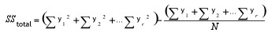
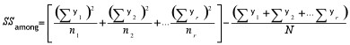
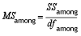
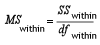
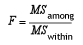

::: {style="DISPLAY: none"}
{#d2h_url_template}{#d2h_package_url style="WIDTH: 0px; DISPLAY: none; HEIGHT: 0px"}
:::

:::: {.d2h_secondary_topic style="PADDING-BOTTOM: 10pt; MARGIN: 0pt; PADDING-LEFT: 0pt; PADDING-RIGHT: 0pt; PADDING-TOP: 0pt"}
#### Anova Test {#anova-test style="tab-stops: 0pt"}

 

**Anova** stands for **Analysis Of Variance**. It is a technique to test the hypothesis that the means among two or more groups of data are equal and thereby, testing the differences between their variances, under the assumption that the sampled groups are normally distributed.

 

The test actually compares the variation between the groups with the variation within the groups and produces the results based on the values of these variations. If the between variation is larger than the within variation, the means of the groups will not be equal. If both these variations are of approximately the same size, then there will not be any significant difference between the means.

[]{style="COLOR: black"} 

Steps to perform an Anova test

 

The null hypothesis is that there is no difference between the means and the alternative hypothesis is that at least one mean is different.

 

The following assumptions must be satisfied before performing the test.

 

[·      ]{style="FONT-FAMILY: Symbol"}The groups from which the samples were obtained must be normally distributed.

[·      ]{style="FONT-FAMILY: Symbol"}The groups are sampled randomly.

[·      ]{style="FONT-FAMILY: Symbol"}The samples must be independent.

[·      ]{style="FONT-FAMILY: Symbol"}The variances of the groups must be equal.

[·      ]{style="FONT-FAMILY: Symbol"}The null hypothesis.

 

 

1.   Calculate the **Sum of Squares** for total, between and within variations.

 

Total Variation

 

{border="0"}

 

 

Between Variation

 

{border="0"}

 

Where,

y is the individual y points of the series,

r is the number of series present,

N is the total number of y points for all the series and

n is the number of y points in each series.

 

Within Variation

*[]{style="FONT-FAMILY: 'Segoe UI','sans-serif'"}* 

*SSwithin = SStotal - SSamong*

 

2.   Using the above quantities, calculate the **degrees of freedom(*[df]{style="FONT-SIZE: 8pt"}*)** for these variations.

 

Between Variation

*[]{style="FONT-FAMILY: 'Segoe UI','sans-serif'"}* 

*dfamong = r-1*

*[]{style="COLOR: black; FONT-SIZE: 8pt"}* 

Within Variation      

*[]{style="FONT-FAMILY: 'Segoe UI','sans-serif'"}* 

*dfwithin = N-r*

*[]{style="COLOR: black; FONT-SIZE: 8pt"}* 

Where,

r is the number of series present and

N is the total number of Y points for all the series.

*[]{style="COLOR: black; FONT-SIZE: 8pt"}* 

3.   As the next step, calculate the Mean Squares of these variations. The mean square for a variation can be calculated simply by dividing its sum of square by its degrees of freedom.

 

Between Variation

 

{border="0"}

*[]{style="COLOR: black; FONT-SIZE: 8pt"}* 

Within Variation      

 

{border="0"}

 

4.   Finally, calculate **F Ratio** as below and get the **F Critical Value**.

 

{border="0"}

*[]{style="COLOR: black; FONT-SIZE: 8pt"}* 

5.   Make your decision as below.

 

[·      ]{style="FONT-FAMILY: Symbol"}[•]{style="FONT-FAMILY: 'Arial Black','sans-serif'"} If the *between* variance is smaller than the *within* variance, then the *means* are really close to each other and you will fail to reject the null hypothesis.

[·      ]{style="FONT-FAMILY: Symbol"}[•]{style="FONT-FAMILY: 'Arial Black','sans-serif'"} If the F ratio is greater than the F critical value, then  the decision will be to reject the null hypothesis and thereby conclude that at least one of the means is different.

 

APIs Used

 

Essential Chart provides support to perform Anova Test by implementing a method named Anova in the **BasicStatisticalFormulas** class. This method does the above described calculations and returns the test results as an instance of **AnovaResult** class. The AnovaResult is a class implemented to store the anova test results such as  sum of squares, degrees of freedom and mean squares for different variations and also stores the **FRatio** and **FCriticalValue** of the test. Below is a detailed table for the Anova method.

 

::: {align="center"}
+-----------------------+-----------------------------------------------------------------------------------------------------------------------------------------------------------------------------------+-----------------------------------------------------------------------+
| Method Name           | Parameters                                                                                                                                                                        | Return Values                                                         |
+-----------------------+-----------------------------------------------------------------------------------------------------------------------------------------------------------------------------------+-----------------------------------------------------------------------+
| Anova                 | 1\. Probability: the alpha value (probability).                                                                                                                                   | An Anova has the following members:                                   |
|                       |                                                                                                                                                                                   |                                                                       |
|                       | 2\. InputSeries: references to two or more input series. Each series must exist in the series collection at the time of the method call, and have the same number of data points. | [·      ]{style="FONT-FAMILY: Symbol"}DegreeOfFreedomBetweenGroups    |
|                       |                                                                                                                                                                                   |                                                                       |
|                       |                                                                                                                                                                                   | [·      ]{style="FONT-FAMILY: Symbol"}DegreeOfFreedomTotal            |
|                       |                                                                                                                                                                                   |                                                                       |
|                       |                                                                                                                                                                                   | [·      ]{style="FONT-FAMILY: Symbol"}DegreeOfFreedomWithinGroups     |
|                       |                                                                                                                                                                                   |                                                                       |
|                       |                                                                                                                                                                                   | [·      ]{style="FONT-FAMILY: Symbol"}FCriticalValue                  |
|                       |                                                                                                                                                                                   |                                                                       |
|                       |                                                                                                                                                                                   | [·      ]{style="FONT-FAMILY: Symbol"}FRatio                          |
|                       |                                                                                                                                                                                   |                                                                       |
|                       |                                                                                                                                                                                   | [·      ]{style="FONT-FAMILY: Symbol"}MeanSquareVarianceBetweenGroups |
|                       |                                                                                                                                                                                   |                                                                       |
|                       |                                                                                                                                                                                   | [·      ]{style="FONT-FAMILY: Symbol"}MeanSquareVarianceWithinGroups  |
|                       |                                                                                                                                                                                   |                                                                       |
|                       |                                                                                                                                                                                   | [·      ]{style="FONT-FAMILY: Symbol"}SumOfSquaresBetweenGroups       |
|                       |                                                                                                                                                                                   |                                                                       |
|                       |                                                                                                                                                                                   | [·      ]{style="FONT-FAMILY: Symbol"}SumOfSquaresTotal               |
|                       |                                                                                                                                                                                   |                                                                       |
|                       |                                                                                                                                                                                   | [·      ]{style="FONT-FAMILY: Symbol"}SumOfSquaresWithinGroups        |
+-----------------------+-----------------------------------------------------------------------------------------------------------------------------------------------------------------------------------+-----------------------------------------------------------------------+
:::

 

Here is a sample code snippet to simulate an Anova test.

 

+-----------------------------------------------------------------------------------------------------------------------------------------------------------+
| **[\[C#\]]{style="FONT-FAMILY: 'Courier New'; COLOR: black"}**                                                                                            |
|                                                                                                                                                           |
| []{style="COLOR: black; FONT-SIZE: 12pt"}                                                                                                                 |
|                                                                                                                                                           |
| [AnovaResult ar = BasicStatisticalFormulas.Anova(confidenceLevel,]{style="FONT-FAMILY: 'Courier New'; COLOR: black"}                                      |
|                                                                                                                                                           |
| [new]{style="FONT-FAMILY: 'Courier New'; COLOR: blue"}[ ChartSeries\[\]{ series1, series2, series3} );]{style="FONT-FAMILY: 'Courier New'; COLOR: black"} |
+-----------------------------------------------------------------------------------------------------------------------------------------------------------+

 

+---------------------------------------------------------------------------------------------------------------------------------------------------------------------------------------------------------------------------------------------------------------------------------------------------------------------------------------------------------------------------------------------------------------------------------------------+
| **[\[VB]{style="FONT-FAMILY: 'Courier New'; COLOR: black"}[.NET]{style="FONT-FAMILY: 'Courier New'; COLOR: black"}[\]]{style="FONT-FAMILY: 'Courier New'; COLOR: black"}**                                                                                                                                                                                                                                                                  |
|                                                                                                                                                                                                                                                                                                                                                                                                                                             |
| []{style="COLOR: black; FONT-SIZE: 12pt"}                                                                                                                                                                                                                                                                                                                                                                                                   |
|                                                                                                                                                                                                                                                                                                                                                                                                                                             |
| [Dim]{style="FONT-FAMILY: 'Courier New'; COLOR: blue"}[ ar ]{style="FONT-FAMILY: 'Courier New'; COLOR: black"}[As]{style="FONT-FAMILY: 'Courier New'; COLOR: blue"}[ AnovaResult = BasicStatisticalFormulas.Anova(confidenceLevel, ]{style="FONT-FAMILY: 'Courier New'; COLOR: black"}[New]{style="FONT-FAMILY: 'Courier New'; COLOR: blue"}[ ChartSeries(){ series1, series2, series3})]{style="FONT-FAMILY: 'Courier New'; COLOR: black"} |
+---------------------------------------------------------------------------------------------------------------------------------------------------------------------------------------------------------------------------------------------------------------------------------------------------------------------------------------------------------------------------------------------------------------------------------------------+

 

The following image displays the results of an ANOVA test.

 

{border="0"}

 

Figure 343: Anova Test

 

[]{#p218} 

[]{#related-topics}
::::
