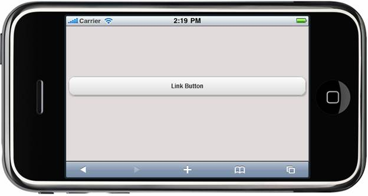
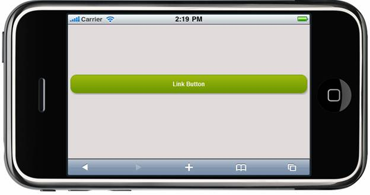

::: {style="DISPLAY: none"}
{#d2h_url_template} {#d2h_package_url style="WIDTH: 0px; DISPLAY: none; HEIGHT: 0px"}
:::

::: {.d2h_secondary_topic style="PADDING-BOTTOM: 10pt; MARGIN: 0pt; PADDING-LEFT: 0pt; PADDING-RIGHT: 0pt; PADDING-TOP: 0pt"}
##### Appearance {#appearance style="tab-stops: 0pt"}

The ActionLink Button control supports built-in themes that give high visual appeal that are suitable for various layouts. It supports the following four built-in Syncfusion themes to enhance the look and feel:

[·      ]{style="FONT-FAMILY: Symbol"} [BlueLight]{style="FONT-FAMILY: 'Arial','sans-serif'"}

[·      ]{style="FONT-FAMILY: Symbol"} [DarkNight]{style="FONT-FAMILY: 'Arial','sans-serif'"}

[·      ]{style="FONT-FAMILY: Symbol"} [MetroBlue]{style="FONT-FAMILY: 'Arial','sans-serif'"}

[·      ]{style="FONT-FAMILY: Symbol"} [Spinach]{style="FONT-FAMILY: 'Arial','sans-serif'"}

Properties

+---------------------------------------------------------------------------+------------------------------------------------------------------+----------------------------------+----------------------------------+-----------------------------------+
| Name                                                                      | Description                                                      | Type of the Property             | Value it Accepts                 | Dependency                        |
+---------------------------------------------------------------------------+------------------------------------------------------------------+----------------------------------+----------------------------------+-----------------------------------+
| []{style="FONT-WEIGHT: normal"}                                           | [Used to define Syncfusion themes.]{style="FONT-WEIGHT: normal"} | enum                             | MobSkins.BlueLight,              | [NA]{style="FONT-WEIGHT: normal"} |
|                                                                           |                                                                  |                                  |                                  |                                   |
| []{style="FONT-WEIGHT: normal"}                                           |                                                                  | []{style="FONT-WEIGHT: normal"}  | MobSkins.DarkNight,              |                                   |
|                                                                           |                                                                  |                                  |                                  |                                   |
| []{style="FONT-WEIGHT: normal"}                                           |                                                                  |                                  | MobSkins.MetroBlue,              |                                   |
|                                                                           |                                                                  |                                  |                                  |                                   |
| [AutoFormat]{style="FONT-WEIGHT: normal"} []{style="FONT-WEIGHT: normal"} |                                                                  |                                  | MobSkins.Spinach                 |                                   |
|                                                                           |                                                                  |                                  |                                  |                                   |
| []{style="FONT-WEIGHT: normal"}                                           |                                                                  |                                  | []{style="FONT-WEIGHT: normal"}  |                                   |
|                                                                           |                                                                  |                                  |                                  |                                   |
| []{style="FONT-WEIGHT: normal"}                                           |                                                                  |                                  |                                  |                                   |
|                                                                           |                                                                  |                                  |                                  |                                   |
| []{style="FONT-WEIGHT: normal"}                                           |                                                                  |                                  |                                  |                                   |
+---------------------------------------------------------------------------+------------------------------------------------------------------+----------------------------------+----------------------------------+-----------------------------------+

 

Using Builder

The following steps explain how to customize the appearance of the ActionLink Button control using Builder.

1.   In the **view**, invoke the **ActionLink Button** helper with the text of the button as the first argument followed by the **AutoFormat** method with the desired theme as the argument.

 

+----------------------------------------------------------------------------------------------------------------------------------------------------------------------------------------------------------------------------------------------------------------------------------------------------------------------------------------------------------------------------------------------------------------------------------------------------------------------------------------------------------------------+
| **[\[ASPX\]]{style="FONT-FAMILY: 'Courier New'"}**                                                                                                                                                                                                                                                                                                                                                                                                                                                                   |
|                                                                                                                                                                                                                                                                                                                                                                                                                                                                                                                      |
| [        [\<%]{style="BACKGROUND: yellow"}[=]{style="COLOR: blue"} Html.MobSyncfusion()]{style="FONT-FAMILY: 'Courier New'"} [.ActionLink([\"Link Button\"]{style="COLOR: #a31515"}, [\"ActionLink\"]{style="COLOR: #a31515"}, [\"Button\"]{style="COLOR: #a31515"}).AutoFormat([MobSkins]{style="COLOR: #2b91af"}.Spinach)]{style="FONT-FAMILY: 'Courier New'"}                                                                                                                                                     |
|                                                                                                                                                                                                                                                                                                                                                                                                                                                                                                                      |
| [ ]{style="FONT-FAMILY: 'Courier New'"} [       ]{style="FONT-FAMILY: 'Courier New'"} [%\>]{style="FONT-FAMILY: 'Courier New'; BACKGROUND: yellow"}                                                                                                                                                                                                                                                                                                                                                                  |
|                                                                                                                                                                                                                                                                                                                                                                                                                                                                                                                      |
| **[\[Razor\]]{style="FONT-FAMILY: 'Courier New'"}**                                                                                                                                                                                                                                                                                                                                                                                                                                                                  |
|                                                                                                                                                                                                                                                                                                                                                                                                                                                                                                                      |
| [        ]{style="FONT-FAMILY: 'Courier New'; COLOR: blue"} [\@{]{style="FONT-FAMILY: 'Courier New'; BACKGROUND: yellow"} []{style="FONT-FAMILY: 'Courier New'"} [Html.MobSyncfusion()]{style="FONT-FAMILY: 'Courier New'"} [.ActionLink([\"Link Button\"]{style="COLOR: #a31515"}, [\"ActionLink\"]{style="COLOR: #a31515"}, [\"Button\"]{style="COLOR: #a31515"}).AutoFormat([MobSkins]{style="COLOR: #2b91af"}.Spinach).]{style="FONT-FAMILY: 'Courier New'"} [Render(); ]{style="FONT-FAMILY: 'Courier New'"} [\ |
|         [}]{style="BACKGROUND: yellow"}]{style="FONT-FAMILY: 'Courier New'"}                                                                                                                                                                                                                                                                                                                                                                                                                                         |
+----------------------------------------------------------------------------------------------------------------------------------------------------------------------------------------------------------------------------------------------------------------------------------------------------------------------------------------------------------------------------------------------------------------------------------------------------------------------------------------------------------------------+

 

2.   Build and run the application.

 

The output is shown in the following screenshot.[]{style="COLOR: black"}

{border="0"}

Figure 206: ActionLink Button---AutoFormat Property

 

{border="0"}

Figure 207: ActionLink Button while Clicking

 

 

[]{#related-topics}
:::
