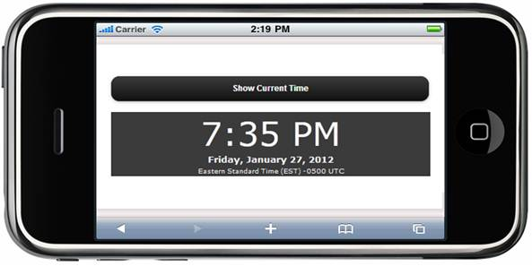
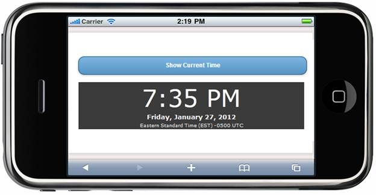
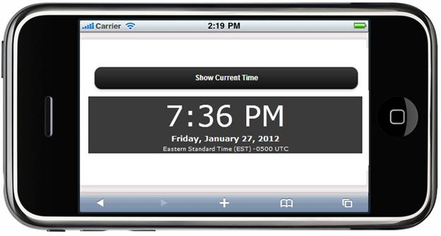

::: {style="DISPLAY: none"}
{#d2h_url_template} {#d2h_package_url style="WIDTH: 0px; DISPLAY: none; HEIGHT: 0px"}
:::

::: {.d2h_secondary_topic style="PADDING-BOTTOM: 10pt; MARGIN: 0pt; PADDING-LEFT: 0pt; PADDING-RIGHT: 0pt; PADDING-TOP: 0pt"}
##### Appearance {#appearance style="tab-stops: 0pt"}

The AjaxActionLink Button control supports built-in themes that provide high visual appeal that are suitable for various layouts. It supports the following four built-in Syncfusion themes to enhance the look and feel:

[·      ]{style="FONT-FAMILY: Symbol"} [BlueLight]{style="FONT-FAMILY: 'Arial','sans-serif'"}

[·      ]{style="FONT-FAMILY: Symbol"} [DarkNight]{style="FONT-FAMILY: 'Arial','sans-serif'"}

[·      ]{style="FONT-FAMILY: Symbol"} [MetroBlue]{style="FONT-FAMILY: 'Arial','sans-serif'"}

[·      ]{style="FONT-FAMILY: Symbol"} [Spinach]{style="FONT-FAMILY: 'Arial','sans-serif'"}

 

Properties

+---------------------------------------------------------------------------+------------------------------------------------------------+----------------------------------+-----------------------------------------------+-----------------------------------+
| Name                                                                      | Description                                                | Type of the Property             | Value it Accepts                              | Dependency                        |
+---------------------------------------------------------------------------+------------------------------------------------------------+----------------------------------+-----------------------------------------------+-----------------------------------+
| []{style="FONT-WEIGHT: normal"}                                           | [To define syncfusion themes]{style="FONT-WEIGHT: normal"} | enum                             | [MobSkins]{style="COLOR: #2b91af"}.BlueLight, | [NA]{style="FONT-WEIGHT: normal"} |
|                                                                           |                                                            |                                  |                                               |                                   |
| []{style="FONT-WEIGHT: normal"}                                           |                                                            | []{style="FONT-WEIGHT: normal"}  | [MobSkins]{style="COLOR: #2b91af"}.DarkNight, |                                   |
|                                                                           |                                                            |                                  |                                               |                                   |
| []{style="FONT-WEIGHT: normal"}                                           |                                                            |                                  | [MobSkins]{style="COLOR: #2b91af"}.MetroBlue, |                                   |
|                                                                           |                                                            |                                  |                                               |                                   |
| [AutoFormat]{style="FONT-WEIGHT: normal"} []{style="FONT-WEIGHT: normal"} |                                                            |                                  | [MobSkins]{style="COLOR: #2b91af"}.Spinach    |                                   |
|                                                                           |                                                            |                                  |                                               |                                   |
| []{style="FONT-WEIGHT: normal"}                                           |                                                            |                                  | []{style="FONT-WEIGHT: normal"}               |                                   |
|                                                                           |                                                            |                                  |                                               |                                   |
| []{style="FONT-WEIGHT: normal"}                                           |                                                            |                                  |                                               |                                   |
|                                                                           |                                                            |                                  |                                               |                                   |
| []{style="FONT-WEIGHT: normal"}                                           |                                                            |                                  |                                               |                                   |
+---------------------------------------------------------------------------+------------------------------------------------------------+----------------------------------+-----------------------------------------------+-----------------------------------+

 

Using Builder

The following steps explain the appearance of the AjaxActionLink Button control using Builder.

 

1.   In the **view**, invoke the **AjaxActionLinkButton** helper with the text of the button as the first argument, followed by the **AutoFormat** method with the desired theme as the argument.

 

+------------------------------------------------------------------------------------------------------------------------------------------------------------------------------------------------------------------------------------------------------------------------------------------------------------------------------------------------------------------------------------------------------------------------------------------------------------------------------------------------------------------------------------------------------------------------------------------------------------------------------------------------------------------------------------------------------+
| **[\[ASPX\]]{style="FONT-FAMILY: 'Courier New'"}**                                                                                                                                                                                                                                                                                                                                                                                                                                                                                                                                                                                                                                                   |
|                                                                                                                                                                                                                                                                                                                                                                                                                                                                                                                                                                                                                                                                                                      |
| [\<%]{style="FONT-FAMILY: 'Courier New'; BACKGROUND: yellow"} [=]{style="FONT-FAMILY: 'Courier New'; COLOR: blue"} [ Ajax.MobSyncfusion().ActionLink([\"Link Button\"]{style="COLOR: #a31515"}, [\"ShowTime\"]{style="COLOR: #a31515"}, [new]{style="COLOR: blue"} { }, [new]{style="COLOR: blue"}[AjaxOptions]{style="COLOR: #2b91af"} { UpdateTargetId = [\"ShowTime\"]{style="COLOR: #a31515"}, InsertionMode = [InsertionMode]{style="COLOR: #2b91af"}.Replace }, [new]{style="COLOR: blue"} { }).AutoFormat([MobSkins]{style="COLOR: #2b91af"}.DarkNight)[%\>]{style="BACKGROUND: yellow"}]{style="FONT-FAMILY: 'Courier New'"}                                                                 |
|                                                                                                                                                                                                                                                                                                                                                                                                                                                                                                                                                                                                                                                                                                      |
| **[\[Razor\]]{style="FONT-FAMILY: 'Courier New'"}**                                                                                                                                                                                                                                                                                                                                                                                                                                                                                                                                                                                                                                                  |
|                                                                                                                                                                                                                                                                                                                                                                                                                                                                                                                                                                                                                                                                                                      |
| [        ]{style="FONT-FAMILY: 'Courier New'; COLOR: blue"} [\@{]{style="FONT-FAMILY: 'Courier New'; BACKGROUND: yellow"} []{style="FONT-FAMILY: 'Courier New'"} [Ajax.MobSyncfusion().ActionLink([\"Link Button\"]{style="COLOR: #a31515"}, [\"ShowTime\"]{style="COLOR: #a31515"}, [new]{style="COLOR: blue"} { }, [new]{style="COLOR: blue"}[AjaxOptions]{style="COLOR: #2b91af"} { UpdateTargetId = [\"ShowTime\"]{style="COLOR: #a31515"}, InsertionMode = [InsertionMode]{style="COLOR: #2b91af"}.Replace }, [new]{style="COLOR: blue"} { }).AutoFormat([MobSkins]{style="COLOR: #2b91af"}.DarkNight).Render();]{style="FONT-FAMILY: 'Courier New'"} []{style="FONT-FAMILY: 'Courier New'"} [\ |
|         [}]{style="BACKGROUND: yellow"}]{style="FONT-FAMILY: 'Courier New'"}                                                                                                                                                                                                                                                                                                                                                                                                                                                                                                                                                                                                                         |
+------------------------------------------------------------------------------------------------------------------------------------------------------------------------------------------------------------------------------------------------------------------------------------------------------------------------------------------------------------------------------------------------------------------------------------------------------------------------------------------------------------------------------------------------------------------------------------------------------------------------------------------------------------------------------------------------------+

 

2.   Build and run the application.

 

The output is shown in the following screenshot.[]{style="FONT-FAMILY: 'Calibri','sans-serif'; COLOR: black"}

[]{style="FONT-FAMILY: 'Calibri','sans-serif'; COLOR: black"} 

[ ]{style="BORDER-BOTTOM: black 1pt; BORDER-LEFT: black 1pt; PADDING-BOTTOM: 0pt; PADDING-LEFT: 0pt; LAYOUT-GRID-MODE: line; PADDING-RIGHT: 0pt; FONT-FAMILY: 'Times New Roman','serif'; BACKGROUND: black; COLOR: black; FONT-SIZE: 0pt; BORDER-TOP: black 1pt; BORDER-RIGHT: black 1pt; PADDING-TOP: 0pt"} {border="0"}

Figure 228: Ajax ActionLink Button---AutoFormat Property

While clicking the AJAX action link the theme is applied.

{border="0"}

Figure 229: AJAX ActionLink after Theme is Applied

 

The updated view can be shown as follows:

{border="0"}

Figure 230: Updated Time after AJAX Action Link is Clicked

 

[]{#related-topics}
:::
