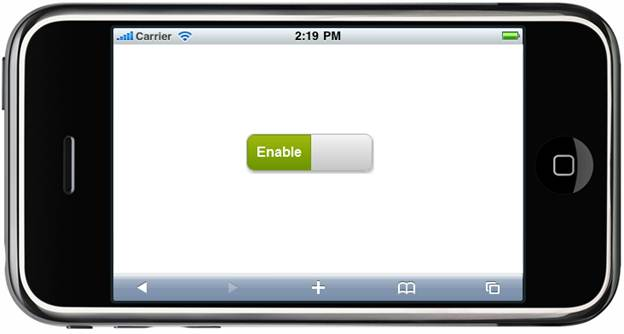

::: {style="DISPLAY: none"}
{#d2h_url_template} {#d2h_package_url style="WIDTH: 0px; DISPLAY: none; HEIGHT: 0px"}
:::

::: {.d2h_secondary_topic style="PADDING-BOTTOM: 10pt; MARGIN: 0pt; PADDING-LEFT: 0pt; PADDING-RIGHT: 0pt; PADDING-TOP: 0pt"}
##### Appearance {#appearance style="tab-stops: 0pt"}

The ToggleButton control supports built-in themes that provide stunning visuals that are suitable for various layouts. It supports the following four built-in Syncfusion themes to enhance the look and feel:

[·      ]{style="FONT-FAMILY: Symbol"} [BlueLight]{style="FONT-FAMILY: 'Arial','sans-serif'"}

[·      ]{style="FONT-FAMILY: Symbol"} [DarkNight]{style="FONT-FAMILY: 'Arial','sans-serif'"}

[·      ]{style="FONT-FAMILY: Symbol"} [MetroBlue]{style="FONT-FAMILY: 'Arial','sans-serif'"}

[·      ]{style="FONT-FAMILY: Symbol"} [Spinach]{style="FONT-FAMILY: 'Arial','sans-serif'"}

Properties

 

+---------------------------------------------------------------------------+----------------------------------------------------------+----------------------------------+-----------------------------------------------+-----------------------------------+
| Name                                                                      | Description                                              | Type of the Property             | Value it Accepts                              | Dependency                        |
+---------------------------------------------------------------------------+----------------------------------------------------------+----------------------------------+-----------------------------------------------+-----------------------------------+
| []{style="FONT-WEIGHT: normal"}                                           | [Defines syncfusion themes]{style="FONT-WEIGHT: normal"} | enum                             | [MobSkins]{style="COLOR: #2b91af"}.BlueLight, | [NA]{style="FONT-WEIGHT: normal"} |
|                                                                           |                                                          |                                  |                                               |                                   |
| []{style="FONT-WEIGHT: normal"}                                           |                                                          | []{style="FONT-WEIGHT: normal"}  | [MobSkins]{style="COLOR: #2b91af"}.DarkNight, |                                   |
|                                                                           |                                                          |                                  |                                               |                                   |
| []{style="FONT-WEIGHT: normal"}                                           |                                                          |                                  | [MobSkins]{style="COLOR: #2b91af"}.MetroBlue, |                                   |
|                                                                           |                                                          |                                  |                                               |                                   |
| [AutoFormat]{style="FONT-WEIGHT: normal"} []{style="FONT-WEIGHT: normal"} |                                                          |                                  | [MobSkins]{style="COLOR: #2b91af"}.Spinach    |                                   |
|                                                                           |                                                          |                                  |                                               |                                   |
| []{style="FONT-WEIGHT: normal"}                                           |                                                          |                                  | []{style="FONT-WEIGHT: normal"}               |                                   |
|                                                                           |                                                          |                                  |                                               |                                   |
| []{style="FONT-WEIGHT: normal"}                                           |                                                          |                                  |                                               |                                   |
|                                                                           |                                                          |                                  |                                               |                                   |
| []{style="FONT-WEIGHT: normal"}                                           |                                                          |                                  |                                               |                                   |
+---------------------------------------------------------------------------+----------------------------------------------------------+----------------------------------+-----------------------------------------------+-----------------------------------+

 

Using Builder

The following steps explain the appearance of the ToggleButton control using Builder:

4.   In the **view**, invoke the **ToggleButton** helper with the control ID as the first argument followed by the **AutoFormat** method with the desired theme as the argument.

 

+--------------------------------------------------------------------------------------------------------------------------------------------+
| **[\[ASPX\]]{style="FONT-FAMILY: 'Courier New'"}**                                                                                         |
|                                                                                                                                            |
| [        [\<%]{style="BACKGROUND: yellow"}[=]{style="COLOR: blue"}\                                                                        |
|         Html.MobSyncfusion().ToggleButton([\"Togg\"]{style="COLOR: #a31515"})\                                                             |
|             .ToggleState([MobToggleState]{style="COLOR: #2b91af"}.On)\                                                                     |
|             .OnText([\"Enable\"]{style="COLOR: #a31515"})\                                                                                 |
|             .OffText([\"Disable\"]{style="COLOR: #a31515"})\                                                                               |
|             .AutoFormat([MobSkins]{style="COLOR: #2b91af"}.Spinach) [%\>]{style="BACKGROUND: yellow"}]{style="FONT-FAMILY: 'Courier New'"} |
|                                                                                                                                            |
| **[\[Razor\]]{style="FONT-FAMILY: 'Courier New'"}**                                                                                        |
|                                                                                                                                            |
| [        ]{style="FONT-FAMILY: 'Courier New'; COLOR: blue"} [\@{]{style="FONT-FAMILY: 'Courier New'; BACKGROUND: yellow"} [\               |
| ]{style="FONT-FAMILY: 'Courier New'"} [         Html.MobSyncfusion().ToggleButton([\"Togg\"]{style="COLOR: #a31515"})\                     |
|               .ToggleState([MobToggleState]{style="COLOR: #2b91af"}.On)\                                                                   |
|               .OnText([\"Enable\"]{style="COLOR: #a31515"})\                                                                               |
|               .OffText([\"Disable\"]{style="COLOR: #a31515"})\                                                                             |
|               .AutoFormat([MobSkins]{style="COLOR: #2b91af"}.Spinach)\                                                                     |
|               .Render(); ]{style="FONT-FAMILY: 'Courier New'"} [}]{style="FONT-FAMILY: 'Courier New'; BACKGROUND: yellow"}                 |
+--------------------------------------------------------------------------------------------------------------------------------------------+

 

5.   Build and run the application.

 

Using Properties Model

The following steps explain how to set the appearance of the ToggleButton control using the properties model:

[]{style="FONT-SIZE: 9pt"} 

4.  [In the **controller**, create an instance for the **MobToggleButtonModel** and pass the instance through **ViewData** to **View** as given below:]{style="FONT-FAMILY: 'Arial','sans-serif'"}

*[[]{style="TEXT-DECORATION: none"}]{.underline}*  

+-----------------------------------------------------------------------------------------------------------------------------------------------------------------------------------------------------------------+
| **[Controller]{style="FONT-FAMILY: 'Courier New'"}**                                                                                                                                                            |
|                                                                                                                                                                                                                 |
| [        [public]{style="COLOR: blue"}[ActionResult]{style="COLOR: #2b91af"} ToggleButton()]{style="FONT-FAMILY: 'Courier New'"}                                                                                |
|                                                                                                                                                                                                                 |
| [        {]{style="FONT-FAMILY: 'Courier New'"}                                                                                                                                                                 |
|                                                                                                                                                                                                                 |
|             [MobToggleButtonModel]{style="FONT-FAMILY: 'Courier New'; COLOR: #2b91af"}[ model = [new]{style="COLOR: blue"}[MobToggleButtonModel]{style="COLOR: #2b91af"}()]{style="FONT-FAMILY: 'Courier New'"} |
|                                                                                                                                                                                                                 |
| [            {]{style="FONT-FAMILY: 'Courier New'"}                                                                                                                                                             |
|                                                                                                                                                                                                                 |
| [                ]{style="FONT-FAMILY: 'Courier New'"} [OnText=[\"Enable\"]{style="COLOR: #a31515"},]{style="FONT-FAMILY: 'Courier New'"}                                                                       |
|                                                                                                                                                                                                                 |
| [                OffText=[\"Disable\"]{style="COLOR: #a31515"},]{style="FONT-FAMILY: 'Courier New'"}                                                                                                            |
|                                                                                                                                                                                                                 |
| [                AutoFormat=[MobSkins]{style="COLOR: #2b91af"}.Spinach]{style="FONT-FAMILY: 'Courier New'"}                                                                                                     |
|                                                                                                                                                                                                                 |
| [            };]{style="FONT-FAMILY: 'Courier New'"}                                                                                                                                                            |
|                                                                                                                                                                                                                 |
| [            ViewData\[[\"Toggle\"]{style="COLOR: #a31515"}\] = model;]{style="FONT-FAMILY: 'Courier New'"}                                                                                                     |
|                                                                                                                                                                                                                 |
| [            [return]{style="COLOR: blue"} View();]{style="FONT-FAMILY: 'Courier New'"}                                                                                                                         |
|                                                                                                                                                                                                                 |
| [       }]{style="FONT-FAMILY: 'Courier New'"} []{style="BACKGROUND: yellow"}                                                                                                                                   |
+-----------------------------------------------------------------------------------------------------------------------------------------------------------------------------------------------------------------+

 

5.   In the **view**, invoke the **ToggleButton** helper with the **ViewData** key as the first argument.

 

+-------------------------------------------------------------------------------------------------------------------------------------------------------------------------------------------------------------------------------------------------------------------------------------------------------------------------------------+
| **[\[ASPX\]]{style="FONT-FAMILY: 'Courier New'"}**                                                                                                                                                                                                                                                                                  |
|                                                                                                                                                                                                                                                                                                                                     |
| [       [\<%]{style="BACKGROUND: yellow"}[=]{style="COLOR: blue"}Html.MobSyncfusion().ToggleButton]{style="FONT-FAMILY: 'Courier New'"} [([\"Toggle\"]{style="COLOR: #a31515"}]{style="FONT-FAMILY: 'Courier New'"} [)[%\>]{style="BACKGROUND: yellow"}]{style="FONT-FAMILY: 'Courier New'"} []{style="FONT-FAMILY: 'Courier New'"} |
|                                                                                                                                                                                                                                                                                                                                     |
| **[]{style="FONT-FAMILY: 'Courier New'"}**                                                                                                                                                                                                                                                                                          |
|                                                                                                                                                                                                                                                                                                                                     |
| **[\[Razor\]]{style="FONT-FAMILY: 'Courier New'"}**                                                                                                                                                                                                                                                                                 |
|                                                                                                                                                                                                                                                                                                                                     |
| **[      ]{style="FONT-FAMILY: 'Courier New'"}** [\@{]{style="FONT-FAMILY: 'Courier New'; BACKGROUND: yellow"} [Html.MobSyncfusion().ToggleButton([\"Toggle\"]{style="COLOR: #a31515"}).Render();[}]{style="BACKGROUND: yellow"}]{style="FONT-FAMILY: 'Courier New'"}                                                               |
+-------------------------------------------------------------------------------------------------------------------------------------------------------------------------------------------------------------------------------------------------------------------------------------------------------------------------------------+

[]{style="BACKGROUND: yellow"} 

6.   Build and run the application.

The output is shown in the following screenshot:

 

{border="0"}

Figure 168: ToggleButton---AutoFormat Property

 

[]{#related-topics}
:::
