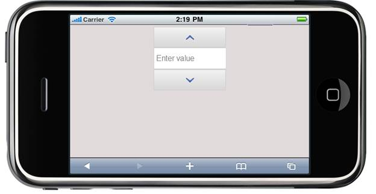

::: {style="DISPLAY: none"}
{#d2h_url_template} {#d2h_package_url style="WIDTH: 0px; DISPLAY: none; HEIGHT: 0px"}
:::

::: {.d2h_secondary_topic style="PADDING-BOTTOM: 10pt; MARGIN: 0pt; PADDING-LEFT: 0pt; PADDING-RIGHT: 0pt; PADDING-TOP: 0pt"}
#### Appearance {#appearance style="tab-stops: 0pt"}

Numeric textbox supports in-built themes that gives high visual appeal that are suitable for various layouts. Numeric textbox supports the following four in-built Syncfusion themes to enhance the look and feel:

[·      ]{style="FONT-FAMILY: Symbol"}BlueLight

[·      ]{style="FONT-FAMILY: Symbol"}DarkNight

[·      ]{style="FONT-FAMILY: Symbol"}MetroBlue

[·      ]{style="FONT-FAMILY: Symbol"}Spinach

Properties

 

+-------------+---------------------------+----------------------+-----------------------------------------------+-------------+
| Name        | Description               | Type of the property | Value it accepts                              | Dependency  |
+-------------+---------------------------+----------------------+-----------------------------------------------+-------------+
| AutoFormat  | Defines the mobile themes | enum                 | [MobSkins]{style="COLOR: #2b91af"}.BlueLight, | NA          |
|             |                           |                      |                                               |             |
|             |                           |                      | [MobSkins]{style="COLOR: #2b91af"}.DarkNight, |             |
|             |                           |                      |                                               |             |
|             |                           |                      | [MobSkins]{style="COLOR: #2b91af"}.MetroBlue, |             |
|             |                           |                      |                                               |             |
|             |                           |                      | [MobSkins]{style="COLOR: #2b91af"}.Spinach    |             |
|             |                           |                      |                                               |             |
|             |                           |                      |                                               |             |
+-------------+---------------------------+----------------------+-----------------------------------------------+-------------+

**[]{style="FONT-FAMILY: 'Calibri','sans-serif'"}**  

Using Builder

The following steps explain the appearance of Numeric textbox control using Builder:

1.   In **View**, invoke the Numeric textbox helper with the Control ID as first argument followed by the AutoFormat method with the desired theme as the argument.

[]{style="FONT-FAMILY: 'Calibri','sans-serif'"} 

+--------------------------------------------------------------------------------------------------------------------------------------------------------------------------------------------------------------------------------------------------------------------------+
| **[\[ASPX\]]{style="FONT-FAMILY: 'Courier New'"}**                                                                                                                                                                                                                       |
|                                                                                                                                                                                                                                                                          |
| [\<%]{style="FONT-FAMILY: 'Courier New'; BACKGROUND: yellow"} [{]{style="FONT-FAMILY: 'Courier New'"}                                                                                                                                                                    |
|                                                                                                                                                                                                                                                                          |
| [                              Html.MobSyncfusion().NumericTextbox([\"myNum\"]{style="COLOR: #a31515"}).AutoFormat([MobSkins]{style="COLOR: #2b91af"}.BlueLight).WaterMarkText([\"Enter value\"]{style="COLOR: #a31515"}).Render();]{style="FONT-FAMILY: 'Courier New'"} |
|                                                                                                                                                                                                                                                                          |
| [    }[%\>]{style="BACKGROUND: yellow"}]{style="FONT-FAMILY: 'Courier New'"}                                                                                                                                                                                             |
|                                                                                                                                                                                                                                                                          |
| []{style="FONT-FAMILY: 'Courier New'; BACKGROUND: yellow"}                                                                                                                                                                                                               |
|                                                                                                                                                                                                                                                                          |
| **[\[Razor\]]{style="FONT-FAMILY: 'Courier New'"}**                                                                                                                                                                                                                      |
|                                                                                                                                                                                                                                                                          |
| [    [\@{]{style="BACKGROUND: yellow"}]{style="FONT-FAMILY: 'Courier New'"}                                                                                                                                                                                              |
|                                                                                                                                                                                                                                                                          |
| [        Html.MobSyncfusion().NumericTextbox([\"myNum\"]{style="COLOR: #a31515"}).AutoFormat([MobSkins]{style="COLOR: #2b91af"}.BlueLight).WaterMarkText([\"Enter value\"]{style="COLOR: #a31515"}).Render();]{style="FONT-FAMILY: 'Courier New'"}                       |
|                                                                                                                                                                                                                                                                          |
| [    [}]{style="BACKGROUND: yellow"}]{style="FONT-FAMILY: 'Courier New'"} []{style="FONT-FAMILY: Consolas; BACKGROUND: yellow; FONT-SIZE: 9.5pt"}                                                                                                                        |
+--------------------------------------------------------------------------------------------------------------------------------------------------------------------------------------------------------------------------------------------------------------------------+

 

2.   Build and run the application.

**[]{style="FONT-FAMILY: 'Calibri','sans-serif'; FONT-SIZE: 12pt"}**  

Using Properties Model

The following steps, explains the appearance of Numeric textbox control using the Properties model:

1.   In the **Controller**, create an instance for the **MobNumericModel** and pass the instance through **ViewData** to **View** as given below:**

*[[ []{style="TEXT-DECORATION: none"} ]{style="FONT-FAMILY: 'Calibri','sans-serif'"}]{.underline}*  

*[[ []{style="TEXT-DECORATION: none"} ]{style="FONT-FAMILY: 'Calibri','sans-serif'"}]{.underline}*  

+----------------------------------------------------------------------------------------------------------------------------------------------------------------------------------------------------------------------------------------------------------+
| **[\[Controller\]]{style="FONT-FAMILY: 'Courier New'"}**                                                                                                                                                                                                 |
|                                                                                                                                                                                                                                                          |
| [public]{style="FONT-FAMILY: 'Courier New'; COLOR: blue"} [ [ActionResult]{style="COLOR: #2b91af"} Index()]{style="FONT-FAMILY: 'Courier New'"}                                                                                                          |
|                                                                                                                                                                                                                                                          |
| [        {]{style="FONT-FAMILY: 'Courier New'"}                                                                                                                                                                                                          |
|                                                                                                                                                                                                                                                          |
| [            ]{style="FONT-FAMILY: 'Courier New'"} [NumericTextBoxModel]{style="FONT-FAMILY: 'Courier New'; COLOR: #2b91af"} [ myModel = [new]{style="COLOR: blue"}[NumericTextBoxModel]{style="COLOR: #2b91af"}();]{style="FONT-FAMILY: 'Courier New'"} |
|                                                                                                                                                                                                                                                          |
| []{style="FONT-FAMILY: 'Courier New'"}                                                                                                                                                                                                                   |
|                                                                                                                                                                                                                                                          |
| [            myModel.AutoFormat = [MobSkins]{style="COLOR: #2b91af"}.BlueLight;]{style="FONT-FAMILY: 'Courier New'"}                                                                                                                                     |
|                                                                                                                                                                                                                                                          |
| [            ViewData\[[\"myNumeric\"]{style="COLOR: #a31515"}\] = myModel;]{style="FONT-FAMILY: 'Courier New'"}                                                                                                                                         |
|                                                                                                                                                                                                                                                          |
| [            [return]{style="COLOR: blue"} View();]{style="FONT-FAMILY: 'Courier New'"}                                                                                                                                                                  |
|                                                                                                                                                                                                                                                          |
| [        }]{style="FONT-FAMILY: 'Courier New'"} []{style="FONT-FAMILY: Consolas; FONT-SIZE: 9.5pt"}                                                                                                                                                      |
|                                                                                                                                                                                                                                                          |
| []{style="FONT-FAMILY: Consolas; BACKGROUND: yellow; FONT-SIZE: 9.5pt"}                                                                                                                                                                                  |
+----------------------------------------------------------------------------------------------------------------------------------------------------------------------------------------------------------------------------------------------------------+

[]{style="FONT-FAMILY: Consolas; FONT-SIZE: 9.5pt"} 

2.   In **View**, invoke the Numeric textbox helper with the ViewData key as the first argument.

[]{style="FONT-FAMILY: 'Calibri','sans-serif'"} 

+--------------------------------------------------------------------------------------------------------------------------------------------------------------------------------+
| **[\[ASPX\]]{style="FONT-FAMILY: 'Courier New'"}**                                                                                                                             |
|                                                                                                                                                                                |
| [  ]{style="FONT-FAMILY: 'Courier New'"} [\<%]{style="FONT-FAMILY: 'Courier New'; BACKGROUND: yellow"} [{                                ]{style="FONT-FAMILY: 'Courier New'"} |
|                                                                                                                                                                                |
| [    Html.MobSyncfusion().NumericTextbox([\"myNumeric\")]{style="COLOR: #a31515"}]{style="FONT-FAMILY: 'Courier New'"}                                                         |
|                                                                                                                                                                                |
| [                          .Render();]{style="FONT-FAMILY: 'Courier New'"}                                                                                                     |
|                                                                                                                                                                                |
| [       }[%\>]{style="BACKGROUND: yellow"}]{style="FONT-FAMILY: 'Courier New'"}                                                                                                |
|                                                                                                                                                                                |
| **[\[Razor\]]{style="FONT-FAMILY: 'Courier New'"}**                                                                                                                            |
|                                                                                                                                                                                |
| [    ]{style="FONT-FAMILY: 'Courier New'"} [\@{]{style="FONT-FAMILY: 'Courier New'; BACKGROUND: yellow"} []{style="FONT-FAMILY: 'Courier New'"}                                |
|                                                                                                                                                                                |
| [           Html.MobSyncfusion().NumericTextbox([\"myNumeric\"]{style="COLOR: #a31515"})]{style="FONT-FAMILY: 'Courier New'"}                                                  |
|                                                                                                                                                                                |
| [                          .Render();]{style="FONT-FAMILY: Consolas; FONT-SIZE: 9.5pt"}                                                                                        |
|                                                                                                                                                                                |
| [       [}]{style="BACKGROUND: yellow"}]{style="FONT-FAMILY: Consolas; FONT-SIZE: 9.5pt"} []{style="FONT-FAMILY: Consolas; BACKGROUND: yellow; FONT-SIZE: 9.5pt"}              |
+--------------------------------------------------------------------------------------------------------------------------------------------------------------------------------+

[]{style="FONT-FAMILY: Consolas; BACKGROUND: yellow; FONT-SIZE: 9.5pt"} 

3.   Build and run the application.

 

The output is shown in the following screenshot:

{border="0"}

Figure 238 Numeric Textbox Control with BlueLight Theme

[]{#related-topics}
:::
