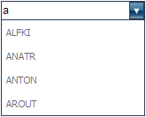

::: {style="DISPLAY: none"}
{#d2h_url_template}{#d2h_package_url style="WIDTH: 0px; DISPLAY: none; HEIGHT: 0px"}
:::

::: {.d2h_secondary_topic style="PADDING-BOTTOM: 10pt; MARGIN: 0pt; PADDING-LEFT: 0pt; PADDING-RIGHT: 0pt; PADDING-TOP: 0pt"}
#### Appearance {#appearance style="tab-stops: 0pt"}

Auto-complete textbox supports fourteen pre-defined skins to enhance the look and feel.

Properties

 

+-------------+--------------------------------------+------------------+---------------------------------------------------+-------------+
| Name        | Description                          | Type of property | Value it accepts                                  | Dependency  |
+-------------+--------------------------------------+------------------+---------------------------------------------------+-------------+
| AutoFormat  | Used to define the syncfusion themes | enum             | [Skins]{style="COLOR: #2b91af"}.Office2007Blue,   | NA          |
|             |                                      |                  |                                                   |             |
|             |                                      |                  | [Skins]{style="COLOR: #2b91af"}.Office2007Silver, |             |
|             |                                      |                  |                                                   |             |
|             |                                      |                  | [Skins]{style="COLOR: #2b91af"}.Office2007Black,  |             |
|             |                                      |                  |                                                   |             |
|             |                                      |                  | [Skins]{style="COLOR: #2b91af"}.Vista,            |             |
|             |                                      |                  |                                                   |             |
|             |                                      |                  | [Skins]{style="COLOR: #2b91af"}.Almond,           |             |
|             |                                      |                  |                                                   |             |
|             |                                      |                  | [Skins]{style="COLOR: #2b91af"}.Blueberry,        |             |
|             |                                      |                  |                                                   |             |
|             |                                      |                  | [Skins]{style="COLOR: #2b91af"}.Blend,            |             |
|             |                                      |                  |                                                   |             |
|             |                                      |                  | [Skins]{style="COLOR: #2b91af"}.Olive,            |             |
|             |                                      |                  |                                                   |             |
|             |                                      |                  | [Skins]{style="COLOR: #2b91af"}.Turquoise,        |             |
|             |                                      |                  |                                                   |             |
|             |                                      |                  | [Skins]{style="COLOR: #2b91af"}.Monochrome,       |             |
|             |                                      |                  |                                                   |             |
|             |                                      |                  | [Skins]{style="COLOR: #2b91af"}.Sandune,          |             |
|             |                                      |                  |                                                   |             |
|             |                                      |                  | [Skins]{style="COLOR: #2b91af"}.VS2010,           |             |
|             |                                      |                  |                                                   |             |
|             |                                      |                  | [Skins]{style="COLOR: #2b91af"}.Marble,           |             |
|             |                                      |                  |                                                   |             |
|             |                                      |                  | [Skins]{style="COLOR: #2b91af"}.Midnight          |             |
+-------------+--------------------------------------+------------------+---------------------------------------------------+-------------+

 

Using Builder

The following steps explain the setting of the Syncfusion theme for an auto-complete textbox using Builder.

1.   In **View**, invoke the auto-complete textbox helper with the control id as first argument, followed by the **AutoFormat** method with a desired theme as argument.

[]{style="FONT-FAMILY: 'Calibri','sans-serif'"} 

+--------------------------------------------------------------------------------------------------------------------------------------------------------------------------------------------------------------------------------------------+
| **[View\[aspx\]]{style="FONT-FAMILY: 'Courier New'"}**                                                                                                                                                                                     |
|                                                                                                                                                                                                                                            |
| [\<%]{style="FONT-FAMILY: 'Courier New'; BACKGROUND: yellow"}[=]{style="FONT-FAMILY: 'Courier New'; COLOR: blue"}[Html.Syncfusion().AutocompleteTextBox([\"myAutocomplete\"]{style="COLOR: #a31515"})]{style="FONT-FAMILY: 'Courier New'"} |
|                                                                                                                                                                                                                                            |
| [.RequestMapper([\"Home/GetData\"]{style="COLOR: #a31515"})]{style="FONT-FAMILY: 'Courier New'"}                                                                                                                                           |
|                                                                                                                                                                                                                                            |
| [.DropDown([true]{style="COLOR: blue"})]{style="FONT-FAMILY: 'Courier New'"}                                                                                                                                                               |
|                                                                                                                                                                                                                                            |
| **[.AutoFormat([Skins]{style="COLOR: #2b91af"}.Vista)]{style="FONT-FAMILY: 'Courier New'"}**[%\>]{style="FONT-FAMILY: 'Courier New'; BACKGROUND: yellow"}                                                                                  |
|                                                                                                                                                                                                                                            |
| []{style="FONT-FAMILY: 'Courier New'; BACKGROUND: yellow"}                                                                                                                                                                                 |
+--------------------------------------------------------------------------------------------------------------------------------------------------------------------------------------------------------------------------------------------+

[]{style="FONT-FAMILY: Consolas; BACKGROUND: yellow; FONT-SIZE: 9.5pt"} 

[]{style="FONT-FAMILY: 'Calibri','sans-serif'"} 

+--------------------------------------------------------------------------------------------------------------------------------------------------------------------------------------------------------------------------------------------+
| **[View\[cshtml\]]{style="FONT-FAMILY: 'Courier New'"}**                                                                                                                                                                                   |
|                                                                                                                                                                                                                                            |
| [\@{]{style="FONT-FAMILY: 'Courier New'; BACKGROUND: yellow"}[ ]{style="FONT-FAMILY: 'Courier New'; COLOR: blue"}[Html.Syncfusion().AutocompleteTextBox([\"myAutocomplete\"]{style="COLOR: #a31515"})]{style="FONT-FAMILY: 'Courier New'"} |
|                                                                                                                                                                                                                                            |
| [.RequestMapper([\"Home/GetData\"]{style="COLOR: #a31515"})]{style="FONT-FAMILY: 'Courier New'"}                                                                                                                                           |
|                                                                                                                                                                                                                                            |
| [.DropDown([true]{style="COLOR: blue"})]{style="FONT-FAMILY: 'Courier New'"}                                                                                                                                                               |
|                                                                                                                                                                                                                                            |
| **[.AutoFormat([Skins]{style="COLOR: #2b91af"}.Vista).Render();]{style="FONT-FAMILY: 'Courier New'"}**[}]{style="FONT-FAMILY: 'Courier New'; BACKGROUND: yellow"}                                                                          |
|                                                                                                                                                                                                                                            |
| []{style="FONT-FAMILY: 'Courier New'; BACKGROUND: yellow"}                                                                                                                                                                                 |
+--------------------------------------------------------------------------------------------------------------------------------------------------------------------------------------------------------------------------------------------+

[]{style="FONT-FAMILY: Consolas; BACKGROUND: yellow; FONT-SIZE: 9.5pt"} 

2.   In the Controller, define the post action from which the auto-complete textbox requests the data source.

 

 

+-------------------------------------------------------------------------------------------------------------------------------------------------------------------------------------------+
| **\[Controller\]**                                                                                                                                                                        |
|                                                                                                                                                                                           |
| [\[[AcceptVerbs]{style="COLOR: #2b91af"}([HttpVerbs]{style="COLOR: #2b91af"}.Post)\]]{style="FONT-FAMILY: Consolas; FONT-SIZE: 9.5pt"}                                                    |
|                                                                                                                                                                                           |
| [        [public]{style="COLOR: blue"} [ActionResult]{style="COLOR: #2b91af"} GetData([string]{style="COLOR: blue"} QueryString)]{style="FONT-FAMILY: Consolas; FONT-SIZE: 9.5pt"}        |
|                                                                                                                                                                                           |
| [        {]{style="FONT-FAMILY: Consolas; FONT-SIZE: 9.5pt"}                                                                                                                              |
|                                                                                                                                                                                           |
| [            [Northwind]{style="COLOR: #2b91af"} context = SqlCE;]{style="FONT-FAMILY: Consolas; FONT-SIZE: 9.5pt"}                                                                       |
|                                                                                                                                                                                           |
| [            [//Get the data source]{style="COLOR: green"}]{style="FONT-FAMILY: Consolas; FONT-SIZE: 9.5pt"}                                                                              |
|                                                                                                                                                                                           |
| [            [var]{style="COLOR: blue"} dataSource = [from]{style="COLOR: blue"} suggestion [in]{style="COLOR: blue"} context.Customers]{style="FONT-FAMILY: Consolas; FONT-SIZE: 9.5pt"} |
|                                                                                                                                                                                           |
| [                             [select]{style="COLOR: blue"} suggestion.CustomerID;]{style="FONT-FAMILY: Consolas; FONT-SIZE: 9.5pt"}                                                      |
|                                                                                                                                                                                           |
| []{style="FONT-FAMILY: Consolas; FONT-SIZE: 9.5pt"}                                                                                                                                       |
|                                                                                                                                                                                           |
| [            [//invoke the AutoCompleteActionResut]{style="COLOR: green"}]{style="FONT-FAMILY: Consolas; FONT-SIZE: 9.5pt"}                                                               |
|                                                                                                                                                                                           |
| [            [return]{style="COLOR: blue"} dataSource.AutocompleteActionResult();]{style="FONT-FAMILY: Consolas; FONT-SIZE: 9.5pt"}                                                       |
|                                                                                                                                                                                           |
| [        }]{style="FONT-FAMILY: Consolas; FONT-SIZE: 9.5pt"}                                                                                                                              |
|                                                                                                                                                                                           |
| []{style="FONT-FAMILY: Consolas; BACKGROUND: yellow; FONT-SIZE: 9.5pt"}                                                                                                                   |
+-------------------------------------------------------------------------------------------------------------------------------------------------------------------------------------------+

**[]{style="FONT-FAMILY: 'Calibri','sans-serif'"}** 

3.   Build and run the application.

 

**Using Properties Model**

The following steps explain the setting of the Syncfusion theme for an auto-complete textbox using Properties model.

1.   In the Controller, create an instance of **AutoCompleteTextBoxModel**, define the **AutoFormat** property and pass the instance through **view specific data** to View as given below.

 

+-------------------------------------------------------------------------------------------------------------------------------------------------------------------------------------------------+
| **[\[Controller\]]{style="FONT-FAMILY: 'Courier New'"}**                                                                                                                                        |
|                                                                                                                                                                                                 |
| [public]{style="FONT-FAMILY: 'Courier New'; COLOR: blue"}[ [ActionResult]{style="COLOR: #2b91af"} Index()]{style="FONT-FAMILY: 'Courier New'"}                                                  |
|                                                                                                                                                                                                 |
| [        {]{style="FONT-FAMILY: 'Courier New'"}                                                                                                                                                 |
|                                                                                                                                                                                                 |
| [            [//create and instance of AutocompleteTextBoxModel]{style="COLOR: green"}]{style="FONT-FAMILY: 'Courier New'"}                                                                     |
|                                                                                                                                                                                                 |
| [            [AutocompleteTextBoxModel]{style="COLOR: #2b91af"} myModel = [new]{style="COLOR: blue"} [AutocompleteTextBoxModel]{style="COLOR: #2b91af"}();]{style="FONT-FAMILY: 'Courier New'"} |
|                                                                                                                                                                                                 |
| [            myModel.RequestMapper = [\"Home/GetTemplate\"]{style="COLOR: #a31515"};]{style="FONT-FAMILY: 'Courier New'"}                                                                       |
|                                                                                                                                                                                                 |
| [            myModel.DropDown = [true]{style="COLOR: blue"};]{style="FONT-FAMILY: 'Courier New'"}                                                                                               |
|                                                                                                                                                                                                 |
| [            **myModel.AutoFormat = [Skins]{style="COLOR: #2b91af"}.Vista;**]{style="FONT-FAMILY: 'Courier New'"}                                                                               |
|                                                                                                                                                                                                 |
| []{style="FONT-FAMILY: 'Courier New'"}                                                                                                                                                          |
|                                                                                                                                                                                                 |
| [            [//pass the instance through view data to the view]{style="COLOR: green"}]{style="FONT-FAMILY: 'Courier New'"}                                                                     |
|                                                                                                                                                                                                 |
| [            ViewData\[[\"myAutocomplete\"]{style="COLOR: #a31515"}\] = myModel;]{style="FONT-FAMILY: 'Courier New'"}                                                                           |
|                                                                                                                                                                                                 |
| [            [return]{style="COLOR: blue"} View();]{style="FONT-FAMILY: 'Courier New'"}                                                                                                         |
|                                                                                                                                                                                                 |
| [        }]{style="FONT-FAMILY: 'Courier New'"}                                                                                                                                                 |
|                                                                                                                                                                                                 |
| []{style="FONT-FAMILY: 'Courier New'; BACKGROUND: yellow"}                                                                                                                                      |
+-------------------------------------------------------------------------------------------------------------------------------------------------------------------------------------------------+

 

**[]{style="FONT-FAMILY: 'Calibri','sans-serif'"}** 

[]{style="FONT-FAMILY: Consolas; FONT-SIZE: 9.5pt"} 

2.   In **View**, invoke the auto-complete textbox helper with the view data key as the Control ID.

 

 

[]{style="FONT-FAMILY: 'Calibri','sans-serif'"} 

+-----------------------------------------------------------------------------------------------------------------------------------------------------------------------------------------------------------------------------------------------------------------------------+
| **[View\[aspx\]]{style="FONT-FAMILY: 'Courier New'"}**                                                                                                                                                                                                                      |
|                                                                                                                                                                                                                                                                             |
| **[]{style="FONT-FAMILY: 'Courier New'"}**                                                                                                                                                                                                                                  |
|                                                                                                                                                                                                                                                                             |
| [\<%]{style="FONT-FAMILY: 'Courier New'; BACKGROUND: yellow"}[=]{style="FONT-FAMILY: 'Courier New'; COLOR: blue"}[Html.Syncfusion().AutocompleteTextBox([\"myAutocomplete\"]{style="COLOR: #a31515"})[%\>]{style="BACKGROUND: yellow"}]{style="FONT-FAMILY: 'Courier New'"} |
|                                                                                                                                                                                                                                                                             |
| []{style="FONT-FAMILY: 'Courier New'; BACKGROUND: yellow"}                                                                                                                                                                                                                  |
+-----------------------------------------------------------------------------------------------------------------------------------------------------------------------------------------------------------------------------------------------------------------------------+

[]{style="FONT-FAMILY: Consolas; BACKGROUND: yellow; FONT-SIZE: 9.5pt"} 

[]{style="FONT-FAMILY: 'Calibri','sans-serif'"} 

+--------------------------------------------------------------------------------------------------------------------------------------------------------------------------------------------------------------------------------------------+
| **[View\[cshtml\]]{style="FONT-FAMILY: 'Courier New'"}**                                                                                                                                                                                   |
|                                                                                                                                                                                                                                            |
| [\@{]{style="FONT-FAMILY: 'Courier New'; BACKGROUND: yellow"}[ ]{style="FONT-FAMILY: 'Courier New'; COLOR: blue"}[Html.Syncfusion().AutocompleteTextBox([\"myAutocomplete\"]{style="COLOR: #a31515"})]{style="FONT-FAMILY: 'Courier New'"} |
|                                                                                                                                                                                                                                            |
| [.RequestMapper([\"Home/GetData\"]{style="COLOR: #a31515"})]{style="FONT-FAMILY: 'Courier New'"}                                                                                                                                           |
|                                                                                                                                                                                                                                            |
| [.DropDown([true]{style="COLOR: blue"})]{style="FONT-FAMILY: 'Courier New'"}                                                                                                                                                               |
|                                                                                                                                                                                                                                            |
| **[.AutoFormat([Skins]{style="COLOR: #2b91af"}.Vista).Render();]{style="FONT-FAMILY: 'Courier New'"}**                                                                                                                                     |
|                                                                                                                                                                                                                                            |
| [}]{style="FONT-FAMILY: 'Courier New'; BACKGROUND: yellow"}                                                                                                                                                                                |
+--------------------------------------------------------------------------------------------------------------------------------------------------------------------------------------------------------------------------------------------+

 

[]{style="FONT-FAMILY: Consolas; BACKGROUND: yellow; FONT-SIZE: 9.5pt"} 

3.   In the **Controller**, define the post action to which the auto-complete textbox requests the data source.

 

+------------------------------------------------------------------------------------------------------------------------------------------------------------------------------+
| **[\[Controller\]]{style="FONT-FAMILY: 'Courier New'"}**                                                                                                                     |
|                                                                                                                                                                              |
| [\[[AcceptVerbs]{style="COLOR: #2b91af"}([HttpVerbs]{style="COLOR: #2b91af"}.Post)\]]{style="FONT-FAMILY: 'Courier New'"}                                                    |
|                                                                                                                                                                              |
| [        [public]{style="COLOR: blue"} [ActionResult]{style="COLOR: #2b91af"} GetData([string]{style="COLOR: blue"} QueryString)]{style="FONT-FAMILY: 'Courier New'"}        |
|                                                                                                                                                                              |
| [        {]{style="FONT-FAMILY: 'Courier New'"}                                                                                                                              |
|                                                                                                                                                                              |
| [            [Northwind]{style="COLOR: #2b91af"} context = SqlCE;]{style="FONT-FAMILY: 'Courier New'"}                                                                       |
|                                                                                                                                                                              |
| [            [//Get the data source]{style="COLOR: green"}]{style="FONT-FAMILY: 'Courier New'"}                                                                              |
|                                                                                                                                                                              |
| [            [var]{style="COLOR: blue"} dataSource = [from]{style="COLOR: blue"} suggestion [in]{style="COLOR: blue"} context.Customers]{style="FONT-FAMILY: 'Courier New'"} |
|                                                                                                                                                                              |
| [                             [select]{style="COLOR: blue"} suggestion.CustomerID;]{style="FONT-FAMILY: 'Courier New'"}                                                      |
|                                                                                                                                                                              |
| []{style="FONT-FAMILY: 'Courier New'"}                                                                                                                                       |
|                                                                                                                                                                              |
| [            [//invoke the AutoCompleteActionResut]{style="COLOR: green"}]{style="FONT-FAMILY: 'Courier New'"}                                                               |
|                                                                                                                                                                              |
| [            [return]{style="COLOR: blue"} dataSource.AutocompleteActionResult();]{style="FONT-FAMILY: 'Courier New'"}                                                       |
|                                                                                                                                                                              |
| [        }]{style="FONT-FAMILY: 'Courier New'"}                                                                                                                              |
|                                                                                                                                                                              |
| []{style="FONT-FAMILY: 'Courier New'; BACKGROUND: yellow"}                                                                                                                   |
+------------------------------------------------------------------------------------------------------------------------------------------------------------------------------+

 

[]{style="FONT-FAMILY: Consolas; FONT-SIZE: 9.5pt"} 

4.   Build and run the application.

The output is shown in the following screenshot.

 

{border="0"}

Figure 79: Auto-complete textbox---Theme

 

 

[]{#related-topics}
:::
