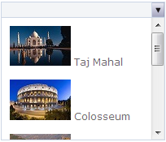

::: {style="DISPLAY: none"}
{#d2h_url_template}{#d2h_package_url style="WIDTH: 0px; DISPLAY: none; HEIGHT: 0px"}
:::

::: {.d2h_secondary_topic style="PADDING-BOTTOM: 10pt; MARGIN: 0pt; PADDING-LEFT: 0pt; PADDING-RIGHT: 0pt; PADDING-TOP: 0pt"}
#### Appearance {#appearance style="tab-stops: 0pt"}

Generic drop-down supports fourteen in-built skins giving a high visual appeal.

 

Properties

 

 

+-------------+--------------------------------------+------------------------------------------------------------------------------------------------+---------------------------------------------------+-------------+
| Name        | Description                          | Type of property                                                                               | Value it accepts                                  | Dependency  |
+-------------+--------------------------------------+------------------------------------------------------------------------------------------------+---------------------------------------------------+-------------+
| AutoFormat  | Used to define the syncfusion themes | [[enum]{style="COLOR: windowtext; TEXT-DECORATION: none; text-underline: none"}]{.UGHyperlink} | [Skins]{style="COLOR: #2b91af"}.Office2007Blue,   | NA          |
|             |                                      |                                                                                                |                                                   |             |
|             |                                      |                                                                                                | [Skins]{style="COLOR: #2b91af"}.Office2007Silver, |             |
|             |                                      |                                                                                                |                                                   |             |
|             |                                      |                                                                                                | [Skins]{style="COLOR: #2b91af"}.Office2007Black,  |             |
|             |                                      |                                                                                                |                                                   |             |
|             |                                      |                                                                                                | [Skins]{style="COLOR: #2b91af"}.Vista,            |             |
|             |                                      |                                                                                                |                                                   |             |
|             |                                      |                                                                                                | [Skins]{style="COLOR: #2b91af"}.Almond,           |             |
|             |                                      |                                                                                                |                                                   |             |
|             |                                      |                                                                                                | [Skins]{style="COLOR: #2b91af"}.Blueberry,        |             |
|             |                                      |                                                                                                |                                                   |             |
|             |                                      |                                                                                                | [Skins]{style="COLOR: #2b91af"}.Blend,            |             |
|             |                                      |                                                                                                |                                                   |             |
|             |                                      |                                                                                                | [Skins]{style="COLOR: #2b91af"}.Olive,            |             |
|             |                                      |                                                                                                |                                                   |             |
|             |                                      |                                                                                                | [Skins]{style="COLOR: #2b91af"}.Turquoise,        |             |
|             |                                      |                                                                                                |                                                   |             |
|             |                                      |                                                                                                | [Skins]{style="COLOR: #2b91af"}.Monochrome,       |             |
|             |                                      |                                                                                                |                                                   |             |
|             |                                      |                                                                                                | [Skins]{style="COLOR: #2b91af"}.Sandune,          |             |
|             |                                      |                                                                                                |                                                   |             |
|             |                                      |                                                                                                | [Skins]{style="COLOR: #2b91af"}.VS2010,           |             |
|             |                                      |                                                                                                |                                                   |             |
|             |                                      |                                                                                                | [Skins]{style="COLOR: #2b91af"}.Marble,           |             |
|             |                                      |                                                                                                |                                                   |             |
|             |                                      |                                                                                                | [Skins]{style="COLOR: #2b91af"}.Midnight          |             |
+-------------+--------------------------------------+------------------------------------------------------------------------------------------------+---------------------------------------------------+-------------+

 

Using Builder

The following steps explain the setting of the Syncfusion theme for the generic drop-down control using Builder.

1.   In **View**, create the drop-down contents and invoke the generic drop-down helper with the Control ID as the first argument followed by the **AutoFormat** method with the desired theme as argument.

**[]{style="FONT-FAMILY: 'Calibri','sans-serif'"}** 

+---------------------------------------------------------------------------------------------------------------------------------------------------------------------------------------------------------------------------------------------------------------------------------------------------------------------------------------------------------------------------------------------------------------------------------+
| **View\[ASPX\]**                                                                                                                                                                                                                                                                                                                                                                                                                |
|                                                                                                                                                                                                                                                                                                                                                                                                                                 |
|                                                                                                                                                                                                                                                                                                                                                                                                                                 |
|                                                                                                                                                                                                                                                                                                                                                                                                                                 |
| [\<]{style="FONT-FAMILY: Consolas; COLOR: blue; FONT-SIZE: 9.5pt"}[div]{style="FONT-FAMILY: Consolas; COLOR: maroon; FONT-SIZE: 9.5pt"}[ [id]{style="COLOR: red"}[=\"drop-down-contents\"]{style="COLOR: blue"} [style]{style="COLOR: red"}[=\"]{style="COLOR: blue"}[visibility]{style="COLOR: red"}[: hidden\"\>]{style="COLOR: blue"}]{style="FONT-FAMILY: Consolas; FONT-SIZE: 9.5pt"}                                      |
|                                                                                                                                                                                                                                                                                                                                                                                                                                 |
| [        [\<]{style="COLOR: blue"}[div]{style="COLOR: maroon"}[\>]{style="COLOR: blue"}]{style="FONT-FAMILY: Consolas; FONT-SIZE: 9.5pt"}                                                                                                                                                                                                                                                                                       |
|                                                                                                                                                                                                                                                                                                                                                                                                                                 |
| [            [\<]{style="COLOR: blue"}[img]{style="COLOR: maroon"} [src]{style="COLOR: red"}[=\']{style="COLOR: blue"}[\<%]{style="BACKGROUND: yellow"}[=]{style="COLOR: blue"} Url.Content(\"\~/Content/taj.jpg\")[%\>]{style="BACKGROUND: yellow"}[\']{style="COLOR: blue"} [/\>]{style="COLOR: blue"}]{style="FONT-FAMILY: Consolas; FONT-SIZE: 9.5pt"}                                                                      |
|                                                                                                                                                                                                                                                                                                                                                                                                                                 |
| [            [\<]{style="COLOR: blue"}[a]{style="COLOR: maroon"} [href]{style="COLOR: red"}[=\"#\"\>]{style="COLOR: blue"}Taj Mahal[\</]{style="COLOR: blue"}[a]{style="COLOR: maroon"}[\>\</]{style="COLOR: blue"}[div]{style="COLOR: maroon"}[\>]{style="COLOR: blue"}]{style="FONT-FAMILY: Consolas; FONT-SIZE: 9.5pt"}                                                                                                      |
|                                                                                                                                                                                                                                                                                                                                                                                                                                 |
| [        [\<]{style="COLOR: blue"}[div]{style="COLOR: maroon"}[\>]{style="COLOR: blue"}]{style="FONT-FAMILY: Consolas; FONT-SIZE: 9.5pt"}                                                                                                                                                                                                                                                                                       |
|                                                                                                                                                                                                                                                                                                                                                                                                                                 |
| [            [\<]{style="COLOR: blue"}[img]{style="COLOR: maroon"} [src]{style="COLOR: red"}[=\']{style="COLOR: blue"}[\<%]{style="BACKGROUND: yellow"}[=]{style="COLOR: blue"} Url.Content(\"\~/Content/colosseum.jpg\")[%\>]{style="BACKGROUND: yellow"}[\']{style="COLOR: blue"} [/\>]{style="COLOR: blue"}]{style="FONT-FAMILY: Consolas; FONT-SIZE: 9.5pt"}                                                                |
|                                                                                                                                                                                                                                                                                                                                                                                                                                 |
| [            [\<]{style="COLOR: blue"}[a]{style="COLOR: maroon"} [href]{style="COLOR: red"}[=\"#\"\>]{style="COLOR: blue"}Colosseum[\</]{style="COLOR: blue"}[a]{style="COLOR: maroon"}[\>\</]{style="COLOR: blue"}[div]{style="COLOR: maroon"}[\>]{style="COLOR: blue"}]{style="FONT-FAMILY: Consolas; FONT-SIZE: 9.5pt"}                                                                                                      |
|                                                                                                                                                                                                                                                                                                                                                                                                                                 |
| [        [\<]{style="COLOR: blue"}[div]{style="COLOR: maroon"}[\>]{style="COLOR: blue"}]{style="FONT-FAMILY: Consolas; FONT-SIZE: 9.5pt"}                                                                                                                                                                                                                                                                                       |
|                                                                                                                                                                                                                                                                                                                                                                                                                                 |
| [            [\<]{style="COLOR: blue"}[img]{style="COLOR: maroon"} [src]{style="COLOR: red"}[=\']{style="COLOR: blue"}[\<%]{style="BACKGROUND: yellow"}[=]{style="COLOR: blue"} Url.Content(\"\~/Content/greatwall.jpg\")[%\>]{style="BACKGROUND: yellow"}[\']{style="COLOR: blue"} [/\>]{style="COLOR: blue"}]{style="FONT-FAMILY: Consolas; FONT-SIZE: 9.5pt"}                                                                |
|                                                                                                                                                                                                                                                                                                                                                                                                                                 |
| [            [\<]{style="COLOR: blue"}[a]{style="COLOR: maroon"} [href]{style="COLOR: red"}[=\"#\"\>]{style="COLOR: blue"}Great Wall [\</]{style="COLOR: blue"}[a]{style="COLOR: maroon"}[\>]{style="COLOR: blue"}]{style="FONT-FAMILY: Consolas; FONT-SIZE: 9.5pt"}                                                                                                                                                            |
|                                                                                                                                                                                                                                                                                                                                                                                                                                 |
| [        [\</]{style="COLOR: blue"}[div]{style="COLOR: maroon"}[\>]{style="COLOR: blue"}]{style="FONT-FAMILY: Consolas; FONT-SIZE: 9.5pt"}                                                                                                                                                                                                                                                                                      |
|                                                                                                                                                                                                                                                                                                                                                                                                                                 |
| [        [\<]{style="COLOR: blue"}[div]{style="COLOR: maroon"}[\>]{style="COLOR: blue"}]{style="FONT-FAMILY: Consolas; FONT-SIZE: 9.5pt"}                                                                                                                                                                                                                                                                                       |
|                                                                                                                                                                                                                                                                                                                                                                                                                                 |
| [            [\<]{style="COLOR: blue"}[img]{style="COLOR: maroon"} [name]{style="COLOR: red"}[=\"Machu Picchu\"]{style="COLOR: blue"} [src]{style="COLOR: red"}[=\']{style="COLOR: blue"}[\<%]{style="BACKGROUND: yellow"}[=]{style="COLOR: blue"} Url.Content(\"\~/Content/machu.jpg\")[%\>]{style="BACKGROUND: yellow"}[\']{style="COLOR: blue"} [/\>]{style="COLOR: blue"}]{style="FONT-FAMILY: Consolas; FONT-SIZE: 9.5pt"} |
|                                                                                                                                                                                                                                                                                                                                                                                                                                 |
| [            [\<]{style="COLOR: blue"}[a]{style="COLOR: maroon"} [href]{style="COLOR: red"}[=\"#\"\>]{style="COLOR: blue"}Machu Picchu[\</]{style="COLOR: blue"}[a]{style="COLOR: maroon"}[\>\</]{style="COLOR: blue"}[div]{style="COLOR: maroon"}[\>]{style="COLOR: blue"}]{style="FONT-FAMILY: Consolas; FONT-SIZE: 9.5pt"}                                                                                                   |
|                                                                                                                                                                                                                                                                                                                                                                                                                                 |
| [        [\<]{style="COLOR: blue"}[div]{style="COLOR: maroon"}[\>]{style="COLOR: blue"}]{style="FONT-FAMILY: Consolas; FONT-SIZE: 9.5pt"}                                                                                                                                                                                                                                                                                       |
|                                                                                                                                                                                                                                                                                                                                                                                                                                 |
| [            [\<]{style="COLOR: blue"}[img]{style="COLOR: maroon"} [name]{style="COLOR: red"}[=\"Petra\"]{style="COLOR: blue"} [src]{style="COLOR: red"}[=\']{style="COLOR: blue"}[\<%]{style="BACKGROUND: yellow"}[=]{style="COLOR: blue"} Url.Content(\"\~/Content/petra.jpg\")[%\>]{style="BACKGROUND: yellow"}[\']{style="COLOR: blue"} [/\>]{style="COLOR: blue"}]{style="FONT-FAMILY: Consolas; FONT-SIZE: 9.5pt"}        |
|                                                                                                                                                                                                                                                                                                                                                                                                                                 |
| [            [\<]{style="COLOR: blue"}[a]{style="COLOR: maroon"} [href]{style="COLOR: red"}[=\"#\"\>]{style="COLOR: blue"}Petra[\</]{style="COLOR: blue"}[a]{style="COLOR: maroon"}[\>\</]{style="COLOR: blue"}[div]{style="COLOR: maroon"}[\>]{style="COLOR: blue"}]{style="FONT-FAMILY: Consolas; FONT-SIZE: 9.5pt"}                                                                                                          |
|                                                                                                                                                                                                                                                                                                                                                                                                                                 |
| [        [\<]{style="COLOR: blue"}[div]{style="COLOR: maroon"}[\>]{style="COLOR: blue"}]{style="FONT-FAMILY: Consolas; FONT-SIZE: 9.5pt"}                                                                                                                                                                                                                                                                                       |
|                                                                                                                                                                                                                                                                                                                                                                                                                                 |
| [            [\<]{style="COLOR: blue"}[img]{style="COLOR: maroon"} [name]{style="COLOR: red"}[=\"Pyramid\"]{style="COLOR: blue"} [src]{style="COLOR: red"}[=\']{style="COLOR: blue"}[\<%]{style="BACKGROUND: yellow"}[=]{style="COLOR: blue"} Url.Content(\"\~/Content/pyramid.jpg\")[%\>]{style="BACKGROUND: yellow"}[\']{style="COLOR: blue"} [/\>]{style="COLOR: blue"}]{style="FONT-FAMILY: Consolas; FONT-SIZE: 9.5pt"}    |
|                                                                                                                                                                                                                                                                                                                                                                                                                                 |
| [            [\<]{style="COLOR: blue"}[a]{style="COLOR: maroon"} [href]{style="COLOR: red"}[=\"#\"\>]{style="COLOR: blue"}Pyramids [\</]{style="COLOR: blue"}[a]{style="COLOR: maroon"}[\>]{style="COLOR: blue"}]{style="FONT-FAMILY: Consolas; FONT-SIZE: 9.5pt"}                                                                                                                                                              |
|                                                                                                                                                                                                                                                                                                                                                                                                                                 |
| [        [\</]{style="COLOR: blue"}[div]{style="COLOR: maroon"}[\>]{style="COLOR: blue"}]{style="FONT-FAMILY: Consolas; FONT-SIZE: 9.5pt"}                                                                                                                                                                                                                                                                                      |
|                                                                                                                                                                                                                                                                                                                                                                                                                                 |
| [       [\</]{style="COLOR: blue"}[div]{style="COLOR: maroon"}[\>]{style="COLOR: blue"}]{style="FONT-FAMILY: Consolas; FONT-SIZE: 9.5pt"}                                                                                                                                                                                                                                                                                       |
|                                                                                                                                                                                                                                                                                                                                                                                                                                 |
| [       [\<%]{style="BACKGROUND: yellow"}[=]{style="COLOR: blue"}Html.Syncfusion().GenericDropDown([\"myDropDown\"]{style="COLOR: #a31515"})]{style="FONT-FAMILY: Consolas; FONT-SIZE: 9.5pt"}                                                                                                                                                                                                                                  |
|                                                                                                                                                                                                                                                                                                                                                                                                                                 |
| [.TargetContentId([\"drop-down-contents\"]{style="COLOR: #a31515"})]{style="FONT-FAMILY: Consolas; FONT-SIZE: 9.5pt"}                                                                                                                                                                                                                                                                                                           |
|                                                                                                                                                                                                                                                                                                                                                                                                                                 |
| [.**AutoFormat([Skins]{style="COLOR: #2b91af"}.Office2007Silver)[%\>]{style="BACKGROUND: yellow"}**]{style="FONT-FAMILY: Consolas; FONT-SIZE: 9.5pt"}                                                                                                                                                                                                                                                                           |
|                                                                                                                                                                                                                                                                                                                                                                                                                                 |
| []{style="FONT-FAMILY: Consolas; BACKGROUND: yellow; FONT-SIZE: 9.5pt"}                                                                                                                                                                                                                                                                                                                                                         |
+---------------------------------------------------------------------------------------------------------------------------------------------------------------------------------------------------------------------------------------------------------------------------------------------------------------------------------------------------------------------------------------------------------------------------------+

 

+--------------------------------------------------------------------------------------------------------------------------------------------------------------------------------------------------------------------------------------------------------------------------------------------------------------------------------------------------------------------------------------------+
| **View\[cshtml\]**                                                                                                                                                                                                                                                                                                                                                                         |
|                                                                                                                                                                                                                                                                                                                                                                                            |
|                                                                                                                                                                                                                                                                                                                                                                                            |
|                                                                                                                                                                                                                                                                                                                                                                                            |
| [\<]{style="FONT-FAMILY: Consolas; COLOR: blue; FONT-SIZE: 9.5pt"}[div]{style="FONT-FAMILY: Consolas; COLOR: maroon; FONT-SIZE: 9.5pt"}[ [id]{style="COLOR: red"}[=\"drop-down-contents\"]{style="COLOR: blue"} [style]{style="COLOR: red"}[=\"]{style="COLOR: blue"}[visibility]{style="COLOR: red"}[: hidden\"\>]{style="COLOR: blue"}]{style="FONT-FAMILY: Consolas; FONT-SIZE: 9.5pt"} |
|                                                                                                                                                                                                                                                                                                                                                                                            |
| [        [\<]{style="COLOR: blue"}[div]{style="COLOR: maroon"}[\>]{style="COLOR: blue"}]{style="FONT-FAMILY: Consolas; FONT-SIZE: 9.5pt"}                                                                                                                                                                                                                                                  |
|                                                                                                                                                                                                                                                                                                                                                                                            |
| [            [\<]{style="COLOR: blue"}[img]{style="COLOR: maroon"} [src]{style="COLOR: red"}[=\']{style="COLOR: blue"}[@]{style="BACKGROUND: yellow"}Url.Content(\"\~/Content/taj.jpg\")[\']{style="COLOR: blue"} [/\>]{style="COLOR: blue"}]{style="FONT-FAMILY: Consolas; FONT-SIZE: 9.5pt"}                                                                                             |
|                                                                                                                                                                                                                                                                                                                                                                                            |
| [            [\<]{style="COLOR: blue"}[a]{style="COLOR: maroon"} [href]{style="COLOR: red"}[=\"#\"\>]{style="COLOR: blue"}Taj Mahal[\</]{style="COLOR: blue"}[a]{style="COLOR: maroon"}[\>\</]{style="COLOR: blue"}[div]{style="COLOR: maroon"}[\>]{style="COLOR: blue"}]{style="FONT-FAMILY: Consolas; FONT-SIZE: 9.5pt"}                                                                 |
|                                                                                                                                                                                                                                                                                                                                                                                            |
| [        [\<]{style="COLOR: blue"}[div]{style="COLOR: maroon"}[\>]{style="COLOR: blue"}]{style="FONT-FAMILY: Consolas; FONT-SIZE: 9.5pt"}                                                                                                                                                                                                                                                  |
|                                                                                                                                                                                                                                                                                                                                                                                            |
| [            [\<]{style="COLOR: blue"}[img]{style="COLOR: maroon"} [src]{style="COLOR: red"}[=\']{style="COLOR: blue"}[@]{style="BACKGROUND: yellow"}Url.Content(\"\~/Content/colosseum.jpg\")[\']{style="COLOR: blue"} [/\>]{style="COLOR: blue"}]{style="FONT-FAMILY: Consolas; FONT-SIZE: 9.5pt"}                                                                                       |
|                                                                                                                                                                                                                                                                                                                                                                                            |
| [            [\<]{style="COLOR: blue"}[a]{style="COLOR: maroon"} [href]{style="COLOR: red"}[=\"#\"\>]{style="COLOR: blue"}Colosseum[\</]{style="COLOR: blue"}[a]{style="COLOR: maroon"}[\>\</]{style="COLOR: blue"}[div]{style="COLOR: maroon"}[\>]{style="COLOR: blue"}]{style="FONT-FAMILY: Consolas; FONT-SIZE: 9.5pt"}                                                                 |
|                                                                                                                                                                                                                                                                                                                                                                                            |
| [        [\<]{style="COLOR: blue"}[div]{style="COLOR: maroon"}[\>]{style="COLOR: blue"}]{style="FONT-FAMILY: Consolas; FONT-SIZE: 9.5pt"}                                                                                                                                                                                                                                                  |
|                                                                                                                                                                                                                                                                                                                                                                                            |
| [            [\<]{style="COLOR: blue"}[img]{style="COLOR: maroon"} [src]{style="COLOR: red"}[=\']{style="COLOR: blue"}[@]{style="BACKGROUND: yellow"}Url.Content(\"\~/Content/greatwall.jpg\")[\']{style="COLOR: blue"} [/\>]{style="COLOR: blue"}]{style="FONT-FAMILY: Consolas; FONT-SIZE: 9.5pt"}                                                                                       |
|                                                                                                                                                                                                                                                                                                                                                                                            |
| [            [\<]{style="COLOR: blue"}[a]{style="COLOR: maroon"} [href]{style="COLOR: red"}[=\"#\"\>]{style="COLOR: blue"}Great Wall [\</]{style="COLOR: blue"}[a]{style="COLOR: maroon"}[\>]{style="COLOR: blue"}]{style="FONT-FAMILY: Consolas; FONT-SIZE: 9.5pt"}                                                                                                                       |
|                                                                                                                                                                                                                                                                                                                                                                                            |
| [        [\</]{style="COLOR: blue"}[div]{style="COLOR: maroon"}[\>]{style="COLOR: blue"}]{style="FONT-FAMILY: Consolas; FONT-SIZE: 9.5pt"}                                                                                                                                                                                                                                                 |
|                                                                                                                                                                                                                                                                                                                                                                                            |
| [        [\<]{style="COLOR: blue"}[div]{style="COLOR: maroon"}[\>]{style="COLOR: blue"}]{style="FONT-FAMILY: Consolas; FONT-SIZE: 9.5pt"}                                                                                                                                                                                                                                                  |
|                                                                                                                                                                                                                                                                                                                                                                                            |
| [            [\<]{style="COLOR: blue"}[img]{style="COLOR: maroon"} [name]{style="COLOR: red"}[=\"Machu Picchu\"]{style="COLOR: blue"} [src]{style="COLOR: red"}[=\']{style="COLOR: blue"}[@]{style="BACKGROUND: yellow"}Url.Content(\"\~/Content/machu.jpg\")[\']{style="COLOR: blue"} [/\>]{style="COLOR: blue"}]{style="FONT-FAMILY: Consolas; FONT-SIZE: 9.5pt"}                        |
|                                                                                                                                                                                                                                                                                                                                                                                            |
| [            [\<]{style="COLOR: blue"}[a]{style="COLOR: maroon"} [href]{style="COLOR: red"}[=\"#\"\>]{style="COLOR: blue"}Machu Picchu[\</]{style="COLOR: blue"}[a]{style="COLOR: maroon"}[\>\</]{style="COLOR: blue"}[div]{style="COLOR: maroon"}[\>]{style="COLOR: blue"}]{style="FONT-FAMILY: Consolas; FONT-SIZE: 9.5pt"}                                                              |
|                                                                                                                                                                                                                                                                                                                                                                                            |
| [        [\<]{style="COLOR: blue"}[div]{style="COLOR: maroon"}[\>]{style="COLOR: blue"}]{style="FONT-FAMILY: Consolas; FONT-SIZE: 9.5pt"}                                                                                                                                                                                                                                                  |
|                                                                                                                                                                                                                                                                                                                                                                                            |
| [            [\<]{style="COLOR: blue"}[img]{style="COLOR: maroon"} [name]{style="COLOR: red"}[=\"Petra\"]{style="COLOR: blue"} [src]{style="COLOR: red"}[=\']{style="COLOR: blue"}[@]{style="BACKGROUND: yellow"}Url.Content(\"\~/Content/petra.jpg\")[\']{style="COLOR: blue"} [/\>]{style="COLOR: blue"}]{style="FONT-FAMILY: Consolas; FONT-SIZE: 9.5pt"}                               |
|                                                                                                                                                                                                                                                                                                                                                                                            |
| [            [\<]{style="COLOR: blue"}[a]{style="COLOR: maroon"} [href]{style="COLOR: red"}[=\"#\"\>]{style="COLOR: blue"}Petra[\</]{style="COLOR: blue"}[a]{style="COLOR: maroon"}[\>\</]{style="COLOR: blue"}[div]{style="COLOR: maroon"}[\>]{style="COLOR: blue"}]{style="FONT-FAMILY: Consolas; FONT-SIZE: 9.5pt"}                                                                     |
|                                                                                                                                                                                                                                                                                                                                                                                            |
| [        [\<]{style="COLOR: blue"}[div]{style="COLOR: maroon"}[\>]{style="COLOR: blue"}]{style="FONT-FAMILY: Consolas; FONT-SIZE: 9.5pt"}                                                                                                                                                                                                                                                  |
|                                                                                                                                                                                                                                                                                                                                                                                            |
| [            [\<]{style="COLOR: blue"}[img]{style="COLOR: maroon"} [name]{style="COLOR: red"}[=\"Pyramid\"]{style="COLOR: blue"} [src]{style="COLOR: red"}[=\']{style="COLOR: blue"}[@]{style="BACKGROUND: yellow"}Url.Content(\"\~/Content/pyramid.jpg\")[\']{style="COLOR: blue"} [/\>]{style="COLOR: blue"}]{style="FONT-FAMILY: Consolas; FONT-SIZE: 9.5pt"}                           |
|                                                                                                                                                                                                                                                                                                                                                                                            |
| [            [\<]{style="COLOR: blue"}[a]{style="COLOR: maroon"} [href]{style="COLOR: red"}[=\"#\"\>]{style="COLOR: blue"}Pyramids [\</]{style="COLOR: blue"}[a]{style="COLOR: maroon"}[\>]{style="COLOR: blue"}]{style="FONT-FAMILY: Consolas; FONT-SIZE: 9.5pt"}                                                                                                                         |
|                                                                                                                                                                                                                                                                                                                                                                                            |
| [        [\</]{style="COLOR: blue"}[div]{style="COLOR: maroon"}[\>]{style="COLOR: blue"}]{style="FONT-FAMILY: Consolas; FONT-SIZE: 9.5pt"}                                                                                                                                                                                                                                                 |
|                                                                                                                                                                                                                                                                                                                                                                                            |
| [       [\</]{style="COLOR: blue"}[div]{style="COLOR: maroon"}[\>]{style="COLOR: blue"}]{style="FONT-FAMILY: Consolas; FONT-SIZE: 9.5pt"}                                                                                                                                                                                                                                                  |
|                                                                                                                                                                                                                                                                                                                                                                                            |
| [       [\@{]{style="BACKGROUND: yellow"}[ ]{style="COLOR: blue"}Html.Syncfusion().GenericDropDown([\"myDropDown\"]{style="COLOR: #a31515"})]{style="FONT-FAMILY: Consolas; FONT-SIZE: 9.5pt"}                                                                                                                                                                                             |
|                                                                                                                                                                                                                                                                                                                                                                                            |
| [.TargetContentId([\"drop-down-contents\"]{style="COLOR: #a31515"})]{style="FONT-FAMILY: Consolas; FONT-SIZE: 9.5pt"}                                                                                                                                                                                                                                                                      |
|                                                                                                                                                                                                                                                                                                                                                                                            |
| [.**AutoFormat([Skins]{style="COLOR: #2b91af"}.Office2007Silver).Render();[}]{style="BACKGROUND: yellow"}**]{style="FONT-FAMILY: Consolas; FONT-SIZE: 9.5pt"}                                                                                                                                                                                                                              |
|                                                                                                                                                                                                                                                                                                                                                                                            |
| []{style="FONT-FAMILY: Consolas; BACKGROUND: yellow; FONT-SIZE: 9.5pt"}                                                                                                                                                                                                                                                                                                                    |
+--------------------------------------------------------------------------------------------------------------------------------------------------------------------------------------------------------------------------------------------------------------------------------------------------------------------------------------------------------------------------------------------+

 

2.   Build and run the application.

**[]{style="FONT-FAMILY: 'Calibri','sans-serif'; FONT-SIZE: 12pt"}** 

Using Properties Model

The following steps explain setting the Syncfusion theme for generic drop-down through Properties model.

1.   In the **Controller**, create an instance of the **GenericDropDownModel**, set the **AutoFormat** property and pass the instance through **view specific data** to **View** as given below.

*[[[]{style="TEXT-DECORATION: none"}]{style="FONT-FAMILY: 'Calibri','sans-serif'"}]{.underline}* 

+------------------------------------------------------------------------------------------------------------------------------------------------------------------------------------------------------------------+
| **\[Controller\]**                                                                                                                                                                                               |
|                                                                                                                                                                                                                  |
|                                                                                                                                                                                                                  |
|                                                                                                                                                                                                                  |
| [public]{style="FONT-FAMILY: Consolas; COLOR: blue; FONT-SIZE: 9.5pt"}[ [ActionResult]{style="COLOR: #2b91af"} Index()]{style="FONT-FAMILY: Consolas; FONT-SIZE: 9.5pt"}                                         |
|                                                                                                                                                                                                                  |
| [        {]{style="FONT-FAMILY: Consolas; FONT-SIZE: 9.5pt"}                                                                                                                                                     |
|                                                                                                                                                                                                                  |
| [            [GenericDropDownModel]{style="COLOR: #2b91af"} myModel = [new]{style="COLOR: blue"} [GenericDropDownModel]{style="COLOR: #2b91af"}();            ]{style="FONT-FAMILY: Consolas; FONT-SIZE: 9.5pt"} |
|                                                                                                                                                                                                                  |
| **[            ]{style="FONT-FAMILY: Consolas; FONT-SIZE: 9.5pt"}**[myModel.TargetContentId = [\"drop-down-contents\"]{style="COLOR: #a31515"};]{style="FONT-FAMILY: Consolas; FONT-SIZE: 9.5pt"}                |
|                                                                                                                                                                                                                  |
| **[            myModel.AutoFormat = [Skins]{style="COLOR: #2b91af"}.Office2007Silver;          ]{style="FONT-FAMILY: Consolas; FONT-SIZE: 9.5pt"}**[]{style="FONT-FAMILY: Consolas; FONT-SIZE: 9.5pt"}           |
|                                                                                                                                                                                                                  |
| []{style="FONT-FAMILY: Consolas; FONT-SIZE: 9.5pt"}                                                                                                                                                              |
|                                                                                                                                                                                                                  |
| [            ViewData\[[\"myDropDown\"]{style="COLOR: #a31515"}\] = myModel;]{style="FONT-FAMILY: Consolas; FONT-SIZE: 9.5pt"}                                                                                   |
|                                                                                                                                                                                                                  |
| [            [return]{style="COLOR: blue"} View();]{style="FONT-FAMILY: Consolas; FONT-SIZE: 9.5pt"}                                                                                                             |
|                                                                                                                                                                                                                  |
| [        }]{style="FONT-FAMILY: Consolas; FONT-SIZE: 9.5pt"}                                                                                                                                                     |
|                                                                                                                                                                                                                  |
| []{style="FONT-FAMILY: Consolas; BACKGROUND: yellow; FONT-SIZE: 9.5pt"}                                                                                                                                          |
+------------------------------------------------------------------------------------------------------------------------------------------------------------------------------------------------------------------+

 

2.   In **View**, create the drop-down contents and invoke the generic drop-down helper with the **View Data** key as the Control ID.

[]{style="FONT-FAMILY: 'Calibri','sans-serif'"} 

+---------------------------------------------------------------------------------------------------------------------------------------------------------------------------------------------------------------------------------------------------------------------------------------------------------------------------------------------------------------------------------------------------------------------------------+
| **View\[aspx\]**                                                                                                                                                                                                                                                                                                                                                                                                                |
|                                                                                                                                                                                                                                                                                                                                                                                                                                 |
|                                                                                                                                                                                                                                                                                                                                                                                                                                 |
|                                                                                                                                                                                                                                                                                                                                                                                                                                 |
| [\<]{style="FONT-FAMILY: Consolas; COLOR: blue; FONT-SIZE: 9.5pt"}[div]{style="FONT-FAMILY: Consolas; COLOR: maroon; FONT-SIZE: 9.5pt"}[ [id]{style="COLOR: red"}[=\"drop-down-contents\"]{style="COLOR: blue"} [style]{style="COLOR: red"}[=\"]{style="COLOR: blue"}[visibility]{style="COLOR: red"}[: hidden\"\>]{style="COLOR: blue"}]{style="FONT-FAMILY: Consolas; FONT-SIZE: 9.5pt"}                                      |
|                                                                                                                                                                                                                                                                                                                                                                                                                                 |
| [        [\<]{style="COLOR: blue"}[div]{style="COLOR: maroon"}[\>]{style="COLOR: blue"}]{style="FONT-FAMILY: Consolas; FONT-SIZE: 9.5pt"}                                                                                                                                                                                                                                                                                       |
|                                                                                                                                                                                                                                                                                                                                                                                                                                 |
| [            [\<]{style="COLOR: blue"}[img]{style="COLOR: maroon"} [src]{style="COLOR: red"}[=\']{style="COLOR: blue"}[\<%]{style="BACKGROUND: yellow"}[=]{style="COLOR: blue"} Url.Content(\"\~/Content/taj.jpg\")[%\>]{style="BACKGROUND: yellow"}[\']{style="COLOR: blue"} [/\>]{style="COLOR: blue"}]{style="FONT-FAMILY: Consolas; FONT-SIZE: 9.5pt"}                                                                      |
|                                                                                                                                                                                                                                                                                                                                                                                                                                 |
| [            [\<]{style="COLOR: blue"}[a]{style="COLOR: maroon"} [href]{style="COLOR: red"}[=\"#\"\>]{style="COLOR: blue"}Taj Mahal[\</]{style="COLOR: blue"}[a]{style="COLOR: maroon"}[\>\</]{style="COLOR: blue"}[div]{style="COLOR: maroon"}[\>]{style="COLOR: blue"}]{style="FONT-FAMILY: Consolas; FONT-SIZE: 9.5pt"}                                                                                                      |
|                                                                                                                                                                                                                                                                                                                                                                                                                                 |
| [        [\<]{style="COLOR: blue"}[div]{style="COLOR: maroon"}[\>]{style="COLOR: blue"}]{style="FONT-FAMILY: Consolas; FONT-SIZE: 9.5pt"}                                                                                                                                                                                                                                                                                       |
|                                                                                                                                                                                                                                                                                                                                                                                                                                 |
| [            [\<]{style="COLOR: blue"}[img]{style="COLOR: maroon"} [src]{style="COLOR: red"}[=\']{style="COLOR: blue"}[\<%]{style="BACKGROUND: yellow"}[=]{style="COLOR: blue"} Url.Content(\"\~/Content/colosseum.jpg\")[%\>]{style="BACKGROUND: yellow"}[\']{style="COLOR: blue"} [/\>]{style="COLOR: blue"}]{style="FONT-FAMILY: Consolas; FONT-SIZE: 9.5pt"}                                                                |
|                                                                                                                                                                                                                                                                                                                                                                                                                                 |
| [            [\<]{style="COLOR: blue"}[a]{style="COLOR: maroon"} [href]{style="COLOR: red"}[=\"#\"\>]{style="COLOR: blue"}Colosseum[\</]{style="COLOR: blue"}[a]{style="COLOR: maroon"}[\>\</]{style="COLOR: blue"}[div]{style="COLOR: maroon"}[\>]{style="COLOR: blue"}]{style="FONT-FAMILY: Consolas; FONT-SIZE: 9.5pt"}                                                                                                      |
|                                                                                                                                                                                                                                                                                                                                                                                                                                 |
| [        [\<]{style="COLOR: blue"}[div]{style="COLOR: maroon"}[\>]{style="COLOR: blue"}]{style="FONT-FAMILY: Consolas; FONT-SIZE: 9.5pt"}                                                                                                                                                                                                                                                                                       |
|                                                                                                                                                                                                                                                                                                                                                                                                                                 |
| [            [\<]{style="COLOR: blue"}[img]{style="COLOR: maroon"} [src]{style="COLOR: red"}[=\']{style="COLOR: blue"}[\<%]{style="BACKGROUND: yellow"}[=]{style="COLOR: blue"} Url.Content(\"\~/Content/greatwall.jpg\")[%\>]{style="BACKGROUND: yellow"}[\']{style="COLOR: blue"} [/\>]{style="COLOR: blue"}]{style="FONT-FAMILY: Consolas; FONT-SIZE: 9.5pt"}                                                                |
|                                                                                                                                                                                                                                                                                                                                                                                                                                 |
| [            [\<]{style="COLOR: blue"}[a]{style="COLOR: maroon"} [href]{style="COLOR: red"}[=\"#\"\>]{style="COLOR: blue"}Great Wall [\</]{style="COLOR: blue"}[a]{style="COLOR: maroon"}[\>]{style="COLOR: blue"}]{style="FONT-FAMILY: Consolas; FONT-SIZE: 9.5pt"}                                                                                                                                                            |
|                                                                                                                                                                                                                                                                                                                                                                                                                                 |
| [        [\</]{style="COLOR: blue"}[div]{style="COLOR: maroon"}[\>]{style="COLOR: blue"}]{style="FONT-FAMILY: Consolas; FONT-SIZE: 9.5pt"}                                                                                                                                                                                                                                                                                      |
|                                                                                                                                                                                                                                                                                                                                                                                                                                 |
| [        [\<]{style="COLOR: blue"}[div]{style="COLOR: maroon"}[\>]{style="COLOR: blue"}]{style="FONT-FAMILY: Consolas; FONT-SIZE: 9.5pt"}                                                                                                                                                                                                                                                                                       |
|                                                                                                                                                                                                                                                                                                                                                                                                                                 |
| [            [\<]{style="COLOR: blue"}[img]{style="COLOR: maroon"} [name]{style="COLOR: red"}[=\"Machu Picchu\"]{style="COLOR: blue"} [src]{style="COLOR: red"}[=\']{style="COLOR: blue"}[\<%]{style="BACKGROUND: yellow"}[=]{style="COLOR: blue"} Url.Content(\"\~/Content/machu.jpg\")[%\>]{style="BACKGROUND: yellow"}[\']{style="COLOR: blue"} [/\>]{style="COLOR: blue"}]{style="FONT-FAMILY: Consolas; FONT-SIZE: 9.5pt"} |
|                                                                                                                                                                                                                                                                                                                                                                                                                                 |
| [            [\<]{style="COLOR: blue"}[a]{style="COLOR: maroon"} [href]{style="COLOR: red"}[=\"#\"\>]{style="COLOR: blue"}Machu Picchu[\</]{style="COLOR: blue"}[a]{style="COLOR: maroon"}[\>\</]{style="COLOR: blue"}[div]{style="COLOR: maroon"}[\>]{style="COLOR: blue"}]{style="FONT-FAMILY: Consolas; FONT-SIZE: 9.5pt"}                                                                                                   |
|                                                                                                                                                                                                                                                                                                                                                                                                                                 |
| [        [\<]{style="COLOR: blue"}[div]{style="COLOR: maroon"}[\>]{style="COLOR: blue"}]{style="FONT-FAMILY: Consolas; FONT-SIZE: 9.5pt"}                                                                                                                                                                                                                                                                                       |
|                                                                                                                                                                                                                                                                                                                                                                                                                                 |
| [            [\<]{style="COLOR: blue"}[img]{style="COLOR: maroon"} [name]{style="COLOR: red"}[=\"Petra\"]{style="COLOR: blue"} [src]{style="COLOR: red"}[=\']{style="COLOR: blue"}[\<%]{style="BACKGROUND: yellow"}[=]{style="COLOR: blue"} Url.Content(\"\~/Content/petra.jpg\")[%\>]{style="BACKGROUND: yellow"}[\']{style="COLOR: blue"} [/\>]{style="COLOR: blue"}]{style="FONT-FAMILY: Consolas; FONT-SIZE: 9.5pt"}        |
|                                                                                                                                                                                                                                                                                                                                                                                                                                 |
| [            [\<]{style="COLOR: blue"}[a]{style="COLOR: maroon"} [href]{style="COLOR: red"}[=\"#\"\>]{style="COLOR: blue"}Petra[\</]{style="COLOR: blue"}[a]{style="COLOR: maroon"}[\>\</]{style="COLOR: blue"}[div]{style="COLOR: maroon"}[\>]{style="COLOR: blue"}]{style="FONT-FAMILY: Consolas; FONT-SIZE: 9.5pt"}                                                                                                          |
|                                                                                                                                                                                                                                                                                                                                                                                                                                 |
| [        [\<]{style="COLOR: blue"}[div]{style="COLOR: maroon"}[\>]{style="COLOR: blue"}]{style="FONT-FAMILY: Consolas; FONT-SIZE: 9.5pt"}                                                                                                                                                                                                                                                                                       |
|                                                                                                                                                                                                                                                                                                                                                                                                                                 |
| [            [\<]{style="COLOR: blue"}[img]{style="COLOR: maroon"} [name]{style="COLOR: red"}[=\"Pyramid\"]{style="COLOR: blue"} [src]{style="COLOR: red"}[=\']{style="COLOR: blue"}[\<%]{style="BACKGROUND: yellow"}[=]{style="COLOR: blue"} Url.Content(\"\~/Content/pyramid.jpg\")[%\>]{style="BACKGROUND: yellow"}[\']{style="COLOR: blue"} [/\>]{style="COLOR: blue"}]{style="FONT-FAMILY: Consolas; FONT-SIZE: 9.5pt"}    |
|                                                                                                                                                                                                                                                                                                                                                                                                                                 |
| [            [\<]{style="COLOR: blue"}[a]{style="COLOR: maroon"} [href]{style="COLOR: red"}[=\"#\"\>]{style="COLOR: blue"}Pyramids [\</]{style="COLOR: blue"}[a]{style="COLOR: maroon"}[\>\</]{style="COLOR: blue"}[div]{style="COLOR: maroon"}[\>]{style="COLOR: blue"}        ]{style="FONT-FAMILY: Consolas; FONT-SIZE: 9.5pt"}                                                                                              |
|                                                                                                                                                                                                                                                                                                                                                                                                                                 |
| [ [\</]{style="COLOR: blue"}[div]{style="COLOR: maroon"}[\>]{style="COLOR: blue"}]{style="FONT-FAMILY: Consolas; FONT-SIZE: 9.5pt"}                                                                                                                                                                                                                                                                                             |
|                                                                                                                                                                                                                                                                                                                                                                                                                                 |
| [\<%]{style="FONT-FAMILY: Consolas; BACKGROUND: yellow; FONT-SIZE: 9.5pt"}[=]{style="FONT-FAMILY: Consolas; COLOR: blue; FONT-SIZE: 9.5pt"}[Html.Syncfusion().GenericDropDown([\"myDropDown\"]{style="COLOR: #a31515"})[%\>]{style="BACKGROUND: yellow"}]{style="FONT-FAMILY: Consolas; FONT-SIZE: 9.5pt"}                                                                                                                      |
|                                                                                                                                                                                                                                                                                                                                                                                                                                 |
| []{style="FONT-FAMILY: Consolas; BACKGROUND: yellow; FONT-SIZE: 9.5pt"}                                                                                                                                                                                                                                                                                                                                                         |
+---------------------------------------------------------------------------------------------------------------------------------------------------------------------------------------------------------------------------------------------------------------------------------------------------------------------------------------------------------------------------------------------------------------------------------+

 

[]{style="FONT-FAMILY: 'Calibri','sans-serif'"} 

+--------------------------------------------------------------------------------------------------------------------------------------------------------------------------------------------------------------------------------------------------------------------------------------------------------------------------------------------------------------------------------------------+
| **View\[cshtml\]**                                                                                                                                                                                                                                                                                                                                                                         |
|                                                                                                                                                                                                                                                                                                                                                                                            |
|                                                                                                                                                                                                                                                                                                                                                                                            |
|                                                                                                                                                                                                                                                                                                                                                                                            |
| [\<]{style="FONT-FAMILY: Consolas; COLOR: blue; FONT-SIZE: 9.5pt"}[div]{style="FONT-FAMILY: Consolas; COLOR: maroon; FONT-SIZE: 9.5pt"}[ [id]{style="COLOR: red"}[=\"drop-down-contents\"]{style="COLOR: blue"} [style]{style="COLOR: red"}[=\"]{style="COLOR: blue"}[visibility]{style="COLOR: red"}[: hidden\"\>]{style="COLOR: blue"}]{style="FONT-FAMILY: Consolas; FONT-SIZE: 9.5pt"} |
|                                                                                                                                                                                                                                                                                                                                                                                            |
| [        [\<]{style="COLOR: blue"}[div]{style="COLOR: maroon"}[\>]{style="COLOR: blue"}]{style="FONT-FAMILY: Consolas; FONT-SIZE: 9.5pt"}                                                                                                                                                                                                                                                  |
|                                                                                                                                                                                                                                                                                                                                                                                            |
| [            [\<]{style="COLOR: blue"}[img]{style="COLOR: maroon"} [src]{style="COLOR: red"}[=\']{style="COLOR: blue"}[@]{style="BACKGROUND: yellow"}Url.Content(\"\~/Content/taj.jpg\")[\']{style="COLOR: blue"} [/\>]{style="COLOR: blue"}]{style="FONT-FAMILY: Consolas; FONT-SIZE: 9.5pt"}                                                                                             |
|                                                                                                                                                                                                                                                                                                                                                                                            |
| [            [\<]{style="COLOR: blue"}[a]{style="COLOR: maroon"} [href]{style="COLOR: red"}[=\"#\"\>]{style="COLOR: blue"}Taj Mahal[\</]{style="COLOR: blue"}[a]{style="COLOR: maroon"}[\>\</]{style="COLOR: blue"}[div]{style="COLOR: maroon"}[\>]{style="COLOR: blue"}]{style="FONT-FAMILY: Consolas; FONT-SIZE: 9.5pt"}                                                                 |
|                                                                                                                                                                                                                                                                                                                                                                                            |
| [        [\<]{style="COLOR: blue"}[div]{style="COLOR: maroon"}[\>]{style="COLOR: blue"}]{style="FONT-FAMILY: Consolas; FONT-SIZE: 9.5pt"}                                                                                                                                                                                                                                                  |
|                                                                                                                                                                                                                                                                                                                                                                                            |
| [            [\<]{style="COLOR: blue"}[img]{style="COLOR: maroon"} [src]{style="COLOR: red"}[=\']{style="COLOR: blue"}[@]{style="BACKGROUND: yellow"}Url.Content(\"\~/Content/colosseum.jpg\")[\']{style="COLOR: blue"} [/\>]{style="COLOR: blue"}]{style="FONT-FAMILY: Consolas; FONT-SIZE: 9.5pt"}                                                                                       |
|                                                                                                                                                                                                                                                                                                                                                                                            |
| [            [\<]{style="COLOR: blue"}[a]{style="COLOR: maroon"} [href]{style="COLOR: red"}[=\"#\"\>]{style="COLOR: blue"}Colosseum[\</]{style="COLOR: blue"}[a]{style="COLOR: maroon"}[\>\</]{style="COLOR: blue"}[div]{style="COLOR: maroon"}[\>]{style="COLOR: blue"}]{style="FONT-FAMILY: Consolas; FONT-SIZE: 9.5pt"}                                                                 |
|                                                                                                                                                                                                                                                                                                                                                                                            |
| [        [\<]{style="COLOR: blue"}[div]{style="COLOR: maroon"}[\>]{style="COLOR: blue"}]{style="FONT-FAMILY: Consolas; FONT-SIZE: 9.5pt"}                                                                                                                                                                                                                                                  |
|                                                                                                                                                                                                                                                                                                                                                                                            |
| [            [\<]{style="COLOR: blue"}[img]{style="COLOR: maroon"} [src]{style="COLOR: red"}[=\']{style="COLOR: blue"}[@]{style="BACKGROUND: yellow"}Url.Content(\"\~/Content/greatwall.jpg\")[\']{style="COLOR: blue"} [/\>]{style="COLOR: blue"}]{style="FONT-FAMILY: Consolas; FONT-SIZE: 9.5pt"}                                                                                       |
|                                                                                                                                                                                                                                                                                                                                                                                            |
| [            [\<]{style="COLOR: blue"}[a]{style="COLOR: maroon"} [href]{style="COLOR: red"}[=\"#\"\>]{style="COLOR: blue"}Great Wall [\</]{style="COLOR: blue"}[a]{style="COLOR: maroon"}[\>]{style="COLOR: blue"}]{style="FONT-FAMILY: Consolas; FONT-SIZE: 9.5pt"}                                                                                                                       |
|                                                                                                                                                                                                                                                                                                                                                                                            |
| [        [\</]{style="COLOR: blue"}[div]{style="COLOR: maroon"}[\>]{style="COLOR: blue"}]{style="FONT-FAMILY: Consolas; FONT-SIZE: 9.5pt"}                                                                                                                                                                                                                                                 |
|                                                                                                                                                                                                                                                                                                                                                                                            |
| [        [\<]{style="COLOR: blue"}[div]{style="COLOR: maroon"}[\>]{style="COLOR: blue"}]{style="FONT-FAMILY: Consolas; FONT-SIZE: 9.5pt"}                                                                                                                                                                                                                                                  |
|                                                                                                                                                                                                                                                                                                                                                                                            |
| [            [\<]{style="COLOR: blue"}[img]{style="COLOR: maroon"} [name]{style="COLOR: red"}[=\"Machu Picchu\"]{style="COLOR: blue"} [src]{style="COLOR: red"}[=\']{style="COLOR: blue"}[@]{style="BACKGROUND: yellow"}Url.Content(\"\~/Content/machu.jpg\")[\']{style="COLOR: blue"} [/\>]{style="COLOR: blue"}]{style="FONT-FAMILY: Consolas; FONT-SIZE: 9.5pt"}                        |
|                                                                                                                                                                                                                                                                                                                                                                                            |
| [            [\<]{style="COLOR: blue"}[a]{style="COLOR: maroon"} [href]{style="COLOR: red"}[=\"#\"\>]{style="COLOR: blue"}Machu Picchu[\</]{style="COLOR: blue"}[a]{style="COLOR: maroon"}[\>\</]{style="COLOR: blue"}[div]{style="COLOR: maroon"}[\>]{style="COLOR: blue"}]{style="FONT-FAMILY: Consolas; FONT-SIZE: 9.5pt"}                                                              |
|                                                                                                                                                                                                                                                                                                                                                                                            |
| [        [\<]{style="COLOR: blue"}[div]{style="COLOR: maroon"}[\>]{style="COLOR: blue"}]{style="FONT-FAMILY: Consolas; FONT-SIZE: 9.5pt"}                                                                                                                                                                                                                                                  |
|                                                                                                                                                                                                                                                                                                                                                                                            |
| [            [\<]{style="COLOR: blue"}[img]{style="COLOR: maroon"} [name]{style="COLOR: red"}[=\"Petra\"]{style="COLOR: blue"} [src]{style="COLOR: red"}[=\']{style="COLOR: blue"}[@]{style="BACKGROUND: yellow"}Url.Content(\"\~/Content/petra.jpg\")[\']{style="COLOR: blue"} [/\>]{style="COLOR: blue"}]{style="FONT-FAMILY: Consolas; FONT-SIZE: 9.5pt"}                               |
|                                                                                                                                                                                                                                                                                                                                                                                            |
| [            [\<]{style="COLOR: blue"}[a]{style="COLOR: maroon"} [href]{style="COLOR: red"}[=\"#\"\>]{style="COLOR: blue"}Petra[\</]{style="COLOR: blue"}[a]{style="COLOR: maroon"}[\>\</]{style="COLOR: blue"}[div]{style="COLOR: maroon"}[\>]{style="COLOR: blue"}]{style="FONT-FAMILY: Consolas; FONT-SIZE: 9.5pt"}                                                                     |
|                                                                                                                                                                                                                                                                                                                                                                                            |
| [        [\<]{style="COLOR: blue"}[div]{style="COLOR: maroon"}[\>]{style="COLOR: blue"}]{style="FONT-FAMILY: Consolas; FONT-SIZE: 9.5pt"}                                                                                                                                                                                                                                                  |
|                                                                                                                                                                                                                                                                                                                                                                                            |
| [            [\<]{style="COLOR: blue"}[img]{style="COLOR: maroon"} [name]{style="COLOR: red"}[=\"Pyramid\"]{style="COLOR: blue"} [src]{style="COLOR: red"}[=\']{style="COLOR: blue"}[@]{style="BACKGROUND: yellow"}Url.Content(\"\~/Content/pyramid.jpg\")[\']{style="COLOR: blue"} [/\>]{style="COLOR: blue"}]{style="FONT-FAMILY: Consolas; FONT-SIZE: 9.5pt"}                           |
|                                                                                                                                                                                                                                                                                                                                                                                            |
| [            [\<]{style="COLOR: blue"}[a]{style="COLOR: maroon"} [href]{style="COLOR: red"}[=\"#\"\>]{style="COLOR: blue"}Pyramids [\</]{style="COLOR: blue"}[a]{style="COLOR: maroon"}[\>\</]{style="COLOR: blue"}[div]{style="COLOR: maroon"}[\>]{style="COLOR: blue"}        ]{style="FONT-FAMILY: Consolas; FONT-SIZE: 9.5pt"}                                                         |
|                                                                                                                                                                                                                                                                                                                                                                                            |
| [ [\</]{style="COLOR: blue"}[div]{style="COLOR: maroon"}[\>]{style="COLOR: blue"}]{style="FONT-FAMILY: Consolas; FONT-SIZE: 9.5pt"}                                                                                                                                                                                                                                                        |
|                                                                                                                                                                                                                                                                                                                                                                                            |
| [\@{]{style="FONT-FAMILY: Consolas; BACKGROUND: yellow; FONT-SIZE: 9.5pt"}[ ]{style="FONT-FAMILY: Consolas; COLOR: blue; FONT-SIZE: 9.5pt"}[Html.Syncfusion().GenericDropDown([\"myDropDown\"]{style="COLOR: #a31515"}).Render();[}]{style="BACKGROUND: yellow"}]{style="FONT-FAMILY: Consolas; FONT-SIZE: 9.5pt"}                                                                         |
|                                                                                                                                                                                                                                                                                                                                                                                            |
| []{style="FONT-FAMILY: Consolas; BACKGROUND: yellow; FONT-SIZE: 9.5pt"}                                                                                                                                                                                                                                                                                                                    |
+--------------------------------------------------------------------------------------------------------------------------------------------------------------------------------------------------------------------------------------------------------------------------------------------------------------------------------------------------------------------------------------------+

 

 

3.   Build and run the application.

The output is shown in the following screenshot.

 

{border="0"}

Figure 140: Generic drop-down with Office2007Silver theme

***[]{style="FONT-FAMILY: 'Calibri','sans-serif'"}*** 

[]{#related-topics}
:::
