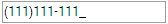

::: {style="DISPLAY: none"}
{#d2h_url_template}{#d2h_package_url style="WIDTH: 0px; DISPLAY: none; HEIGHT: 0px"}
:::

::: {.d2h_secondary_topic style="PADDING-BOTTOM: 10pt; MARGIN: 0pt; PADDING-LEFT: 0pt; PADDING-RIGHT: 0pt; PADDING-TOP: 0pt"}
#### Appearance {#appearance style="tab-stops: 0pt"}

Mask Edit textbox supports fourteen pre-defined skins to enhance the look and feel.

Properties

+-------------+--------------------------------------+------------------------------------------------------------------------------------------------+---------------------------------------------------+-------------+
| Name        | Description                          | Type of property                                                                               | Value it accepts                                  | Dependency  |
+-------------+--------------------------------------+------------------------------------------------------------------------------------------------+---------------------------------------------------+-------------+
| AutoFormat  | Used to define the syncfusion themes | [[enum]{style="COLOR: windowtext; TEXT-DECORATION: none; text-underline: none"}]{.UGHyperlink} | [Skins]{style="COLOR: #2b91af"}.Office2007Blue,   | NA          |
|             |                                      |                                                                                                |                                                   |             |
|             |                                      |                                                                                                | [Skins]{style="COLOR: #2b91af"}.Office2007Silver, |             |
|             |                                      |                                                                                                |                                                   |             |
|             |                                      |                                                                                                | [Skins]{style="COLOR: #2b91af"}.Office2007Black,  |             |
|             |                                      |                                                                                                |                                                   |             |
|             |                                      |                                                                                                | [Skins]{style="COLOR: #2b91af"}.Vista,            |             |
|             |                                      |                                                                                                |                                                   |             |
|             |                                      |                                                                                                | [Skins]{style="COLOR: #2b91af"}.Almond,           |             |
|             |                                      |                                                                                                |                                                   |             |
|             |                                      |                                                                                                | [Skins]{style="COLOR: #2b91af"}.Blueberry,        |             |
|             |                                      |                                                                                                |                                                   |             |
|             |                                      |                                                                                                | [Skins]{style="COLOR: #2b91af"}.Blend,            |             |
|             |                                      |                                                                                                |                                                   |             |
|             |                                      |                                                                                                | [Skins]{style="COLOR: #2b91af"}.Olive,            |             |
|             |                                      |                                                                                                |                                                   |             |
|             |                                      |                                                                                                | [Skins]{style="COLOR: #2b91af"}.Turquoise,        |             |
|             |                                      |                                                                                                |                                                   |             |
|             |                                      |                                                                                                | [Skins]{style="COLOR: #2b91af"}.Monochrome,       |             |
|             |                                      |                                                                                                |                                                   |             |
|             |                                      |                                                                                                | [Skins]{style="COLOR: #2b91af"}.Sandune,          |             |
|             |                                      |                                                                                                |                                                   |             |
|             |                                      |                                                                                                | [Skins]{style="COLOR: #2b91af"}.VS2010,           |             |
|             |                                      |                                                                                                |                                                   |             |
|             |                                      |                                                                                                | [Skins]{style="COLOR: #2b91af"}.Marble,           |             |
|             |                                      |                                                                                                |                                                   |             |
|             |                                      |                                                                                                | [Skins]{style="COLOR: #2b91af"}.Midnight          |             |
+-------------+--------------------------------------+------------------------------------------------------------------------------------------------+---------------------------------------------------+-------------+

 

Using Builder

The following steps explain the setting of the Syncfusion theme for the mask edit using Builder.

1.   In **View**, invoke the mask edit textbox helper followed by the **AutoFormat** method with the desired theme as argument.

[]{style="FONT-FAMILY: 'Calibri','sans-serif'"} 

+---------------------------------------------------------------------------------------------------------------------------------------------------------------------------------------------------------------------------------------------------------------------------+
| **View\[ASPX\]**                                                                                                                                                                                                                                                          |
|                                                                                                                                                                                                                                                                           |
|                                                                                                                                                                                                                                                                           |
|                                                                                                                                                                                                                                                                           |
| [\<%]{style="FONT-FAMILY: Consolas; BACKGROUND: yellow; FONT-SIZE: 9.5pt"}[=]{style="FONT-FAMILY: Consolas; COLOR: blue; FONT-SIZE: 9.5pt"}[Html.Syncfusion().MaskEditTextBox([\"myMaskEdit\"]{style="COLOR: #a31515"})]{style="FONT-FAMILY: Consolas; FONT-SIZE: 9.5pt"} |
|                                                                                                                                                                                                                                                                           |
| [.Mask([\"999-99-999\"]{style="COLOR: #a31515"})]{style="FONT-FAMILY: Consolas; FONT-SIZE: 9.5pt"}                                                                                                                                                                        |
|                                                                                                                                                                                                                                                                           |
| **[.AutoFormat([Skins]{style="COLOR: #2b91af"}.Midnight)]{style="FONT-FAMILY: Consolas; FONT-SIZE: 9.5pt"}**[%\>]{style="FONT-FAMILY: Consolas; BACKGROUND: yellow; FONT-SIZE: 9.5pt"}                                                                                    |
|                                                                                                                                                                                                                                                                           |
| []{style="FONT-FAMILY: Consolas; BACKGROUND: yellow; FONT-SIZE: 9.5pt"}                                                                                                                                                                                                   |
+---------------------------------------------------------------------------------------------------------------------------------------------------------------------------------------------------------------------------------------------------------------------------+

 

+---------------------------------------------------------------------------------------------------------------------------------------------------------------------------------------------------------------------------------------------------+
|                                                                                                                                                                                                                                                   |
|                                                                                                                                                                                                                                                   |
| **View\[cshtml\]**                                                                                                                                                                                                                                |
|                                                                                                                                                                                                                                                   |
|                                                                                                                                                                                                                                                   |
|                                                                                                                                                                                                                                                   |
| [\@{]{style="FONT-FAMILY: Consolas; BACKGROUND: yellow; FONT-SIZE: 9.5pt"}[ Html.Syncfusion().MaskEditTextBox([\"myMaskEdit\"]{style="COLOR: #a31515"})]{style="FONT-FAMILY: Consolas; FONT-SIZE: 9.5pt"}                                         |
|                                                                                                                                                                                                                                                   |
| [.Mask([\"999-99-999\"]{style="COLOR: #a31515"})]{style="FONT-FAMILY: Consolas; FONT-SIZE: 9.5pt"}                                                                                                                                                |
|                                                                                                                                                                                                                                                   |
| **[.AutoFormat([Skins]{style="COLOR: #2b91af"}.Midnight)]{style="FONT-FAMILY: Consolas; FONT-SIZE: 9.5pt"}**[.Render();]{style="FONT-FAMILY: Consolas; FONT-SIZE: 9.5pt"}[}]{style="FONT-FAMILY: Consolas; BACKGROUND: yellow; FONT-SIZE: 9.5pt"} |
|                                                                                                                                                                                                                                                   |
| []{style="FONT-FAMILY: Consolas; BACKGROUND: yellow; FONT-SIZE: 9.5pt"}                                                                                                                                                                           |
+---------------------------------------------------------------------------------------------------------------------------------------------------------------------------------------------------------------------------------------------------+

 

 

 

2.   Build and run the application.

**[]{style="FONT-FAMILY: 'Calibri','sans-serif'; FONT-SIZE: 12pt"}** 

Using PropertiesModel

The following steps explain the setting of the Syncfusion theme for the mask edit through the Properties model.

1.   In the **Controller**, create an instance of **MaskEditTextBoxModel**, set the **AutoFormat** property and pass the instance through view specific data to View as given below.**

**[]{style="FONT-FAMILY: 'Calibri','sans-serif'"}** 

+------------------------------------------------------------------------------------------------------------------------------------------------------------------------------------------------------+
| **\[Controller\]**                                                                                                                                                                                   |
|                                                                                                                                                                                                      |
|                                                                                                                                                                                                      |
|                                                                                                                                                                                                      |
| [public]{style="FONT-FAMILY: Consolas; COLOR: blue; FONT-SIZE: 9.5pt"}[ [ActionResult]{style="COLOR: #2b91af"} Index()]{style="FONT-FAMILY: Consolas; FONT-SIZE: 9.5pt"}                             |
|                                                                                                                                                                                                      |
| [        {]{style="FONT-FAMILY: Consolas; FONT-SIZE: 9.5pt"}                                                                                                                                         |
|                                                                                                                                                                                                      |
| [            [//create an instance of MaskEditTextBoxModel]{style="COLOR: green"}]{style="FONT-FAMILY: Consolas; FONT-SIZE: 9.5pt"}                                                                  |
|                                                                                                                                                                                                      |
| [            [MaskEditTextBoxModel]{style="COLOR: #2b91af"} myModel = [new]{style="COLOR: blue"} [MaskEditTextBoxModel]{style="COLOR: #2b91af"}();]{style="FONT-FAMILY: Consolas; FONT-SIZE: 9.5pt"} |
|                                                                                                                                                                                                      |
| [            myModel.Mask = [\"999-99-999\"]{style="COLOR: #a31515"};]{style="FONT-FAMILY: Consolas; FONT-SIZE: 9.5pt"}                                                                              |
|                                                                                                                                                                                                      |
| **[            myModel.AutoFormat = [Skins]{style="COLOR: #2b91af"}.Midnight;]{style="FONT-FAMILY: Consolas; FONT-SIZE: 9.5pt"}**                                                                    |
|                                                                                                                                                                                                      |
| [            ]{style="FONT-FAMILY: Consolas; FONT-SIZE: 9.5pt"}                                                                                                                                      |
|                                                                                                                                                                                                      |
| [            [//pass the instance through view data to the view]{style="COLOR: green"}]{style="FONT-FAMILY: Consolas; FONT-SIZE: 9.5pt"}                                                             |
|                                                                                                                                                                                                      |
| [            ViewData\[[\"myMaskEdit\"]{style="COLOR: #a31515"}\] = myModel;]{style="FONT-FAMILY: Consolas; FONT-SIZE: 9.5pt"}                                                                       |
|                                                                                                                                                                                                      |
| [            [return]{style="COLOR: blue"} View();]{style="FONT-FAMILY: Consolas; FONT-SIZE: 9.5pt"}                                                                                                 |
|                                                                                                                                                                                                      |
| [        }]{style="FONT-FAMILY: Consolas; FONT-SIZE: 9.5pt"}                                                                                                                                         |
|                                                                                                                                                                                                      |
| []{style="FONT-FAMILY: Consolas; BACKGROUND: yellow; FONT-SIZE: 9.5pt"}                                                                                                                              |
+------------------------------------------------------------------------------------------------------------------------------------------------------------------------------------------------------+

*[[]{style="TEXT-DECORATION: none"}]{.underline}* 

2.   In **View**, invoke the mask edit textbox helper with the view data key as the control ID.

**[]{style="FONT-FAMILY: 'Calibri','sans-serif'"}** 

+------------------------------------------------------------------------------------------------------------------------------------------------------------------------------------------------------------------------------------------------------------------------------------------------------------+
| **View\[ASPX\]**                                                                                                                                                                                                                                                                                           |
|                                                                                                                                                                                                                                                                                                            |
|                                                                                                                                                                                                                                                                                                            |
|                                                                                                                                                                                                                                                                                                            |
| [\<%]{style="FONT-FAMILY: Consolas; BACKGROUND: yellow; FONT-SIZE: 9.5pt"}[=]{style="FONT-FAMILY: Consolas; COLOR: blue; FONT-SIZE: 9.5pt"}[Html.Syncfusion().MaskEditTextBox([\"myMaskEdit\"]{style="COLOR: #a31515"})[%\>]{style="BACKGROUND: yellow"}]{style="FONT-FAMILY: Consolas; FONT-SIZE: 9.5pt"} |
|                                                                                                                                                                                                                                                                                                            |
| []{style="FONT-FAMILY: Consolas; BACKGROUND: yellow; FONT-SIZE: 9.5pt"}                                                                                                                                                                                                                                    |
+------------------------------------------------------------------------------------------------------------------------------------------------------------------------------------------------------------------------------------------------------------------------------------------------------------+

 

**[]{style="FONT-FAMILY: 'Calibri','sans-serif'"}** 

+----------------------------------------------------------------------------------------------------------------------------------------------------------------------------------------------------------------------------------------------------+
| **View\[cshtml\]**                                                                                                                                                                                                                                 |
|                                                                                                                                                                                                                                                    |
|                                                                                                                                                                                                                                                    |
|                                                                                                                                                                                                                                                    |
| [\@{]{style="FONT-FAMILY: Consolas; BACKGROUND: yellow; FONT-SIZE: 9.5pt"}[ Html.Syncfusion().MaskEditTextBox([\"myMaskEdit\"]{style="COLOR: #a31515"}).Render();[}]{style="BACKGROUND: yellow"}]{style="FONT-FAMILY: Consolas; FONT-SIZE: 9.5pt"} |
|                                                                                                                                                                                                                                                    |
| []{style="FONT-FAMILY: Consolas; BACKGROUND: yellow; FONT-SIZE: 9.5pt"}                                                                                                                                                                            |
+----------------------------------------------------------------------------------------------------------------------------------------------------------------------------------------------------------------------------------------------------+

 

3.   Build and run the application.

 

The output is shown in the following screenshot.

 

{border="0"}

Figure 147: Mask Edit textbox with Midnight theme

 

[]{#related-topics}
:::
