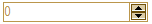

::: {style="DISPLAY: none"}
{#d2h_url_template}{#d2h_package_url style="WIDTH: 0px; DISPLAY: none; HEIGHT: 0px"}
:::

::: {.d2h_secondary_topic style="PADDING-BOTTOM: 10pt; MARGIN: 0pt; PADDING-LEFT: 0pt; PADDING-RIGHT: 0pt; PADDING-TOP: 0pt"}
#### Appearance {#appearance style="tab-stops: 0pt"}

The numeric text box control supports fourteen built-in skins to enhance the look and feel.

**[]{style="FONT-FAMILY: 'Calibri','sans-serif'; FONT-SIZE: 12pt"}** 

Properties

+-------------+---------------------------------------+----------------------------------+-------------------------+-------------+
| Name        | Description                           | Type of property                 | Values it accepts       | Dependency  |
+-------------+---------------------------------------+----------------------------------+-------------------------+-------------+
| AutoFormat  | Used to define the Syncfusion themes. | [enum]{style="FONT-SIZE: 9.5pt"} | Skins.Office2007Blue,   | NA          |
|             |                                       |                                  |                         |             |
|             |                                       |                                  | Skins.Office2007Silver, |             |
|             |                                       |                                  |                         |             |
|             |                                       |                                  | Skins.Office2007Black,  |             |
|             |                                       |                                  |                         |             |
|             |                                       |                                  | Skins.Vista,            |             |
|             |                                       |                                  |                         |             |
|             |                                       |                                  | Skins.Almond,           |             |
|             |                                       |                                  |                         |             |
|             |                                       |                                  | Skins.Blueberry,        |             |
|             |                                       |                                  |                         |             |
|             |                                       |                                  | Skins.Blend,            |             |
|             |                                       |                                  |                         |             |
|             |                                       |                                  | Skins.Olive,            |             |
|             |                                       |                                  |                         |             |
|             |                                       |                                  | Skins.Turquoise,        |             |
|             |                                       |                                  |                         |             |
|             |                                       |                                  | Skins.Monochrome,       |             |
|             |                                       |                                  |                         |             |
|             |                                       |                                  | Skins.Sandune,          |             |
|             |                                       |                                  |                         |             |
|             |                                       |                                  | Skins.VS2010,           |             |
|             |                                       |                                  |                         |             |
|             |                                       |                                  | Skins.Marble,           |             |
|             |                                       |                                  |                         |             |
|             |                                       |                                  | Skins.Midnight          |             |
+-------------+---------------------------------------+----------------------------------+-------------------------+-------------+

*[[]{style="TEXT-DECORATION: none"}]{.underline}* 

Using Builder

The following steps explain how to set themes for the numeric text box through the builder.

1.   In **View**, invoke the numeric text box helper followed by the **AutoFormat** method with the desired theme as an argument.

[]{style="FONT-FAMILY: Consolas; BACKGROUND: yellow; FONT-SIZE: 9.5pt"} 

+-------------------------------------------------------------------------------------------------------------------------------------------------------------------------------------------------------------------------------------------------------------------------+
| **View \[ASPX\]**                                                                                                                                                                                                                                                       |
|                                                                                                                                                                                                                                                                         |
|                                                                                                                                                                                                                                                                         |
|                                                                                                                                                                                                                                                                         |
| [\<%]{style="FONT-FAMILY: Consolas; BACKGROUND: yellow; FONT-SIZE: 9.5pt"}[=]{style="FONT-FAMILY: Consolas; COLOR: blue; FONT-SIZE: 9.5pt"}[Html.Syncfusion().NumericTextBox([\"myNumeric\"]{style="COLOR: #a31515"})]{style="FONT-FAMILY: Consolas; FONT-SIZE: 9.5pt"} |
|                                                                                                                                                                                                                                                                         |
| **[.AutoFormat([Skins]{style="COLOR: #2b91af"}.Sandune)]{style="FONT-FAMILY: Consolas; FONT-SIZE: 9.5pt"}**[%\>]{style="FONT-FAMILY: Consolas; BACKGROUND: yellow; FONT-SIZE: 9.5pt"}                                                                                   |
|                                                                                                                                                                                                                                                                         |
| []{style="FONT-FAMILY: Consolas; BACKGROUND: yellow; FONT-SIZE: 9.5pt"}                                                                                                                                                                                                 |
+-------------------------------------------------------------------------------------------------------------------------------------------------------------------------------------------------------------------------------------------------------------------------+

 

+-------------------------------------------------------------------------------------------------------------------------------------------------------------------------------------------------------------------------------------------------------------------------------------------------------------------------------------------------------------------+
| **View \[cshtml\]**                                                                                                                                                                                                                                                                                                                                               |
|                                                                                                                                                                                                                                                                                                                                                                   |
|                                                                                                                                                                                                                                                                                                                                                                   |
|                                                                                                                                                                                                                                                                                                                                                                   |
| [@(]{style="FONT-FAMILY: Consolas; BACKGROUND: yellow; FONT-SIZE: 9.5pt"}[new]{style="FONT-FAMILY: Consolas; COLOR: blue; FONT-SIZE: 9.5pt"}[ [HtmlString]{style="COLOR: #2b91af"}(]{style="FONT-FAMILY: Consolas; FONT-SIZE: 9.5pt"}[Html.Syncfusion().NumericTextBox([\"myNumeric\"]{style="COLOR: #a31515"})]{style="FONT-FAMILY: Consolas; FONT-SIZE: 9.5pt"} |
|                                                                                                                                                                                                                                                                                                                                                                   |
| **[.AutoFormat([Skins]{style="COLOR: #2b91af"}.Sandune)]{style="FONT-FAMILY: Consolas; FONT-SIZE: 9.5pt"}**[.ToString())[)]{style="BACKGROUND: yellow"}]{style="FONT-FAMILY: Consolas; FONT-SIZE: 9.5pt"}                                                                                                                                                         |
+-------------------------------------------------------------------------------------------------------------------------------------------------------------------------------------------------------------------------------------------------------------------------------------------------------------------------------------------------------------------+

 

2.   Build and run the application.**

*[[]{style="TEXT-DECORATION: none"}]{.underline}* 

Using Properties Model

The following steps explain how to set themes for the numeric text box through the properties model.

1.   In the controller, create an instance of **NumericTextBoxModel**; define the **AutoFormat** property and pass the instance through the view-specific data to the view.

[]{style="FONT-FAMILY: Consolas; FONT-SIZE: 9.5pt"} 

+----------------------------------------------------------------------------------------------------------------------------------------------------------------------------------------------------+
| **\[Controlleer\]**                                                                                                                                                                                |
|                                                                                                                                                                                                    |
|                                                                                                                                                                                                    |
|                                                                                                                                                                                                    |
| [public]{style="FONT-FAMILY: Consolas; COLOR: blue; FONT-SIZE: 9.5pt"}[ [ActionResult]{style="COLOR: #2b91af"} Index()]{style="FONT-FAMILY: Consolas; FONT-SIZE: 9.5pt"}                           |
|                                                                                                                                                                                                    |
| [        {]{style="FONT-FAMILY: Consolas; FONT-SIZE: 9.5pt"}                                                                                                                                       |
|                                                                                                                                                                                                    |
| [            [//Creating instance of NumericTextBoxModel]{style="COLOR: green"}]{style="FONT-FAMILY: Consolas; FONT-SIZE: 9.5pt"}                                                                  |
|                                                                                                                                                                                                    |
| [            [NumericTextBoxModel]{style="COLOR: #2b91af"} myModel = [new]{style="COLOR: blue"} [NumericTextBoxModel]{style="COLOR: #2b91af"}();]{style="FONT-FAMILY: Consolas; FONT-SIZE: 9.5pt"} |
|                                                                                                                                                                                                    |
| [            **myModel.AutoFormat = [Skins]{style="COLOR: #2b91af"}.Sandune;**]{style="FONT-FAMILY: Consolas; FONT-SIZE: 9.5pt"}                                                                   |
|                                                                                                                                                                                                    |
| []{style="FONT-FAMILY: Consolas; FONT-SIZE: 9.5pt"}                                                                                                                                                |
|                                                                                                                                                                                                    |
| [            [//pass the instance through view data to the view]{style="COLOR: green"}]{style="FONT-FAMILY: Consolas; FONT-SIZE: 9.5pt"}                                                           |
|                                                                                                                                                                                                    |
| [            ViewData\[[\"myNumeric\"]{style="COLOR: #a31515"}\] = myModel;]{style="FONT-FAMILY: Consolas; FONT-SIZE: 9.5pt"}                                                                      |
|                                                                                                                                                                                                    |
| [            [return]{style="COLOR: blue"} View();]{style="FONT-FAMILY: Consolas; FONT-SIZE: 9.5pt"}                                                                                               |
|                                                                                                                                                                                                    |
| [        }]{style="FONT-FAMILY: Consolas; FONT-SIZE: 9.5pt"}                                                                                                                                       |
|                                                                                                                                                                                                    |
| []{style="FONT-FAMILY: Consolas; FONT-SIZE: 9.5pt"}                                                                                                                                                |
+----------------------------------------------------------------------------------------------------------------------------------------------------------------------------------------------------+

[]{style="FONT-FAMILY: Consolas; FONT-SIZE: 9.5pt"} 

2.   In **View**, invoke the numeric text box helper with the view data key as the control ID.**

[]{style="FONT-FAMILY: Consolas; BACKGROUND: yellow; FONT-SIZE: 9.5pt"} 

+-----------------------------------------------------------------------------------------------------------------------------------------------------------------------------------------------------------------------------------------------------------------------------------------------------------+
| **View\[ASPX\]**                                                                                                                                                                                                                                                                                          |
|                                                                                                                                                                                                                                                                                                           |
|                                                                                                                                                                                                                                                                                                           |
|                                                                                                                                                                                                                                                                                                           |
| [\<%]{style="FONT-FAMILY: Consolas; BACKGROUND: yellow; FONT-SIZE: 9.5pt"}[=]{style="FONT-FAMILY: Consolas; COLOR: blue; FONT-SIZE: 9.5pt"}[Html.Syncfusion().NumericTextBox([\"myNumeric\"]{style="COLOR: #a31515"}) [%\>]{style="BACKGROUND: yellow"}]{style="FONT-FAMILY: Consolas; FONT-SIZE: 9.5pt"} |
|                                                                                                                                                                                                                                                                                                           |
| []{style="FONT-FAMILY: Consolas; BACKGROUND: yellow; FONT-SIZE: 9.5pt"}                                                                                                                                                                                                                                   |
+-----------------------------------------------------------------------------------------------------------------------------------------------------------------------------------------------------------------------------------------------------------------------------------------------------------+

[]{style="FONT-FAMILY: Consolas; BACKGROUND: yellow; FONT-SIZE: 9.5pt"} 

+-----------------------------------------------------------------------------------------------------------------------------------------------------------------------------------------------------------------------------------------------------------------------------------------------------------------------------------------------------------------------------------------------------------------------------------------------------------------+
| **View\[cshtml\]**                                                                                                                                                                                                                                                                                                                                                                                                                                              |
|                                                                                                                                                                                                                                                                                                                                                                                                                                                                 |
|                                                                                                                                                                                                                                                                                                                                                                                                                                                                 |
|                                                                                                                                                                                                                                                                                                                                                                                                                                                                 |
| [@(]{style="FONT-FAMILY: Consolas; BACKGROUND: yellow; FONT-SIZE: 9.5pt"}[new]{style="FONT-FAMILY: Consolas; COLOR: blue; FONT-SIZE: 9.5pt"}[ [HtmlString]{style="COLOR: #2b91af"}(]{style="FONT-FAMILY: Consolas; FONT-SIZE: 9.5pt"}[Html.Syncfusion().NumericTextBox([\"myNumeric\"]{style="COLOR: #a31515"})]{style="FONT-FAMILY: Consolas; FONT-SIZE: 9.5pt"}[.ToString())[)]{style="BACKGROUND: yellow"}]{style="FONT-FAMILY: Consolas; FONT-SIZE: 9.5pt"} |
|                                                                                                                                                                                                                                                                                                                                                                                                                                                                 |
| []{style="FONT-FAMILY: Consolas; BACKGROUND: yellow; FONT-SIZE: 9.5pt"}                                                                                                                                                                                                                                                                                                                                                                                         |
+-----------------------------------------------------------------------------------------------------------------------------------------------------------------------------------------------------------------------------------------------------------------------------------------------------------------------------------------------------------------------------------------------------------------------------------------------------------------+

***[[[]{style="TEXT-DECORATION: none"}]{style="FONT-FAMILY: 'Calibri','sans-serif'"}]{.underline}*** 

3.   Build and run the application.

The following image shows the output.

 

{border="0"}

Figure 163: Numeric Text Box Theme

 

 

[]{#related-topics}
:::
