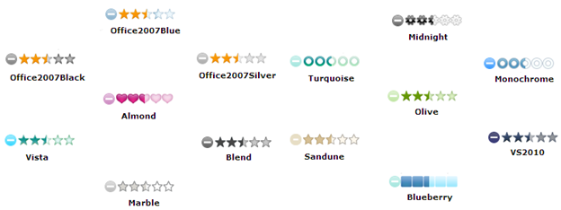

::: {style="DISPLAY: none"}
{#d2h_url_template}{#d2h_package_url style="WIDTH: 0px; DISPLAY: none; HEIGHT: 0px"}
:::

::: {.d2h_secondary_topic style="PADDING-BOTTOM: 10pt; MARGIN: 0pt; PADDING-LEFT: 0pt; PADDING-RIGHT: 0pt; PADDING-TOP: 0pt"}
#### Appearance {#appearance style="tab-stops: 0pt"}

The rating control supports fourteen predefined skins to enhance the look and feel.**[]{style="FONT-SIZE: 12pt"}**

 

Properties

+-------------+---------------------------------------+----------------------------------+-------------------------+-------------+
| Name        | Description                           | Type of property                 | Value it accepts        | Dependency  |
+-------------+---------------------------------------+----------------------------------+-------------------------+-------------+
| AutoFormat  | Used to define the Syncfusion themes. | [enum]{style="FONT-SIZE: 9.5pt"} | Skins.Office2007Blue,   | NA          |
|             |                                       |                                  |                         |             |
|             |                                       |                                  | Skins.Office2007Silver, |             |
|             |                                       |                                  |                         |             |
|             |                                       |                                  | Skins.Office2007Black,  |             |
|             |                                       |                                  |                         |             |
|             |                                       |                                  | Skins.Vista,            |             |
|             |                                       |                                  |                         |             |
|             |                                       |                                  | Skins.Almond,           |             |
|             |                                       |                                  |                         |             |
|             |                                       |                                  | Skins.Blueberry,        |             |
|             |                                       |                                  |                         |             |
|             |                                       |                                  | Skins.Blend,            |             |
|             |                                       |                                  |                         |             |
|             |                                       |                                  | Skins.Olive,            |             |
|             |                                       |                                  |                         |             |
|             |                                       |                                  | Skins.Turquoise,        |             |
|             |                                       |                                  |                         |             |
|             |                                       |                                  | Skins.Monochrome,       |             |
|             |                                       |                                  |                         |             |
|             |                                       |                                  | Skins.Sandune,          |             |
|             |                                       |                                  |                         |             |
|             |                                       |                                  | Skins.VS2010,           |             |
|             |                                       |                                  |                         |             |
|             |                                       |                                  | Skins.Marble,           |             |
|             |                                       |                                  |                         |             |
|             |                                       |                                  | Skins.Midnight          |             |
+-------------+---------------------------------------+----------------------------------+-------------------------+-------------+

*[[]{style="TEXT-DECORATION: none"}]{.underline}* 

Using Builder

The following steps explain how to set Syncfusion themes through the builder.

1.   In **View**, invoke the rating helper followed by the **AutoFormat** method with the desired theme as an argument.

[]{style="FONT-FAMILY: Consolas; FONT-SIZE: 9.5pt"} 

+-------------------------------------------------------------------------------------------------------------------------------------------------------------------------------------------------------------------------------------------------------------------------------------------------------------------------------------------------------------------------------------------------------------------------------------------------------+
| **View\[ASPX\]**                                                                                                                                                                                                                                                                                                                                                                                                                                      |
|                                                                                                                                                                                                                                                                                                                                                                                                                                                       |
| [\<%]{style="FONT-FAMILY: Consolas; BACKGROUND: yellow; FONT-SIZE: 9.5pt"}[=]{style="FONT-FAMILY: Consolas; COLOR: blue; FONT-SIZE: 9.5pt"}[Html.Syncfusion().Rating([\"myRating\"]{style="COLOR: #a31515"})]{style="FONT-FAMILY: Consolas; FONT-SIZE: 9.5pt"}                                                                                                                                                                                        |
|                                                                                                                                                                                                                                                                                                                                                                                                                                                       |
| **[.]{style="FONT-FAMILY: Consolas; FONT-SIZE: 9.5pt"}[AutoFormat]{style="FONT-FAMILY: 'Courier New'"}[(]{style="FONT-FAMILY: Consolas; FONT-SIZE: 9.5pt"}[Skins]{style="FONT-FAMILY: 'Courier New'; COLOR: #2b91af"}[.Almond]{style="FONT-FAMILY: 'Courier New'"}[)]{style="FONT-FAMILY: Consolas; FONT-SIZE: 9.5pt"}**[%\>]{style="FONT-FAMILY: Consolas; BACKGROUND: yellow; FONT-SIZE: 9.5pt"}[]{style="FONT-FAMILY: Consolas; FONT-SIZE: 9.5pt"} |
|                                                                                                                                                                                                                                                                                                                                                                                                                                                       |
| []{style="FONT-FAMILY: Consolas; FONT-SIZE: 9.5pt"}                                                                                                                                                                                                                                                                                                                                                                                                   |
+-------------------------------------------------------------------------------------------------------------------------------------------------------------------------------------------------------------------------------------------------------------------------------------------------------------------------------------------------------------------------------------------------------------------------------------------------------+

[]{style="FONT-FAMILY: Consolas; FONT-SIZE: 9.5pt"} 

+------------------------------------------------------------------------------------------------------------------------------------------------------------------------------------------------------------------------------------------------------------------------------------------------------------------------------------------------------------------------------------------------------------------------------------------------------------------------------------------------------------------+
| **View\[cshtml\]**                                                                                                                                                                                                                                                                                                                                                                                                                                                                                               |
|                                                                                                                                                                                                                                                                                                                                                                                                                                                                                                                  |
| [\@{]{style="FONT-FAMILY: Consolas; BACKGROUND: yellow; FONT-SIZE: 9.5pt"}[ Html.Syncfusion().Rating([\"myRating\"]{style="COLOR: #a31515"})]{style="FONT-FAMILY: Consolas; FONT-SIZE: 9.5pt"}                                                                                                                                                                                                                                                                                                                   |
|                                                                                                                                                                                                                                                                                                                                                                                                                                                                                                                  |
| **[.]{style="FONT-FAMILY: Consolas; FONT-SIZE: 9.5pt"}[AutoFormat]{style="FONT-FAMILY: 'Courier New'"}[(]{style="FONT-FAMILY: Consolas; FONT-SIZE: 9.5pt"}[Skins]{style="FONT-FAMILY: 'Courier New'; COLOR: #2b91af"}[.Almond]{style="FONT-FAMILY: 'Courier New'"}[)]{style="FONT-FAMILY: Consolas; FONT-SIZE: 9.5pt"}**[.Render();]{style="FONT-FAMILY: Consolas; FONT-SIZE: 9.5pt"}[}]{style="FONT-FAMILY: Consolas; BACKGROUND: yellow; FONT-SIZE: 9.5pt"}[]{style="FONT-FAMILY: Consolas; FONT-SIZE: 9.5pt"} |
|                                                                                                                                                                                                                                                                                                                                                                                                                                                                                                                  |
| []{style="FONT-FAMILY: Consolas; FONT-SIZE: 9.5pt"}                                                                                                                                                                                                                                                                                                                                                                                                                                                              |
+------------------------------------------------------------------------------------------------------------------------------------------------------------------------------------------------------------------------------------------------------------------------------------------------------------------------------------------------------------------------------------------------------------------------------------------------------------------------------------------------------------------+

 

2.   Build and run the application.

 

Using Properties Model

The following steps explain how to set Syncfusion themes using Builder.

1.   In the controller, create an instance of **RatingModel**.

2.   Reset the **AutoPostBack** and **RequestMapper** properties and pass the instance through the view-specific data to the view.

**[]{style="FONT-FAMILY: 'Calibri','sans-serif'"}** 

+-----------------------------------------------------------------------------------------------------------------------------------------------------------------------------------------------------------+
| **\[Controller\]**[]{style="COLOR: blue"}                                                                                                                                                                 |
|                                                                                                                                                                                                           |
| [public]{style="FONT-FAMILY: 'Courier New'; COLOR: blue"}[ [ActionResult]{style="COLOR: #2b91af"} Index()]{style="FONT-FAMILY: 'Courier New'"}                                                            |
|                                                                                                                                                                                                           |
| [        {]{style="FONT-FAMILY: 'Courier New'"}                                                                                                                                                           |
|                                                                                                                                                                                                           |
| [//Creating instance of RatingModel]{style="FONT-FAMILY: Consolas; COLOR: green; FONT-SIZE: 9.5pt"}[           \                                                                                          |
| [RatingModel]{style="COLOR: #2b91af"} myModel = [new]{style="COLOR: blue"} [RatingModel]{style="COLOR: #2b91af"}();                      ]{style="FONT-FAMILY: 'Courier New'"}                            |
|                                                                                                                                                                                                           |
| [           ** myModel.AutoFormat = [Skins]{style="COLOR: #2b91af"}.Almond;**]{style="FONT-FAMILY: 'Courier New'"}                                                                                        |
|                                                                                                                                                                                                           |
| []{style="FONT-FAMILY: 'Courier New'"}                                                                                                                                                                    |
|                                                                                                                                                                                                           |
| [            ]{style="FONT-FAMILY: 'Courier New'"}[//passing the instance through view data to view]{style="FONT-FAMILY: Consolas; COLOR: green; FONT-SIZE: 9.5pt"}[]{style="FONT-FAMILY: 'Courier New'"} |
|                                                                                                                                                                                                           |
| [ViewData\[[\"myRating\"]{style="COLOR: #a31515"}\] = myModel;]{style="FONT-FAMILY: 'Courier New'"}                                                                                                       |
|                                                                                                                                                                                                           |
| [            [return]{style="COLOR: blue"} View();]{style="FONT-FAMILY: 'Courier New'"}                                                                                                                   |
|                                                                                                                                                                                                           |
| [        }]{style="FONT-FAMILY: 'Courier New'"}                                                                                                                                                           |
|                                                                                                                                                                                                           |
| []{style="FONT-FAMILY: 'Courier New'"}                                                                                                                                                                    |
+-----------------------------------------------------------------------------------------------------------------------------------------------------------------------------------------------------------+

 

3.   In **View**, invoke the rating helper with the view data key as the control ID.

+-----------------------------------------------------------------------------------------------------------------------------------------------------------------------------------------------------------------------------------------------------------+
| **View\[ASPX\]**                                                                                                                                                                                                                                          |
|                                                                                                                                                                                                                                                           |
| [\<%]{style="FONT-FAMILY: 'Courier New'; BACKGROUND: yellow"}[=]{style="FONT-FAMILY: 'Courier New'; COLOR: blue"}[Html.Syncfusion().Rating([\"myRating\"]{style="COLOR: #a31515"}) [%\>]{style="BACKGROUND: yellow"}]{style="FONT-FAMILY: 'Courier New'"} |
|                                                                                                                                                                                                                                                           |
| []{style="FONT-FAMILY: 'Courier New'"}                                                                                                                                                                                                                    |
+-----------------------------------------------------------------------------------------------------------------------------------------------------------------------------------------------------------------------------------------------------------+

[]{style="FONT-FAMILY: 'Calibri','sans-serif'"} 

+----------------------------------------------------------------------------------------------------------------------------------------------------------------------------------------------------------------+
| ** View\[cshtml\]**                                                                                                                                                                                            |
|                                                                                                                                                                                                                |
| [\@{]{style="FONT-FAMILY: 'Courier New'; BACKGROUND: yellow"}[ Html.Syncfusion().Rating([\"myRating\"]{style="COLOR: #a31515"}).Render(); [}]{style="BACKGROUND: yellow"}]{style="FONT-FAMILY: 'Courier New'"} |
|                                                                                                                                                                                                                |
| []{style="FONT-FAMILY: 'Courier New'"}                                                                                                                                                                         |
+----------------------------------------------------------------------------------------------------------------------------------------------------------------------------------------------------------------+

 

4.   Build and run the application.

The following shows the fourteen Syncfusion themes used for ratings.

{border="0"}

Figure 183: Rating Themes

 

[]{#related-topics}
:::
