::: {style="DISPLAY: none"}
{#d2h_url_template}{#d2h_package_url style="WIDTH: 0px; DISPLAY: none; HEIGHT: 0px"}
:::

::: {.d2h_secondary_topic style="PADDING-BOTTOM: 10pt; MARGIN: 0pt; PADDING-LEFT: 0pt; PADDING-RIGHT: 0pt; PADDING-TOP: 0pt"}
#### Appearance {#appearance style="tab-stops: 0pt"}

The Split-Button supports fourteen built-in themes giving a high visual appeal.

 

Use Case Scenarios

It allows for easy customization of the appearance to be displayed on the Split-Button.

 

Adding Appearance[ ]{style="COLOR: red"}to an Application

The appearance can be customized by two ways in the Split-Button.

[·      ]{style="FONT-FAMILY: Symbol"}Using Builder

[·      ]{style="FONT-FAMILY: Symbol"}Using Properties Model

 

Using Builder

The following steps guides you in customizing the appearance using the Builder.

 

1.   In **View**, invoke the SplitButton helper with the button id as the first argument followed by the **Skin** methods.

[]{style="FONT-FAMILY: 'Myriad Pro','sans-serif'"} 

[]{style="FONT-FAMILY: 'Myriad Pro','sans-serif'"} 

+---------------------------------------------------------------------------------------------------------------------------------------------------------------------------------------------------------------+
| **[View\[aspx\]]{style="FONT-FAMILY: 'Courier New'"}**                                                                                                                                                        |
|                                                                                                                                                                                                               |
| [        [\<%]{style="BACKGROUND: yellow"}[=]{style="COLOR: blue"}Html.Syncfusion().SplitButton([\"btnSplit\"]{style="COLOR: #a31515"})]{style="FONT-FAMILY: 'Courier New'"}                                  |
|                                                                                                                                                                                                               |
| [            .Text([\"Save\"]{style="COLOR: #a31515"})]{style="FONT-FAMILY: 'Courier New'"}                                                                                                                   |
|                                                                                                                                                                                                               |
| [            **.Skin([Skins]{style="COLOR: #2b91af"}.Almond)**]{style="FONT-FAMILY: 'Courier New'"}                                                                                                           |
|                                                                                                                                                                                                               |
| [            .ContentType([ContentTypes]{style="COLOR: #2b91af"}.TextAndImage)]{style="FONT-FAMILY: 'Courier New'"}                                                                                           |
|                                                                                                                                                                                                               |
| [            .ImageUrl([\"Content/icon_save.png\"]{style="COLOR: #a31515"})]{style="FONT-FAMILY: 'Courier New'"}                                                                                              |
|                                                                                                                                                                                                               |
| [            .ImagePosition([ImagePositions]{style="COLOR: #2b91af"}.Right)]{style="FONT-FAMILY: 'Courier New'"}                                                                                              |
|                                                                                                                                                                                                               |
| [            .ArrowPosition([ArrowPositions]{style="COLOR: #2b91af"}.Bottom)]{style="FONT-FAMILY: 'Courier New'"}                                                                                             |
|                                                                                                                                                                                                               |
| [            .DataSource(([IEnumerable]{style="COLOR: #2b91af"})ViewData\[[\"MenuData\"]{style="COLOR: #a31515"}\])]{style="FONT-FAMILY: 'Courier New'"}                                                      |
|                                                                                                                                                                                                               |
| [            .BindTo(mapping =\> mapping.Id([\"Id\"]{style="COLOR: #a31515"}).ParentId([\"ParentId\"]{style="COLOR: #a31515"}).Text([\"Text\"]{style="COLOR: #a31515"}))]{style="FONT-FAMILY: 'Courier New'"} |
|                                                                                                                                                                                                               |
| [        [%\>]{style="BACKGROUND: yellow"}]{style="FONT-FAMILY: 'Courier New'"}**[]{style="FONT-FAMILY: 'Courier New'"}**                                                                                     |
+---------------------------------------------------------------------------------------------------------------------------------------------------------------------------------------------------------------+

[]{style="FONT-FAMILY: 'Myriad Pro','sans-serif'"} 

[]{style="FONT-FAMILY: 'Myriad Pro','sans-serif'"} 

+---------------------------------------------------------------------------------------------------------------------------------------------------------------------------------------------------------------+
| **[View\[cshtml\]]{style="FONT-FAMILY: 'Courier New'"}**                                                                                                                                                      |
|                                                                                                                                                                                                               |
| [        [\@{]{style="BACKGROUND: yellow"}[ ]{style="COLOR: blue"}Html.Syncfusion().SplitButton([\"btnSplit\"]{style="COLOR: #a31515"})]{style="FONT-FAMILY: 'Courier New'"}                                  |
|                                                                                                                                                                                                               |
| [            .Text([\"Save\"]{style="COLOR: #a31515"})]{style="FONT-FAMILY: 'Courier New'"}                                                                                                                   |
|                                                                                                                                                                                                               |
| [            **.Skin([Skins]{style="COLOR: #2b91af"}.Almond)**]{style="FONT-FAMILY: 'Courier New'"}                                                                                                           |
|                                                                                                                                                                                                               |
| [            .ContentType([ContentTypes]{style="COLOR: #2b91af"}.TextAndImage)]{style="FONT-FAMILY: 'Courier New'"}                                                                                           |
|                                                                                                                                                                                                               |
| [            .ImageUrl([\"Content/icon_save.png\"]{style="COLOR: #a31515"})]{style="FONT-FAMILY: 'Courier New'"}                                                                                              |
|                                                                                                                                                                                                               |
| [            .ImagePosition([ImagePositions]{style="COLOR: #2b91af"}.Right)]{style="FONT-FAMILY: 'Courier New'"}                                                                                              |
|                                                                                                                                                                                                               |
| [            .ArrowPosition([ArrowPositions]{style="COLOR: #2b91af"}.Bottom)]{style="FONT-FAMILY: 'Courier New'"}                                                                                             |
|                                                                                                                                                                                                               |
| [            .DataSource(([IEnumerable]{style="COLOR: #2b91af"})ViewData\[[\"MenuData\"]{style="COLOR: #a31515"}\])]{style="FONT-FAMILY: 'Courier New'"}                                                      |
|                                                                                                                                                                                                               |
| [            .BindTo(mapping =\> mapping.Id([\"Id\"]{style="COLOR: #a31515"}).ParentId([\"ParentId\"]{style="COLOR: #a31515"}).Text([\"Text\"]{style="COLOR: #a31515"}))]{style="FONT-FAMILY: 'Courier New'"} |
|                                                                                                                                                                                                               |
| [            .Render();]{style="FONT-FAMILY: 'Courier New'"}                                                                                                                                                  |
|                                                                                                                                                                                                               |
| [        [}]{style="BACKGROUND: yellow"}]{style="FONT-FAMILY: 'Courier New'"}**[]{style="FONT-FAMILY: 'Courier New'"}**                                                                                       |
+---------------------------------------------------------------------------------------------------------------------------------------------------------------------------------------------------------------+

[]{style="FONT-FAMILY: 'Myriad Pro','sans-serif'"} 

[]{style="FONT-FAMILY: 'Myriad Pro','sans-serif'"} 

[]{style="FONT-FAMILY: 'Myriad Pro','sans-serif'"} 

2.   Run the application.

[]{style="FONT-FAMILY: 'Calibri','sans-serif'"} 

The output is shown in the following screenshot.

[]{style="FONT-FAMILY: 'Calibri','sans-serif'"} 

[]{style="FONT-FAMILY: 'Calibri','sans-serif'"} 

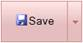{border="0"}          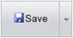{border="0"}   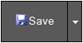{border="0"}   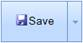{border="0"}

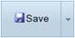{border="0"}          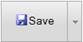{border="0"}   {border="0"}   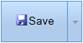{border="0"}

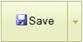{border="0"}          {border="0"}   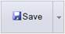{border="0"}   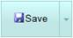{border="0"}

[{border="0"}]{style="FONT-FAMILY: 'Calibri','sans-serif'"}[     {border="0"}]{style="FONT-FAMILY: 'Calibri','sans-serif'"}

Figure 249: Split Button Themes

Using Properties Model

 

The following steps guides you in customizing the appearance using the Properties model.

 

1.   In **Controller**, create an object for the **SplitButtonModel** class and set **Text, ImageUrl, ContentType, ImagePosition,** and **Skin** properties. Assign this model class to view data.

 

+-------------------------------------------------------------------------------------------------------------------------------------------------------------------------------------------------------------------------------------------------------------------------------+
| **[\[Controller\]]{style="FONT-FAMILY: 'Courier New'"}**                                                                                                                                                                                                                      |
|                                                                                                                                                                                                                                                                               |
| [        [public]{style="COLOR: blue"} [ActionResult]{style="COLOR: #2b91af"} Index()]{style="FONT-FAMILY: 'Courier New'"}                                                                                                                                                    |
|                                                                                                                                                                                                                                                                               |
| [        {]{style="FONT-FAMILY: 'Courier New'"}                                                                                                                                                                                                                               |
|                                                                                                                                                                                                                                                                               |
| [            [SplitButtonModel]{style="COLOR: #2b91af"} splitButtonModel = [new]{style="COLOR: blue"} [SplitButtonModel]{style="COLOR: #2b91af"}()]{style="FONT-FAMILY: 'Courier New'"}                                                                                       |
|                                                                                                                                                                                                                                                                               |
| [            {]{style="FONT-FAMILY: 'Courier New'"}                                                                                                                                                                                                                           |
|                                                                                                                                                                                                                                                                               |
| [                Text = [\"Save\"]{style="COLOR: #a31515"},]{style="FONT-FAMILY: 'Courier New'"}                                                                                                                                                                              |
|                                                                                                                                                                                                                                                                               |
| [                ImageUrl = [\"Content/icon_save.png\"]{style="COLOR: #a31515"},]{style="FONT-FAMILY: 'Courier New'"}                                                                                                                                                         |
|                                                                                                                                                                                                                                                                               |
| **[                Skin = [Skins]{style="COLOR: #2b91af"}.Almond,]{style="FONT-FAMILY: 'Courier New'"}**                                                                                                                                                                      |
|                                                                                                                                                                                                                                                                               |
| [                ContentType = [ContentTypes]{style="COLOR: #2b91af"}.TextAndImage,]{style="FONT-FAMILY: 'Courier New'"}                                                                                                                                                      |
|                                                                                                                                                                                                                                                                               |
| [                ImagePosition = [ImagePositions]{style="COLOR: #2b91af"}.Right,]{style="FONT-FAMILY: 'Courier New'"}                                                                                                                                                         |
|                                                                                                                                                                                                                                                                               |
| [                ArrowPosition = [ArrowPositions]{style="COLOR: #2b91af"}.Right,]{style="FONT-FAMILY: 'Courier New'"}                                                                                                                                                         |
|                                                                                                                                                                                                                                                                               |
| [                DataSource = context.MenuData.ToList(),]{style="FONT-FAMILY: 'Courier New'"}                                                                                                                                                                                 |
|                                                                                                                                                                                                                                                                               |
| [                BindTo = [new]{style="COLOR: blue"} [DropDownFields]{style="COLOR: #2b91af"}() { Id = [\"Id\"]{style="COLOR: #a31515"}, ParentId = [\"ParentId\"]{style="COLOR: #a31515"}, Text = [\"Text\"]{style="COLOR: #a31515"} },]{style="FONT-FAMILY: 'Courier New'"} |
|                                                                                                                                                                                                                                                                               |
| [            };]{style="FONT-FAMILY: 'Courier New'"}                                                                                                                                                                                                                          |
|                                                                                                                                                                                                                                                                               |
| [            ViewData\[[\"SplitButtonModel\"]{style="COLOR: #a31515"}\] = splitButtonModel;]{style="FONT-FAMILY: 'Courier New'"}                                                                                                                                              |
|                                                                                                                                                                                                                                                                               |
| [            [return]{style="COLOR: blue"} View();]{style="FONT-FAMILY: 'Courier New'"}                                                                                                                                                                                       |
|                                                                                                                                                                                                                                                                               |
| [        }]{style="FONT-FAMILY: 'Courier New'"}                                                                                                                                                                                                                               |
|                                                                                                                                                                                                                                                                               |
| []{style="FONT-FAMILY: 'Courier New'; BACKGROUND: yellow"}                                                                                                                                                                                                                    |
+-------------------------------------------------------------------------------------------------------------------------------------------------------------------------------------------------------------------------------------------------------------------------------+

[]{style="FONT-FAMILY: 'Myriad Pro','sans-serif'"} 

2.   In **View**, invoke the **SplitButton** helper with the button id as the first argument followed by the view data of the **SplitButtonModel** class.

[]{style="FONT-FAMILY: 'Myriad Pro','sans-serif'"} 

+-----------------------------------------------------------------------------------------------------------------------------------------------------------------------------------------------------------------------------------------------------------------------------------------------------------------------------------------------------------------------+
| **[View\[aspx\]]{style="FONT-FAMILY: 'Courier New'"}**                                                                                                                                                                                                                                                                                                                |
|                                                                                                                                                                                                                                                                                                                                                                       |
| **[]{style="FONT-FAMILY: 'Courier New'"}**                                                                                                                                                                                                                                                                                                                            |
|                                                                                                                                                                                                                                                                                                                                                                       |
| [\<%]{style="FONT-FAMILY: 'Courier New'; BACKGROUND: yellow"}[=]{style="FONT-FAMILY: 'Courier New'; COLOR: blue"}[Html.Syncfusion().SplitButton([\"btnSplit\"]{style="COLOR: #a31515"},([SplitButtonModel]{style="COLOR: #2b91af"})ViewData\[[\"SplitButtonModel\"]{style="COLOR: #a31515"}\]) [%\>]{style="BACKGROUND: yellow"}]{style="FONT-FAMILY: 'Courier New'"} |
|                                                                                                                                                                                                                                                                                                                                                                       |
| []{style="FONT-FAMILY: 'Courier New'; BACKGROUND: yellow"}                                                                                                                                                                                                                                                                                                            |
+-----------------------------------------------------------------------------------------------------------------------------------------------------------------------------------------------------------------------------------------------------------------------------------------------------------------------------------------------------------------------+

[]{style="FONT-FAMILY: 'Myriad Pro','sans-serif'"} 

+-------------------------------------------------------------------------------------------------------------------------------------------------------------------------------------------------------------------------------------------------------------------------------------------------------------------------------------------------------------------------------+
| **[View\[cshtml\]]{style="FONT-FAMILY: 'Courier New'"}**                                                                                                                                                                                                                                                                                                                      |
|                                                                                                                                                                                                                                                                                                                                                                               |
| **[]{style="FONT-FAMILY: 'Courier New'"}**                                                                                                                                                                                                                                                                                                                                    |
|                                                                                                                                                                                                                                                                                                                                                                               |
| [\@{]{style="FONT-FAMILY: 'Courier New'; BACKGROUND: yellow"}[ ]{style="FONT-FAMILY: 'Courier New'; COLOR: blue"}[Html.Syncfusion().SplitButton([\"btnSplit\"]{style="COLOR: #a31515"},([SplitButtonModel]{style="COLOR: #2b91af"})ViewData\[[\"SplitButtonModel\"]{style="COLOR: #a31515"}\]).Render(); [}]{style="BACKGROUND: yellow"}]{style="FONT-FAMILY: 'Courier New'"} |
|                                                                                                                                                                                                                                                                                                                                                                               |
| []{style="FONT-FAMILY: 'Courier New'; BACKGROUND: yellow"}                                                                                                                                                                                                                                                                                                                    |
+-------------------------------------------------------------------------------------------------------------------------------------------------------------------------------------------------------------------------------------------------------------------------------------------------------------------------------------------------------------------------------+

[]{style="FONT-FAMILY: 'Myriad Pro','sans-serif'"} 

[]{style="FONT-FAMILY: 'Myriad Pro','sans-serif'"} 

3.   Run the application.

 

The output is shown in the following screenshot.

[]{style="FONT-FAMILY: 'Calibri','sans-serif'"} 

{border="0"}          {border="0"}   {border="0"}   {border="0"}

{border="0"}          {border="0"}   {border="0"}   {border="0"}

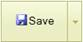{border="0"}          {border="0"}   {border="0"}   {border="0"}

[{border="0"}]{style="FONT-FAMILY: 'Calibri','sans-serif'"}[     {border="0"}]{style="FONT-FAMILY: 'Calibri','sans-serif'"}

Figure 250: Split Button Themes

Properties

The following table illustrates the properties which describes the appearance of the Split-Button.

 

+-----------+-----------------------------------------------------------------+----------------------+-----------+--------------------------------------------------+---------------------------+
| Name      | Description                                                     | Type of the property | Data Type | Value it accepts                                 | Dependency                |
+-----------+-----------------------------------------------------------------+----------------------+-----------+--------------------------------------------------+---------------------------+
| Skin      | Specifies the field that provides the appearance of the button. | Server side          | Enum      | [Skins]{style="COLOR: #2b91af"}.Almond           | []{style="COLOR: black"}  |
|           |                                                                 |                      |           |                                                  |                           |
|           |                                                                 |                      |           | [Skins]{style="COLOR: #2b91af"}.Blend            |                           |
|           |                                                                 |                      |           |                                                  |                           |
|           |                                                                 |                      |           | [Skins]{style="COLOR: #2b91af"}.Blueberry        |                           |
|           |                                                                 |                      |           |                                                  |                           |
|           |                                                                 |                      |           | [Skins]{style="COLOR: #2b91af"}.Marble           |                           |
|           |                                                                 |                      |           |                                                  |                           |
|           |                                                                 |                      |           | [Skins]{style="COLOR: #2b91af"}.Midnight         |                           |
|           |                                                                 |                      |           |                                                  |                           |
|           |                                                                 |                      |           | [Skins]{style="COLOR: #2b91af"}.Monochrome       |                           |
|           |                                                                 |                      |           |                                                  |                           |
|           |                                                                 |                      |           | [Skins]{style="COLOR: #2b91af"}.Office2007Black  |                           |
|           |                                                                 |                      |           |                                                  |                           |
|           |                                                                 |                      |           | [Skins]{style="COLOR: #2b91af"}.Office2007Blue   |                           |
|           |                                                                 |                      |           |                                                  |                           |
|           |                                                                 |                      |           | [Skins]{style="COLOR: #2b91af"}.Office2007Silver |                           |
|           |                                                                 |                      |           |                                                  |                           |
|           |                                                                 |                      |           | [Skins]{style="COLOR: #2b91af"}.Olive            |                           |
|           |                                                                 |                      |           |                                                  |                           |
|           |                                                                 |                      |           | [Skins]{style="COLOR: #2b91af"}.Sandune          |                           |
|           |                                                                 |                      |           |                                                  |                           |
|           |                                                                 |                      |           | [Skins]{style="COLOR: #2b91af"}.Turquoise        |                           |
|           |                                                                 |                      |           |                                                  |                           |
|           |                                                                 |                      |           | [Skins]{style="COLOR: #2b91af"}.Vista            |                           |
|           |                                                                 |                      |           |                                                  |                           |
|           |                                                                 |                      |           | [Skins]{style="COLOR: #2b91af"}.VS2010           |                           |
+-----------+-----------------------------------------------------------------+----------------------+-----------+--------------------------------------------------+---------------------------+

[]{style="COLOR: black"} 

Sample Link

To view the samples, follow the steps below.

1.   Open the Tools sample browser from the dashboard. (Refer to the Samples and Location chapter).

2.   Navigate to **Tools.Mvc -\> Button -\> Core Features Demo**.

 

[]{#related-topics}
:::
