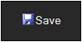

::: {style="DISPLAY: none"}
{#d2h_url_template}{#d2h_package_url style="WIDTH: 0px; DISPLAY: none; HEIGHT: 0px"}
:::

::: {.d2h_secondary_topic style="PADDING-BOTTOM: 10pt; MARGIN: 0pt; PADDING-LEFT: 0pt; PADDING-RIGHT: 0pt; PADDING-TOP: 0pt"}
#### Appearance {#appearance style="tab-stops: 0pt"}

 

The Toggle-Button supports fourteen built-in themes giving a high visual appeal.

 

Use Case Scenarios

It allows for easy customization of the appearance to be displayed on the Toggle-Button.

 

Adding Appearance[ ]{style="COLOR: red"}to an Application

The appearance can be customized through two ways in Toggle-Button.

[·      ]{style="FONT-FAMILY: Symbol"}Using Builder

[·      ]{style="FONT-FAMILY: Symbol"}Using Properties Model

 

Using Builder

 

The following steps guides you in customizing the appearance using Builder.

 

1.   In View, invoke the Toggle-Button helper with the button id as the first argument followed by the **Skin** methods.

[]{style="FONT-FAMILY: 'Myriad Pro','sans-serif'"} 

+--------------------------------------------------------------------------------------------------------------------------------------------------------------------------------+
| **[View\[aspx\]]{style="FONT-FAMILY: 'Courier New'"}**                                                                                                                         |
|                                                                                                                                                                                |
| [        [\<%]{style="BACKGROUND: yellow"}[=]{style="COLOR: blue"}Html.Syncfusion().ToggleButton([\"btnToggle\"]{style="COLOR: #a31515"})]{style="FONT-FAMILY: 'Courier New'"} |
|                                                                                                                                                                                |
| [        .Text([\"Save\"]{style="COLOR: #a31515"})]{style="FONT-FAMILY: 'Courier New'"}                                                                                        |
|                                                                                                                                                                                |
| [        **.Skin([Skins]{style="COLOR: #2b91af"}.Almond)**]{style="FONT-FAMILY: 'Courier New'"}                                                                                |
|                                                                                                                                                                                |
| [        .IsChecked([true]{style="COLOR: blue"})]{style="FONT-FAMILY: 'Courier New'"}                                                                                          |
|                                                                                                                                                                                |
| [        .ImageUrl([\"Content/icon_save.png\"]{style="COLOR: #a31515"})]{style="FONT-FAMILY: 'Courier New'"}                                                                   |
|                                                                                                                                                                                |
| [        .ContentType([ContentTypes]{style="COLOR: #2b91af"}.TextAndImage)]{style="FONT-FAMILY: 'Courier New'"}                                                                |
|                                                                                                                                                                                |
| [        [%\>]{style="BACKGROUND: yellow"}]{style="FONT-FAMILY: 'Courier New'"}                                                                                                |
+--------------------------------------------------------------------------------------------------------------------------------------------------------------------------------+

 

[]{style="FONT-FAMILY: 'Myriad Pro','sans-serif'"} 

+--------------------------------------------------------------------------------------------------------------------------------------------------------------------------------+
| **[View\[cshtml\]]{style="FONT-FAMILY: 'Courier New'"}**                                                                                                                       |
|                                                                                                                                                                                |
| [        [\@{]{style="BACKGROUND: yellow"}[ ]{style="COLOR: blue"}Html.Syncfusion().ToggleButton([\"btnToggle\"]{style="COLOR: #a31515"})]{style="FONT-FAMILY: 'Courier New'"} |
|                                                                                                                                                                                |
| [        .Text([\"Save\"]{style="COLOR: #a31515"})]{style="FONT-FAMILY: 'Courier New'"}                                                                                        |
|                                                                                                                                                                                |
| [        **.Skin([Skins]{style="COLOR: #2b91af"}.Almond)**]{style="FONT-FAMILY: 'Courier New'"}                                                                                |
|                                                                                                                                                                                |
| [        .IsChecked([true]{style="COLOR: blue"})]{style="FONT-FAMILY: 'Courier New'"}                                                                                          |
|                                                                                                                                                                                |
| [        .ImageUrl([\"Content/icon_save.png\"]{style="COLOR: #a31515"})]{style="FONT-FAMILY: 'Courier New'"}                                                                   |
|                                                                                                                                                                                |
| [        .ContentType([ContentTypes]{style="COLOR: #2b91af"}.TextAndImage)]{style="FONT-FAMILY: 'Courier New'"}                                                                |
|                                                                                                                                                                                |
| [        .Render();]{style="FONT-FAMILY: 'Courier New'"}                                                                                                                       |
|                                                                                                                                                                                |
| [        [}]{style="BACKGROUND: yellow"}]{style="FONT-FAMILY: 'Courier New'"}                                                                                                  |
+--------------------------------------------------------------------------------------------------------------------------------------------------------------------------------+

 

 

2.   Run the application.

 

The output is shown in the following screenshot.

[]{style="FONT-FAMILY: 'Calibri','sans-serif'"} 

{border="0"} {border="0"}   {border="0"}   {border="0"}

{border="0"} {border="0"}   {border="0"}   {border="0"}

{border="0"} {border="0"}   {border="0"}   {border="0"}

Figure 300: Toggle-Button Themes

[]{style="FONT-FAMILY: 'Calibri','sans-serif'"} 

**Using Properties Model**

 

The following steps guides in customizing the appearance using the Properties model.

1.   In Controller, create an object for the **ToggleButtonModel** class and set the **Text, ImageUrl, ContentType, ImagePosition,** and **Skin** properties.

2.   Assign this model class to **View** data.

[]{style="FONT-FAMILY: 'Myriad Pro','sans-serif'"} 

+--------------------------------------------------------------------------------------------------------------------------------------------------------------------------------------------+
| **[\[Controller\]]{style="FONT-FAMILY: 'Courier New'"}**                                                                                                                                   |
|                                                                                                                                                                                            |
| [        [public]{style="COLOR: blue"} [ActionResult]{style="COLOR: #2b91af"} Index()]{style="FONT-FAMILY: 'Courier New'"}                                                                 |
|                                                                                                                                                                                            |
| [        {]{style="FONT-FAMILY: 'Courier New'"}                                                                                                                                            |
|                                                                                                                                                                                            |
| [            [ToggleButtonModel]{style="COLOR: #2b91af"} toggleButtonModel = [new]{style="COLOR: blue"} [ToggleButtonModel]{style="COLOR: #2b91af"}()]{style="FONT-FAMILY: 'Courier New'"} |
|                                                                                                                                                                                            |
| [            {]{style="FONT-FAMILY: 'Courier New'"}                                                                                                                                        |
|                                                                                                                                                                                            |
| [                Text = [\"Save\"]{style="COLOR: #a31515"},]{style="FONT-FAMILY: 'Courier New'"}                                                                                           |
|                                                                                                                                                                                            |
| [                **Skin = [Skins]{style="COLOR: #2b91af"}.Almond,**]{style="FONT-FAMILY: 'Courier New'"}                                                                                   |
|                                                                                                                                                                                            |
| [                IsChecked = [true]{style="COLOR: blue"},]{style="FONT-FAMILY: 'Courier New'"}                                                                                             |
|                                                                                                                                                                                            |
| [                ImageUrl = [\"Content/icon_save.png\"]{style="COLOR: #a31515"},]{style="FONT-FAMILY: 'Courier New'"}                                                                      |
|                                                                                                                                                                                            |
| [                ContentType = [ContentTypes]{style="COLOR: #2b91af"}.TextAndImage,]{style="FONT-FAMILY: 'Courier New'"}                                                                   |
|                                                                                                                                                                                            |
| [                ImagePosition = [ImagePositions]{style="COLOR: #2b91af"}.Right]{style="FONT-FAMILY: 'Courier New'"}                                                                       |
|                                                                                                                                                                                            |
| [            };]{style="FONT-FAMILY: 'Courier New'"}                                                                                                                                       |
|                                                                                                                                                                                            |
| [            ViewData\[[\"ToggleButtonModel\"]{style="COLOR: #a31515"}\] = toggleButtonModel;]{style="FONT-FAMILY: 'Courier New'"}                                                         |
|                                                                                                                                                                                            |
| [            [return]{style="COLOR: blue"} View();]{style="FONT-FAMILY: 'Courier New'"}                                                                                                    |
|                                                                                                                                                                                            |
| [        }]{style="FONT-FAMILY: 'Courier New'"}                                                                                                                                            |
|                                                                                                                                                                                            |
| []{style="FONT-FAMILY: 'Courier New'; BACKGROUND: yellow"}                                                                                                                                 |
+--------------------------------------------------------------------------------------------------------------------------------------------------------------------------------------------+

[]{style="FONT-FAMILY: 'Myriad Pro','sans-serif'"} 

3.   In View, invoke the ToggleButton helper with the button id as the first argument followed by the view data of the **ToggleButtonModel** class.

 

+---------------------------------------------------------------------------------------------------------------------------------------------------------------------------------------------------------------------------------------------------------------------------------------------------------------------------------------------------------------------------+
| **[View\[aspx\]]{style="FONT-FAMILY: 'Courier New'"}**                                                                                                                                                                                                                                                                                                                    |
|                                                                                                                                                                                                                                                                                                                                                                           |
| [\<%]{style="FONT-FAMILY: 'Courier New'; BACKGROUND: yellow"}[=]{style="FONT-FAMILY: 'Courier New'; COLOR: blue"}[Html.Syncfusion().ToggleButton([\"btnToggle\"]{style="COLOR: #a31515"},([ToggleButtonModel]{style="COLOR: #2b91af"})ViewData\[[\"ToggleButtonModel\"]{style="COLOR: #a31515"}\]) [%\>]{style="BACKGROUND: yellow"}]{style="FONT-FAMILY: 'Courier New'"} |
|                                                                                                                                                                                                                                                                                                                                                                           |
| []{style="FONT-FAMILY: 'Courier New'; BACKGROUND: yellow"}                                                                                                                                                                                                                                                                                                                |
+---------------------------------------------------------------------------------------------------------------------------------------------------------------------------------------------------------------------------------------------------------------------------------------------------------------------------------------------------------------------------+

[]{style="FONT-FAMILY: 'Myriad Pro','sans-serif'"} 

+-----------------------------------------------------------------------------------------------------------------------------------------------------------------------------------------------------------------------------------------------------------------------------------------------------------------------------------------------------------------------------------------------------------------------------------------------------------------------------------------+
| **[View\[cshtml\]]{style="FONT-FAMILY: 'Courier New'"}**                                                                                                                                                                                                                                                                                                                                                                                                                                |
|                                                                                                                                                                                                                                                                                                                                                                                                                                                                                         |
| [\@{]{style="FONT-FAMILY: 'Courier New'; BACKGROUND: yellow"}[ ]{style="FONT-FAMILY: 'Courier New'; COLOR: blue"}[Html.Syncfusion().ToggleButton([\"btnToggle\"]{style="COLOR: #a31515"},([ToggleButtonModel]{style="COLOR: #2b91af"})ViewData\[[\"ToggleButtonModel\"]{style="COLOR: #a31515"}\]).Render();]{style="FONT-FAMILY: 'Courier New'"}[}]{style="FONT-FAMILY: 'Courier New'; BACKGROUND: yellow; FONT-SIZE: 11pt"}[]{style="FONT-FAMILY: 'Courier New'; BACKGROUND: yellow"} |
|                                                                                                                                                                                                                                                                                                                                                                                                                                                                                         |
| []{style="FONT-FAMILY: 'Courier New'; BACKGROUND: yellow"}                                                                                                                                                                                                                                                                                                                                                                                                                              |
+-----------------------------------------------------------------------------------------------------------------------------------------------------------------------------------------------------------------------------------------------------------------------------------------------------------------------------------------------------------------------------------------------------------------------------------------------------------------------------------------+

[]{style="FONT-FAMILY: 'Myriad Pro','sans-serif'"} 

4.   Run the application.

 

The output is shown in the following screenshot.

[]{style="FONT-FAMILY: 'Calibri','sans-serif'"} 

{border="0"} {border="0"}   {border="0"}   {border="0"}

{border="0"} {border="0"}   {border="0"}   {border="0"}

{border="0"} {border="0"}   {border="0"}   {border="0"}

Figure 301: Toggle-Button Themes

Properties

[]{style="COLOR: black"} 

The following table illustrates the properties which describes the appearance of the Toggle-Button.

[]{style="COLOR: black"} 

+-----------+-----------------------------------------------------------------+----------------------+-----------+------------------------+---------------------------+
| Name      | Description                                                     | Type of the property | Data Type | Value it accepts       | Dependency                |
+-----------+-----------------------------------------------------------------+----------------------+-----------+------------------------+---------------------------+
| Skin      | Specifies the field that provides the appearance of the button. | Server side          | Enum      | Skins.Almond           | []{style="COLOR: black"}  |
|           |                                                                 |                      |           |                        |                           |
|           |                                                                 |                      |           | Skins.Blend            |                           |
|           |                                                                 |                      |           |                        |                           |
|           |                                                                 |                      |           | Skins.Blueberry        |                           |
|           |                                                                 |                      |           |                        |                           |
|           |                                                                 |                      |           | Skins.Marble           |                           |
|           |                                                                 |                      |           |                        |                           |
|           |                                                                 |                      |           | Skins.Midnight         |                           |
|           |                                                                 |                      |           |                        |                           |
|           |                                                                 |                      |           | Skins.Monochrome       |                           |
|           |                                                                 |                      |           |                        |                           |
|           |                                                                 |                      |           | Skins.Office2007Black  |                           |
|           |                                                                 |                      |           |                        |                           |
|           |                                                                 |                      |           | Skins.Office2007Blue   |                           |
|           |                                                                 |                      |           |                        |                           |
|           |                                                                 |                      |           | Skins.Office2007Silver |                           |
|           |                                                                 |                      |           |                        |                           |
|           |                                                                 |                      |           | Skins.Olive            |                           |
|           |                                                                 |                      |           |                        |                           |
|           |                                                                 |                      |           | Skins.Sandune          |                           |
|           |                                                                 |                      |           |                        |                           |
|           |                                                                 |                      |           | Skins.Turquoise        |                           |
|           |                                                                 |                      |           |                        |                           |
|           |                                                                 |                      |           | Skins.Vista            |                           |
|           |                                                                 |                      |           |                        |                           |
|           |                                                                 |                      |           | Skins.VS2010           |                           |
+-----------+-----------------------------------------------------------------+----------------------+-----------+------------------------+---------------------------+

[]{style="COLOR: black"} 

Sample Link

To view the samples, follow the steps below.

1.   Open the Tools sample browser from the dashboard. (Refer to the Samples and Location chapter)

2.   Navigate to **Tools.Mvc -\> Button -\> Core Features Demo**.

**[]{style="COLOR: black"}** 

[]{#related-topics}
:::
