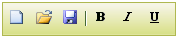

::: {style="DISPLAY: none"}
{#d2h_url_template}{#d2h_package_url style="WIDTH: 0px; DISPLAY: none; HEIGHT: 0px"}
:::

::: {.d2h_secondary_topic style="PADDING-BOTTOM: 10pt; MARGIN: 0pt; PADDING-LEFT: 0pt; PADDING-RIGHT: 0pt; PADDING-TOP: 0pt"}
#### Appearance {#appearance style="tab-stops: 0pt"}

 

The toolbar control supports fourteen built-in skins and varied background layouts to enhance its look and feel.

**[]{style="FONT-FAMILY: 'Calibri','sans-serif'"}** 

Properties

 

+-------------+---------------------------------------------+----------------------------------+--------------------------------------------------------------------+-------------+
| Name        | Description                                 | Type of property                 | Value it accepts                                                   | Dependency  |
+=============+=============================================+==================================+====================================================================+=============+
| Skin        | Defines one of the fourteen in-built themes | [enum]{style="FONT-SIZE: 9.5pt"} | [·      ]{style="FONT-FAMILY: Symbol"}ToolBarSkin.Office2007Blue   | NA          |
|             |                                             |                                  |                                                                    |             |
|             |                                             |                                  | [·      ]{style="FONT-FAMILY: Symbol"}ToolBarSkin.Office2007Silver |             |
|             |                                             |                                  |                                                                    |             |
|             |                                             |                                  | [·      ]{style="FONT-FAMILY: Symbol"}ToolBarSkin.Office2007Black  |             |
|             |                                             |                                  |                                                                    |             |
|             |                                             |                                  | [·      ]{style="FONT-FAMILY: Symbol"}ToolBarSkin.Vista            |             |
|             |                                             |                                  |                                                                    |             |
|             |                                             |                                  | [·      ]{style="FONT-FAMILY: Symbol"}ToolBarSkin.Almond           |             |
|             |                                             |                                  |                                                                    |             |
|             |                                             |                                  | [·      ]{style="FONT-FAMILY: Symbol"}ToolBarSkin.Blueberry        |             |
|             |                                             |                                  |                                                                    |             |
|             |                                             |                                  | [·      ]{style="FONT-FAMILY: Symbol"}ToolBarSkin.Blend            |             |
|             |                                             |                                  |                                                                    |             |
|             |                                             |                                  | [·      ]{style="FONT-FAMILY: Symbol"}ToolBarSkin.Olive            |             |
|             |                                             |                                  |                                                                    |             |
|             |                                             |                                  | [·      ]{style="FONT-FAMILY: Symbol"}ToolBarSkin.Turquoise        |             |
|             |                                             |                                  |                                                                    |             |
|             |                                             |                                  | [·      ]{style="FONT-FAMILY: Symbol"}ToolBarSkin.Monochrome       |             |
|             |                                             |                                  |                                                                    |             |
|             |                                             |                                  | [·      ]{style="FONT-FAMILY: Symbol"}ToolBarSkin.Sandune          |             |
|             |                                             |                                  |                                                                    |             |
|             |                                             |                                  | [·      ]{style="FONT-FAMILY: Symbol"}ToolBarSkin.VS2010           |             |
|             |                                             |                                  |                                                                    |             |
|             |                                             |                                  | [·      ]{style="FONT-FAMILY: Symbol"}ToolBarSkin.Marble           |             |
|             |                                             |                                  |                                                                    |             |
|             |                                             |                                  | [·      ]{style="FONT-FAMILY: Symbol"}ToolBarSkin.Midnight         |             |
|             |                                             |                                  |                                                                    |             |
|             |                                             |                                  |                                                                    |             |
+-------------+---------------------------------------------+----------------------------------+--------------------------------------------------------------------+-------------+

*[[]{style="TEXT-DECORATION: none"}]{.underline}* 

Using Builder

 

The following steps explain how to define a theme for the toolbar using Builder.

1.   In **View**, create a *ul-li* list of toolbar items and invoke the toolbar helper.

[]{style="FONT-FAMILY: 'Calibri','sans-serif'"} 

+--------------------------------------------------------------------------------------------------------------------------------------------------------------------------------------------------------------------------------------------------------------------------------------------------------------------------------------------------------------------------------------------------------------------------+
| **[View\[ASPX\]]{style="FONT-FAMILY: 'Courier New'"}**                                                                                                                                                                                                                                                                                                                                                                   |
|                                                                                                                                                                                                                                                                                                                                                                                                                          |
| [\<]{style="FONT-FAMILY: 'Courier New'; COLOR: blue"}[div]{style="FONT-FAMILY: 'Courier New'; COLOR: maroon"}[ [id]{style="COLOR: red"}[=\"toolbarItems\"]{style="COLOR: blue"} [style]{style="COLOR: red"}[=\"]{style="COLOR: blue"}[visibility]{style="COLOR: red"}[:hidden\"\>]{style="COLOR: blue"}]{style="FONT-FAMILY: 'Courier New'"}                                                                             |
|                                                                                                                                                                                                                                                                                                                                                                                                                          |
| [     [\<]{style="COLOR: blue"}[ul]{style="COLOR: maroon"}[\>]{style="COLOR: blue"}]{style="FONT-FAMILY: 'Courier New'"}                                                                                                                                                                                                                                                                                                 |
|                                                                                                                                                                                                                                                                                                                                                                                                                          |
| [         [\<]{style="COLOR: blue"}[li]{style="COLOR: maroon"} [id]{style="COLOR: red"}[=\"New\"]{style="COLOR: blue"} [title]{style="COLOR: red"}[=\"New \[Ctrl + N\]\"\>]{style="COLOR: blue"}]{style="FONT-FAMILY: 'Courier New'"}                                                                                                                                                                                    |
|                                                                                                                                                                                                                                                                                                                                                                                                                          |
| [             [\<]{style="COLOR: blue"}[img]{style="COLOR: maroon"} [src]{style="COLOR: red"}[=\']{style="COLOR: blue"}[\<%]{style="BACKGROUND: yellow"}[=]{style="COLOR: blue"} Url.Content(\"\~/Content/new.gif\")[%\>]{style="BACKGROUND: yellow"}[\']{style="COLOR: blue"} [/\>\</]{style="COLOR: blue"}[li]{style="COLOR: maroon"}[\>]{style="COLOR: blue"}          ]{style="FONT-FAMILY: 'Courier New'"}          |
|                                                                                                                                                                                                                                                                                                                                                                                                                          |
| [          [\<]{style="COLOR: blue"}[li]{style="COLOR: maroon"} [id]{style="COLOR: red"}[=\"Open\"]{style="COLOR: blue"} [title]{style="COLOR: red"}[=\"Open file\]\"\>]{style="COLOR: blue"}]{style="FONT-FAMILY: 'Courier New'"}                                                                                                                                                                                       |
|                                                                                                                                                                                                                                                                                                                                                                                                                          |
| [               [\<]{style="COLOR: blue"}[img]{style="COLOR: maroon"} [src]{style="COLOR: red"}[=\']{style="COLOR: blue"}[\<%]{style="BACKGROUND: yellow"}[=]{style="COLOR: blue"} Url.Content(\"\~/Content/openremote.gif\")[%\>]{style="BACKGROUND: yellow"}[\']{style="COLOR: blue"} [/\>\</]{style="COLOR: blue"}[li]{style="COLOR: maroon"}[\>]{style="COLOR: blue"}          ]{style="FONT-FAMILY: 'Courier New'"} |
|                                                                                                                                                                                                                                                                                                                                                                                                                          |
| [          [\<]{style="COLOR: blue"}[li]{style="COLOR: maroon"} [id]{style="COLOR: red"}[=\"Save\"]{style="COLOR: blue"} [title]{style="COLOR: red"}[=\"Save \[Ctrl + S\]\"\>]{style="COLOR: blue"}]{style="FONT-FAMILY: 'Courier New'"}                                                                                                                                                                                 |
|                                                                                                                                                                                                                                                                                                                                                                                                                          |
| [               [\<]{style="COLOR: blue"}[img]{style="COLOR: maroon"} [src]{style="COLOR: red"}[=\']{style="COLOR: blue"}[\<%]{style="BACKGROUND: yellow"}[=]{style="COLOR: blue"} Url.Content(\"\~/Content/savelocal.gif\")[%\>]{style="BACKGROUND: yellow"}[\']{style="COLOR: blue"} [/\>\</]{style="COLOR: blue"}[li]{style="COLOR: maroon"}[\>]{style="COLOR: blue"}]{style="FONT-FAMILY: 'Courier New'"}            |
|                                                                                                                                                                                                                                                                                                                                                                                                                          |
| [      \</]{style="FONT-FAMILY: 'Courier New'; COLOR: blue"}[ul]{style="FONT-FAMILY: 'Courier New'; COLOR: maroon"}[\>]{style="FONT-FAMILY: 'Courier New'; COLOR: blue"}[       ]{style="FONT-FAMILY: 'Courier New'"}                                                                                                                                                                                                    |
|                                                                                                                                                                                                                                                                                                                                                                                                                          |
| [       [\<]{style="COLOR: blue"}[ul]{style="COLOR: maroon"}[\>]{style="COLOR: blue"}]{style="FONT-FAMILY: 'Courier New'"}                                                                                                                                                                                                                                                                                               |
|                                                                                                                                                                                                                                                                                                                                                                                                                          |
| [          [\<]{style="COLOR: blue"}[li]{style="COLOR: maroon"} [id]{style="COLOR: red"}[=\"Bold\"]{style="COLOR: blue"} [tilte]{style="COLOR: red"}[=\"Bold \[Ctrl + B\]\"\>]{style="COLOR: blue"}]{style="FONT-FAMILY: 'Courier New'"}                                                                                                                                                                                 |
|                                                                                                                                                                                                                                                                                                                                                                                                                          |
| [              [\<]{style="COLOR: blue"}[img]{style="COLOR: maroon"} [src]{style="COLOR: red"}[=\']{style="COLOR: blue"}[\<%]{style="BACKGROUND: yellow"}[=]{style="COLOR: blue"} Url.Content(\"\~/Content/bold.gif\")[%\>]{style="BACKGROUND: yellow"}[\']{style="COLOR: blue"} [/\>\</]{style="COLOR: blue"}[li]{style="COLOR: maroon"}[\>          ]{style="COLOR: blue"}]{style="FONT-FAMILY: 'Courier New'"}        |
|                                                                                                                                                                                                                                                                                                                                                                                                                          |
| [          [\<]{style="COLOR: blue"}[li]{style="COLOR: maroon"} [id]{style="COLOR: red"}[=\"Italic\"]{style="COLOR: blue"} [tilte]{style="COLOR: red"}[=\"Bold \[Ctrl + I\]\"\>]{style="COLOR: blue"}]{style="FONT-FAMILY: 'Courier New'"}                                                                                                                                                                               |
|                                                                                                                                                                                                                                                                                                                                                                                                                          |
| [              [\<]{style="COLOR: blue"}[img]{style="COLOR: maroon"} [src]{style="COLOR: red"}[=\']{style="COLOR: blue"}[\<%]{style="BACKGROUND: yellow"}[=]{style="COLOR: blue"} Url.Content(\"\~/Content/italic.gif\")[%\>]{style="BACKGROUND: yellow"}[\']{style="COLOR: blue"} [/\>\</]{style="COLOR: blue"}[li]{style="COLOR: maroon"}[\>          ]{style="COLOR: blue"}]{style="FONT-FAMILY: 'Courier New'"}      |
|                                                                                                                                                                                                                                                                                                                                                                                                                          |
| [          [\<]{style="COLOR: blue"}[li]{style="COLOR: maroon"} [id]{style="COLOR: red"}[=\"Underline\"]{style="COLOR: blue"} [tilte]{style="COLOR: red"}[=\"Bold \[Ctrl + U\]\"\>]{style="COLOR: blue"}]{style="FONT-FAMILY: 'Courier New'"}                                                                                                                                                                            |
|                                                                                                                                                                                                                                                                                                                                                                                                                          |
| [              [\<]{style="COLOR: blue"}[img]{style="COLOR: maroon"} [src]{style="COLOR: red"}[=\']{style="COLOR: blue"}[\<%]{style="BACKGROUND: yellow"}[=]{style="COLOR: blue"} Url.Content(\"\~/Content/underline.gif\")[%\>]{style="BACKGROUND: yellow"}[\']{style="COLOR: blue"} [/\>\</]{style="COLOR: blue"}[li]{style="COLOR: maroon"}[\>]{style="COLOR: blue"}]{style="FONT-FAMILY: 'Courier New'"}             |
|                                                                                                                                                                                                                                                                                                                                                                                                                          |
| [       [\</]{style="COLOR: blue"}[ul]{style="COLOR: maroon"}[\>]{style="COLOR: blue"}]{style="FONT-FAMILY: 'Courier New'"}                                                                                                                                                                                                                                                                                              |
|                                                                                                                                                                                                                                                                                                                                                                                                                          |
| [   [\</]{style="COLOR: blue"}[div]{style="COLOR: maroon"}[\>]{style="COLOR: blue"}]{style="FONT-FAMILY: 'Courier New'"}                                                                                                                                                                                                                                                                                                 |
|                                                                                                                                                                                                                                                                                                                                                                                                                          |
| [    [\<%]{style="BACKGROUND: yellow"}[=]{style="COLOR: blue"}Html.Syncfusion().Toolbar([\"myToolbar\"]{style="COLOR: #a31515"})]{style="FONT-FAMILY: 'Courier New'"}                                                                                                                                                                                                                                                    |
|                                                                                                                                                                                                                                                                                                                                                                                                                          |
| [       .TargetId([\"toolbarItems\"]{style="COLOR: #a31515"})]{style="FONT-FAMILY: 'Courier New'"}                                                                                                                                                                                                                                                                                                                       |
|                                                                                                                                                                                                                                                                                                                                                                                                                          |
| **[.Skin([ToolBarSkin]{style="COLOR: #2b91af"}.Olive)]{style="FONT-FAMILY: 'Courier New'"}**[%\>]{style="FONT-FAMILY: 'Courier New'; BACKGROUND: yellow"}**[]{style="FONT-FAMILY: 'Courier New'"}**                                                                                                                                                                                                                      |
+--------------------------------------------------------------------------------------------------------------------------------------------------------------------------------------------------------------------------------------------------------------------------------------------------------------------------------------------------------------------------------------------------------------------------+

**[]{style="FONT-FAMILY: 'Calibri','sans-serif'"}** 

 

+---------------------------------------------------------------------------------------------------------------------------------------------------------------------------------------------------------------------------------------------------------------------------------------------------------------------------------------------------------+
| **View\[cshtml\]**                                                                                                                                                                                                                                                                                                                                      |
|                                                                                                                                                                                                                                                                                                                                                         |
| [\<]{style="FONT-FAMILY: 'Courier New'; COLOR: blue"}[div]{style="FONT-FAMILY: 'Courier New'; COLOR: maroon"}[ [id]{style="COLOR: red"}[=\"toolbarItems\"]{style="COLOR: blue"} [style]{style="COLOR: red"}[=\"]{style="COLOR: blue"}[visibility]{style="COLOR: red"}[:hidden\"\>]{style="COLOR: blue"}]{style="FONT-FAMILY: 'Courier New'"}            |
|                                                                                                                                                                                                                                                                                                                                                         |
| [     [\<]{style="COLOR: blue"}[ul]{style="COLOR: maroon"}[\>]{style="COLOR: blue"}]{style="FONT-FAMILY: 'Courier New'"}                                                                                                                                                                                                                                |
|                                                                                                                                                                                                                                                                                                                                                         |
| [         [\<]{style="COLOR: blue"}[li]{style="COLOR: maroon"} [id]{style="COLOR: red"}[=\"New\"]{style="COLOR: blue"} [title]{style="COLOR: red"}[=\"New \[Ctrl + N\]\"\>]{style="COLOR: blue"}]{style="FONT-FAMILY: 'Courier New'"}                                                                                                                   |
|                                                                                                                                                                                                                                                                                                                                                         |
| [             [\<]{style="COLOR: blue"}[img]{style="COLOR: maroon"} [src]{style="COLOR: red"}[=\']{style="COLOR: blue"}[@]{style="BACKGROUND: yellow"}Url.Content(\"\~/Content/new.gif\")[\']{style="COLOR: blue"} [/\>\</]{style="COLOR: blue"}[li]{style="COLOR: maroon"}[\>]{style="COLOR: blue"}          ]{style="FONT-FAMILY: 'Courier New'"}     |
|                                                                                                                                                                                                                                                                                                                                                         |
| [          [\<]{style="COLOR: blue"}[li]{style="COLOR: maroon"} [id]{style="COLOR: red"}[=\"Open\"]{style="COLOR: blue"} [title]{style="COLOR: red"}[=\"Open file\]\"\>]{style="COLOR: blue"}]{style="FONT-FAMILY: 'Courier New'"}                                                                                                                      |
|                                                                                                                                                                                                                                                                                                                                                         |
| [        [\<]{style="COLOR: blue"}[img]{style="COLOR: maroon"} [src]{style="COLOR: red"}[=\']{style="COLOR: blue"}[@]{style="BACKGROUND: yellow"}Url.Content(\"\~/Content/openremote.gif\")[\']{style="COLOR: blue"} [/\>\</]{style="COLOR: blue"}[li]{style="COLOR: maroon"}[\>]{style="COLOR: blue"}          ]{style="FONT-FAMILY: 'Courier New'"}   |
|                                                                                                                                                                                                                                                                                                                                                         |
| [        [\<]{style="COLOR: blue"}[li]{style="COLOR: maroon"} [id]{style="COLOR: red"}[=\"Save\"]{style="COLOR: blue"} [title]{style="COLOR: red"}[=\"Save \[Ctrl + S\]\"\>]{style="COLOR: blue"}]{style="FONT-FAMILY: 'Courier New'"}                                                                                                                  |
|                                                                                                                                                                                                                                                                                                                                                         |
| [       [\<]{style="COLOR: blue"}[img]{style="COLOR: maroon"} [src]{style="COLOR: red"}[=\']{style="COLOR: blue"}[@]{style="BACKGROUND: yellow"}Url.Content(\"\~/Content/savelocal.gif\")[\']{style="COLOR: blue"} [/\>\</]{style="COLOR: blue"}[li]{style="COLOR: maroon"}[\>]{style="COLOR: blue"}]{style="FONT-FAMILY: 'Courier New'"}               |
|                                                                                                                                                                                                                                                                                                                                                         |
| [      \</]{style="FONT-FAMILY: 'Courier New'; COLOR: blue"}[ul]{style="FONT-FAMILY: 'Courier New'; COLOR: maroon"}[\>]{style="FONT-FAMILY: 'Courier New'; COLOR: blue"}[ [\<]{style="COLOR: blue"}[ul]{style="COLOR: maroon"}[\>]{style="COLOR: blue"}]{style="FONT-FAMILY: 'Courier New'"}                                                            |
|                                                                                                                                                                                                                                                                                                                                                         |
| [          [\<]{style="COLOR: blue"}[li]{style="COLOR: maroon"} [id]{style="COLOR: red"}[=\"Bold\"]{style="COLOR: blue"} [tilte]{style="COLOR: red"}[=\"Bold \[Ctrl + B\]\"\>]{style="COLOR: blue"}]{style="FONT-FAMILY: 'Courier New'"}                                                                                                                |
|                                                                                                                                                                                                                                                                                                                                                         |
| [              [\<]{style="COLOR: blue"}[img]{style="COLOR: maroon"} [src]{style="COLOR: red"}[=\']{style="COLOR: blue"}[@]{style="BACKGROUND: yellow"}Url.Content(\"\~/Content/bold.gif\")[\']{style="COLOR: blue"} [/\>\</]{style="COLOR: blue"}[li]{style="COLOR: maroon"}[\>          ]{style="COLOR: blue"}]{style="FONT-FAMILY: 'Courier New'"}   |
|                                                                                                                                                                                                                                                                                                                                                         |
| [          [\<]{style="COLOR: blue"}[li]{style="COLOR: maroon"} [id]{style="COLOR: red"}[=\"Italic\"]{style="COLOR: blue"} [tilte]{style="COLOR: red"}[=\"Bold \[Ctrl + I\]\"\>]{style="COLOR: blue"}]{style="FONT-FAMILY: 'Courier New'"}                                                                                                              |
|                                                                                                                                                                                                                                                                                                                                                         |
| [              [\<]{style="COLOR: blue"}[img]{style="COLOR: maroon"} [src]{style="COLOR: red"}[=\']{style="COLOR: blue"}[@]{style="BACKGROUND: yellow"}Url.Content(\"\~/Content/italic.gif\")[\']{style="COLOR: blue"} [/\>\</]{style="COLOR: blue"}[li]{style="COLOR: maroon"}[\>          ]{style="COLOR: blue"}]{style="FONT-FAMILY: 'Courier New'"} |
|                                                                                                                                                                                                                                                                                                                                                         |
| [          [\<]{style="COLOR: blue"}[li]{style="COLOR: maroon"} [id]{style="COLOR: red"}[=\"Underline\"]{style="COLOR: blue"} [tilte]{style="COLOR: red"}[=\"Bold \[Ctrl + U\]\"\>]{style="COLOR: blue"}]{style="FONT-FAMILY: 'Courier New'"}                                                                                                           |
|                                                                                                                                                                                                                                                                                                                                                         |
| [              [\<]{style="COLOR: blue"}[img]{style="COLOR: maroon"} [src]{style="COLOR: red"}[=\']{style="COLOR: blue"}[@]{style="BACKGROUND: yellow"}Url.Content(\"\~/Content/underline.gif\")[\']{style="COLOR: blue"} [/\>\</]{style="COLOR: blue"}[li]{style="COLOR: maroon"}[\>]{style="COLOR: blue"}]{style="FONT-FAMILY: 'Courier New'"}        |
|                                                                                                                                                                                                                                                                                                                                                         |
| [       [\</]{style="COLOR: blue"}[ul]{style="COLOR: maroon"}[\>]{style="COLOR: blue"} [\</]{style="COLOR: blue"}[div]{style="COLOR: maroon"}[\>]{style="COLOR: blue"}]{style="FONT-FAMILY: 'Courier New'"}                                                                                                                                             |
|                                                                                                                                                                                                                                                                                                                                                         |
| [    [\@{]{style="BACKGROUND: yellow"} Html.Syncfusion().Toolbar([\"myToolbar\"]{style="COLOR: #a31515"})]{style="FONT-FAMILY: 'Courier New'"}                                                                                                                                                                                                          |
|                                                                                                                                                                                                                                                                                                                                                         |
| [       .TargetId([\"toolbarItems\"]{style="COLOR: #a31515"})]{style="FONT-FAMILY: 'Courier New'"}                                                                                                                                                                                                                                                      |
|                                                                                                                                                                                                                                                                                                                                                         |
| **[.Skin([ToolBarSkin]{style="COLOR: #2b91af"}.Olive)]{style="FONT-FAMILY: 'Courier New'"}**[.Render();]{style="FONT-FAMILY: 'Courier New'"}[}]{style="FONT-FAMILY: 'Courier New'; BACKGROUND: yellow"}**[]{style="FONT-FAMILY: 'Courier New'"}**                                                                                                       |
+---------------------------------------------------------------------------------------------------------------------------------------------------------------------------------------------------------------------------------------------------------------------------------------------------------------------------------------------------------+

**[]{style="FONT-FAMILY: 'Calibri','sans-serif'"}** 

2.   Build and run the application

 

Using Properties Model

 

The following steps explain how to define the theme for a toolbar using the Properties Model.

1.   In the controller, create an instance of **ToolbarModel**.

2.   Define the **Skin** property and pass the instance through the **view-specific data** to the **view**.[]{style="FONT-FAMILY: Consolas; FONT-SIZE: 9.5pt"}

[]{style="FONT-FAMILY: Consolas; FONT-SIZE: 9.5pt"} 

+-------------------------------------------------------------------------------------------------------------------------------------------------------------------------+
| **[\[Controller\]]{style="FONT-FAMILY: 'Courier New'"}**                                                                                                                |
|                                                                                                                                                                         |
| [public]{style="FONT-FAMILY: 'Courier New'; COLOR: blue"}[ [ActionResult]{style="COLOR: #2b91af"} Index()]{style="FONT-FAMILY: 'Courier New'"}                          |
|                                                                                                                                                                         |
| [        {]{style="FONT-FAMILY: 'Courier New'"}                                                                                                                         |
|                                                                                                                                                                         |
| [            [ToolbarModel]{style="COLOR: #2b91af"} myModel = [new]{style="COLOR: blue"} [ToolbarModel]{style="COLOR: #2b91af"}();]{style="FONT-FAMILY: 'Courier New'"} |
|                                                                                                                                                                         |
| [            myModel.TargetId = [\"toolbarItems\"]{style="COLOR: #a31515"};]{style="FONT-FAMILY: 'Courier New'"}                                                        |
|                                                                                                                                                                         |
| [            **myModel.Skin = [ToolBarSkin]{style="COLOR: #2b91af"}.Olive;**]{style="FONT-FAMILY: 'Courier New'"}                                                       |
|                                                                                                                                                                         |
| []{style="FONT-FAMILY: 'Courier New'"}                                                                                                                                  |
|                                                                                                                                                                         |
| [            [//pass the instance through View Data]{style="COLOR: green"}]{style="FONT-FAMILY: 'Courier New'"}                                                         |
|                                                                                                                                                                         |
| [            ViewData\[[\"myToolbar\"]{style="COLOR: #a31515"}\] = myModel;]{style="FONT-FAMILY: 'Courier New'"}                                                        |
|                                                                                                                                                                         |
| [            [return]{style="COLOR: blue"} View();]{style="FONT-FAMILY: 'Courier New'"}                                                                                 |
|                                                                                                                                                                         |
| [        }]{style="FONT-FAMILY: 'Courier New'"}                                                                                                                         |
|                                                                                                                                                                         |
| []{style="FONT-FAMILY: 'Courier New'"}                                                                                                                                  |
+-------------------------------------------------------------------------------------------------------------------------------------------------------------------------+

[]{style="FONT-FAMILY: Consolas; FONT-SIZE: 9.5pt"} 

3.   In **View**, create a *ul-li* list of toolbar items and invoke the toolbar helper.

**[]{style="FONT-FAMILY: 'Calibri','sans-serif'"}** 

+--------------------------------------------------------------------------------------------------------------------------------------------------------------------------------------------------------------------------------------------------------------------------------------------------------------------------------------------------------------------------------------------------------------------------+
| **[View\[ASPX\]]{style="FONT-FAMILY: 'Courier New'"}**                                                                                                                                                                                                                                                                                                                                                                   |
|                                                                                                                                                                                                                                                                                                                                                                                                                          |
| [\<]{style="FONT-FAMILY: 'Courier New'; COLOR: blue"}[div]{style="FONT-FAMILY: 'Courier New'; COLOR: maroon"}[ [id]{style="COLOR: red"}[=\"toolbarItems\"]{style="COLOR: blue"} [style]{style="COLOR: red"}[=\"]{style="COLOR: blue"}[visibility]{style="COLOR: red"}[:hidden\"\>]{style="COLOR: blue"}]{style="FONT-FAMILY: 'Courier New'"}                                                                             |
|                                                                                                                                                                                                                                                                                                                                                                                                                          |
| [     [\<]{style="COLOR: blue"}[ul]{style="COLOR: maroon"}[\>]{style="COLOR: blue"}]{style="FONT-FAMILY: 'Courier New'"}                                                                                                                                                                                                                                                                                                 |
|                                                                                                                                                                                                                                                                                                                                                                                                                          |
| [         [\<]{style="COLOR: blue"}[li]{style="COLOR: maroon"} [id]{style="COLOR: red"}[=\"New\"]{style="COLOR: blue"} [title]{style="COLOR: red"}[=\"New \[Ctrl + N\]\"\>]{style="COLOR: blue"}]{style="FONT-FAMILY: 'Courier New'"}                                                                                                                                                                                    |
|                                                                                                                                                                                                                                                                                                                                                                                                                          |
| [             [\<]{style="COLOR: blue"}[img]{style="COLOR: maroon"} [src]{style="COLOR: red"}[=\']{style="COLOR: blue"}[\<%]{style="BACKGROUND: yellow"}[=]{style="COLOR: blue"} Url.Content(\"\~/Content/new.gif\")[%\>]{style="BACKGROUND: yellow"}[\']{style="COLOR: blue"} [/\>\</]{style="COLOR: blue"}[li]{style="COLOR: maroon"}[\>]{style="COLOR: blue"}          ]{style="FONT-FAMILY: 'Courier New'"}          |
|                                                                                                                                                                                                                                                                                                                                                                                                                          |
| [          [\<]{style="COLOR: blue"}[li]{style="COLOR: maroon"} [id]{style="COLOR: red"}[=\"Open\"]{style="COLOR: blue"} [title]{style="COLOR: red"}[=\"Open file\]\"\>]{style="COLOR: blue"}]{style="FONT-FAMILY: 'Courier New'"}                                                                                                                                                                                       |
|                                                                                                                                                                                                                                                                                                                                                                                                                          |
| [               [\<]{style="COLOR: blue"}[img]{style="COLOR: maroon"} [src]{style="COLOR: red"}[=\']{style="COLOR: blue"}[\<%]{style="BACKGROUND: yellow"}[=]{style="COLOR: blue"} Url.Content(\"\~/Content/openremote.gif\")[%\>]{style="BACKGROUND: yellow"}[\']{style="COLOR: blue"} [/\>\</]{style="COLOR: blue"}[li]{style="COLOR: maroon"}[\>]{style="COLOR: blue"}          ]{style="FONT-FAMILY: 'Courier New'"} |
|                                                                                                                                                                                                                                                                                                                                                                                                                          |
| [          [\<]{style="COLOR: blue"}[li]{style="COLOR: maroon"} [id]{style="COLOR: red"}[=\"Save\"]{style="COLOR: blue"} [title]{style="COLOR: red"}[=\"Save \[Ctrl + S\]\"\>]{style="COLOR: blue"}]{style="FONT-FAMILY: 'Courier New'"}                                                                                                                                                                                 |
|                                                                                                                                                                                                                                                                                                                                                                                                                          |
| [               [\<]{style="COLOR: blue"}[img]{style="COLOR: maroon"} [src]{style="COLOR: red"}[=\']{style="COLOR: blue"}[\<%]{style="BACKGROUND: yellow"}[=]{style="COLOR: blue"} Url.Content(\"\~/Content/savelocal.gif\")[%\>]{style="BACKGROUND: yellow"}[\']{style="COLOR: blue"} [/\>\</]{style="COLOR: blue"}[li]{style="COLOR: maroon"}[\>]{style="COLOR: blue"}]{style="FONT-FAMILY: 'Courier New'"}            |
|                                                                                                                                                                                                                                                                                                                                                                                                                          |
| [      \</]{style="FONT-FAMILY: 'Courier New'; COLOR: blue"}[ul]{style="FONT-FAMILY: 'Courier New'; COLOR: maroon"}[\>]{style="FONT-FAMILY: 'Courier New'; COLOR: blue"}[       ]{style="FONT-FAMILY: 'Courier New'"}                                                                                                                                                                                                    |
|                                                                                                                                                                                                                                                                                                                                                                                                                          |
| [       [\<]{style="COLOR: blue"}[ul]{style="COLOR: maroon"}[\>]{style="COLOR: blue"}]{style="FONT-FAMILY: 'Courier New'"}                                                                                                                                                                                                                                                                                               |
|                                                                                                                                                                                                                                                                                                                                                                                                                          |
| [          [\<]{style="COLOR: blue"}[li]{style="COLOR: maroon"} [id]{style="COLOR: red"}[=\"Bold\"]{style="COLOR: blue"} [tilte]{style="COLOR: red"}[=\"Bold \[Ctrl + B\]\"\>]{style="COLOR: blue"}]{style="FONT-FAMILY: 'Courier New'"}                                                                                                                                                                                 |
|                                                                                                                                                                                                                                                                                                                                                                                                                          |
| [              [\<]{style="COLOR: blue"}[img]{style="COLOR: maroon"} [src]{style="COLOR: red"}[=\']{style="COLOR: blue"}[\<%]{style="BACKGROUND: yellow"}[=]{style="COLOR: blue"} Url.Content(\"\~/Content/bold.gif\")[%\>]{style="BACKGROUND: yellow"}[\']{style="COLOR: blue"} [/\>\</]{style="COLOR: blue"}[li]{style="COLOR: maroon"}[\>          ]{style="COLOR: blue"}]{style="FONT-FAMILY: 'Courier New'"}        |
|                                                                                                                                                                                                                                                                                                                                                                                                                          |
| [          [\<]{style="COLOR: blue"}[li]{style="COLOR: maroon"} [id]{style="COLOR: red"}[=\"Italic\"]{style="COLOR: blue"} [tilte]{style="COLOR: red"}[=\"Bold \[Ctrl + I\]\"\>]{style="COLOR: blue"}]{style="FONT-FAMILY: 'Courier New'"}                                                                                                                                                                               |
|                                                                                                                                                                                                                                                                                                                                                                                                                          |
| [              [\<]{style="COLOR: blue"}[img]{style="COLOR: maroon"} [src]{style="COLOR: red"}[=\']{style="COLOR: blue"}[\<%]{style="BACKGROUND: yellow"}[=]{style="COLOR: blue"} Url.Content(\"\~/Content/italic.gif\")[%\>]{style="BACKGROUND: yellow"}[\']{style="COLOR: blue"} [/\>\</]{style="COLOR: blue"}[li]{style="COLOR: maroon"}[\>          ]{style="COLOR: blue"}]{style="FONT-FAMILY: 'Courier New'"}      |
|                                                                                                                                                                                                                                                                                                                                                                                                                          |
| [          [\<]{style="COLOR: blue"}[li]{style="COLOR: maroon"} [id]{style="COLOR: red"}[=\"Underline\"]{style="COLOR: blue"} [tilte]{style="COLOR: red"}[=\"Bold \[Ctrl + U\]\"\>]{style="COLOR: blue"}]{style="FONT-FAMILY: 'Courier New'"}                                                                                                                                                                            |
|                                                                                                                                                                                                                                                                                                                                                                                                                          |
| [              [\<]{style="COLOR: blue"}[img]{style="COLOR: maroon"} [src]{style="COLOR: red"}[=\']{style="COLOR: blue"}[\<%]{style="BACKGROUND: yellow"}[=]{style="COLOR: blue"} Url.Content(\"\~/Content/underline.gif\")[%\>]{style="BACKGROUND: yellow"}[\']{style="COLOR: blue"} [/\>\</]{style="COLOR: blue"}[li]{style="COLOR: maroon"}[\>]{style="COLOR: blue"}]{style="FONT-FAMILY: 'Courier New'"}             |
|                                                                                                                                                                                                                                                                                                                                                                                                                          |
| [       [\</]{style="COLOR: blue"}[ul]{style="COLOR: maroon"}[\>]{style="COLOR: blue"}]{style="FONT-FAMILY: 'Courier New'"}                                                                                                                                                                                                                                                                                              |
|                                                                                                                                                                                                                                                                                                                                                                                                                          |
| [   [\</]{style="COLOR: blue"}[div]{style="COLOR: maroon"}[\>]{style="COLOR: blue"}]{style="FONT-FAMILY: 'Courier New'"}                                                                                                                                                                                                                                                                                                 |
|                                                                                                                                                                                                                                                                                                                                                                                                                          |
| [      [\<%]{style="BACKGROUND: yellow"}[=]{style="COLOR: blue"}Html.Syncfusion().Toolbar([\"myToolbar\"]{style="COLOR: #a31515"})[%\>]{style="BACKGROUND: yellow"}]{style="FONT-FAMILY: 'Courier New'"}                                                                                                                                                                                                                 |
|                                                                                                                                                                                                                                                                                                                                                                                                                          |
| **[]{style="FONT-FAMILY: 'Courier New'"}**                                                                                                                                                                                                                                                                                                                                                                               |
+--------------------------------------------------------------------------------------------------------------------------------------------------------------------------------------------------------------------------------------------------------------------------------------------------------------------------------------------------------------------------------------------------------------------------+

[]{style="FONT-FAMILY: 'Calibri','sans-serif'"} 

+---------------------------------------------------------------------------------------------------------------------------------------------------------------------------------------------------------------------------------------------------------------------------------------------------------------------------------------------------------+
| **View\[cshtml\]**                                                                                                                                                                                                                                                                                                                                      |
|                                                                                                                                                                                                                                                                                                                                                         |
| [\<]{style="FONT-FAMILY: 'Courier New'; COLOR: blue"}[div]{style="FONT-FAMILY: 'Courier New'; COLOR: maroon"}[ [id]{style="COLOR: red"}[=\"toolbarItems\"]{style="COLOR: blue"} [style]{style="COLOR: red"}[=\"]{style="COLOR: blue"}[visibility]{style="COLOR: red"}[:hidden\"\>]{style="COLOR: blue"}]{style="FONT-FAMILY: 'Courier New'"}            |
|                                                                                                                                                                                                                                                                                                                                                         |
| [     [\<]{style="COLOR: blue"}[ul]{style="COLOR: maroon"}[\>]{style="COLOR: blue"}]{style="FONT-FAMILY: 'Courier New'"}                                                                                                                                                                                                                                |
|                                                                                                                                                                                                                                                                                                                                                         |
| [         [\<]{style="COLOR: blue"}[li]{style="COLOR: maroon"} [id]{style="COLOR: red"}[=\"New\"]{style="COLOR: blue"} [title]{style="COLOR: red"}[=\"New \[Ctrl + N\]\"\>]{style="COLOR: blue"}]{style="FONT-FAMILY: 'Courier New'"}                                                                                                                   |
|                                                                                                                                                                                                                                                                                                                                                         |
| [             [\<]{style="COLOR: blue"}[img]{style="COLOR: maroon"} [src]{style="COLOR: red"}[=\']{style="COLOR: blue"}[@]{style="BACKGROUND: yellow"}Url.Content(\"\~/Content/new.gif\")[\']{style="COLOR: blue"} [/\>\</]{style="COLOR: blue"}[li]{style="COLOR: maroon"}[\>]{style="COLOR: blue"}          ]{style="FONT-FAMILY: 'Courier New'"}     |
|                                                                                                                                                                                                                                                                                                                                                         |
| [          [\<]{style="COLOR: blue"}[li]{style="COLOR: maroon"} [id]{style="COLOR: red"}[=\"Open\"]{style="COLOR: blue"} [title]{style="COLOR: red"}[=\"Open file\]\"\>]{style="COLOR: blue"}]{style="FONT-FAMILY: 'Courier New'"}                                                                                                                      |
|                                                                                                                                                                                                                                                                                                                                                         |
| [        [\<]{style="COLOR: blue"}[img]{style="COLOR: maroon"} [src]{style="COLOR: red"}[=\']{style="COLOR: blue"}[@]{style="BACKGROUND: yellow"}Url.Content(\"\~/Content/openremote.gif\")[\']{style="COLOR: blue"} [/\>\</]{style="COLOR: blue"}[li]{style="COLOR: maroon"}[\>]{style="COLOR: blue"}          ]{style="FONT-FAMILY: 'Courier New'"}   |
|                                                                                                                                                                                                                                                                                                                                                         |
| [        [\<]{style="COLOR: blue"}[li]{style="COLOR: maroon"} [id]{style="COLOR: red"}[=\"Save\"]{style="COLOR: blue"} [title]{style="COLOR: red"}[=\"Save \[Ctrl + S\]\"\>]{style="COLOR: blue"}]{style="FONT-FAMILY: 'Courier New'"}                                                                                                                  |
|                                                                                                                                                                                                                                                                                                                                                         |
| [       [\<]{style="COLOR: blue"}[img]{style="COLOR: maroon"} [src]{style="COLOR: red"}[=\']{style="COLOR: blue"}[@]{style="BACKGROUND: yellow"}Url.Content(\"\~/Content/savelocal.gif\")[\']{style="COLOR: blue"} [/\>\</]{style="COLOR: blue"}[li]{style="COLOR: maroon"}[\>]{style="COLOR: blue"}]{style="FONT-FAMILY: 'Courier New'"}               |
|                                                                                                                                                                                                                                                                                                                                                         |
| [      \</]{style="FONT-FAMILY: 'Courier New'; COLOR: blue"}[ul]{style="FONT-FAMILY: 'Courier New'; COLOR: maroon"}[\>]{style="FONT-FAMILY: 'Courier New'; COLOR: blue"}[ [\<]{style="COLOR: blue"}[ul]{style="COLOR: maroon"}[\>]{style="COLOR: blue"}]{style="FONT-FAMILY: 'Courier New'"}                                                            |
|                                                                                                                                                                                                                                                                                                                                                         |
| [          [\<]{style="COLOR: blue"}[li]{style="COLOR: maroon"} [id]{style="COLOR: red"}[=\"Bold\"]{style="COLOR: blue"} [tilte]{style="COLOR: red"}[=\"Bold \[Ctrl + B\]\"\>]{style="COLOR: blue"}]{style="FONT-FAMILY: 'Courier New'"}                                                                                                                |
|                                                                                                                                                                                                                                                                                                                                                         |
| [              [\<]{style="COLOR: blue"}[img]{style="COLOR: maroon"} [src]{style="COLOR: red"}[=\']{style="COLOR: blue"}[@]{style="BACKGROUND: yellow"}Url.Content(\"\~/Content/bold.gif\")[\']{style="COLOR: blue"} [/\>\</]{style="COLOR: blue"}[li]{style="COLOR: maroon"}[\>          ]{style="COLOR: blue"}]{style="FONT-FAMILY: 'Courier New'"}   |
|                                                                                                                                                                                                                                                                                                                                                         |
| [          [\<]{style="COLOR: blue"}[li]{style="COLOR: maroon"} [id]{style="COLOR: red"}[=\"Italic\"]{style="COLOR: blue"} [tilte]{style="COLOR: red"}[=\"Bold \[Ctrl + I\]\"\>]{style="COLOR: blue"}]{style="FONT-FAMILY: 'Courier New'"}                                                                                                              |
|                                                                                                                                                                                                                                                                                                                                                         |
| [              [\<]{style="COLOR: blue"}[img]{style="COLOR: maroon"} [src]{style="COLOR: red"}[=\']{style="COLOR: blue"}[@]{style="BACKGROUND: yellow"}Url.Content(\"\~/Content/italic.gif\")[\']{style="COLOR: blue"} [/\>\</]{style="COLOR: blue"}[li]{style="COLOR: maroon"}[\>          ]{style="COLOR: blue"}]{style="FONT-FAMILY: 'Courier New'"} |
|                                                                                                                                                                                                                                                                                                                                                         |
| [          [\<]{style="COLOR: blue"}[li]{style="COLOR: maroon"} [id]{style="COLOR: red"}[=\"Underline\"]{style="COLOR: blue"} [tilte]{style="COLOR: red"}[=\"Bold \[Ctrl + U\]\"\>]{style="COLOR: blue"}]{style="FONT-FAMILY: 'Courier New'"}                                                                                                           |
|                                                                                                                                                                                                                                                                                                                                                         |
| [              [\<]{style="COLOR: blue"}[img]{style="COLOR: maroon"} [src]{style="COLOR: red"}[=\']{style="COLOR: blue"}[@]{style="BACKGROUND: yellow"}Url.Content(\"\~/Content/underline.gif\")[\']{style="COLOR: blue"} [/\>\</]{style="COLOR: blue"}[li]{style="COLOR: maroon"}[\>]{style="COLOR: blue"}]{style="FONT-FAMILY: 'Courier New'"}        |
|                                                                                                                                                                                                                                                                                                                                                         |
| [       [\</]{style="COLOR: blue"}[ul]{style="COLOR: maroon"}[\>]{style="COLOR: blue"} [\</]{style="COLOR: blue"}[div]{style="COLOR: maroon"}[\>]{style="COLOR: blue"}]{style="FONT-FAMILY: 'Courier New'"}                                                                                                                                             |
|                                                                                                                                                                                                                                                                                                                                                         |
| [    [\@{]{style="BACKGROUND: yellow"} Html.Syncfusion().Toolbar([\"myToolbar\"]{style="COLOR: #a31515"}).Render();[}]{style="BACKGROUND: yellow"}]{style="FONT-FAMILY: 'Courier New'"}**[]{style="FONT-FAMILY: 'Courier New'"}**                                                                                                                       |
+---------------------------------------------------------------------------------------------------------------------------------------------------------------------------------------------------------------------------------------------------------------------------------------------------------------------------------------------------------+

[]{style="FONT-FAMILY: 'Calibri','sans-serif'"} 

4.   Build and run the application

The following figure shows the output of the toolbar control with a set theme.

{border="0"}

Figure 307: Toolbar with Syncfusion Theme

[]{#related-topics}
:::
