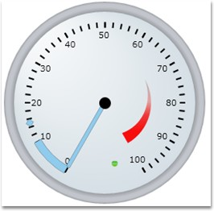
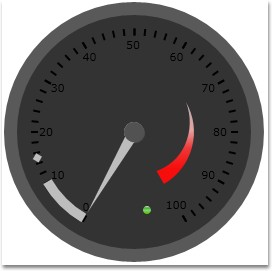
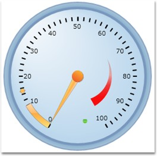
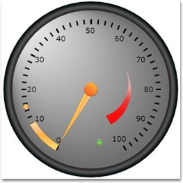
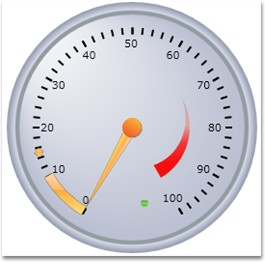
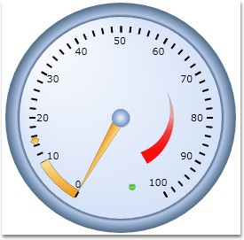
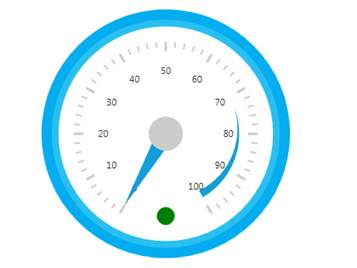

::: {style="DISPLAY: none"}
{#d2h_url_template}{#d2h_package_url style="WIDTH: 0px; DISPLAY: none; HEIGHT: 0px"}
:::

::: {.d2h_secondary_topic style="PADDING-BOTTOM: 10pt; MARGIN: 0pt; PADDING-LEFT: 0pt; PADDING-RIGHT: 0pt; PADDING-TOP: 0pt"}
#### Appearance {#appearance style="tab-stops: 0pt"}

[]{style="FONT-FAMILY: 'Trebuchet MS','sans-serif'; COLOR: #15428b; FONT-SIZE: 9pt"} 

Visual Style

**[]{style="FONT-FAMILY: 'Trebuchet MS','sans-serif'; COLOR: #15428b; FONT-SIZE: 9pt"}** 

The appearance of the Circular gauge control can be enhanced by customizing the visual styles of the control. This can be achieved by setting the **VisualStyle** property to the required style.

 

The following are the visual styles supported by the Circular gauge control.

 

[·      ]{style="FONT-FAMILY: Symbol"}Default

[·      ]{style="FONT-FAMILY: Symbol"}Blend

[·      ]{style="FONT-FAMILY: Symbol"}Office 2007 Silver

[·      ]{style="FONT-FAMILY: Symbol"}Office 2007 Blue

[·      ]{style="FONT-FAMILY: Symbol"}Office 2007 Black

[·      ]{style="FONT-FAMILY: Symbol"}Office 2003

[·      ]{style="FONT-FAMILY: Symbol"}Metro

[]{style="FONT-FAMILY: 'Trebuchet MS','sans-serif'; COLOR: #15428b; FONT-SIZE: 9pt"} 

{border="0"}

[]{style="FONT-FAMILY: 'Trebuchet MS','sans-serif'; COLOR: #15428b; FONT-SIZE: 9pt"} 

Figure 50: Visual Style Default

***[]{style="FONT-FAMILY: 'Trebuchet MS','sans-serif'; COLOR: #15428b; FONT-SIZE: 9pt"}*** 

{border="0"}

***[]{style="FONT-FAMILY: 'Trebuchet MS','sans-serif'; COLOR: #15428b; FONT-SIZE: 9pt"}*** 

Figure 51: Visual Style Blend

[]{style="FONT-FAMILY: 'Trebuchet MS','sans-serif'; COLOR: #15428b; FONT-SIZE: 9pt"} 

{border="0"}

[]{style="FONT-FAMILY: 'Trebuchet MS','sans-serif'; COLOR: #15428b; FONT-SIZE: 9pt"} 

Figure 52: Visual Style Office Blue

[]{style="FONT-FAMILY: 'Trebuchet MS','sans-serif'; COLOR: #15428b; FONT-SIZE: 9pt"} 

{border="0"}

[]{style="FONT-FAMILY: 'Trebuchet MS','sans-serif'; COLOR: #15428b; FONT-SIZE: 9pt"} 

Figure 53: Visual Style Office Black

[]{style="FONT-FAMILY: 'Trebuchet MS','sans-serif'; COLOR: #15428b; FONT-SIZE: 9pt"} 

{border="0"}

[]{style="FONT-FAMILY: 'Trebuchet MS','sans-serif'; COLOR: #15428b; FONT-SIZE: 9pt"} 

Figure 54: Visual Style Office Silver

***[]{style="FONT-FAMILY: 'Trebuchet MS','sans-serif'; COLOR: #15428b; FONT-SIZE: 9pt"}*** 

{border="0"}

[]{style="FONT-FAMILY: 'Trebuchet MS','sans-serif'; COLOR: #15428b; FONT-SIZE: 9pt"} 

Figure 55: Visual Style Office 2003

{border="0"}

***[]{style="FONT-FAMILY: 'Trebuchet MS','sans-serif'; COLOR: #15428b; FONT-SIZE: 9pt"}*** 

Figure 56: Metro

***[]{style="FONT-FAMILY: 'Trebuchet MS','sans-serif'; COLOR: #15428b; FONT-SIZE: 9pt"}*** 

The following code example illustrates how to set the visual style for the control.

[]{style="FONT-FAMILY: 'Trebuchet MS','sans-serif'; COLOR: #15428b; FONT-SIZE: 9pt"} 

+-----------------------------------------------------------------------------------------------------------------------------------------------------------------------------------------------------------------+
| **[\[C#\]]{style="FONT-FAMILY: 'Courier New'; COLOR: black"}**                                                                                                                                                  |
|                                                                                                                                                                                                                 |
| **[]{style="FONT-FAMILY: 'Courier New'; COLOR: black"}**                                                                                                                                                        |
|                                                                                                                                                                                                                 |
| [SkinManager]{style="FONT-FAMILY: 'Courier New'; COLOR: #2b91af; FONT-SIZE: 9pt"}[.ApplyStyle(CircularGauge, [VisualStyle]{style="COLOR: #2b91af"}.Blend);]{style="FONT-FAMILY: 'Courier New'; FONT-SIZE: 9pt"} |
+-----------------------------------------------------------------------------------------------------------------------------------------------------------------------------------------------------------------+

[]{style="FONT-FAMILY: 'Trebuchet MS','sans-serif'; COLOR: #15428b; FONT-SIZE: 9pt"} 

{border="0"}

***[]{style="FONT-FAMILY: 'Trebuchet MS','sans-serif'; COLOR: #15428b; FONT-SIZE: 9pt"}*** 

Figure 57: Visual Style Blend

More:

[ ]{#related-topics}

[{border="0" align="absMiddle"}Visual Style without Using Shared.Silverlight.dll](ms-xhelp:///?Id=d7467970-f24e-4239-a8cf-1890e9fb6b69){style="TEXT-DECORATION: none"}
:::
