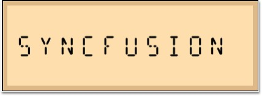
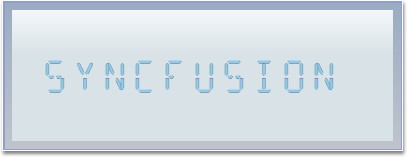
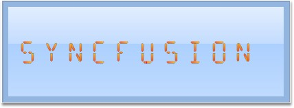
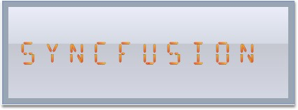
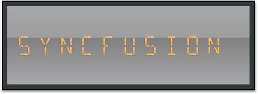
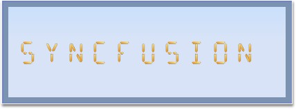
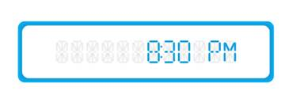

::: {style="DISPLAY: none"}
{#d2h_url_template}{#d2h_package_url style="WIDTH: 0px; DISPLAY: none; HEIGHT: 0px"}
:::

::: {.d2h_secondary_topic style="PADDING-BOTTOM: 10pt; MARGIN: 0pt; PADDING-LEFT: 0pt; PADDING-RIGHT: 0pt; PADDING-TOP: 0pt"}
#### Appearance {#appearance style="tab-stops: 0pt"}

[]{style="FONT-FAMILY: 'Trebuchet MS','sans-serif'; COLOR: #15428b; FONT-SIZE: 9pt"} 

This section discusses the following sections:

**[]{style="FONT-FAMILY: 'Trebuchet MS','sans-serif'; COLOR: #15428b; FONT-SIZE: 9pt"}** 

[·      ]{style="FONT-FAMILY: Symbol"}Setting InnerFrame and OuterFrame Border Brush

[·      ]{style="FONT-FAMILY: Symbol"}Setting Visual Style

[]{style="FONT-FAMILY: 'Trebuchet MS','sans-serif'; COLOR: #15428b; FONT-SIZE: 9pt"} 

1.   Setting InnerFrame and OuterFrame Border Brush

**[]{style="FONT-FAMILY: 'Trebuchet MS','sans-serif'; COLOR: #15428b; FONT-SIZE: 9pt"}** 

The Digital gauge control can be displayed in various colors. The background color for the inner frame and the outer frame of the gauge can be set using the **InnerFrameBrush** and **OuterFrameBrush** properties.

[]{style="FONT-FAMILY: 'Trebuchet MS','sans-serif'; COLOR: #15428b; FONT-SIZE: 9pt"} 

The following sample code snippet illustrates setting of colors for Digital gauge:

[]{style="FONT-FAMILY: 'Trebuchet MS','sans-serif'; COLOR: #15428b; FONT-SIZE: 9pt"} 

+--------------------------------------------------------------------------------------------------------------------------------------------------------------------------------------------------------------------------------------------------------------------------------------------------------------------------------------------------------------------------------------------------------------------------------------------------------------------------------------------------------------------------------------------------------------------------------------------------------------------------------------------------------------------------------------------------------------------------------------------------------------------------------------------------------------------------------------------------------------------------------------------------------------------------------------------------------------------------------------------------------------------------------------------------------------------------------------------------------------------------------------------------------------------------------------------------------------------------------------------------------------------------------------------------------------+
| **[\[XAML\]]{style="FONT-FAMILY: 'Courier New'; COLOR: black"}**                                                                                                                                                                                                                                                                                                                                                                                                                                                                                                                                                                                                                                                                                                                                                                                                                                                                                                                                                                                                                                                                                                                                                                                                                                             |
|                                                                                                                                                                                                                                                                                                                                                                                                                                                                                                                                                                                                                                                                                                                                                                                                                                                                                                                                                                                                                                                                                                                                                                                                                                                                                                              |
| []{style="FONT-FAMILY: 'Courier New'; COLOR: blue; FONT-SIZE: 9pt"}                                                                                                                                                                                                                                                                                                                                                                                                                                                                                                                                                                                                                                                                                                                                                                                                                                                                                                                                                                                                                                                                                                                                                                                                                                          |
|                                                                                                                                                                                                                                                                                                                                                                                                                                                                                                                                                                                                                                                                                                                                                                                                                                                                                                                                                                                                                                                                                                                                                                                                                                                                                                              |
| [\<]{style="FONT-FAMILY: 'Courier New'; COLOR: blue; FONT-SIZE: 9pt"}[syncfusion]{style="FONT-FAMILY: 'Courier New'; COLOR: #a31515; FONT-SIZE: 9pt"}[:]{style="FONT-FAMILY: 'Courier New'; COLOR: blue; FONT-SIZE: 9pt"}[DigitalGauge]{style="FONT-FAMILY: 'Courier New'; COLOR: #a31515; FONT-SIZE: 9pt"}[ [ Name]{style="COLOR: red"}[=\"digitalGauge\"]{style="COLOR: blue"} [ InnerFrameBrush]{style="COLOR: red"}[=\"BurlyWood\"]{style="COLOR: blue"}[ Background]{style="COLOR: red"}[=\"NavajoWhite\"]{style="COLOR: blue"}[ OuterFrameBrush]{style="COLOR: red"}[=\"Black\" ]{style="COLOR: blue"}[CharacterHeight]{style="COLOR: red"}[=\"30\"]{style="COLOR: blue"} [SegmentWidth]{style="COLOR: red"}[=\"3\"]{style="COLOR: blue"}[ SegmentBrush]{style="COLOR: red"}[=\"Black\"]{style="COLOR: blue"} [ SegmentSpacing]{style="COLOR: red"}[=\"1\"]{style="COLOR: blue"}[ OuterFrameOffset]{style="COLOR: red"}[=\"3\"]{style="COLOR: blue"} [CharacterSpacing]{style="COLOR: red"}[=\"5\"]{style="COLOR: blue"} [ CharacterCount]{style="COLOR: red"}[=\"10\"]{style="COLOR: blue"} [Value]{style="COLOR: red"}[=\"Syncfusion\"]{style="COLOR: blue"}[ CharacterType]{style="COLOR: red"}[=\"SegmentFourteen\" /\>]{style="COLOR: blue"}]{style="FONT-FAMILY: 'Courier New'; FONT-SIZE: 9pt"} |
+--------------------------------------------------------------------------------------------------------------------------------------------------------------------------------------------------------------------------------------------------------------------------------------------------------------------------------------------------------------------------------------------------------------------------------------------------------------------------------------------------------------------------------------------------------------------------------------------------------------------------------------------------------------------------------------------------------------------------------------------------------------------------------------------------------------------------------------------------------------------------------------------------------------------------------------------------------------------------------------------------------------------------------------------------------------------------------------------------------------------------------------------------------------------------------------------------------------------------------------------------------------------------------------------------------------+

[]{style="FONT-FAMILY: 'Trebuchet MS','sans-serif'; COLOR: #15428b; FONT-SIZE: 9pt"} 

+------------------------------------------------------------------------------------------------------------------------------------------------------------------------------------------------------------------------------+
| **[\[C#\]]{style="FONT-FAMILY: 'Courier New'; COLOR: black"}**                                                                                                                                                               |
|                                                                                                                                                                                                                              |
| **[]{style="FONT-FAMILY: 'Courier New'; COLOR: black"}**                                                                                                                                                                     |
|                                                                                                                                                                                                                              |
| [DigitalGauge]{style="FONT-FAMILY: 'Courier New'; COLOR: #2b91af; FONT-SIZE: 9pt"}[ digitalGauge = [new]{style="COLOR: blue"} [DigitalGauge]{style="COLOR: #2b91af"}();]{style="FONT-FAMILY: 'Courier New'; FONT-SIZE: 9pt"} |
|                                                                                                                                                                                                                              |
| [digitalGauge.Background = [new]{style="COLOR: blue"} [SolidColorBrush]{style="COLOR: #2b91af"}([Colors]{style="COLOR: #2b91af"}.Brown);]{style="FONT-FAMILY: 'Courier New'; FONT-SIZE: 9pt"}                                |
|                                                                                                                                                                                                                              |
| [digitalGauge.InnerFrameBrush = [new]{style="COLOR: blue"} [SolidColorBrush]{style="COLOR: #2b91af"}([Colors]{style="COLOR: #2b91af"}.Brown);]{style="FONT-FAMILY: 'Courier New'; FONT-SIZE: 9pt"}                           |
|                                                                                                                                                                                                                              |
| [digitalGauge.OuterFrameBrush = [new]{style="COLOR: blue"} [SolidColorBrush]{style="COLOR: #2b91af"}([Colors]{style="COLOR: #2b91af"}.Black);]{style="FONT-FAMILY: 'Courier New'; FONT-SIZE: 9pt"}                           |
|                                                                                                                                                                                                                              |
| [digitalGauge.SegmentBrush=[new]{style="COLOR: blue"} [SolidColorBrush]{style="COLOR: #2b91af"}([Colors]{style="COLOR: #2b91af"}.Black);]{style="FONT-FAMILY: 'Courier New'; FONT-SIZE: 9pt"}                                |
|                                                                                                                                                                                                                              |
| [digitalGauge.DimmedBrush = [new]{style="COLOR: blue"} [SolidColorBrush]{style="COLOR: #2b91af"}([Colors]{style="COLOR: #2b91af"}.Gray);]{style="FONT-FAMILY: 'Courier New'; FONT-SIZE: 9pt"}                                |
|                                                                                                                                                                                                                              |
| [digitalGauge.Value = [\"Syncfusion\"]{style="COLOR: #a31515"};]{style="FONT-FAMILY: 'Courier New'; FONT-SIZE: 9pt"}                                                                                                         |
|                                                                                                                                                                                                                              |
| [digitalGauge.SegmentSpacing = 1;]{style="FONT-FAMILY: 'Courier New'; FONT-SIZE: 9pt"}                                                                                                                                       |
|                                                                                                                                                                                                                              |
| [digitalGauge.SegmentWidth = 2;]{style="FONT-FAMILY: 'Courier New'; FONT-SIZE: 9pt"}                                                                                                                                         |
|                                                                                                                                                                                                                              |
| [digitalGauge.CharacterCount = 10;]{style="FONT-FAMILY: 'Courier New'; FONT-SIZE: 9pt"}                                                                                                                                      |
|                                                                                                                                                                                                                              |
| [digitalGauge.CharacterHeight = 30;]{style="FONT-FAMILY: 'Courier New'; FONT-SIZE: 9pt"}                                                                                                                                     |
|                                                                                                                                                                                                                              |
| [digitalGauge.CharacterSpacing = 4;]{style="FONT-FAMILY: 'Courier New'; FONT-SIZE: 9pt"}                                                                                                                                     |
|                                                                                                                                                                                                                              |
| [digitalGauge.CharacterType = [CharacterType]{style="COLOR: #2b91af"}.SegmentFourteen;]{style="FONT-FAMILY: 'Courier New'; FONT-SIZE: 9pt"}                                                                                  |
|                                                                                                                                                                                                                              |
| [LayoutRoot.Children.Add(digitalGauge);]{style="FONT-FAMILY: 'Courier New'; FONT-SIZE: 9pt"}                                                                                                                                 |
+------------------------------------------------------------------------------------------------------------------------------------------------------------------------------------------------------------------------------+

[]{style="FONT-FAMILY: 'Trebuchet MS','sans-serif'; COLOR: #15428b; FONT-SIZE: 9pt"} 

[]{style="FONT-FAMILY: 'Trebuchet MS','sans-serif'; COLOR: #15428b; FONT-SIZE: 9pt"} 

{border="0"}

***[]{style="FONT-FAMILY: 'Trebuchet MS','sans-serif'; COLOR: #15428b; FONT-SIZE: 9pt"}*** 

Figure 129: Digital gauge Appearance

[]{style="FONT-FAMILY: 'Times New Roman','serif'; FONT-SIZE: 12pt"} 

2.   Setting Visual Style

**[]{style="FONT-FAMILY: 'Trebuchet MS','sans-serif'; COLOR: #15428b; FONT-SIZE: 9pt"}** 

The appearance of the Digital gauge control can be enhanced by customizing the visual style of the control. This is achieved by using the **VisualStyle** property.

[]{style="FONT-FAMILY: 'Trebuchet MS','sans-serif'; COLOR: #15428b; FONT-SIZE: 9pt"} 

The following are the visual styles supported by the Digital Gauge control.

 

[·      ]{style="FONT-FAMILY: Symbol"}Default

[·      ]{style="FONT-FAMILY: Symbol"}Blend

[·      ]{style="FONT-FAMILY: Symbol"}Office 2007 Silver

[·      ]{style="FONT-FAMILY: Symbol"}Office 2007 Blue

[·      ]{style="FONT-FAMILY: Symbol"}Office 2007 Black

[·      ]{style="FONT-FAMILY: Symbol"}Office 2003

[·      ]{style="FONT-FAMILY: Symbol"}Metro

 

[]{style="FONT-FAMILY: 'Trebuchet MS','sans-serif'; COLOR: #15428b; FONT-SIZE: 9pt"} 

{border="0"}

Figure 130: Visual Style-\'Default\'

***[]{style="FONT-FAMILY: 'Trebuchet MS','sans-serif'; COLOR: #15428b; FONT-SIZE: 9pt"}*** 

***[]{style="FONT-FAMILY: 'Trebuchet MS','sans-serif'; COLOR: #15428b; FONT-SIZE: 9pt"}*** 

***[]{style="FONT-FAMILY: 'Trebuchet MS','sans-serif'; COLOR: #15428b; FONT-SIZE: 9pt"}*** 

{border="0"}

***[]{style="FONT-FAMILY: 'Trebuchet MS','sans-serif'; COLOR: #15428b; FONT-SIZE: 9pt"}*** 

Figure 131: Visual Style-\'Blend\'

***[]{style="FONT-FAMILY: 'Trebuchet MS','sans-serif'; COLOR: #15428b; FONT-SIZE: 9pt"}*** 

***[]{style="FONT-FAMILY: 'Trebuchet MS','sans-serif'; COLOR: #15428b; FONT-SIZE: 9pt"}*** 

{border="0"}

 

Figure 132: Visual Style-\'Office2007Blue\'

***[]{style="FONT-FAMILY: 'Trebuchet MS','sans-serif'; COLOR: #15428b; FONT-SIZE: 9pt"}*** 

***[]{style="FONT-FAMILY: 'Trebuchet MS','sans-serif'; COLOR: #15428b; FONT-SIZE: 9pt"}*** 

{border="0"}

***[]{style="FONT-FAMILY: 'Trebuchet MS','sans-serif'; COLOR: #15428b; FONT-SIZE: 9pt"}*** 

***[]{style="FONT-FAMILY: 'Trebuchet MS','sans-serif'; COLOR: #15428b; FONT-SIZE: 9pt"}*** 

Figure 133: Visual Style-\'Office2007Silver\'

***[]{style="FONT-FAMILY: 'Trebuchet MS','sans-serif'; COLOR: #15428b; FONT-SIZE: 9pt"}*** 

***[]{style="FONT-FAMILY: 'Trebuchet MS','sans-serif'; COLOR: #15428b; FONT-SIZE: 9pt"}*** 

{border="0"}

***[]{style="FONT-FAMILY: 'Trebuchet MS','sans-serif'; COLOR: #15428b; FONT-SIZE: 9pt"}*** 

***[]{style="FONT-FAMILY: 'Trebuchet MS','sans-serif'; COLOR: #15428b; FONT-SIZE: 9pt"}*** 

Figure 134: Visual Style-\'Office2007Black\'

***[]{style="FONT-FAMILY: 'Trebuchet MS','sans-serif'; COLOR: #15428b; FONT-SIZE: 9pt"}*** 

***[]{style="FONT-FAMILY: 'Trebuchet MS','sans-serif'; COLOR: #15428b; FONT-SIZE: 9pt"}*** 

{border="0"}       

***[]{style="FONT-FAMILY: 'Trebuchet MS','sans-serif'; COLOR: #15428b; FONT-SIZE: 9pt"}*** 

Figure 135: Visual Style-\'Office2003\'

{border="0"}

Figure 136: Visual Style-\'Metro\'

 

[]{style="FONT-FAMILY: 'Trebuchet MS','sans-serif'; COLOR: #15428b; FONT-SIZE: 9pt"} 

The following code example illustrates how to set the visual style for the control.

[]{style="FONT-FAMILY: 'Trebuchet MS','sans-serif'; COLOR: #15428b; FONT-SIZE: 9pt"} 

+----------------------------------------------------------------------------------------------------------------------------------------------------------------------------------------------------------------+
| **[\[C#\]]{style="FONT-FAMILY: 'Courier New'; COLOR: black"}**                                                                                                                                                 |
|                                                                                                                                                                                                                |
| **[]{style="FONT-FAMILY: 'Courier New'; COLOR: black"}**                                                                                                                                                       |
|                                                                                                                                                                                                                |
| [SkinManager]{style="FONT-FAMILY: 'Courier New'; COLOR: #2b91af; FONT-SIZE: 9pt"}[.ApplyStyle(digitalGauge, [VisualStyle]{style="COLOR: #2b91af"}.Blend);]{style="FONT-FAMILY: 'Courier New'; FONT-SIZE: 9pt"} |
+----------------------------------------------------------------------------------------------------------------------------------------------------------------------------------------------------------------+

[]{style="FONT-FAMILY: 'Trebuchet MS','sans-serif'; COLOR: #15428b; FONT-SIZE: 9pt"} 

[]{style="FONT-FAMILY: 'Trebuchet MS','sans-serif'; COLOR: #15428b; FONT-SIZE: 9pt"} 

{border="0"}

[]{style="FONT-FAMILY: 'Trebuchet MS','sans-serif'; COLOR: #15428b; FONT-SIZE: 9pt"} 

Figure 137: VisualStyle-\'Blend\'

 

[]{#p112} 

 

[]{#related-topics}
:::
