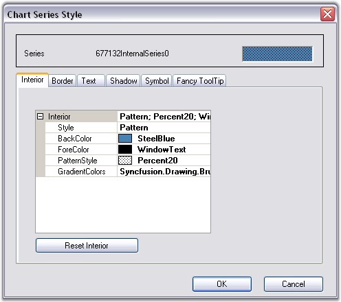
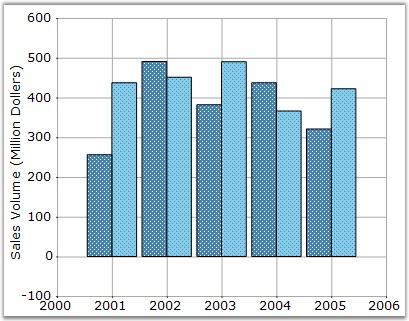
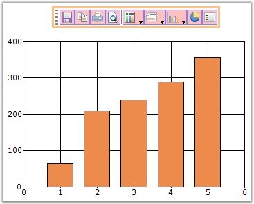

::: {style="DISPLAY: none"}
{#d2h_url_template}{#d2h_package_url style="WIDTH: 0px; DISPLAY: none; HEIGHT: 0px"}
:::

::::: {.d2h_secondary_topic style="PADDING-BOTTOM: 10pt; MARGIN: 0pt; PADDING-LEFT: 0pt; PADDING-RIGHT: 0pt; PADDING-TOP: 0pt"}
#### Appearance {#appearance style="tab-stops: 0pt"}

 

Setting Styles for the Chart through the Toolbar

 

Click the **Styles** icon in the toolbar to open the **Chart Series Style** dialog box. The following are the settings available in this dialog box.

 

[·      ]{style="FONT-FAMILY: Symbol"}Interior color for the series can be set using the options available in the **Interior** tab.

[·      ]{style="FONT-FAMILY: Symbol"}Border properties using **Border** tab.

[·      ]{style="FONT-FAMILY: Symbol"}Text for the series can be enabled and also customized using the **Text** tab.

[·      ]{style="FONT-FAMILY: Symbol"}Shadow for the series can be enabled and customized using the **Shadow** tab.

[·      ]{style="FONT-FAMILY: Symbol"}Series can hold customized symbols using the **Symbol** tab.

[·      ]{style="FONT-FAMILY: Symbol"}FancyToolTip can be enabled using the options available in the **Fancy ToolTip** tab.

 

The below image shows how to set the interior properties through \"Interior\" tab in the Chart Series Style Window. This can be invoked by clicking \"Styles\" command.

 

{border="0"}

 

Figure 298: Chart Series Style Window to set Interior Properties

 

{border="0"}

 

Figure 299: Chart after setting Interior Properties

 

Toolbar Appearance

 

Toolbar provides an option to set different back color, border style, button back color and button fore color.

 

User can enable or disable the Border line of Toolbar by using **ShowBorder** property in the Toolbar instance.

 

{border="0"}

 

Figure 300: Toolbar with Border

 

Toolbar Behavior

 

The docking behavior of the Toolbar can be controlled using **Toolbar.Behavior** property.

 

::: {align="center"}
+-----------------------------------+------------------------------------------------+
| Toolbar Property                  | Description                                    |
+-----------------------------------+------------------------------------------------+
| Behavior                          | Specifies the docking behavior of the toolbar. |
|                                   |                                                |
|                                   | Docking - It is dockable on all four sides.    |
|                                   |                                                |
|                                   | Movable - It is movable.                       |
|                                   |                                                |
|                                   | All - It is movable and dockable.              |
|                                   |                                                |
|                                   | None - It is neither movable nor dockable.     |
+-----------------------------------+------------------------------------------------+
:::

 

+---------------------------------------------------------------------------------------------------------------------------------------------------------------------------------+
| **[\[C#\]]{style="FONT-FAMILY: 'Courier New'; COLOR: black"}**                                                                                                                  |
|                                                                                                                                                                                 |
| []{style="FONT-FAMILY: 'Courier New'"}                                                                                                                                          |
|                                                                                                                                                                                 |
| [this]{style="FONT-FAMILY: 'Courier New'; COLOR: blue"}[.chartControl1.ToolBar.Behavior = [ChartDockingFlags]{style="COLOR: #2b91af"}.All;]{style="FONT-FAMILY: 'Courier New'"} |
+---------------------------------------------------------------------------------------------------------------------------------------------------------------------------------+

 

+----------------------------------------------------------------------------------------------------------------------------------------------------------------------------+
| **[\[VB.NET\]]{style="FONT-FAMILY: 'Courier New'; COLOR: black"}**                                                                                                         |
|                                                                                                                                                                            |
| **[]{style="FONT-FAMILY: 'Courier New'; COLOR: black"}**                                                                                                                   |
|                                                                                                                                                                            |
| [Me]{style="FONT-FAMILY: 'Courier New'; COLOR: blue"}[.chartControl1.ToolBar.Behavior = [ChartDockingFlags.All]{style="COLOR: black"}]{style="FONT-FAMILY: 'Courier New'"} |
+----------------------------------------------------------------------------------------------------------------------------------------------------------------------------+

 

::: {style="BORDER-BOTTOM: windowtext 1pt solid; BORDER-LEFT: medium none; PADDING-BOTTOM: 1pt; MARGIN-TOP: 9pt; PADDING-LEFT: 0pt; PADDING-RIGHT: 0pt; MARGIN-BOTTOM: 9pt; BORDER-TOP: windowtext 1pt solid; BORDER-RIGHT: medium none; PADDING-TOP: 1pt"}
{border="0"}Note: You can display or hide a toolbar while printing a Chart. See [Printing And Print Preview]{style="COLOR: black"} topic for more details.
:::

 

[]{#p201} 

[]{#related-topics}
:::::
