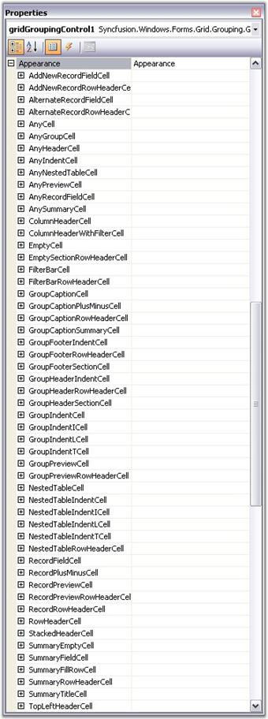
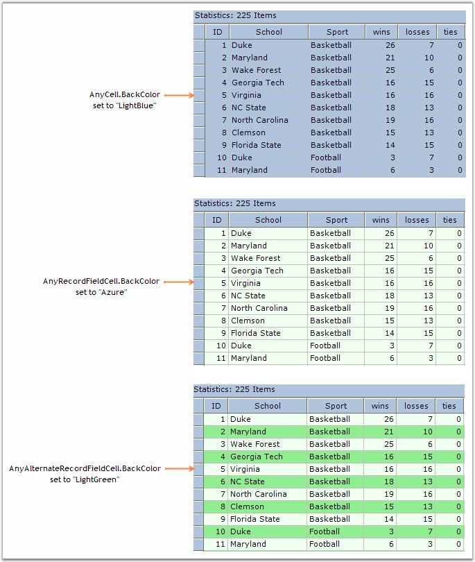

::: {style="DISPLAY: none"}
{#d2h_url_template}{#d2h_package_url style="WIDTH: 0px; DISPLAY: none; HEIGHT: 0px"}
:::

:::: {.d2h_secondary_topic style="PADDING-BOTTOM: 10pt; MARGIN: 0pt; PADDING-LEFT: 0pt; PADDING-RIGHT: 0pt; PADDING-TOP: 0pt"}
#### Appearance {#appearance style="tab-stops: 0pt"}

 

This property allows you to control the appearance of the grouping grid at design time as well as at run time. You can change the overall appearance of the grid and also the appearance of each element in the grid by setting this property.

 

**Appearance** contains a list of **GridStyleInfo** properties as seen in the following graphic. A **GridStyleInfo** object contains many properties such as **BackColor**, **Font** and **CellType** which defines the look and behavior of a grid cell. Each of these properties identifies a particular set of cells that make up a Grid Grouping control.

[]{style="FONT-FAMILY: 'Trebuchet MS','sans-serif'; COLOR: #15428b; FONT-SIZE: 9pt"} 

{border="0"}

**[]{style="FONT-FAMILY: 'Trebuchet MS','sans-serif'; COLOR: #15428b; FONT-SIZE: 9pt"}** 

*[Figure ]{style="FONT-SIZE: 9pt"}[316]{style="FONT-SIZE: 9pt"}[: Appearance Properties]{style="FONT-SIZE: 9pt"}*

[]{style="FONT-FAMILY: 'Trebuchet MS','sans-serif'; COLOR: #15428b; FONT-SIZE: 9pt"} 

To understand exactly what is going on here, let\'s consider three of these GridStyleInfo properties: **AnyCell**, **AnyRecordFieldCell** and **AnyAlternateRecordFieldCell**. Say we set **AnyCell.BackColor** = Color.LightBlue. This will color any grid cell light blue.

[]{style="FONT-FAMILY: 'Trebuchet MS','sans-serif'; COLOR: #15428b; FONT-SIZE: 9pt"} 

::: {style="BORDER-BOTTOM: windowtext 1pt solid; BORDER-LEFT: medium none; PADDING-BOTTOM: 1pt; MARGIN-TOP: 9pt; PADDING-LEFT: 0pt; PADDING-RIGHT: 0pt; MARGIN-BOTTOM: 9pt; BORDER-TOP: windowtext 1pt solid; BORDER-RIGHT: medium none; PADDING-TOP: 1pt"}
{border="0"}Note:[ ]{style="COLOR: black"}If you are using a Themed Operating system, like Windows XP, turn the GridGroupingControl.ThemesEnabled property off so that the theme coloring does not affect things like header cell buttons. Otherwise, this will interfere with illustrating the concepts we are trying to communicate in this section.
:::

[]{style="FONT-FAMILY: 'Trebuchet MS','sans-serif'; COLOR: #15428b; FONT-SIZE: 9pt"} 

Next if we set **AnyRecordFieldCell.BackColor** = Color.Azure, we will see the color of any record field cell change to azure. If we then set **AnyAlternateRecordFieldCell.BackColor** = Color.LightGreen, we will see alternate records being displayed with a green background. Below is a picture illustrating the look of the grid after setting each property in order.

 

There is an inheritance hierarchy that is associated with the **Appearance** properties. The general rule is that, if present, the more specific property takes precedence over the less specific property. This means that AnyCell.BackColor is overridden by setting the AnyRecordFieldCell.BackColor which, is again overridden by setting even more specific AnyAlternatingRecordFieldCell.BackColor.

[]{style="FONT-FAMILY: 'Trebuchet MS','sans-serif'; COLOR: #15428b; FONT-SIZE: 9pt"} 

{border="0"}

[]{style="FONT-FAMILY: 'Trebuchet MS','sans-serif'; COLOR: #15428b; FONT-SIZE: 9pt"} 

*[Figure ]{style="FONT-SIZE: 9pt"}[317]{style="FONT-SIZE: 9pt"}[: Property Inheritance At Work]{style="FONT-SIZE: 9pt"}*

 

[]{#p447} 

 

More:

[ ]{#related-topics}

[{border="0" align="absMiddle"}Appearance Options](ms-xhelp:///?Id=123bdb24-4548-47d9-9faa-fd6b87e1de1c){style="TEXT-DECORATION: none"}

[{border="0" align="absMiddle"}Format Cells Dialog Support](ms-xhelp:///?Id=533b6dc8-c907-4f3f-96de-7a261b660d3f){style="TEXT-DECORATION: none"}

[{border="0" align="absMiddle"}Conditional Formatting](ms-xhelp:///?Id=ccc103cf-9b94-43b5-8578-60066b57a54a){style="TEXT-DECORATION: none"}

[{border="0" align="absMiddle"}Dynamic Formatting](ms-xhelp:///?Id=f4b786a6-c463-462e-919b-fa0ba9aa300b){style="TEXT-DECORATION: none"}

[{border="0" align="absMiddle"}BaseStyles](ms-xhelp:///?Id=15e2aa37-1cc9-4c6e-9ef7-c7bd57fbd3d7){style="TEXT-DECORATION: none"}

[{border="0" align="absMiddle"}Get Cell Styles](ms-xhelp:///?Id=c1d7ec42-2206-41b2-8e30-963535834d6b){style="TEXT-DECORATION: none"}

[{border="0" align="absMiddle"}Look and Feel](ms-xhelp:///?Id=1bc90f98-0d51-4e06-8d2c-7c980dedd94c){style="TEXT-DECORATION: none"}

[{border="0" align="absMiddle"}Table Options](ms-xhelp:///?Id=b826e507-857d-4223-8b62-505409002e44){style="TEXT-DECORATION: none"}
::::
