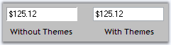
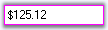
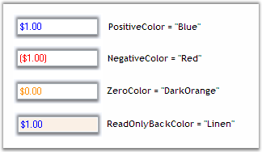

::: {style="DISPLAY: none"}
{#d2h_url_template}{#d2h_package_url style="WIDTH: 0px; DISPLAY: none; HEIGHT: 0px"}
:::

:::::: {.d2h_secondary_topic style="PADDING-BOTTOM: 10pt; MARGIN: 0pt; PADDING-LEFT: 0pt; PADDING-RIGHT: 0pt; PADDING-TOP: 0pt"}
##### Appearance {#appearance style="tab-stops: 0pt"}

###### 3.3.8.6.5.1 [[Themes]{style="COLOR: windowtext; TEXT-DECORATION: none; text-underline: none"}](http://help.syncfusion.com/ug_82/WindowsFormsUI_Tools/AppearanceAndBehaviorSettings13.html) {#themes style="tab-stops: 0pt"}

CurrencyTextBox control can be themed by setting **ThemesEnabled** to true.[]{style="COLOR: black"}

[]{style="COLOR: black"} 

::: {align="center"}
  -------------------------------------------------- ---------------------------------------------------------------------------------------------------------------------------
  CurrencyTextBox Property[]{style="COLOR: black"}   Description[]{style="COLOR: black"}
  ThemesEnabled[]{style="COLOR: black"}              Specifies whether the CurrencyTextBox control uses XP themes, when BorderStyle is set to Fixed3D.[]{style="COLOR: black"}
  -------------------------------------------------- ---------------------------------------------------------------------------------------------------------------------------
:::

[]{style="COLOR: black"} 

+-----------------------------------------------------------------------------------------------------------------------------------------------------------------------------------------------------------------------------------------------------------------------------------+
| **[\[C#\]]{style="FONT-FAMILY: 'Courier New'; COLOR: black"}**[]{style="COLOR: black"}                                                                                                                                                                                            |
|                                                                                                                                                                                                                                                                                   |
| []{style="COLOR: black"}                                                                                                                                                                                                                                                          |
|                                                                                                                                                                                                                                                                                   |
| [this]{style="FONT-FAMILY: 'Courier New'; COLOR: blue"}[.currencyTextBox1.ThemesEnabled = ]{style="FONT-FAMILY: 'Courier New'; COLOR: black"}[true]{style="FONT-FAMILY: 'Courier New'; COLOR: blue"}[;]{style="FONT-FAMILY: 'Courier New'; COLOR: black"}[]{style="COLOR: black"} |
+-----------------------------------------------------------------------------------------------------------------------------------------------------------------------------------------------------------------------------------------------------------------------------------+

[]{style="COLOR: black"} 

+----------------------------------------------------------------------------------------------------------------------------------------------------------------------------------------------------------------------------+
| **[\[VB.NET\]]{style="FONT-FAMILY: 'Courier New'; COLOR: black"}**[]{style="COLOR: black"}                                                                                                                                 |
|                                                                                                                                                                                                                            |
| []{style="COLOR: black"}                                                                                                                                                                                                   |
|                                                                                                                                                                                                                            |
| [Me]{style="FONT-FAMILY: 'Courier New'; COLOR: blue"}[.currencyTextBox1.ThemesEnabled = ]{style="FONT-FAMILY: 'Courier New'; COLOR: black"}[True]{style="FONT-FAMILY: 'Courier New'; COLOR: blue"}[]{style="COLOR: black"} |
+----------------------------------------------------------------------------------------------------------------------------------------------------------------------------------------------------------------------------+

[]{style="COLOR: black"} 

{border="0"}

 

Figure 512: BorderStyle = \"Fixed3D\"; ThemesEnabled = True / False

 

###### 3.3.8.6.5.2 [[Border Styles]{style="COLOR: windowtext; TEXT-DECORATION: none; text-underline: none"}](http://help.syncfusion.com/ug_82/WindowsFormsUI_Tools/CurrencyTextBox_BorderStyles.html) {#border-styles style="tab-stops: 0pt"}

The below properties describes various properties available to set border for the CurrencyTextBox control.[]{style="COLOR: black"}

[]{style="COLOR: black"} 

::: {align="center"}
+----------------------------------------------------+-------------------------------------------------------------------------------------------------------------------------------+
| CurrencyTextBox Properties[]{style="COLOR: black"} | Description[]{style="COLOR: black"}                                                                                           |
+----------------------------------------------------+-------------------------------------------------------------------------------------------------------------------------------+
| BorderStyle[]{style="COLOR: black"}                | Sets the style of the border. The options includes:[]{style="COLOR: black"}                                                   |
|                                                    |                                                                                                                               |
|                                                    | []{style="COLOR: black"}                                                                                                      |
|                                                    |                                                                                                                               |
|                                                    | FixedSingle,[]{style="COLOR: black"}                                                                                          |
|                                                    |                                                                                                                               |
|                                                    | Fixed3D and[]{style="COLOR: black"}                                                                                           |
|                                                    |                                                                                                                               |
|                                                    | None (Default).[]{style="COLOR: black"}                                                                                       |
+----------------------------------------------------+-------------------------------------------------------------------------------------------------------------------------------+
| Border3DStyle[]{style="COLOR: black"}              | Sets 3D border style of the CurrencyTextBox when the BorderStyle is in Fixed3D. The options includes:[]{style="COLOR: black"} |
|                                                    |                                                                                                                               |
|                                                    | []{style="COLOR: black"}                                                                                                      |
|                                                    |                                                                                                                               |
|                                                    | *Raised,*[]{style="COLOR: black"}                                                                                             |
|                                                    |                                                                                                                               |
|                                                    | *RaisedOuter,*[]{style="COLOR: black"}                                                                                        |
|                                                    |                                                                                                                               |
|                                                    | *RaisedInner,*[]{style="COLOR: black"}                                                                                        |
|                                                    |                                                                                                                               |
|                                                    | *Sunken (default),*[]{style="COLOR: black"}                                                                                   |
|                                                    |                                                                                                                               |
|                                                    | *SunkenOuter,*[]{style="COLOR: black"}                                                                                        |
|                                                    |                                                                                                                               |
|                                                    | *SunkenInner,*[]{style="COLOR: black"}                                                                                        |
|                                                    |                                                                                                                               |
|                                                    | *Etched,*[]{style="COLOR: black"}                                                                                             |
|                                                    |                                                                                                                               |
|                                                    | *Bump,*[]{style="COLOR: black"}                                                                                               |
|                                                    |                                                                                                                               |
|                                                    | *Adjust and*[]{style="COLOR: black"}                                                                                          |
|                                                    |                                                                                                                               |
|                                                    | *Flat.*[]{style="COLOR: black"}                                                                                               |
+----------------------------------------------------+-------------------------------------------------------------------------------------------------------------------------------+
| BorderSides[]{style="COLOR: black"}                | Specifies the border sides. The options includes[]{style="COLOR: black"}                                                      |
|                                                    |                                                                                                                               |
|                                                    | []{style="COLOR: black"}                                                                                                      |
|                                                    |                                                                                                                               |
|                                                    | *Left,*[]{style="COLOR: black"}                                                                                               |
|                                                    |                                                                                                                               |
|                                                    | *Top,*[]{style="COLOR: black"}                                                                                                |
|                                                    |                                                                                                                               |
|                                                    | *Right,*[]{style="COLOR: black"}                                                                                              |
|                                                    |                                                                                                                               |
|                                                    | *Bottom,*[]{style="COLOR: black"}                                                                                             |
|                                                    |                                                                                                                               |
|                                                    | *Middle and*[]{style="COLOR: black"}                                                                                          |
|                                                    |                                                                                                                               |
|                                                    | *All (default).*[]{style="COLOR: black"}                                                                                      |
+----------------------------------------------------+-------------------------------------------------------------------------------------------------------------------------------+
| BorderColor[]{style="COLOR: black"}                | Specifies the color of the border when BorderStyle is FixedSingle.[]{style="COLOR: black"}                                    |
+----------------------------------------------------+-------------------------------------------------------------------------------------------------------------------------------+
:::

[]{style="COLOR: black"} 

+------------------------------------------------------------------------------------------------------------------------------------------------------------------------------------------------------------------+
| **[\[C#\]]{style="FONT-FAMILY: 'Courier New'; COLOR: black"}**[]{style="COLOR: black"}                                                                                                                           |
|                                                                                                                                                                                                                  |
| []{style="COLOR: black"}                                                                                                                                                                                         |
|                                                                                                                                                                                                                  |
| [this]{style="FONT-FAMILY: 'Courier New'; COLOR: blue"}[.currencyTextBox1.BorderStyle = System.Windows.Forms.BorderStyle.FixedSingle;]{style="FONT-FAMILY: 'Courier New'; COLOR: black"}[]{style="COLOR: black"} |
|                                                                                                                                                                                                                  |
| [this]{style="FONT-FAMILY: 'Courier New'; COLOR: blue"}[.currencyTextBox1.Border3DStyle = System.Windows.Forms.Border3DStyle.Flat;]{style="FONT-FAMILY: 'Courier New'; COLOR: black"}[]{style="COLOR: black"}    |
|                                                                                                                                                                                                                  |
| [this]{style="FONT-FAMILY: 'Courier New'; COLOR: blue"}[.currencyTextBox1.BorderColor = System.Drawing.Color.Magenta;]{style="FONT-FAMILY: 'Courier New'; COLOR: black"}[]{style="COLOR: black"}                 |
|                                                                                                                                                                                                                  |
| [this]{style="FONT-FAMILY: 'Courier New'; COLOR: blue"}[.currencyTextBox1.BorderSides = System.Windows.Forms.Border3DSide.All;]{style="FONT-FAMILY: 'Courier New'; COLOR: black"}[]{style="COLOR: black"}        |
+------------------------------------------------------------------------------------------------------------------------------------------------------------------------------------------------------------------+

[]{style="COLOR: black"} 

+---------------------------------------------------------------------------------------------------------------------------------------------------------------------------------------------------------------+
| **[\[VB.NET\]]{style="FONT-FAMILY: 'Courier New'; COLOR: black"}**[]{style="COLOR: black"}                                                                                                                    |
|                                                                                                                                                                                                               |
| []{style="COLOR: black"}                                                                                                                                                                                      |
|                                                                                                                                                                                                               |
| [Me]{style="FONT-FAMILY: 'Courier New'; COLOR: blue"}[.currencyTextBox1.BorderStyle = System.Windows.Forms.BorderStyle.FixedSingle]{style="FONT-FAMILY: 'Courier New'; COLOR: black"}[]{style="COLOR: black"} |
|                                                                                                                                                                                                               |
| [Me]{style="FONT-FAMILY: 'Courier New'; COLOR: blue"}[.currencyTextBox1.Border3DStyle = System.Windows.Forms.Border3DStyle.Flat]{style="FONT-FAMILY: 'Courier New'; COLOR: black"}[]{style="COLOR: black"}    |
|                                                                                                                                                                                                               |
| [Me]{style="FONT-FAMILY: 'Courier New'; COLOR: blue"}[.currencyTextBox1.BorderColor = System.Drawing.Color.Magenta]{style="FONT-FAMILY: 'Courier New'; COLOR: black"}[]{style="COLOR: black"}                 |
|                                                                                                                                                                                                               |
| [Me]{style="FONT-FAMILY: 'Courier New'; COLOR: blue"}[.currencyTextBox1.BorderSides = System.Windows.Forms.Border3DSide.All]{style="FONT-FAMILY: 'Courier New'; COLOR: black"}[]{style="COLOR: black"}        |
+---------------------------------------------------------------------------------------------------------------------------------------------------------------------------------------------------------------+

[]{style="COLOR: black"} 

{border="0"}

 

Figure 513: BorderStyle = \"FixedSingle\"; Border3DStyle = \"Flat\"; BorderColor = \"Magenta\"

 

###### 3.3.8.6.5.3 [[Color Settings]{style="COLOR: windowtext; TEXT-DECORATION: none; text-underline: none"}](http://help.syncfusion.com/ug_82/WindowsFormsUI_Tools/ColorSettings.html) {#color-settings style="tab-stops: 0pt"}

We can set different colors for the different set of currency values i.e, Colors can be set for positive currency values, negative currency values and zero values by using the below[ ]{style="FONT-FAMILY: 'Verdana','sans-serif'; COLOR: black; FONT-SIZE: 8pt"}properties. We can draw the background of Currency TextBox with colors when it is in read only mode by** ReadOnlyBackColor**.[]{style="COLOR: black"}

[]{style="COLOR: black"} 

::: {align="center"}
  ---------------------------------------------------- --------------------------------------------------------------------------------------------------------------------------------
  CurrencyTextBox Properties[]{style="COLOR: black"}   Description[]{style="COLOR: black"}
  PositiveColor[]{style="COLOR: black"}                Specifies Forecolor when the current value is positive.[]{style="COLOR: black"}
  NegativeColor[]{style="COLOR: black"}                Specifies Forecolor when the current value is negative.[]{style="COLOR: black"}
  ReadOnlyBackColor[]{style="COLOR: black"}            Specifies the color to be used for back color when the control is read only. Set ReadOnly to \'true\'.[]{style="COLOR: black"}
  ZeroColor[]{style="COLOR: black"}                    Specifies Forecolor when the current value is Zero.[]{style="COLOR: black"}
  ---------------------------------------------------- --------------------------------------------------------------------------------------------------------------------------------
:::

[]{style="COLOR: black"} 

+------------------------------------------------------------------------------------------------------------------------------------------------------------------------------------------------------+
| **[\[C#\]]{style="FONT-FAMILY: 'Courier New'; COLOR: black"}**[]{style="COLOR: black"}                                                                                                               |
|                                                                                                                                                                                                      |
| []{style="COLOR: black"}                                                                                                                                                                             |
|                                                                                                                                                                                                      |
| [this]{style="FONT-FAMILY: 'Courier New'; COLOR: blue"}[.currencyTextBox1.PositiveColor = System.Drawing.Color.Blue;]{style="FONT-FAMILY: 'Courier New'; COLOR: black"}[]{style="COLOR: black"}      |
|                                                                                                                                                                                                      |
| [this]{style="FONT-FAMILY: 'Courier New'; COLOR: blue"}[.currencyTextBox1.NegativeColor = System.Drawing.Color.Red;]{style="FONT-FAMILY: 'Courier New'; COLOR: black"}[]{style="COLOR: black"}       |
|                                                                                                                                                                                                      |
| [this]{style="FONT-FAMILY: 'Courier New'; COLOR: blue"}[.currencyTextBox1.ReadOnlyBackColor = System.Drawing.Color.Linen;]{style="FONT-FAMILY: 'Courier New'; COLOR: black"}[]{style="COLOR: black"} |
|                                                                                                                                                                                                      |
| [this]{style="FONT-FAMILY: 'Courier New'; COLOR: blue"}[.currencyTextBox1.ZeroColor = System.Drawing.Color.DarkOrange;]{style="FONT-FAMILY: 'Courier New'; COLOR: black"}[]{style="COLOR: black"}    |
+------------------------------------------------------------------------------------------------------------------------------------------------------------------------------------------------------+

[]{style="COLOR: black"} 

+---------------------------------------------------------------------------------------------------------------------------------------------------------------------------------------------------+
| **[\[VB.NET\]]{style="FONT-FAMILY: 'Courier New'; COLOR: black"}**[]{style="COLOR: black"}                                                                                                        |
|                                                                                                                                                                                                   |
| []{style="COLOR: black"}                                                                                                                                                                          |
|                                                                                                                                                                                                   |
| [Me]{style="FONT-FAMILY: 'Courier New'; COLOR: blue"}[.currencyTextBox1.PositiveColor = System.Drawing.Color.Blue]{style="FONT-FAMILY: 'Courier New'; COLOR: black"}[]{style="COLOR: black"}      |
|                                                                                                                                                                                                   |
| [Me]{style="FONT-FAMILY: 'Courier New'; COLOR: blue"}[.currencyTextBox1.NegativeColor = System.Drawing.Color.Red]{style="FONT-FAMILY: 'Courier New'; COLOR: black"}[]{style="COLOR: black"}       |
|                                                                                                                                                                                                   |
| [Me]{style="FONT-FAMILY: 'Courier New'; COLOR: blue"}[.currencyTextBox1.ReadOnlyBackColor = System.Drawing.Color.Linen]{style="FONT-FAMILY: 'Courier New'; COLOR: black"}[]{style="COLOR: black"} |
|                                                                                                                                                                                                   |
| [Me]{style="FONT-FAMILY: 'Courier New'; COLOR: blue"}[.currencyTextBox1.ZeroColor = System.Drawing.Color.DarkOrange]{style="FONT-FAMILY: 'Courier New'; COLOR: black"}[]{style="COLOR: black"}    |
+---------------------------------------------------------------------------------------------------------------------------------------------------------------------------------------------------+

[]{style="COLOR: black"} 

{border="0"}

[]{style="COLOR: black"} 

Figure 514: Color Settings for CurrencyTextBox Control[]{style="COLOR: black"}

 

[]{#related-topics}
::::::
