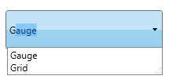
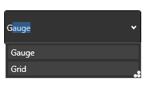
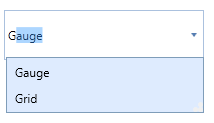
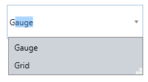
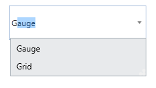
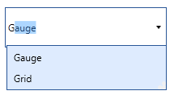
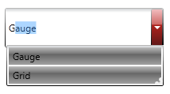
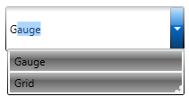
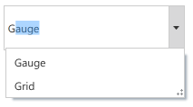

::: {style="DISPLAY: none"}
{#d2h_url_template}{#d2h_package_url style="WIDTH: 0px; DISPLAY: none; HEIGHT: 0px"}
:::

::::: {#nsbanner .d2h_main_nsbanner style="BORDER-BOTTOM: #999999 1px solid; POSITION: relative; PADDING-BOTTOM: 0px; BACKGROUND-COLOR: transparent; PADDING-LEFT: 0px; PADDING-RIGHT: 0px; DISPLAY: none; BORDER-TOP: #999999 1px solid; PADDING-TOP: 0px; LEFT: 0px"}
:::: {#TitleRow .d2h_main_titlerow style="PADDING-BOTTOM: 4px; BACKGROUND-COLOR: transparent; PADDING-LEFT: 22px; WIDTH: 100%; PADDING-RIGHT: 10px; DISPLAY: none; PADDING-TOP: 4px"}
::: {#ienav .d2h_main_ienav style="DISPLAY: none"}
{#D2HPrevious .D2HPreviousEnabled}  {#D2HNext .D2HNextEnabled}
:::
::::
:::::

:::: {#nstext .d2h_main_nstext style="PADDING-BOTTOM: 10px; BACKGROUND-COLOR: transparent; PADDING-LEFT: 22px; PADDING-RIGHT: 10px; HEIGHT: 100%; OVERFLOW: auto; PADDING-TOP: 5px" hasuserbackground="true" valign="bottom"}
::: {#d2h_breadcrumbs .d2h_breadcrumbs}
[Essential Studio User Guide Documentation](ms-xhelp:///?Id=12457748-09e3-4d74-a240-8e049cedf030){.d2h_breadcrumbsNormal}[ \> ]{.d2h_breadcrumbsLinkSeparator}[User Interface Edition](ms-xhelp:///?Id=c29296b7-531c-413b-a0ec-488ca1f7f669){.d2h_breadcrumbsNormal}[ \> ]{.d2h_breadcrumbsLinkSeparator}[Essential WPF](ms-xhelp:///?Id=7f4f82c5-151c-4262-94d0-75c4626c77bc){.d2h_breadcrumbsNormal}[ \> ]{.d2h_breadcrumbsLinkSeparator}[Essential Tools]{.d2h_breadcrumbsContentsOnly}[ \> ]{.d2h_breadcrumbsLinkSeparator}[Tools WPF Controls](ms-xhelp:///?Id=2ea58a12-9426-4a63-96b4-89eb80232c2c){.d2h_breadcrumbsNormal}[ \> ]{.d2h_breadcrumbsLinkSeparator}[AutoComplete](ms-xhelp:///?Id=dd346fbc-4f8f-437f-8728-e697af09cc18){.d2h_breadcrumbsNormal}
:::

### Appearance {#appearance style="tab-stops: 0pt"}

The Appearance of the AutoComplete control can be changed using the **VisualStyle** property. The following styles are supported by AutoComplete control.

 

[·      ]{style="FONT-FAMILY: Symbol"}Blend

[·      ]{style="FONT-FAMILY: Symbol"}Office2003

[·      ]{style="FONT-FAMILY: Symbol"}Office2007Blue

[·      ]{style="FONT-FAMILY: Symbol"}Office2007Black

[·      ]{style="FONT-FAMILY: Symbol"}Office2007Silver

[·      ]{style="FONT-FAMILY: Symbol"}ShinyBlue

[·      ]{style="FONT-FAMILY: Symbol"}ShinyRed

[·      ]{style="FONT-FAMILY: Symbol"}SyncOrange

[·      ]{style="FONT-FAMILY: Symbol"}VS2010

[·      ]{style="FONT-FAMILY: Symbol"}Metro

 

The following code snippet illustrates how different visual styles can be applied to the control.

 

+--------------------------------------------------------------------------------------------------------------------------------------------------------------------------------------------------------------------------------------------------------------------------------------------------------------------------------------------------------------------------------------------------------------------------------------------------------------------------------------------------------------------------------------+
| **[\[XAML\]]{style="FONT-FAMILY: 'Courier New'"}**                                                                                                                                                                                                                                                                                                                                                                                                                                                                                   |
|                                                                                                                                                                                                                                                                                                                                                                                                                                                                                                                                      |
| [\<]{style="FONT-FAMILY: 'Courier New'; COLOR: blue"}[syncfusion]{style="FONT-FAMILY: 'Courier New'; COLOR: #a31515"}[:]{style="FONT-FAMILY: 'Courier New'; COLOR: blue"}[AutoComplete]{style="FONT-FAMILY: 'Courier New'; COLOR: #a31515"}[ Height]{style="FONT-FAMILY: 'Courier New'; COLOR: red"}[=\"25\"]{style="FONT-FAMILY: 'Courier New'; COLOR: blue"}[ Width]{style="FONT-FAMILY: 'Courier New'; COLOR: red"}[=\"200\"]{style="FONT-FAMILY: 'Courier New'; COLOR: blue"}[ ]{style="FONT-FAMILY: 'Courier New'; COLOR: red"} |
|                                                                                                                                                                                                                                                                                                                                                                                                                                                                                                                                      |
| [syncfusion]{style="FONT-FAMILY: 'Courier New'; COLOR: red"}[:]{style="FONT-FAMILY: 'Courier New'; COLOR: blue"}[SkinStorage.VisualStyle]{style="FONT-FAMILY: 'Courier New'; COLOR: red"}[=\"Office2007Blue\"/\>]{style="FONT-FAMILY: 'Courier New'; COLOR: blue"}[]{style="FONT-FAMILY: 'Courier New'"}                                                                                                                                                                                                                             |
+--------------------------------------------------------------------------------------------------------------------------------------------------------------------------------------------------------------------------------------------------------------------------------------------------------------------------------------------------------------------------------------------------------------------------------------------------------------------------------------------------------------------------------------+

 

+---------------------------------------------------------------------------------------------------------------------------------------------------------------------------------------------------------------------------+
| **[\[C#\]]{style="FONT-FAMILY: 'Courier New'"}**                                                                                                                                                                          |
|                                                                                                                                                                                                                           |
| [SkinStorage]{style="FONT-FAMILY: 'Courier New'; COLOR: #2b91af"}[.SetVisualStyle(autoComplete, [\"Office2007Blue\"]{style="COLOR: #a31515"});]{style="FONT-FAMILY: 'Courier New'"}[]{style="FONT-FAMILY: 'Courier New'"} |
+---------------------------------------------------------------------------------------------------------------------------------------------------------------------------------------------------------------------------+

 

{border="0"}

Figure 34: Windows7

 

{border="0"}

Figure 35: Blend

 

{border="0"}

Figure 36: Office2007Blue

 

{border="0"}

Figure 37: Office2007Black

 

{border="0"}

Figure 38: Office2007Silver

{border="0"}

Figure 39: Office2003

 

{border="0"}

Figure 40: ShinyRed

 

{border="0"}

Figure 41: ShinyBlue

**[]{style="FONT-FAMILY: 'Myriad Pro','sans-serif'"}** 

{border="0"}

Figure 42: SyncOrange

{border="0"}

Figure 43: Metro

[]{#related-topics}
::::
