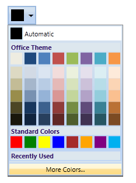
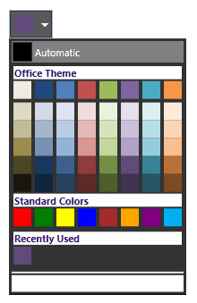
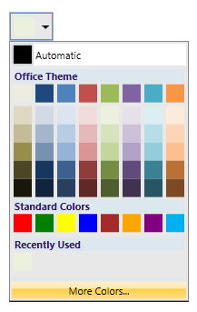
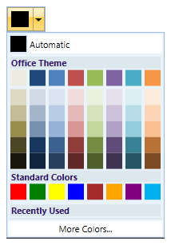
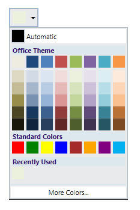
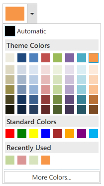

::: {style="DISPLAY: none"}
{#d2h_url_template}{#d2h_package_url style="WIDTH: 0px; DISPLAY: none; HEIGHT: 0px"}
:::

::: {.d2h_secondary_topic style="PADDING-BOTTOM: 10pt; MARGIN: 0pt; PADDING-LEFT: 0pt; PADDING-RIGHT: 0pt; PADDING-TOP: 0pt"}
#### Appearance {#appearance style="tab-stops: 0pt"}

The appearance of the ColorPickerPalette control can be customized by using the VisualStyle property. The following are the various built-in visual styles for ColorPickerPalette control.

[·      ]{style="FONT-FAMILY: Symbol"}Blend

[·      ]{style="FONT-FAMILY: Symbol"}Office2003

[·      ]{style="FONT-FAMILY: Symbol"}Office2007Blue

[·      ]{style="FONT-FAMILY: Symbol"}Office2007Black

[·      ]{style="FONT-FAMILY: Symbol"}Office2007Silver

[·      ]{style="FONT-FAMILY: Symbol"}VS2010

[·      ]{style="FONT-FAMILY: Symbol"}Metro

 

{border="0"}

Figure 201: Default Style

 

{border="0"}

Figure 202: Blend Style

 

{border="0"}

Figure 203: Office2007Black Style

 

{border="0"}

Figure 204: Office2007Blue Style

 

{border="0"}

Figure 205: Office2007Silver Style

 

{border="0"}

Figure 206: Metro style

 

[]{#related-topics}
:::
