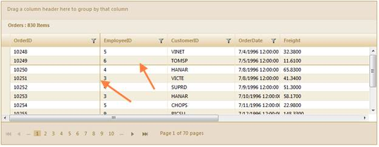

::: {style="DISPLAY: none"}
{#d2h_url_template}{#d2h_package_url style="WIDTH: 0px; DISPLAY: none; HEIGHT: 0px"}
:::

::: {.d2h_secondary_topic style="PADDING-BOTTOM: 10pt; MARGIN: 0pt; PADDING-LEFT: 0pt; PADDING-RIGHT: 0pt; PADDING-TOP: 0pt"}
#### Appearance {#appearance style="tab-stops: 0pt"}

 

The following screenshot displays a dark border, indicating columns and rows that are frozen.

 

{border="0"}

Figure 282: Border Shows Frozen Rows and Columns

[]{style="FONT-FAMILY: 'Myriad Pro','sans-serif'"} 

[]{#related-topics}
:::
