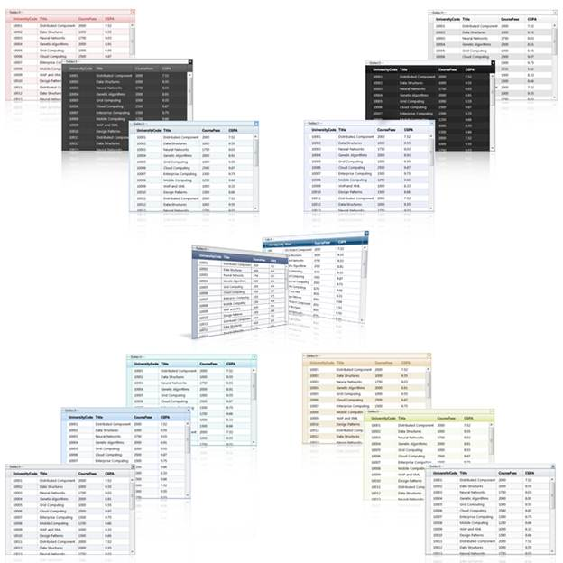

::: {style="DISPLAY: none"}
{#d2h_url_template}{#d2h_package_url style="WIDTH: 0px; DISPLAY: none; HEIGHT: 0px"}
:::

::::: {#nsbanner .d2h_main_nsbanner style="BORDER-BOTTOM: #999999 1px solid; POSITION: relative; PADDING-BOTTOM: 0px; BACKGROUND-COLOR: transparent; PADDING-LEFT: 0px; PADDING-RIGHT: 0px; DISPLAY: none; BORDER-TOP: #999999 1px solid; PADDING-TOP: 0px; LEFT: 0px"}
:::: {#TitleRow .d2h_main_titlerow style="PADDING-BOTTOM: 4px; BACKGROUND-COLOR: transparent; PADDING-LEFT: 22px; WIDTH: 100%; PADDING-RIGHT: 10px; DISPLAY: none; PADDING-TOP: 4px"}
::: {#ienav .d2h_main_ienav style="DISPLAY: none"}
{#D2HPrevious .D2HPreviousEnabled}  {#D2HNext .D2HNextEnabled}
:::
::::
:::::

:::::: {#nstext .d2h_main_nstext style="PADDING-BOTTOM: 10px; BACKGROUND-COLOR: transparent; PADDING-LEFT: 22px; PADDING-RIGHT: 10px; HEIGHT: 100%; OVERFLOW: auto; PADDING-TOP: 5px" hasuserbackground="true" valign="bottom"}
::: {#d2h_breadcrumbs .d2h_breadcrumbs}
[Essential Studio User Guide Documentation](ms-xhelp:///?Id=12457748-09e3-4d74-a240-8e049cedf030){.d2h_breadcrumbsNormal}[ \> ]{.d2h_breadcrumbsLinkSeparator}[User Interface Edition](ms-xhelp:///?Id=c29296b7-531c-413b-a0ec-488ca1f7f669){.d2h_breadcrumbsNormal}[ \> ]{.d2h_breadcrumbsLinkSeparator}[Essential ASP.NET MVC](ms-xhelp:///?Id=4b14e7d1-65c4-4f67-b1aa-2c37709905a5){.d2h_breadcrumbsNormal}[ \> ]{.d2h_breadcrumbsLinkSeparator}[Essential Grid]{.d2h_breadcrumbsContentsOnly}[ \> ]{.d2h_breadcrumbsLinkSeparator}[Getting Started](ms-xhelp:///?Id=c7ed3902-b25b-4170-be58-1d3d0b57748a){.d2h_breadcrumbsNormal}[ \> ]{.d2h_breadcrumbsLinkSeparator}[Feature Summary](ms-xhelp:///?Id=1923e679-441a-44e0-9bca-e0e50988a857){.d2h_breadcrumbsNormal}[ \> ]{.d2h_breadcrumbsLinkSeparator}[Concepts and Features](ms-xhelp:///?Id=4a1657fa-4756-42b9-9153-aebf5dcfc503){.d2h_breadcrumbsNormal}[ \> ]{.d2h_breadcrumbsLinkSeparator}[MultiColumnDropDown](ms-xhelp:///?Id=cf0e6254-8964-4a67-b141-e26bc6e4f04a){.d2h_breadcrumbsNormal}
:::

### Appearance {#appearance style="tab-stops: 0pt"}

The MultiColumnDropDown control supports fourteen professional built-in skins. These skins can be applied to the drop-down column to enhance the look and feel of the control.

 

[·      ]{style="FONT-FAMILY: Symbol"}Office 2007Blue

[·      ]{style="FONT-FAMILY: Symbol"}Office 2007Black

[·      ]{style="FONT-FAMILY: Symbol"}Office 2007Silver

[·      ]{style="FONT-FAMILY: Symbol"}Vista

[·      ]{style="FONT-FAMILY: Symbol"}Almond

[·      ]{style="FONT-FAMILY: Symbol"}Blend

[·      ]{style="FONT-FAMILY: Symbol"}Blueberry

[·      ]{style="FONT-FAMILY: Symbol"}Marble

[·      ]{style="FONT-FAMILY: Symbol"}Midnight

[·      ]{style="FONT-FAMILY: Symbol"}Monochrome

[·      ]{style="FONT-FAMILY: Symbol"}Olive

[·      ]{style="FONT-FAMILY: Symbol"}Sandune

[·      ]{style="FONT-FAMILY: Symbol"}Turquoise

 

{border="0"}

Figure 305: MultiColumnDropDown Control Skins

 

Use Case Scenarios[]{style="FONT-FAMILY: 'Cambria','serif'; FONT-SIZE: 13pt"}

The built-in skins provide users a very easy way to specify a visual style for the control (by setting just a single property) that suits their application requirements.

 

Property

 

::: {align="center"}
+------------+--------------------------------------------------------------------------------------------+------------+----------------------+------------------------+--------------------------------------------------+
| Property   | Description                                                                                | Type       | Type of the property | Value it accepts       | Any other dependencies/sub-properties associated |
+============+============================================================================================+============+======================+========================+==================================================+
| AutoFormat | Used to apply auto format by using Skins enumeration. The default value is Office2007Blue. | ServerSide | Enum                 | Skins.Office2007Blue   | [NA]{style="COLOR: black"}                       |
|            |                                                                                            |            |                      |                        |                                                  |
|            |                                                                                            |            |                      | Skins.Office2007Black  |                                                  |
|            |                                                                                            |            |                      |                        |                                                  |
|            |                                                                                            |            |                      | Skins.Office2007Silver |                                                  |
|            |                                                                                            |            |                      |                        |                                                  |
|            |                                                                                            |            |                      | Skins.Vista            |                                                  |
|            |                                                                                            |            |                      |                        |                                                  |
|            |                                                                                            |            |                      | Skins.Almond           |                                                  |
|            |                                                                                            |            |                      |                        |                                                  |
|            |                                                                                            |            |                      | Skins.Blend            |                                                  |
|            |                                                                                            |            |                      |                        |                                                  |
|            |                                                                                            |            |                      | Skins.Blueberry        |                                                  |
|            |                                                                                            |            |                      |                        |                                                  |
|            |                                                                                            |            |                      | Skins.Marble           |                                                  |
|            |                                                                                            |            |                      |                        |                                                  |
|            |                                                                                            |            |                      | Skins.Midnight         |                                                  |
|            |                                                                                            |            |                      |                        |                                                  |
|            |                                                                                            |            |                      | Skins.Monochrome       |                                                  |
|            |                                                                                            |            |                      |                        |                                                  |
|            |                                                                                            |            |                      | Skins.Olive            |                                                  |
|            |                                                                                            |            |                      |                        |                                                  |
|            |                                                                                            |            |                      | Skins.Sandune          |                                                  |
|            |                                                                                            |            |                      |                        |                                                  |
|            |                                                                                            |            |                      | Skins.Turquoise        |                                                  |
|            |                                                                                            |            |                      |                        |                                                  |
|            |                                                                                            |            |                      | Skins.VS2010           |                                                  |
+------------+--------------------------------------------------------------------------------------------+------------+----------------------+------------------------+--------------------------------------------------+
:::

 

Methods

 

::: {align="center"}
+--------------------+-----------------+-----------------------------+---------------------------------------------+
| Method             | Arguments       | Return type                 | Description                                 |
+--------------------+-----------------+-----------------------------+---------------------------------------------+
| AutoFormat (Skins) | Skins           | IMultiColumnDropDownBuilder | Used to set skins to multi column dropdown. |
|                    |                 |                             |                                             |
|                    |                 |                             |                                             |
+--------------------+-----------------+-----------------------------+---------------------------------------------+
:::

 

Sample Link

To access the sample link:

Go to **Tools MVC Demos** in the sample browser. Refer to [Installation and Deployment\>Samples and Location]{style="FONT-FAMILY: 'Arial','sans-serif'"}.

 

1.   Select the **Multi Column Drop-Down** item in the demo list.

 

2.   Select any of the demos to view the **MultiColumnDropDown** full-fledged demo.

 

More:

[ ]{#related-topics}

[{border="0" align="absMiddle"}Setting the Appearance of the MultiColumnDropDown Control](ms-xhelp:///?Id=d9cdd8f8-28ce-41d9-b1e0-30034a14c5ff){style="TEXT-DECORATION: none"}
::::::
